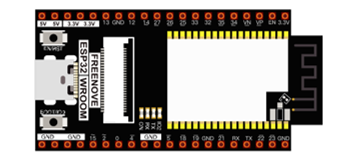
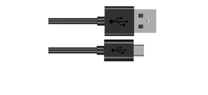
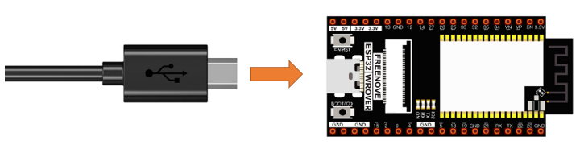
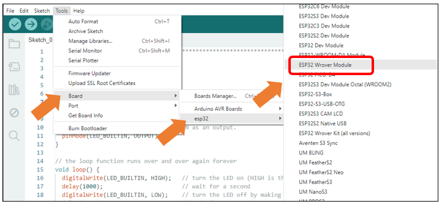
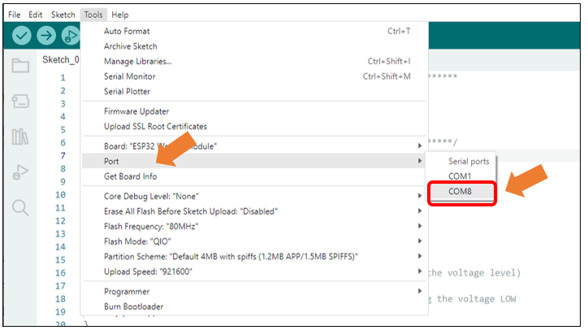
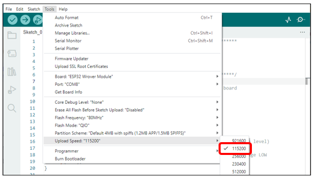
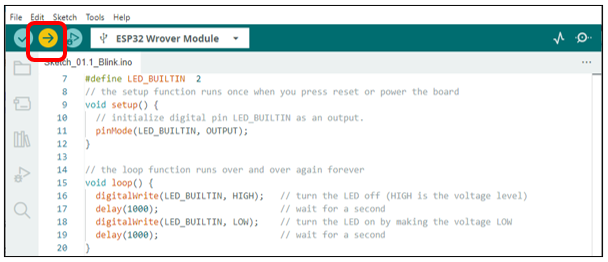
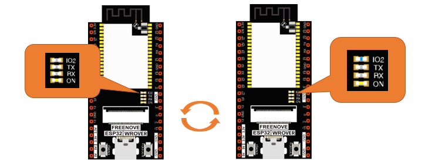
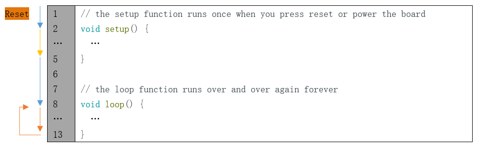

##############################################################################
0. Chapter LED
##############################################################################

This chapter is the Start Point in the journey to build and explore ESP32 electronic projects. We will start with simple "Blink" project.

Project 0.1 Blink
************************************

In this project, we will use ESP32 to control blinking a common LED.

Component List
====================================

.. list-table:: 
   :width: 80%
   :header-rows: 1 
   :align: center
   :class: table-line
   
   * -  ESP32-WROVER x1
     -  USB cable
   
   * -  |Chapter00_00|
     -  |Chapter00_01| 
  

Power
---------------------------------------

ESP32-WROVER needs 5v power supply. In this tutorial, we need connect ESP32-WROVER to computer via USB cable to power it and program it. We can also use other 5v power source to power it.

In the following projects, we only use USB cable to power ESP32-WROVER by default.

In the whole tutorial, we don't use T extension to power ESP32-WROVER. So 5V and 3.3V (includeing EXT 3.3V) on the extension board are provided by ESP32-WROVER. 

We can also use DC jack of extension board to power ESP32-WROVER.In this way, 5v and EXT 3.3v on extension board are provided by external power resource.

Sketch
=======================================

According to the circuit, when the GPIO2 of ESP32-WROVER output level is low, the LED turns ON. Conversely, when the GPIO2 ESP32-WROVER output level is high, the LED turns OFF. Therefore, we can let GPIO2 circularly output high and low level to make the LED blink.

Upload the following Sketch: 

**Freenove_Ultimate_Starter_Kit_for_ESP32\\Sketches\\Sketch_01.1_Blink**.

Before uploading the code, click "**Tools**", "**Board**" and select "**ESP32 Wrover Module**".

Select the serial port. 

.. note::
    
    **For macOS users, if the uploading fails, please set the baud rate to 115200 before clicking "Upload Speed".**

Sketch_01.1_Blink
----------------------------------------

Click "Upload", Download the code to ESP32-WROVER and your LED in the circuit starts Blink.

.. hint::
    
    :combo:`red font-bolder:If you have any concerns, please contact us via:` support@freenove.com

The following is the program code:

.. literalinclude:: ../../../freenove_Kit/C/Sketches/Sketch_01.1_Blink/Sketch_01.1_Blink.ino
    :linenos: 
    :language: c
    :dedent:

The Arduino IDE code usually contains two basic functions: void setup() and void loop(). 

After the board is reset, the setup() function will be executed firstly, and then the loop() function.

setup() function is generally used to write code to initialize the hardware. And loop() function is used to write code to achieve certain functions. loop() function is executed repeatedly. When the execution reaches the end of loop(), it will jump to the beginning of loop() to run again.

.. py:function:: Reset

    Reset operation will lead the code to be executed from the beginning. Switching on the power, finishing uploading the code and pressing the reset button will trigger reset operation.

In the circuit, ESP32-WROVER's GPIO2 is connected to the LED, so the LED pin is defined as 2.

.. code-block:: c

    #define PIN_LED 2

This means that after this line of code, all PIN_LED will be treated as 2.

In the setup () function, first, we set the PIN_LED as output mode, which can make the port output high level or low level.

.. code-block:: c

    // initialize digital pin PIN_LED as an output.
    pinMode(PIN_LED, OUTPUT);

Then, in the loop () function, set the PIN_LED to output high level to make LED light off.

.. code-block:: c

    digitalWrite(PIN_LED, HIGH);  // turn the LED off (HIGH is the voltage level)

Wait for 1000ms, that is 1s. Delay () function is used to make control board wait for a moment before executing the next statement. The parameter indicates the number of milliseconds to wait for.

.. code-block:: c

    delay(1000);                  // wait for a second

Then set the PIN_LED to output low level, and LED light up. One second later, the execution of loop () function will be completed. 

.. code-block:: c

    digitalWrite(PIN_LED, LOW);   // turn the LED on by making the voltage LOW
    delay(1000);                  // wait for a second

The loop() function is constantly being executed, so LED will keep blinking.

Reference
----------------------------------

.. py:function:: void pinMode(int pin, int mode);

    Configures the specified pin to behave either as an input or an output. 
    
    **Parameters**
    
    pin: the pin number to set the mode of.
    
    mode: INPUT, OUTPUT, INPUT_PULLDOWM, or INPUT_PULLUP.

.. py:function:: void digitalWrite (int pin, int value);

    Writes the value HIGH or LOW (1 or 0) to the given pin which must have been previously set as an output.

For more related functions, please refer to https://www.arduino.cc/reference/en/