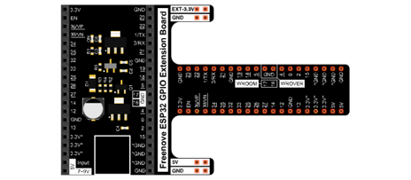
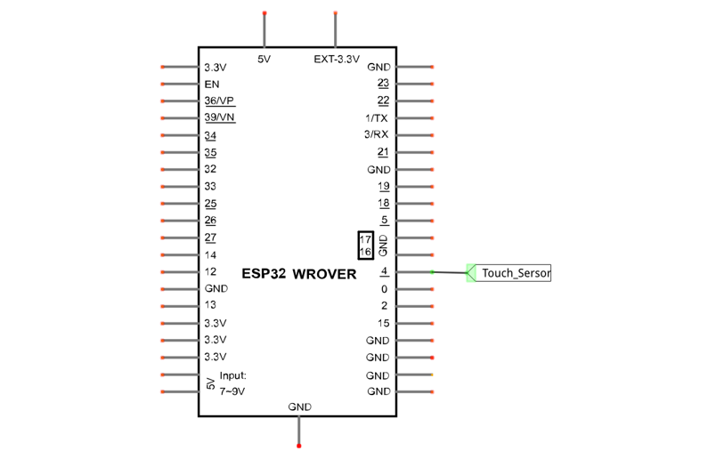
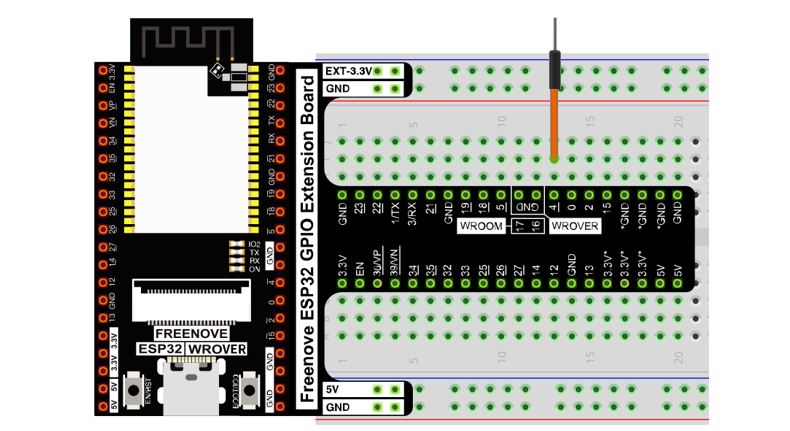
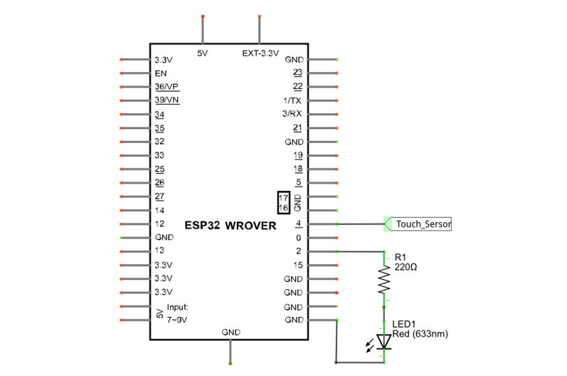

##############################################################################
Chapter 10 Touch Sensor
##############################################################################

ESP32 offers up to 10 capacitive touch GPIO, and as you can see from the previous section, mechanical switches are prone to jitter that must be eliminated when used, which is not the case with ESP32's built-in touch sensor. In addition, on the service life, the touch switch also has advantages that mechanical switch is completely incomparable.

Project 10.1 Read Touch Sensor
*********************************************

This project reads the value of the touch sensor and prints it out.

Component List
======================================

.. table::
    :width: 80%
    :align: center
    :class: table-line
    
    +------------------------------------+-------------------------+
    | ESP32-WROVER x1                    | GPIO Extension Board x1 |
    |                                    |                         |
    | |Chapter01_00|                     | |Chapter01_01|          |
    +------------------------------------+-------------------------+
    | Breadboard x1                                                |
    |                                                              |
    | |Chapter01_02|                                               |
    +--------------------------------------------------------------+
    | Jumper M/M x1                                                |
    |                                                              |
    | |Chapter01_05|                                               |
    +--------------------------------------------------------------+
  
.. |Chapter01_00| image:: ../_static/imgs/1_LED/Chapter01_00.png

.. |Chapter01_02| image:: ../_static/imgs/1_LED/Chapter01_02.png
.. |Chapter01_05| image:: ../_static/imgs/1_LED/Chapter01_05.png

Related knowledge
========================================

Touch sensor
------------------------------------------

ESP32's touch sensor supports up to 10 GPIO channels as capacitive touch pins. Each pin can be used separately as an independent touch switch or be combined to produce multiple touch points. The following table is a list of available touch pins on ESP32.

.. table::
    :align: center
    :class: zebra
    
    +------------------------------+-------------------+-------------+
    | Name of touch sensing signal | Functions of pins | GPIO number |
    +==============================+===================+=============+
    | T0                           | GPIO4             | GPIO4       |
    +------------------------------+-------------------+-------------+
    | T1                           | GPIO0             | GPIO0       |
    +------------------------------+-------------------+-------------+
    | T2                           | GPIO2             | GPIO2       |
    +------------------------------+-------------------+-------------+
    | T3                           | MTDO              | GPIO15      |
    +------------------------------+-------------------+-------------+
    | T4                           | MTCK              | GPIO13      |
    +------------------------------+-------------------+-------------+
    | T5                           | MTDI              | GPIO12      |
    +------------------------------+-------------------+-------------+
    | T6                           | MTMS              | GPIO14      |
    +------------------------------+-------------------+-------------+
    | T7                           | GPIO27            | GPIO27      |
    +------------------------------+-------------------+-------------+
    | T8                           | 32K_XN            | GPIO33      |
    +------------------------------+-------------------+-------------+
    | T9                           | 32K_XP            | GPIO32      |
    +------------------------------+-------------------+-------------+

The touch pin number is already defined in ESP32's code base. For example, in the code, you can use T0 to represent GPIO4.

The electrical signals generated by touch are analog data, which are converted by an internal ADC converter. You may have noticed that all touch pins have ADC functionality.

The hardware connection method is shown in the following figure.

.. image:: ../_static/imgs/10_Touch_Sensor/Chapter10_00.png
    :align: center

Circuit
=============================================

.. list-table:: 
   :width: 80%
   :align: center
   :class: table-line
   
   * -  **Schematic diagram**
   * -  |Chapter10_01|
   * -  **Hardware connection**
   * -  :combo:`red font-bolder:If you need any support, please contact us via:` support@freenove.com
        
        |Chapter10_02|

Sketch
===========================================

Sketch_10.1_TouchRead
-------------------------------------------

Download the code to ESP32-WROVER, open the serial monitor, and set the baud rate to 115200. As shown in the following figure.

Touched by hands, the value of the touch sensor will change. The closer the value is to zero, the more obviously the touch action will be detected. The value detected by the sensor may be different in different environments or when different people touch it. The code is very simple, just look at Reference.

Reference
--------------------------------------------

.. py:function:: uint16_t touchRead(uint8_t pin);
    
    Read touch sensor value. (values close to 0 mean touch detected)

Project 10.2 Touch Lamp
*****************************************

In this project, we will use ESP32's touch sensor to create a touch switch lamp.

Component List
==========================================

.. table::
    :width: 80%
    :align: center
    :class: table-line
    
    +------------------------------------+------------------------+
    | ESP32-WROVER x1                    | GPIO Extension Board x1|
    |                                    |                        |
    | |Chapter01_00|                     | |Chapter01_01|         |
    +------------------------------------+------------------------+
    | Breadboard x1                                               |
    |                                                             |
    | |Chapter01_02|                                              |
    +-----------------+------------------+------------------------+
    | LED x1          | Resistor 220Ω x1 | Jumper M/M x3          |
    |                 |                  |                        |
    | |Chapter01_03|  | |Chapter01_04|   | |Chapter01_05|         |
    +-----------------+------------------+------------------------+

.. |Chapter01_03| image:: ../_static/imgs/1_LED/Chapter01_03.png 
.. |Chapter01_04| image:: ../_static/imgs/1_LED/Chapter01_04.png    

Circuit
=========================================

.. list-table:: 
   :width: 80%
   :align: center
   :class: table-line
   
   * -  **Schematic diagram**
   * -  |Chapter10_06|
   * -  **Hardware connection**
   * -  :combo:`red font-bolder:If you need any support, please contact us via:` support@freenove.com
        
        |Chapter10_07|

.. |Chapter10_07| image:: ../_static/imgs/10_Touch_Sensor/Chapter10_07.png    

Sketch
==========================================

Sketch_10.2_TouchLamp
--------------------------------------------

Download the code to ESP32-WROVER, open the serial monitor, and set the baud rate to 115200. As shown in the following figure, 

With a touch pad, the state of the LED changes with each touch, and the detection state of the touch sensor is printed in the serial monitor.

The following is the program code:

.. literalinclude:: ../../../freenove_Kit/C/Sketches/Sketch_10.2_TouchLamp/Sketch_10.2_TouchLamp.ino
    :linenos: 
    :language: c
    :dedent:

The closer the return value of the function touchRead() is to 0, the more obviously the touch is detected. This is not a fixed value, so you need to define a threshold that is considered valid (when the value of the sensor is less than this threshold). Similarly, a threshold value is to be defined in the release state, and a value in between is considered an invalid disturbance value.

.. literalinclude:: ../../../freenove_Kit/C/Sketches/Sketch_10.2_TouchLamp/Sketch_10.2_TouchLamp.ino
    :linenos: 
    :language: c
    :lines: 8-9
    :dedent:

In loop(), first determine whether the touch was detected. If yes, print some messages, flip the state of the LED, and set the flag bit isProcessed to true to avoid repeating the program after the touch was successful.

.. literalinclude:: ../../../freenove_Kit/C/Sketches/Sketch_10.2_TouchLamp/Sketch_10.2_TouchLamp.ino
    :linenos: 
    :language: c
    :lines: 17-23
    :dedent:

It then determines if the touch key is released, and if so, prints some messages and sets the isProcessed to false to avoid repeating the process after the touch release and to prepare for the next touch probe.

.. literalinclude:: ../../../freenove_Kit/C/Sketches/Sketch_10.2_TouchLamp/Sketch_10.2_TouchLamp.ino
    :linenos: 
    :language: c
    :lines: 25-30
    :dedent: