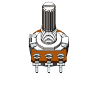

Project 11.2 Soft Colorful Light 
*****************************************

In this project, 3 potentiometers are used to control the RGB LED and in principle it is the same as the Soft Light project. Namely, read the voltage value of the potentiometer and then convert it to PWM used to control LED brightness. Difference is that the original project only controlled one LED, but this project required (3) RGB LEDs.

.. table::
    :width: 80%
    :align: center
    :class: table-line
    
    +------------------------------------+----------------------------------------------------+
    | ESP32-WROVER x1                    | GPIO Extension Board x1                            |
    |                                    |                                                    |
    | |Chapter01_00|                     | |Chapter01_01|                                     |
    +------------------------------------+----------------------------------------------------+
    | Breadboard x1                                                                           |
    |                                                                                         |
    | |Chapter01_02|                                                                          |
    +-----------------+------------------+------------------------+---------------------------+
    | RGBLED x1       | Resistor 220Ω x3 | Jumper M/M x13         | Rotary potentiometer x3   |
    |                 |                  |                        |                           |
    | |Chapter11_03|  | |Chapter01_04|   | |Chapter01_05|         | |Chapter09_00|            |
    +-----------------+------------------+------------------------+---------------------------+

.. |Chapter01_00| image:: ../_static/imgs/1_LED/Chapter01_00.png
.. |Chapter01_01| image:: ../_static/imgs/1_LED/Chapter01_01.png
.. |Chapter01_02| image:: ../_static/imgs/1_LED/Chapter01_02.png
.. |Chapter01_04| image:: ../_static/imgs/1_LED/Chapter01_04.png    
.. |Chapter01_05| image:: ../_static/imgs/1_LED/Chapter01_05.png

Circuit
=============================================

.. list-table:: 
   :width: 80%
   :align: center
   :class: table-line
   
   * -  **Schematic diagram**
   * -  |Chapter11_04|
   * -  **Hardware connection**
   * -  :combo:`red font-bolder:If you need any support, please contact us via:` support@freenove.com
        
        |Chapter11_05|

.. |Chapter11_05| image:: ../_static/imgs/11_Potentiometer_&_LED/Chapter11_05.png  

Sketch
===========================

Sketch_11.2_SoftColorfulLight
-----------------------------------

Download the code to ESP32-WROVER, rotate one of the potentiometers, then the color of RGB LED will change. 

The following is the program code:

.. literalinclude:: ../../../freenove_Kit/C/Sketches/Sketch_11.2_SoftColorfulLight/Sketch_11.2_SoftColorfulLight.ino
    :linenos: 
    :language: c
    :dedent:

In the code you can read the ADC values of the 3 potentiometers and map it into a PWM duty cycle to control the 3 LED elements to vary the color of their respective RGB LED.

Project 11.3 Soft Rainbow Light
********************************************

In this project, we use potentiometer to control Freenove 8 RGB LED Module.

Component List
=====================================

.. table::
    :width: 80%
    :align: center
    :class: table-line
    
    +------------------------------------+----------------------------------------------------+
    | ESP32-WROVER x1                    | GPIO Extension Board x1                            |
    |                                    |                                                    |
    | |Chapter01_00|                     | |Chapter01_01|                                     |
    +------------------------------------+----------------------------------------------------+
    | Breadboard x1                                                                           |
    |                                                                                         |
    | |Chapter01_02|                                                                          |
    +------------------------------------+----------------------------------------------------+
    | Freenove 8 RGB LED Module x1       | Jumper F/M x3 Jumper M/M x3                        |
    |                                    |                                                    |
    | |Chapter11_08|                     |  |Chapter11_07|                                    |
    +------------------------------------+----------------------------------------------------+

.. |Chapter11_08| image:: ../_static/imgs/11_Potentiometer_&_LED/Chapter11_08.png

Sketch
====================================

Sketch_11.3_Soft_Rainbow_Light
--------------------------------------

Download the code to ESP32-WROVER, rotate the handle of the potentiometer, and the color of the lamp ring will change. 

:combo:`red font-bolder:If you need any support, please feel free to contact us via:` support@freenove.com

The following is the program code:

.. literalinclude:: ../../../freenove_Kit/C/Sketches/Sketch_11.3_SoftRainbowLight/Sketch_11.3_SoftRainbowLight.ino
    :linenos: 
    :language: c
    :dedent:

The overall logical structure of the code is the same as the previous project rainbow light, except that the starting point of the color in this code is controlled by potentiometer.