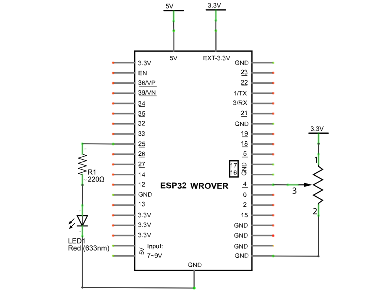
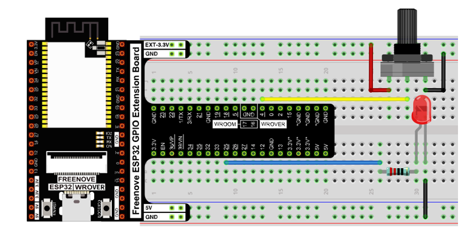
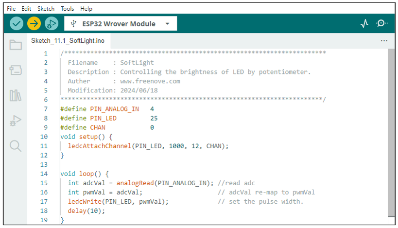

##############################################################################
Chapter 11 Potentiometer & LED
##############################################################################

We have learned how to use ADC and DAC before. When using DAC output analog to drive LED, we found that, when the output voltage is less than led turn-on voltage, the LED does not light; when the output analog voltage is greater than the LED voltage, the LED lights. This leads to a certain degree of waste of resources. Therefore, in the control of LED brightness, we should choose a more reasonable way of PWM control. In this chapter, we learn to control the brightness of LED through a potentiometer.

Project 11.1 Soft Light
*********************************************

In this project, we will make a soft light. We will use an ADC Module to read ADC values of a potentiometer and map it to duty cycle of the PWM used to control the brightness of a LED. Then you can change the brightness of a LED by adjusting the potentiometer.

Component List
==============================================

.. table::
    :width: 80%
    :align: center
    :class: table-line
    
    +------------------------------------+----------------------------------------------------+
    | ESP32-WROVER x1                    | GPIO Extension Board x1                            |
    |                                    |                                                    |
    | |Chapter01_00|                     | |Chapter01_01|                                     |
    +------------------------------------+----------------------------------------------------+
    | Breadboard x1                                                                           |
    |                                                                                         |
    | |Chapter01_02|                                                                          |
    +-----------------+------------------+------------------------+---------------------------+
    | LED x1          | Resistor 220Ω x1 | Jumper M/M x5          | Rotary potentiometer x1   |
    |                 |                  |                        |                           |
    | |Chapter01_03|  | |Chapter01_04|   | |Chapter01_05|         | |Chapter09_00|            |
    +-----------------+------------------+------------------------+---------------------------+

.. |Chapter01_00| image:: ../_static/imgs/1_LED/Chapter01_00.png
.. |Chapter01_01| image:: ../_static/imgs/1_LED/Chapter01_01.png
.. |Chapter01_02| image:: ../_static/imgs/1_LED/Chapter01_02.png
.. |Chapter01_03| image:: ../_static/imgs/1_LED/Chapter01_03.png 
.. |Chapter01_04| image:: ../_static/imgs/1_LED/Chapter01_04.png    
.. |Chapter01_05| image:: ../_static/imgs/1_LED/Chapter01_05.png
.. |Chapter09_00| image:: ../_static/imgs/9_AD_DA_Converter/Chapter09_00.png

Circuit
=========================================

.. list-table:: 
   :width: 80%
   :align: center
   
   * -  **Schematic diagram**
   * -  |Chapter11_00|
   * -  **Hardware connection**
       
   * -  :combo:`red font-bolder:If you need any support, please contact us via:` support@freenove.com
       
        |Chapter11_01|

Sketch
=======================================

Sketch_11.1_Softlight
---------------------------------------

Download the code to ESP32-WROVER, by turning the adjustable resistor to change the input voltage of GPIO25, ESP32 changes the output voltage of GPIO4 according to this voltage value, thus changing the brightness of the LED.

The following is the code:

.. literalinclude:: ../../../freenove_Kit/C/Sketches/Sketch_11.1_SoftLight/Sketch_11.1_SoftLight.ino
    :linenos: 
    :language: c
    :dedent:

In the code, read the ADC value of potentiometer and map it to the duty cycle of PWM to control LED brightness.

.. include:: 11_2_Potentiometer_&_LED.rst