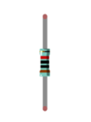
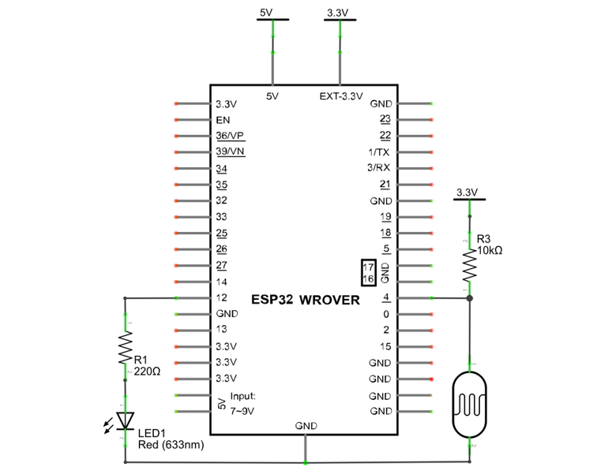
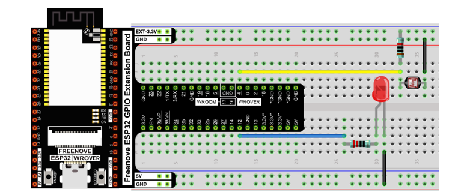

##############################################################################
Chapter Photoresistor & LED
##############################################################################

In this chapter, we will learn how to use a photoresistor.

Project NightLamp
***************************************

A photoresistor is very sensitive to the amount of light present. We can take advantage of the characteristic to make a nightlight with the following function: when the ambient light is less (darker environment) the LED will automatically become brighter to compensate and when the ambient light is greater (brighter environment) the LED will automatically dim to compensate.

Component List
======================================

+------------------------------------+-------------------------+
| ESP32-WROVER x1                    | GPIO Extension Board x1 |
|                                    |                         |
| |Chapter01_00|                     | |Chapter01_01|          |
+------------------------------------+-------------------------+
| Breadboard x1                                                |
|                                                              |
| |Chapter01_02|                                               |
+-----------------+--------------------------------------------+
| LED x1          | Jumper M/M x4                              |
|                 |                                            |
| |Chapter07_00|  | |Chapter01_05|                             |
+-----------------+------------------+-------------------------+
|Photoresistor x1 | Resistor 220Ω x1 | Resistor 10kΩ x2        |
|                 |                  |                         |
| |Chapter07_02|  | |Chapter01_04|   | |Chapter07_04|          |
+-----------------+------------------+-------------------------+

.. |Chapter01_00| image:: ../_static/imgs/1_LED/Chapter01_00.png
.. |Chapter01_01| image:: ../_static/imgs/1_LED/Chapter01_01.png
.. |Chapter01_02| image:: ../_static/imgs/1_LED/Chapter01_02.png
.. |Chapter01_04| image:: ../_static/imgs/1_LED/Chapter01_02.png
.. |Chapter07_00| image:: ../_static/imgs/7_Buzzer/Chapter07_00.png
.. |Chapter07_01| image:: ../_static/imgs/7_Buzzer/Chapter07_01.png
.. |Chapter07_02| image:: ../_static/imgs/7_Buzzer/Chapter07_02.png
.. |Chapter07_03| image:: ../_static/imgs/7_Buzzer/Chapter07_03.png

.. |Chapter01_05| image:: ../_static/imgs/1_LED/Chapter01_05.png

Component knowledge
=============================

Photoresistor 
----------------------------

A photoresistor is simply a light sensitive resistor. It is an active component that decreases resistance with respect to receiving luminosity (light) on the component's light sensitive surface. A photoresistor's resistance value will change in proportion to the ambient light detected. With this characteristic, we can use a photoresistor to detect light intensity. The photoresistor and its electronic symbol are as follows.

.. image:: ../_static/imgs/12_Photoresistor_&_LED/Chapter12_00.png
    :align: center

The circuit below is used to detect the change of a photoresistor's resistance value:

.. image:: ../_static/imgs/12_Photoresistor_&_LED/Chapter12_01.png
    :align: center

In the above circuit, when a photoresistor's resistance vale changes due to a change in light intensity, the voltage between the photoresistor and resistor R1 will also change. Therefore, the intensity of the light can be obtained by measuring this voltage.

Circuit
===============================

The circuit of this project is similar to project Soft Light. The only difference is that the input signal is changed from a potentiometer to a combination of a photoresistor and a resistor.

.. list-table:: 
   :width: 100%
   :header-rows: 1 
   :align: center
   
   * -  Schematic diagram
   * -  |Chapter12_02|
   * -  Hardware connection. 
       
        :red:`If you need any support, please contact us via:` support@freenove.com
   * -  |Chapter12_03|

Sketch
==================================

The circuit used is similar to the project Soft Light. The only difference is that the input signal of the AIN0 pin of ADC changes from a potentiometer to a combination of a photoresistor and a resistor.

Sketch_Nightlamp
------------------------------------

Download the code to ESP32-WROVER, if you cover the photoresistor or increase the light shining on it, the brightness of the LED changes accordingly. 

The following is the program code:

.. literalinclude:: ../../../freenove_Kit/C/Sketches/Sketch_12.1_NightLamp/Sketch_12.1_NightLamp.ino
    :linenos: 
    :language: c
    :dedent:

Reference
----------------------------------

.. py:function:: constrain(amt,low,high)

    #define constrain(amt,low,high) ((amt)<(low)? (low):((amt)>(high)? (high):(amt)))
    
    Constrain the value amt between low and high.