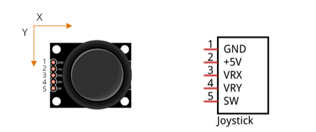
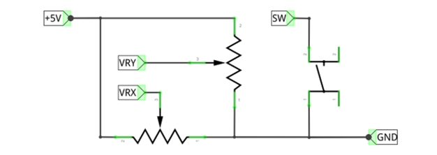
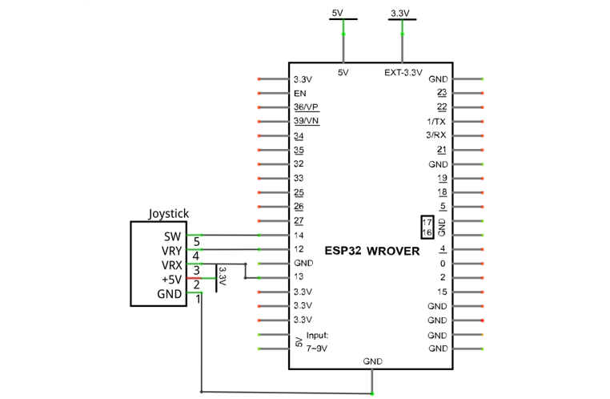
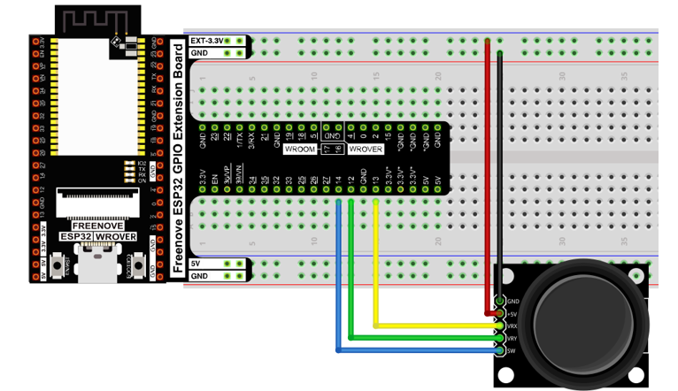
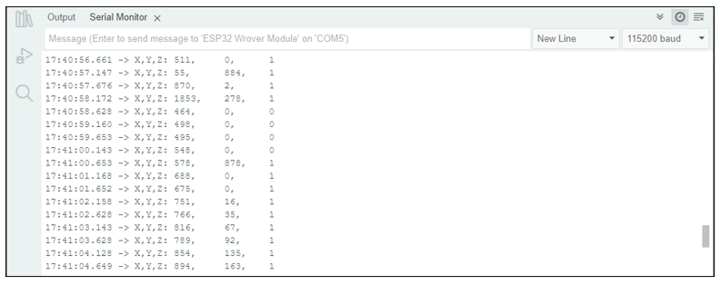

##############################################################################
Chapter Joystick
##############################################################################

In the previous chapter, we have learned how to use rotary potentiometer. Now, let's learn a new electronic module joystick which working on the same principle as rotary potentiometer.

Project Joystick
***************************************

In this project, we will read the output data of a joystick and display it to the Terminal screen.

Component List
====================================

+------------------------------------+------------------------+
| ESP32-WROVER x1                    | GPIO Extension Board x1|
|                                    |                        |
| |Chapter01_00|                     | |Chapter01_01|         |
+------------------------------------+------------------------+
| Breadboard x1                                               |
|                                                             |
| |Chapter01_02|                                              |
+-----------------+------------------+------------------------+
| Joystick x1                        | Jumper M/M x3          |
|                                    |                        |
| |Chapter14_00|                     | |Chapter01_05|         |
+-----------------+------------------+------------------------+

.. |Chapter01_00| image:: ../_static/imgs/1_LED/Chapter01_00.png
.. |Chapter01_01| image:: ../_static/imgs/1_LED/Chapter01_01.png
.. |Chapter01_02| image:: ../_static/imgs/1_LED/Chapter01_02.png
.. |Chapter13_00| image:: ../_static/imgs/1_LED/Chapter13_00.png 
.. |Chapter07_04| image:: ../_static/imgs/7_Buzzer/Chapter07_04.png   
.. |Chapter01_05| image:: ../_static/imgs/1_LED/Chapter01_05.png
.. |Chapter14_00| image:: ../_static/imgs/14_Joystick/Chapter14_00.png

Component knowledge
======================================

Joystick
--------------------------------------

A joystick is a kind of input sensor used with your fingers. You should be familiar with this concept already as they are widely used in gamepads and remote controls. It can receive input on two axes (Y and or X) at the same time (usually used to control direction on a two dimensional plane). And it also has a third direction capability by pressing down (Z axis/direction).

This is accomplished by incorporating two rotary potentiometers inside the joystick Module at 90 degrees of each other, placed in such a manner as to detect shifts in direction in two directions simultaneously and with a push button switch in the "vertical" axis, which can detect when a User presses on the Joystick.

When the joystick data is read, there are some differences between the axes: data of X and Y axes is analog, which needs to use the ADC. The data of the Z axis is digital, so you can directly use the GPIO to read this data or you have the option to use the ADC to read this.

Circuit
=========================================

.. list-table:: 
   :width: 100%
   :header-rows: 1 
   :align: center
   
   * -  Schematic diagram
   * -  |Chapter14_03|
   * -  Hardware connection. 
       
        :red:`If you need any support, please contact us via:` support@freenove.com
   * -  |Chapter14_04|

Sketch
===========================

In this project's code, we will read the ADC values of X and Y axes of the joystick, and read digital quality of the Z axis, then display these out in terminal.

Sketch_Joystick
-------------------------------

Download the code to ESP32-WROVER, open the serial port monitor, the baud rate is 115200, as shown in the figure below, shift (moving) the joystick or pressing it down will make the data change. 

The following is the code:

.. literalinclude:: ../../../freenove_Kit/C/Sketches/Sketch_14.1_Joystick/Sketch_14.1_Joystick.ino
    :linenos: 
    :language: c
    :dedent:

In the code, configure xyzPins[2] to pull-up input mode.  In loop(), use analogRead () to read the value of axes X and Y and use digitalRead () to read the value of axis Z, then display them.

.. literalinclude:: ../../../freenove_Kit/C/Sketches/Sketch_14.1_Joystick/Sketch_14.1_Joystick.ino
    :linenos: 
    :language: c
    :lines: 14-18
    :dedent: