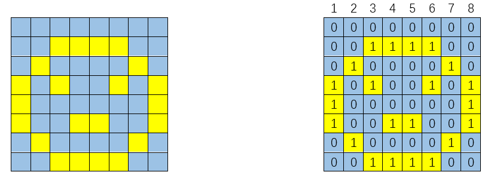

##############################################################################
Chapter 74HC595 & LED Matrix
##############################################################################

Thus far we have learned how to use the 74HC595 IC chip to control the LED bar graph and the 7-segment display. We will now use 74HC595 IC chips to control a LED matrix.

Project LED Matrix
*************************************

In this project, we will use two 74HC595 IC chips to control a monochrome (one color) (8X8) LED matrix to make it display both simple graphics and characters.

Component List
==========================

+------------------------------------+----------------------------------------------------+
| ESP32-WROVER x1                    | GPIO Extension Board x1                            |
|                                    |                                                    |
| |Chapter01_00|                     | |Chapter01_01|                                     |
+------------------------------------+----------------------------------------------------+
| Breadboard x1                                                                           |
|                                                                                         |
| |Chapter01_02|                                                                          |
+-----------------+------------------+------------------------+---------------------------+
| 74HC595 x2      | Resistor 220Ω x8 | Jumper M/M x15         | 8*8 LEDMatrix x1          |
|                 |                  |                        |                           |
| |Chapter15_00|  | |Chapter01_04|   | |Chapter01_05|         | |Chapter16_00|            |
+-----------------+------------------+------------------------+---------------------------+

.. |Chapter01_00| image:: ../_static/imgs/1_LED/Chapter01_00.png
.. |Chapter01_01| image:: ../_static/imgs/1_LED/Chapter01_01.png
.. |Chapter01_02| image:: ../_static/imgs/1_LED/Chapter01_02.png
.. |Chapter15_00| image:: ../_static/imgs/15_74HC595_&_LED_Bar_Graph/Chapter15_00.png 
.. |Chapter01_04| image:: ../_static/imgs/1_LED/Chapter01_04.png    
.. |Chapter01_05| image:: ../_static/imgs/1_LED/Chapter01_05.png

Component knowledge
=================================

LED Matrix
---------------------------------

A LED matrix is a rectangular display module that consists of a uniform grid of LEDs. The following is an 8X8 monochrome (one color) LED matrix containing 64 LEDs (8 rows by 8 columns).

.. image:: ../_static/imgs/16_74HC595_&_LED_Matrix/Chapter16_00.png
    :align: center

In order to facilitate the operation and reduce the number of ports required to drive this component, the positive poles of the LEDs in each row and negative poles of the LEDs in each column are respectively connected together inside the LED matrix module, which is called a common anode. There is another arrangement type. Negative poles of the LEDs in each row and the positive poles of the LEDs in each column are respectively connected together, which is called a common cathode.

.. image:: ../_static/imgs/16_74HC595_&_LED_Matrix/Chapter16_01.png
    :align: center

Here is how a common anode LED matrix works. First, choose 16 ports on ESP32 board to connect to the 16 ports of LED matrix. Configure one port in columns for low level, which makes that column the selected port. Then configure the eight port in the row to display content in the selected column. Add a delay value and then select the next column that outputs the corresponding content. This kind of operation by column is called scan. If you want to display the following image of a smiling face, you can display it in 8 columns, and each column is represented by one byte.

+--------+-----------+-------------+
| Column |  Binary   | Hexadecimal |
+========+===========+=============+
| 1      | 0001 1100 | 0x1c        |
+--------+-----------+-------------+
| 2      | 0010 0010 | 0x22        |
+--------+-----------+-------------+
| 3      | 0101 0001 | 0x51        |
+--------+-----------+-------------+
| 4      | 0100 0101 | 0x45        |
+--------+-----------+-------------+
| 5      | 0100 0101 | 0x45        |
+--------+-----------+-------------+
| 6      | 0101 0001 | 0x51        |
+--------+-----------+-------------+
| 7      | 0010 0010 | 0x22        |
+--------+-----------+-------------+
| 8      | 0001 1100 | 0x1c        |
+--------+-----------+-------------+

To begin, display the first column, then turn off the first column and display the second column. (and so on) .... turn off the seventh column and display the 8th column, and then start the process over from the first column again like the control of LED bar graph project. The whole process will be repeated rapidly in a loop. Due to the principle of optical afterglow effect and the vision persistence effect in human sight, we will see a picture of a smiling face directly rather than individual columns of LEDs turned ON one column at a time (although in fact this is the reality we cannot perceive). 

Then, to save the number of GPIO, we use a 74HC595. When the first column is turned ON, set the lights that need to be displayed in the first column to "1", otherwise to "0", as shown in the above example, where the value of the first column is 0x1c. This value is sent to 74HC595 to control the display of the first column of the LED matrix. Following the above idea, turn OFF the display of the first column, then turn ON the second column, and then send the value of the second column to 74HC595 ...... Until each column is displayed, the LED matrix is displayed again from the first column.

Circuit
========================================

In circuit of this project, the power pin of the 74HC595 IC chip is connected to 3.3V. It can also be connected to 5V to make LED matrix brighter.

.. list-table:: 
   :width: 100%
   :header-rows: 1 
   :align: center
   
   * -  Schematic diagram
   * -  |Chapter16_03|
   * -  Hardware connection. 
       
        :red:`If you need any support, please contact us via:` support@freenove.com
   * -  |Chapter16_04|

.. |Chapter16_03| image:: ../_static/imgs/16_74HC595_&_LED_Matrix/Chapter16_03.png    
.. |Chapter16_04| image:: ../_static/imgs/16_74HC595_&_LED_Matrix/Chapter16_04.png  

Sketch
=========================================

The following code will make LED matrix display a smiling face, and then display scrolling character "0-F".

.. image:: ../_static/imgs/16_74HC595_&_LED_Matrix/Chapter16_05.png
    :align: center

Download the code to ESP32-WROVER, and the LED matrix display a smiling face, and then display characters "0 to F" scrolling in a loop on the LED matrix.

Sketch_16.3_LED_Matrix
---------------------------------------

The following is the program code:

.. literalinclude:: ../../../freenove_Kit/C/Sketches/Sketch_16.3_LED_Matrix/Sketch_16.3_LED_Matrix.ino
    :linenos: 
    :language: c
    :dedent:

The first "for" loop in the "while" loop is used to display a static smile. Displaying column information from left to right, one column at a time with a total of 8 columns. This repeats 500 times to ensure sufficient display time.

.. literalinclude:: ../../../freenove_Kit/C/Sketches/Sketch_16.3_LED_Matrix/Sketch_16.3_LED_Matrix.ino
    :linenos: 
    :language: c
    :lines: 45-56
    :dedent:

The second "for" loop is used to display scrolling characters "0 to F", for a total of 17* 8 = 144 columns. Displaying the 0-8 column, then the 1-9 column, then the 2-10 column...... and so on…128-136 column in consecutively to achieve the scrolling effect. The display of each frame is repeated a certain number of times and the more repetitions, the longer the single frame display will be and the slower the scrolling movement.

.. literalinclude:: ../../../freenove_Kit/C/Sketches/Sketch_16.3_LED_Matrix/Sketch_16.3_LED_Matrix.ino
    :linenos: 
    :language: c
    :lines: 57-69
    :dedent:

The amount of pins of ESP32 is limited, so you need to find ways to save pins. If you use ESP32's GPIO to control the lattice without using 74HC595, you need 16 pins for the use of LED matrix. In this example, we use two 74HC595 to drive the LED matrix, requiring only three pins, so that we could save the rest of 13 pins.