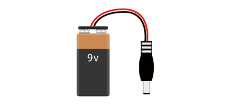
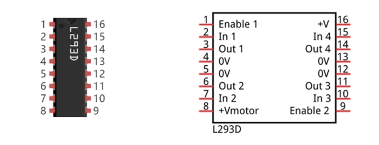
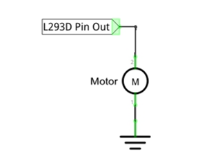
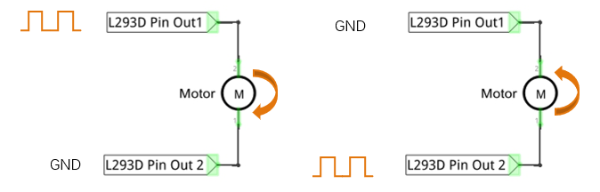

##############################################################################
Chapter Motor & Driver
##############################################################################

In this chapter, we will learn about DC motors and DC motor drivers and how to control the speed and direction of a DC motor.

Project Control Motor with Potentiometer
*************************************************************

Control the direction and speed of the motor with a potentiometer.

.. table::
    :width: 80%
    :align: center
    :class: table-line
    
    +------------------------------------+----------------------------------------------------+
    | ESP32-WROVER x1                    | GPIO Extension Board x1                            |
    |                                    |                                                    |
    | |Chapter01_00|                     | |Chapter01_01|                                     |
    +------------------------------------+----------------------------------------------------+
    | Breadboard x1                                                                           |
    |                                                                                         |
    | |Chapter01_02|                                                                          |
    +------------------------------------+----------------------------------------------------+
    | Motor x1                           | 9V battery (prepared by yourself) & battery line   |
    |                                    |                                                    |
    | |Chapter17_02|                     | |Chapter17_03|                                     |
    +-------------------------+----------+----------------------+-----------------------------+
    | Jumper M/M              | L293D                           | Rotary potentiometer x1     |
    |                         |                                 |                             |
    | |Chapter01_05|          | |Chapter17_00|                  |  |Chapter09_00|             |
    +-------------------------+---------------------------------+-----------------------------+

.. |Chapter01_00| image:: ../_static/imgs/1_LED/Chapter01_00.png
.. |Chapter01_01| image:: ../_static/imgs/1_LED/Chapter01_01.png
.. |Chapter01_02| image:: ../_static/imgs/1_LED/Chapter01_02.png
.. |Chapter17_02| image:: ../_static/imgs/17_Relay_&_Motor/Chapter17_02.png
.. |Chapter01_05| image:: ../_static/imgs/1_LED/Chapter01_05.png

.. |Chapter09_00| image:: ../_static/imgs/9_AD_DA_Converter/Chapter09_00.png
.. |Chapter17_00| image:: ../_static/imgs/17_Motor_&_Driver/Chapter17_00.png

Component knowledge
=============================================

L293D
---------------------------------------

L293D is an IC chip (Integrated Circuit Chip) with a 4-channel motor drive. You can drive a unidirectional DC motor with 4 ports or a bi-directional DC motor with 2 ports or a stepper motor (stepper motors are covered later in this Tutorial).

Port description of L293D module is as follows:

.. table::
    :width: 80%
    :align: center
    :class: zebra
    
    +----------+--------------+---------------------------------------------------------------------------------------------------------------+
    | Pin name |  Pin number  |                                                  Description                                                  |
    +==========+==============+===============================================================================================================+
    | In x     | 2, 7, 10, 15 | Channel x digital signal input pin                                                                            |
    +----------+--------------+---------------------------------------------------------------------------------------------------------------+
    | Out x    | 3, 6, 11, 14 | Channel x output pin, input high or low level according to In x pin, get connected to +Vmotor or 0V           |
    +----------+--------------+---------------------------------------------------------------------------------------------------------------+
    | Enable1  | 1            | Channel 1 and channel 2 enable pin, high level enable                                                         |
    +----------+--------------+---------------------------------------------------------------------------------------------------------------+
    | Enable2  | 9            | Channel 3 and channel 4 enable pin, high level enable                                                         |
    +----------+--------------+---------------------------------------------------------------------------------------------------------------+
    | 0V       | 4, 5, 12, 13 | Power cathode (GND)                                                                                           |
    +----------+--------------+---------------------------------------------------------------------------------------------------------------+
    | +V       | 16           | Positive electrode (VCC) of power supply, supply voltage 3.0~36V                                              |
    +----------+--------------+---------------------------------------------------------------------------------------------------------------+
    |          |              | Positive electrode of load power supply, provide power supply for the Out                                     |
    | +Vmotor  | 8            |                                                                                                               |
    |          |              | pin x, the supply voltage is +V~36V                                                                           |
    +----------+--------------+---------------------------------------------------------------------------------------------------------------+

For more detail, please refer to the datasheet for this IC Chip.

When using L293D to drive DC motor, there are usually two connection options.

The following connection option uses one channel of the L239D, which can control motor speed through the PWM, However the motor then can only rotate in one direction.

The following connection uses two channels of the L239D: one channel outputs the PWM wave, and the other channel connects to GND, therefore you can control the speed of the motor. When these two channel signals are exchanged, not only controls the speed of motor, but also can control the steering of the motor.

In practical use the motor is usually connected to channel 1 and 2 by outputting different levels to in1 and in2 to control the rotational direction of the motor, and output to the PWM wave to Enable1 port to control the motor's rotational speed. If the motor is connected to channel 3 and 4 by outputting different levels to in3 and in4 to control the motor's rotation direction, and output to the PWM wave to Enable2 pin to control the motor's rotational speed.

Circuit
============================================

Use caution when connecting this circuit, because the DC motor is a high-power component, do not use the power provided by the ESP32 to power the motor directly, which may cause permanent damage to your ESP32! The logic circuit can be powered by the ESP32 power or an external power supply, which should share a common ground with ESP32.

.. list-table:: 
   :width: 80%
   :align: center
   :class: table-line
   
   * -  **Schematic diagram**
   * -  |Chapter17_04|
   * -  **Hardware connection** 
       
   * -  If you need any support, please feel free to contact us via: support@freenove.com

        |Chapter17_05|

.. note::
    
    **he motor circuit uses A large current, about 0.2-0.3A without load.We recommend that you use a 9V battery to power the extension board.**

Sketch
=============================================

Sketch_Control_Motor_by_L293D
--------------------------------------------

Download code to ESP32-WROVER, rotate the potentiometer in one direction and the motor speeds up slowly in one direction. And then rotate the potentiometer in the other direction and the motor will slow down to stop. And then rotate it in an inverse direction to accelerate the motor.

.. image:: ../_static/imgs/17_Motor_&_Driver/Chapter17_07.png
    :align: center

The following is the sketch:

.. literalinclude:: ../../../freenove_Kit/C/Sketches/Sketch_17.2_Control_Motor_by_L293D/Sketch_17.2_Control_Motor_by_L293D.ino
    :linenos: 
    :language: c
    :dedent:

The ADC of ESP32 has a 12-bit accuracy, corresponding to a range from 0 to 4095. In this program, set the number 2048 as the midpoint. If the value of ADC is less than 2048, make the motor rotate in one direction. If the value of ADC is greater than 2048, make the motor rotate in the other direction. Subtract 2048 from the ADC value and take the absolute value and use this result as the speed of the motor.

.. literalinclude:: ../../../freenove_Kit/C/Sketches/Sketch_17.2_Control_Motor_by_L293D/Sketch_17.2_Control_Motor_by_L293D.ino
    :linenos: 
    :language: c
    :lines: 23-35
    :dedent:

Set the accuracy of the PWM to 11 bits and range from 0 to 2047 to control the rotation speed of the motor.

.. literalinclude:: ../../../freenove_Kit/C/Sketches/Sketch_17.2_Control_Motor_by_L293D/Sketch_17.2_Control_Motor_by_L293D.ino
    :linenos: 
    :language: c
    :lines: 19-19
    :dedent:

Function driveMotor is used to control the rotation direction and speed of the motor. The dir represents direction while **spd** refers to speed.

.. literalinclude:: ../../../freenove_Kit/C/Sketches/Sketch_17.2_Control_Motor_by_L293D/Sketch_17.2_Control_Motor_by_L293D.ino
    :linenos: 
    :language: c
    :lines: 37-49
    :dedent: