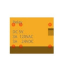
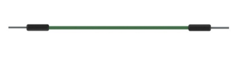
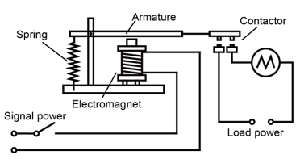
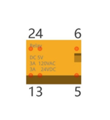
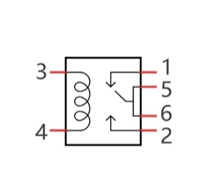
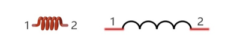
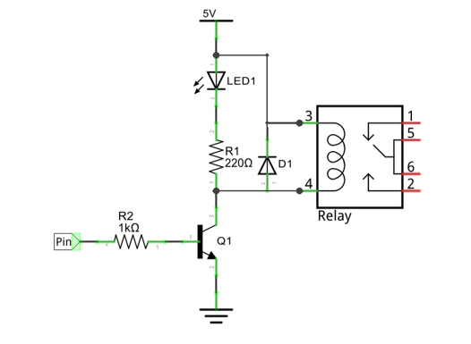
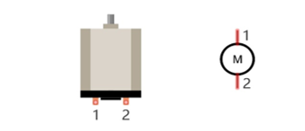

##############################################################################
Chapter Relay & Motor
##############################################################################

In this chapter, we will learn a kind of special switch module, relay module.

Project Relay & Motor
*********************************************

In this project, we will use a push button switch indirectly to control the motor via a relay.

Component List
==========================

+------------------------------------+----------------------------------------------------+
| ESP32-WROVER x1                    | GPIO Extension Board x1                            |
|                                    |                                                    |
| |Chapter01_00|                     | |Chapter01_01|                                     |
+------------------------------------+----------------------------------------------------+
| Breadboard x1                                                                           |
|                                                                                         |
| |Chapter01_02|                                                                          |
+-----------------+------------------+------------------------+---------------------------+
| Resistor 10kΩ x2| Resistor 220Ω x1 | NPN transistor x1      | Resistor 1kΩ x1           |
|                 |                  |                        |                           |
| |Chapter02_01|  | |Chapter01_04|   | |Chapter07_02|         | |Chapter07_03|            |
+-----------------+------------------+------------------------+---------------------------+
| Relay x1        | Diode x1         | Push button x1         | LED x1                    |
|                 |                  |                        |                           |
| |Chapter17_00|  | |Chapter17_01|   | |Chapter02_02|         | |Chapter01_03|            |
+-----------------+------------------+------------------------+---------------------------+
| Motor x1                           | Jumper M/M                                         |
|                                    |                                                    |
| |Chapter17_02|                     | |Chapter01_05|                                     |
+------------------------------------+----------------------------------------------------+
| 9V battery (prepared by yourself) & battery line                                        |
|                                                                                         |
| |Chapter17_03|                                                                          |
+-----------------------------------------------------------------------------------------+

.. |Chapter01_00| image:: ../_static/imgs/1_LED/Chapter01_00.png
.. |Chapter01_01| image:: ../_static/imgs/1_LED/Chapter01_01.png
.. |Chapter01_02| image:: ../_static/imgs/1_LED/Chapter01_02.png
.. |Chapter02_01| image:: ../_static/imgs/2_Button_&_LED/Chapter02_01.png
.. |Chapter01_04| image:: ../_static/imgs/1_LED/Chapter01_04.png
.. |Chapter07_02| image:: ../_static/imgs/7_Buzzer/Chapter07_02.png    
.. |Chapter07_03| image:: ../_static/imgs/7_Buzzer/Chapter07_03.png

.. |Chapter17_01| image:: ../_static/imgs/17_Relay_&_Motor/Chapter17_01.png
.. |Chapter02_02| image:: ../_static/imgs/2_Button_&_LED/Chapter02_02.png
.. |Chapter01_03| image:: ../_static/imgs/1_LED/Chapter01_03.png 
.. |Chapter17_02| image:: ../_static/imgs/17_Relay_&_Motor/Chapter17_02.png

.. |Chapter17_03| image:: ../_static/imgs/17_Relay_&_Motor/Chapter17_03.png

Component knowledge
====================================

Relay
------------------------------------

A relay is a safe switch which can use low power circuit to control high power circuit. It consists of electromagnet and contacts. The electromagnet is controlled by low power circuit and contacts are used in high power circuit. When the electromagnet is energized, it will attract contacts.

The following is a schematic diagram of a common relay and the feature and circuit symbol of a 5V relay used in this project:

.. list-table:: 
   :width: 100%
   :header-rows: 1 
   :align: center
   
   * -  Diagram 
     -  Feature
     -  Symbol

   * -  |Chapter17_04|
     -  |Chapter17_05| 
     -  |Chapter17_06|

Pin 5 and pin 6 are connected to each other inside. When the coil pins 3 and 4 get connected to 5V power supply, pin 1 will be disconnected to pin 5&6 and pin 2 will be connected to pin 5&6. So pin 1 is called close end, pin 2 is called open end.

Inductor
----------------------------------------

The symbol of Inductance is "L" and the unit of inductance is the "Henry" (H). Here is an example of how this can be encountered: 1H=1000mH, 1mH=1000μH.

An inductor is an energy storage device that converts electrical energy into magnetic energy. Generally, it consists of winding coil, with a certain amount of inductance. Inductors hinder the change of current passing through it.  When the current passing through it increases, it will attempt to hinder the increasing trend of current; and when the current passing through it decreases, it will attempt to hinder the decreasing trend of current. So the current passing through inductor is not transient.

The reference circuit for relay is as follows. The coil of relays can be equivalent to that of inductors, when the transistor disconnects power supply of the relay, the current in the coil of the relay can't stop immediately, causing an impact on power supply. So a parallel diode will get connected to both ends of relay coil pin in reversing direction, then the current will pass through diode, avoiding the impact on power supply. 

Motor
----------------------------------------

A motor is a device that converts electrical energy into mechanical energy. Motor consists of two parts: stator and rotor. When motor works, the stationary part is stator, and the rotating part is rotor. Stator is usually the outer case of motor, and it has terminals to connect to the power. Rotor is usually the shaft of motor, and can drive other mechanical devices to run. Diagram below is a small DC motor with two pins.

When a motor gets connected to the power supply, it will rotate in one direction. Reverse the polarity of power supply, then the motor rotates in opposite direction.

.. image:: ../_static/imgs/17_Relay_&_Motor/Chapter17_10.png
    :align: center

.. list-table:: 
   :width: 80%
   :header-rows: 1 
   :align: center
   
   * -  Schematic diagram
   * -  |Chapter17_11|
   * -  Hardware connection. 
       
        If you need any support, please feel free to contact us via: support@freenove.com

        |Chapter17_12|

.. |Chapter17_11| image:: ../_static/imgs/17_Relay_&_Motor/Chapter17_11.png
.. |Chapter17_12| image:: ../_static/imgs/17_Relay_&_Motor/Chapter17_12.png

.. note::
    
    the motor circuit uses A large current, about 0.2-0.3A without load.We recommend that you use a 9V battery to power the extension board.

Sketch 
===========================================

Use buttons to control the relays and motors.

Sketch_Control_Motor_by_Relay
-------------------------------------------

Download the code to ESP32-WROVER. When the DC motor is connected to a power supply, it will rotate in one direction. If you reverse the polarity of the power supply, the DC motor will rotate in opposite direction. 

The following is the program code:

.. literalinclude:: ../../../freenove_Kit/C/Sketches/Sketch_17.1_Control_Motor_by_Relay/Sketch_17.1_Control_Motor_by_Relay.ino
    :linenos: 
    :language: c
    :dedent:

In Chapter 2, the pressing and releasing of the button will result in mechanical vibrating. If we don't solve this problem, some unexpected consequences may happen to the procedure.  Click here to return to Chapter 2 Button & LED

To eliminate the vibrating, we record the electrical level of the button with nowButtonState, and the time point for the last change of pin level with lastChangeTime If the state of the button changes, it will record the time point of the change.

.. literalinclude:: ../../../freenove_Kit/C/Sketches/Sketch_17.1_Control_Motor_by_Relay/Sketch_17.1_Control_Motor_by_Relay.ino
    :linenos: 
    :language: c
    :lines: 21-25
    :dedent:

If the state of the pin changes and keeps stable for a period of time, it can be considered as a valid key state change, update the key state variable buttonState, and determine whether the key is pressed or released according to the current state.

.. literalinclude:: ../../../freenove_Kit/C/Sketches/Sketch_17.1_Control_Motor_by_Relay/Sketch_17.1_Control_Motor_by_Relay.ino
    :linenos: 
    :language: c
    :lines: 26-36
    :dedent: