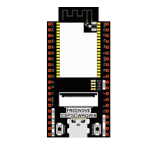
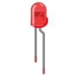
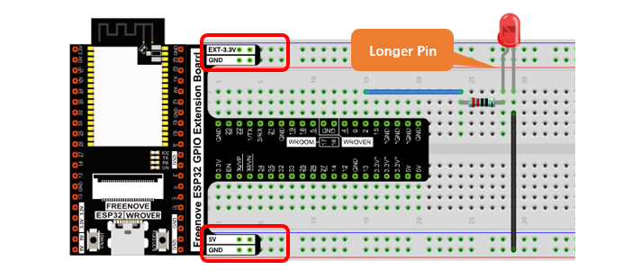

##############################################################################
Chapter LED
##############################################################################

This chapter is the Start Point in the journey to build and explore ESP32 electronic projects. We will start with simple "Blink" project.

Project Blink
*************************************

In this project, we will use ESP32 to control blinking a common LED.

Component List
======================================

+------------------------------------+-------------------------+
| ESP32-WROVER x1                    | GPIO Extension Board x1 |
|                                    |                         |
| |Chapter01_00|                     | |Chapter01_01|          |
+------------------------------------+-------------------------+
| Breadboard x1                                                |
|                                                              |
| |Chapter01_02|                                               |
+-----------------+------------------+-------------------------+
| LED x1          | Resistor 220Ω x1 | Jumper M/M x2           |
|                 |                  |                         |
| |Chapter01_03|  | |Chapter01_04|   | |Chapter01_05|          |
+-----------------+------------------+-------------------------+
  

.. |Chapter01_01| image:: ../_static/imgs/1_LED/Chapter01_01.png    
.. |Chapter01_02| image:: ../_static/imgs/1_LED/Chapter01_02.png    

.. |Chapter01_04| image:: ../_static/imgs/1_LED/Chapter01_04.png    
.. |Chapter01_05| image:: ../_static/imgs/1_LED/Chapter01_05.png    

Component knowledge
=====================================

LED
--------------------------------------

A LED is a type of diode. All diodes only work if current is flowing in the correct direction and have two poles. A LED will only work (light up) if the longer pin (+) of LED is connected to the positive output from a power source and the shorter pin is connected to the negative (-).  Negative output is also referred to as Ground (GND). This type of component is known as "diodes" (think One-Way Street).

All common 2 lead diodes are the same in this respect. Diodes work only if the voltage of its positive electrode is higher than its negative electrode and there is a narrow range of operating voltage for most all common diodes of 1.9 and 3.4V. If you use much more than 3.3V the LED will be damaged and burn out.

.. note::
    
    LEDs cannot be directly connected to a power supply, which usually ends in a damaged component. A resistor with a specified resistance value must be connected in series to the LED you plan to use.

Resistor
--------------------------------------

Resistors use Ohms (Ω) as the unit of measurement of their resistance (R). 1MΩ=1000kΩ, 1kΩ=1000Ω. 

A resistor is a passive electrical component that limits or regulates the flow of current in an electronic circuit. 

On the left, we see a physical representation of a resistor, and the right is the symbol used to represent the presence of a resistor in a circuit diagram or schematic.

The bands of color on a resistor is a shorthand code used to identify its resistance value. For more details of resistor color codes, please refer to the appendix of this tutorial.

With a fixed voltage, there will be less current output with greater resistance added to the circuit. The relationship between Current, Voltage and Resistance can be expressed by this formula: I=V/R known as Ohm's Law where I = Current, V = Voltage and R = Resistance. Knowing the values of any two of these allows you to solve the value of the third.

In the following diagram, the current through R1 is: I=U/R=5V/10kΩ=0.0005A=0.5mA. 

.. warning::
    
    Never connect the two poles of a power supply with anything of low resistance value (i.e. a metal object or bare wire) this is a Short and results in high current that may damage the power supply and electronic components.

.. note::
    
    Unlike LEDs and diodes, resistors have no poles and re non-polar (it does not matter which direction you insert them into a circuit, it will work the same)

Breadboard
-----------------------------

Here we have a small breadboard as an example of how the rows of holes (sockets) are electrically attached. 

The left picture shows the way to connect pins. The right picture shows the practical internal structure.

Power
-------------------------------

ESP32-WROVER needs 5v power supply. In this tutorial, we need connect ESP32-WROVER to computer via USB cable to power it and program it. We can also use other 5v power source to power it.

In the following projects, we only use USB cable to power ESP32-WROVER by default.

In the whole tutorial, we don't use T extension to power ESP32-WROVER. So 5V and 3.3V (includeing EXT 3.3V) on the extension board are provided by ESP32-WROVER. 

We can also use DC jack of extension board to power ESP32-WROVER.In this way, 5v and EXT 3.3v on extension board are provided by external power resource.

Circuit
===================================

First, disconnect all power from the ESP32-WROVER. Then build the circuit according to the circuit and hardware diagrams. After the circuit is built and verified correct, connect the PC to ESP32-WROVER. 

CAUTION: Avoid any possible short circuits (especially connecting 5V or GND, 3.3V and GND)! WARNING: A short circuit can cause high current in your circuit, generate excessive component heat and cause permanent damage to your hardware!

.. list-table:: 
   :width: 100%
   :header-rows: 1 
   :align: center
   
   * -  Schematic diagram
   * -  |Chapter01_11|
   * -  Hardware connection. 
       
        :red:`If you need any support, please contact us via:` support@freenove.com
   * -  |Chapter01_12|
        
        :red:`Don't rotate ESP32-WROVER 180° for connection.`

Sketch
=================================

According to the circuit, when the GPIO2 of ESP32-WROVER output level is high, the LED turns ON. Conversely, when the GPIO2 ESP32-WROVER output level is low, the LED turns OFF. Therefore, we can let GPIO2 circularly output high and low level to make the LED blink.

Upload the following Sketch: 

**Freenove_Ultimate_Starter_Kit_for_ESP32\\Sketches\\Sketch_01.1_Blink.**

Before uploading the code, click "**Tools**", "**Board**" and select "**ESP32 Wrover Module**".

.. image:: ../_static/imgs/1_LED/Chapter01_13.png
    :align: center

Select the serial port.

.. note::
    
    For macOS users, if the uploading fails, please set the baud rate to 115200 before clicking 

"Upload Speed".

Sketch_Blink
---------------------------------

Click "Upload", Download the code to ESP32-WROVER and your LED in the circuit starts Blink.

:red:`If you have any concerns, please contact us via:` support@freenove.com