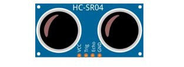
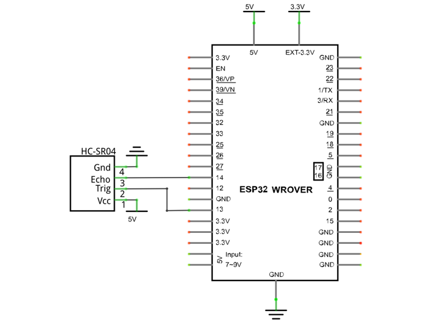
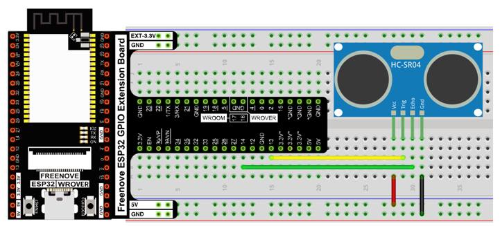

##############################################################################
Chapter 21 Ultrasonic Ranging
##############################################################################

In this chapter, we learn a module which use ultrasonic to measure distance, HC SR04.

Project 21.1 Ultrasonic Ranging
*********************************************

In this project, we use ultrasonic ranging module to measure distance, and print out the data in the terminal.

Component List
==================================

.. table::
    :width: 80%
    :align: center
    :class: table-line
    
    +------------------------------------+----------------------------------------------------+
    | ESP32-WROVER x1                    | GPIO Extension Board x1                            |
    |                                    |                                                    |
    | |Chapter01_00|                     | |Chapter01_01|                                     |
    +------------------------------------+----------------------------------------------------+
    | Breadboard x1                                                                           |
    |                                                                                         |
    | |Chapter01_02|                                                                          |
    +------------------------------------+----------------------------------------------------+
    | HC SR04 x1                         | Jumper F/M x4                                      |
    |                                    |                                                    |
    | |Chapter21_00|                     |  |Chapter20_01|                                    |
    +------------------------------------+----------------------------------------------------+

.. |Chapter01_00| image:: ../_static/imgs/1_LED/Chapter01_00.png
.. |Chapter01_01| image:: ../_static/imgs/1_LED/Chapter01_01.png
.. |Chapter01_02| image:: ../_static/imgs/1_LED/Chapter01_02.png

.. |Chapter20_01| image:: ../_static/imgs/20_LCD1602/Chapter20_01.png

Component Knowledge
===========================================

The ultrasonic ranging module uses the principle that ultrasonic waves will be sent back when encounter obstacles. We can measure the distance by counting the time interval between sending and receiving of the ultrasonic waves, and the time difference is the total time of the ultrasonic wave's journey from being transmitted to being received. Because the speed of sound in air is a constant, about v=340m/s, we can calculate the distance between the ultrasonic ranging module and the obstacle: s=vt/2.

.. image:: ../_static/imgs/21_Ultrasonic_Ranging/Chapter21_01.png
    :align: center

The HC-SR04 ultrasonic ranging module integrates both an ultrasonic transmitter and a receiver. The transmitter is used to convert electrical signals (electrical energy) into high frequency (beyond human hearing) sound waves (mechanical energy) and the function of the receiver is opposite of this. The picture and the diagram of the HC SR04 ultrasonic ranging module are shown below:

.. list-table:: 
   :align: center
   :class: table-line
   
   * -  |Chapter21_00|
     -  |Chapter21_02|

Pin description:

.. list-table:: 
   :align: center
   :header-rows: 1
   :class: zebra
   
   * -  Pin
     -  Description
   
   * -  VCC
     -  power supply pin

   * -  Trig
     -  trigger pin

   * -  Echo
     -  Echo pin

   * -  GND
     -  GND

**Technical specs:**

Working voltage: 5V

Working current: 12mA

Minimum measured distance: 2cm

Maximum measured distance: 200cm

Instructions for use: output a high-level pulse in Trig pin lasting for least 10us, the module begins to transmit ultrasonic waves. At the same time, the Echo pin is pulled up. When the module receives the returned ultrasonic waves from encountering an obstacle, the Echo pin will be pulled down. The duration of high level in the Echo pin is the total time of the ultrasonic wave from transmitting to receiving, s=vt/2. 

.. image:: ../_static/imgs/21_Ultrasonic_Ranging/Chapter21_03.png
    :align: center

Circuit
=======================================

Note that the voltage of ultrasonic module is 5V in the circuit.

.. list-table:: 
   :width: 80%
   :align: center
   :class: table-line
   
   * -  **Schematic diagram**
   * -  |Chapter21_04|
   * -  **Hardware connection** 
       
   * -  :combo:`red font-bolder:If you need any support, please feel free to contact us via:` support@freenove.com

        |Chapter21_05|

Sketch
======================================

Sketch_21.1_Ultrasonic_Ranging
---------------------------------------

Download the code to ESP32-WROVER, open the serial port monitor, set the baud rate to 115200 and you can use it to measure the distance between the ultrasonic module and the object. As shown in the following figure: 

.. image:: ../_static/imgs/21_Ultrasonic_Ranging/Chapter21_07.png
    :align: center

The following is the program code:

.. literalinclude:: ../../../freenove_Kit/C/Sketches/Sketch_21.1_Ultrasonic_Ranging/Sketch_21.1_Ultrasonic_Ranging.ino
    :linenos: 
    :language: c
    :dedent:

First, define the pins and the maximum measurement distance.

.. literalinclude:: ../../../freenove_Kit/C/Sketches/Sketch_21.1_Ultrasonic_Ranging/Sketch_21.1_Ultrasonic_Ranging.ino
    :linenos: 
    :language: c
    :lines: 7-9
    :dedent:

If the module does not return high level, we cannot wait for this forever, so we need to calculate the time period for the maximum distance, that is, time Out. timeOut= 2*MAX_DISTANCE/100/340*1000000. The result of the constant part in this formula is approximately 58.8.

.. literalinclude:: ../../../freenove_Kit/C/Sketches/Sketch_21.1_Ultrasonic_Ranging/Sketch_21.1_Ultrasonic_Ranging.ino
    :linenos: 
    :language: c
    :lines: 11-11
    :dedent:

Subfunction getSonar () function is used to start the ultrasonic module to begin measuring, and return the measured distance in cm units. In this function, first let trigPin send 10us high level to start the ultrasonic module. Then use pulseIn () to read the ultrasonic module and return the duration time of high level. Finally, the measured distance according to the time is calculated.

.. literalinclude:: ../../../freenove_Kit/C/Sketches/Sketch_21.1_Ultrasonic_Ranging/Sketch_21.1_Ultrasonic_Ranging.ino
    :linenos: 
    :language: c
    :lines: 27-39
    :dedent:

About function **pulseIn()**:

.. py:function:: int pulseIn(int pin, int level, int timeout);

    **pin** : the number of the Arduino pin on which you want to read the pulse. Allowed data types: int.
    
    **value** : type of pulse to read: either HIGH or LOW. Allowed data types: int.
    
    **timeout** (optional): the number of microseconds to wait for the pulse to start; default is one second. 

Project 21.2 Ultrasonic Ranging
*******************************************

Component List and Circuit
=========================================

Component List and Circuit are the same as the previous section.

Sketch
===========================================

How to install the library
---------------------------------------------

We use the third party library UltrasonicSensor. If you haven't installed it yet, please do so before learning. 

The steps to add third-party Libraries are as follows: open arduino -> Sketch -> Include library -> Manage libraries. Enter "UltrasonicSensor" in the search bar and select "UltrasonicSensor" for installation.

Refer to the following operations: 

.. image:: ../_static/imgs/21_Ultrasonic_Ranging/Chapter21_09.png
    :align: center

Sketch_21.2_Ultrasonic_Ranging
--------------------------------------------

Download the code to ESP32-WROVER, open the serial port monitor, set the baud rate to 115200. Use the ultrasonic module to measure distance. As shown in the following figure: 

The following is the program code:

.. literalinclude:: ../../../freenove_Kit/C/Sketches/Sketch_21.2_Ultrasonic_Ranging/Sketch_21.2_Ultrasonic_Ranging.ino
    :linenos: 
    :language: c
    :dedent:

First, add UltrasonicSensor library.

.. literalinclude:: ../../../freenove_Kit/C/Sketches/Sketch_21.2_Ultrasonic_Ranging/Sketch_21.2_Ultrasonic_Ranging.ino
    :linenos: 
    :language: c
    :lines: 7-7
    :dedent:

Define an ultrasonic object and associate the pins.

.. literalinclude:: ../../../freenove_Kit/C/Sketches/Sketch_21.2_Ultrasonic_Ranging/Sketch_21.2_Ultrasonic_Ranging.ino
    :linenos: 
    :language: c
    :lines: 9-9
    :dedent:

Set the ambient temperature to make the module measure more accurately.

.. literalinclude:: ../../../freenove_Kit/C/Sketches/Sketch_21.2_Ultrasonic_Ranging/Sketch_21.2_Ultrasonic_Ranging.ino
    :linenos: 
    :language: c
    :lines: 15-15
    :dedent:

Use the distanceInCentimeters function to get the distance measured by the ultrasound and print it out through the serial port.

.. literalinclude:: ../../../freenove_Kit/C/Sketches/Sketch_21.2_Ultrasonic_Ranging/Sketch_21.2_Ultrasonic_Ranging.ino
    :linenos: 
    :language: c
    :lines: 18-22
    :dedent:

Reference
----------------------------------

.. py:function:: class UltrasonicSensor 
    
    **class UltrasonicSensor** must be instantiated when used, that is, define an object of Servo type, for example:
    
        **UltrasonicSensor ultrasonic(13, 14);**
    
        **setTemperature(value):** The speed of sound propagation is different at different temperatures. In order to get more accurate data, this function needs to be called. value is the temperature value of the current environment.
    
    **distanceInCentimeters():** The ultrasonic distance acquisition function returns the value in centimeters. 
    
    **distanceInMillimeters():** The ultrasonic distance acquisition function returns the value in millimeter.