##############################################################################
Chapter 22 Matrix Keypad
##############################################################################

Earlier we learned about a single push button switch. In this chapter, we will learn about matrix keyboards, which integrates a number of push button switches as keys for the purposes of input.

Project 22.1 Matrix Keypad
*******************************************

In this project, we will attempt to get every key code on the matrix keypad to work.

Component List
===========================================

.. table::
    :width: 80%
    :align: center
    :class: table-line
    
    +------------------------------------+---------------------------------+
    | ESP32-WROVER x1                    | GPIO Extension Board x1         |
    |                                    |                                 |
    | |Chapter01_00|                     | |Chapter01_01|                  |
    +------------------------------------+---------------------------------+
    | Breadboard x1                                                        |
    |                                                                      |
    | |Chapter01_02|                                                       |
    +------------------------------------+---------------------------------+
    | 4x4 Matrix Keypad x1               | Jumper M/M x8                   |
    |                                    |                                 |
    | |Chapter22_00|                     |  |Chapter01_05|                 |
    +------------------------------------+---------------------------------+

.. |Chapter01_00| image:: ../_static/imgs/1_LED/Chapter01_00.png
.. |Chapter01_01| image:: ../_static/imgs/1_LED/Chapter01_01.png
.. |Chapter01_02| image:: ../_static/imgs/1_LED/Chapter01_02.png
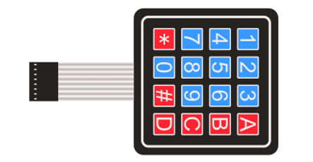
.. |Chapter01_05| image:: ../_static/imgs/1_LED/Chapter01_05.png

Component knowledge
===========================================

4x4 Matrix Keypad
--------------------------------------------

A keypad matrix is a device that integrates a number of keys in one package. As is shown below, a 4x4 keypad matrix integrates 16 keys:

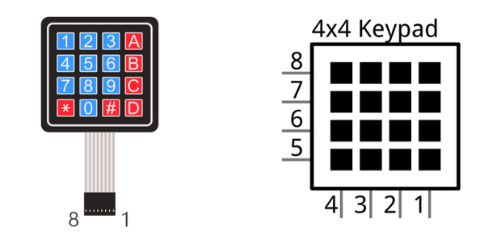

Similar to the integration of a LED matrix, the 4x4 keypad matrix has each row of keys connected with one pin and this is the same for the columns. Such efficient connections reduce the number of processor ports required. The internal circuit of the Keypad Matrix is shown below.

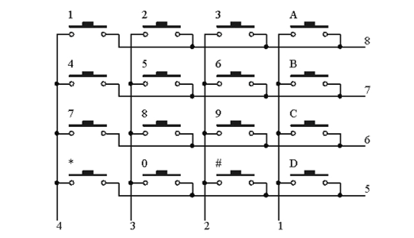

The usage is similar to the LED matrix, using a row or column scanning method to detect the state of each key's position by column and row. Take column scanning method as an example, send low level to the first 1 column (Pin1), detect level state of row 5, 6, 7, 8 to judge whether the key A, B, C, D are pressed. Then send low level to column 2, 3, 4 in turn to detect whether other keys are pressed. Therefore, you can get the state of all of the keys.

Circuit
============================================

.. list-table:: 
   :width: 80%
   :align: center
   :class: table-line
   
   * -  **Schematic diagram**
   * -  |Chapter22_03|
   * -  **Hardware connection** 
   * -  :combo:`red font-bolder:If you need any support, please feel free to contact us via:` support@freenove.com

        |Chapter22_04|

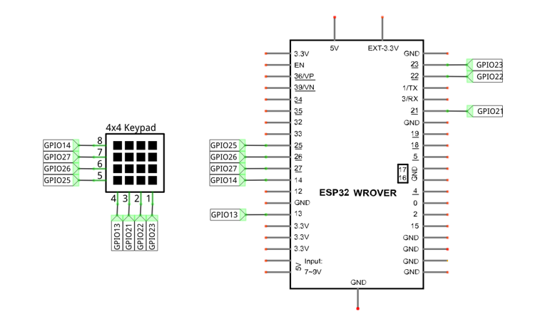
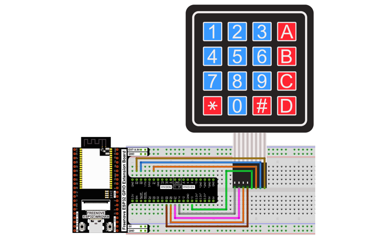

Sketch
=============================================

This code is used to obtain all key codes of the 4x4 matrix keypad, when one of the keys is pressed, the key code will be printed out via serial port.

How to install the library
----------------------------------------------

We use the third party library **Keypad**. If you haven't installed it yet, please do so before learning. 

The steps to add third-party Libraries are as follows: open arduino -> Sketch -> Include library -> Manage libraries. Enter " Keypad" in the search bar and select "Keypad" for installation.

Refer to the following operations: 

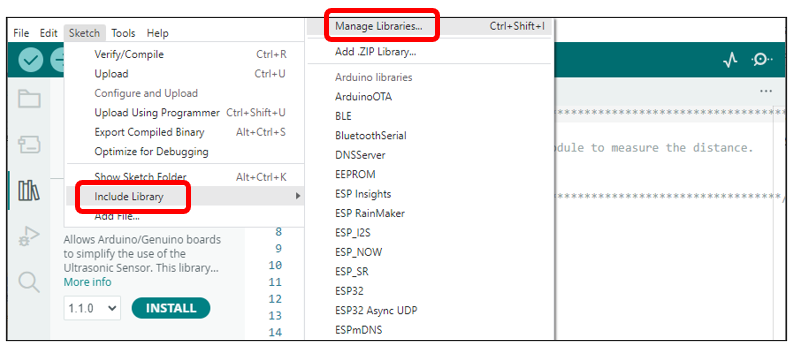

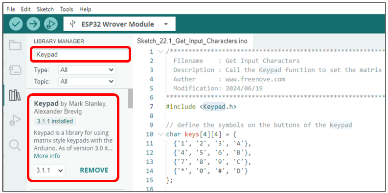

Sketch_22.1_Get_Input_Characters
-----------------------------------------------

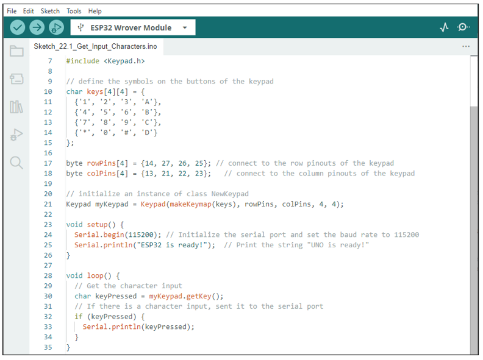

Download the code to ESP32-WROVER, open the serial port monitor, set the baud rate to 115200, press the keyboard, the value of the pressed keys will be printed out via the serial port. As shown in the following figure: 

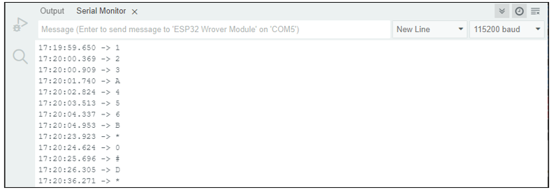

The following is the program code:

.. literalinclude:: ../../../freenove_Kit/C/Sketches/Sketch_22.1_Get_Input_Characters/Sketch_22.1_Get_Input_Characters.ino
    :linenos: 
    :language: c
    :dedent:

First, add header file, define 4*4 matrix keyboard key value and the matrix keyboard pin. 

.. literalinclude:: ../../../freenove_Kit/C/Sketches/Sketch_22.1_Get_Input_Characters/Sketch_22.1_Get_Input_Characters.ino
    :linenos: 
    :language: c
    :lines: 7-18
    :dedent:

Second, define a matrix keyboard object and associate the keys and pins with it.

.. literalinclude:: ../../../freenove_Kit/C/Sketches/Sketch_22.1_Get_Input_Characters/Sketch_22.1_Get_Input_Characters.ino
    :linenos: 
    :language: c
    :lines: 21-21
    :dedent:

Finally, get the key value and print it out via the serial port.

.. literalinclude:: ../../../freenove_Kit/C/Sketches/Sketch_22.1_Get_Input_Characters/Sketch_22.1_Get_Input_Characters.ino
    :linenos: 
    :language: c
    :lines: 28-35
    :dedent:

Reference
-------------------------------------

You need to add the library each time you use the Keypad.

.. py:function:: class Keypad

    **Keypad(char *userKeymap, byte *row, byte *col, byte numRows, byte numCols);**
    
    Constructor, the parameters are: key code of keyboard, row pin, column pin, the number of rows, the number of columns.
    
    **char getKey();**
    
    Get the key code of the pressed key. If no key is pressed, the return value is NULL.
    
    **void setDebounceTime(uint);**
    
    Set the debounce time with a default time of 10ms.
    
    **void setHoldTime(uint);**
    
    Set the duration for the key to keep stable state after pressed.
    
    **bool isPressed(char keyChar);**
    
    Judge whether the key with code "keyChar" is pressed.
    
    **char waitForKey();**
    
    Wait for a key to be pressed, and return key code of the pressed key.
    
    **KeyState getState();**
    
    Get the state of the keys.
    
    **bool keyStateChanged();**
    
    Judge whether there is a change of key state, then return True or False.

For More information about Keypad, please visit: http://playground.arduino.cc/Code/Keypad

Project 22.2 Keypad Door
******************************************************

In this project, we use keypad as a keyboard to control the action of the servo motor.

Component List
=======================================================

.. table::
    :width: 80%
    :align: center
    :class: table-line
    
    +------------------------------------+-----------------------------------------------+
    | ESP32-WROVER x1                    | GPIO Extension Board x1                       |
    |                                    |                                               |
    | |Chapter01_00|                     | |Chapter01_01|                                |
    +------------------------------------+-----------------------------------------------+
    | Breadboard x1                                                                      |
    |                                                                                    |
    | |Chapter01_02|                                                                     |
    +------------------------------------+------------------------+----------------------+
    | Jumper M/M                         | Servo x1               | 4x4 Matrix Keypad x1 |
    |                                    |                        |                      |
    | |Chapter01_05|                     |  |Chapter18_00|        |   |Chapter22_00|     |
    +------------------------------------+------------------------+----------------------+
    | NPN transistorx1 (S8050)           | Active buzzer x1       | Resistor 1kΩ x1      |
    |                                    |                        |                      |
    | |Chapter07_00|                     |  |Chapter07_01|        |   |Chapter07_03|     |
    +------------------------------------+------------------------+----------------------+

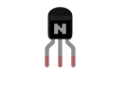
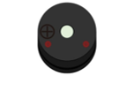
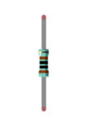

Circuit
========================================================

.. list-table:: 
   :width: 80%
   :align: center
   :Class: table-line
   
   * -  **Schematic diagram**
   * -  |Chapter22_09|
   * -  **Hardware connection**
   * -  :combo:`red font-bolder:If you need any support, please feel free to contact us via:` support@freenove.com

        |Chapter22_10|

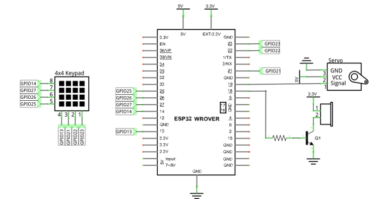
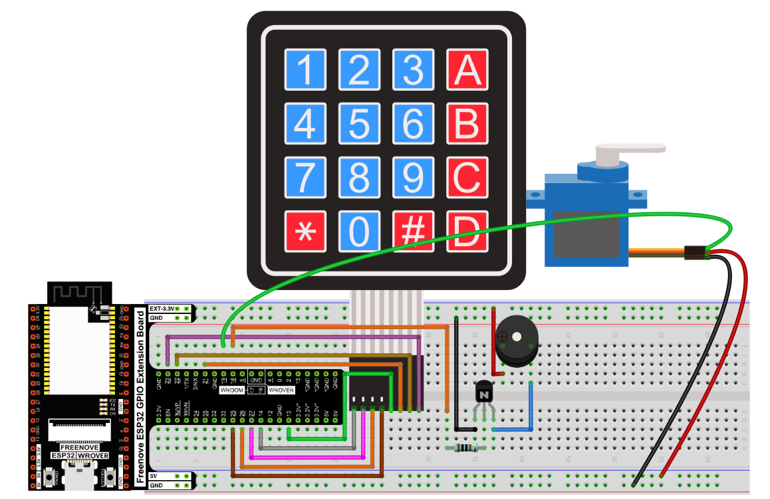

Sketch
================================================

Sketch_22.2_Keypad_Door
-------------------------------------------------

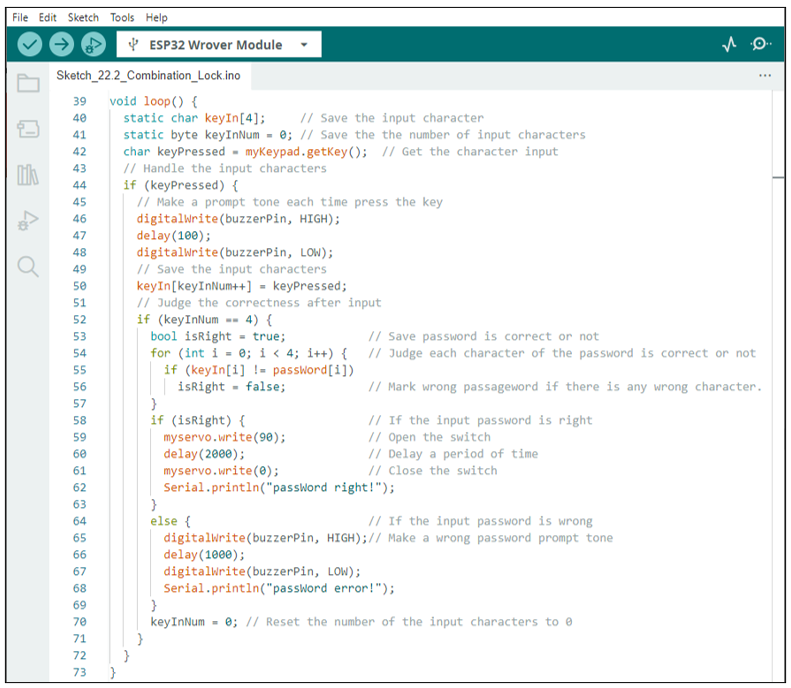

Verify and upload the code to the ESP32-WROVER and press the keypad to input password with 4 characters. If the input is correct, the servo will move to a certain degree, then return to the original position. If the input is wrong, an input error alarm will be generated.

The following is the program code:

.. literalinclude:: ../../../freenove_Kit/C/Sketches/Sketch_22.2_Combination_Lock/Sketch_22.2_Combination_Lock.ino
    :linenos: 
    :language: c
    :dedent:

First, we need to set the value of the password.

.. literalinclude:: ../../../freenove_Kit/C/Sketches/Sketch_22.2_Combination_Lock/Sketch_22.2_Combination_Lock.ino
    :linenos: 
    :language: c
    :lines: 28-28
    :dedent:

Second, each time the key is pressed, the buzzer makes a short sound and stores the key value entered.

.. literalinclude:: ../../../freenove_Kit/C/Sketches/Sketch_22.2_Combination_Lock/Sketch_22.2_Combination_Lock.ino
    :linenos: 
    :language: c
    :lines: 42-50
    :dedent:

Third, if the button has been pressed for four times, ESP32 begins to judge if the password is correct.

.. literalinclude:: ../../../freenove_Kit/C/Sketches/Sketch_22.2_Combination_Lock/Sketch_22.2_Combination_Lock.ino
    :linenos: 
    :language: c
    :lines: 52-57
    :dedent:

If the password is correct, control the servo motor to open the lock and wait for 2 seconds before closing the lock. If it is not correct, the buzzer makes a long sound and prints the error message through the serial port.

.. literalinclude:: ../../../freenove_Kit/C/Sketches/Sketch_22.2_Combination_Lock/Sketch_22.2_Combination_Lock.ino
    :linenos: 
    :language: c
    :lines: 58-69
    :dedent:

Finally, remember to empty the keyInNum every time.

.. literalinclude:: ../../../freenove_Kit/C/Sketches/Sketch_22.2_Combination_Lock/Sketch_22.2_Combination_Lock.ino
    :linenos: 
    :language: c
    :lines: 70-70
    :dedent:

For More information about Keypad, please visit: http://playground.arduino.cc/Code/Keypad .