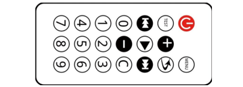
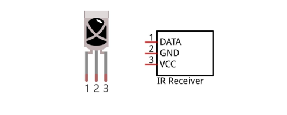
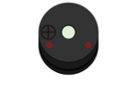
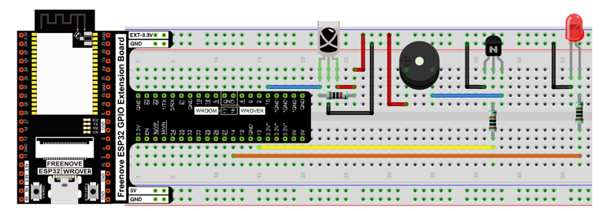

##############################################################################
Chapter Infrared Remote
##############################################################################

In this chapter, we'll learn how to use an infrared remote control, and control a LED.

Project Infrared Remote Control
*****************************************

First, we need to understand how infrared remote control works, then get the command sent from infrared remote control.

Component List
=======================================================

+------------------------------------+-----------------------------------------------+
| ESP32-WROVER x1                    | GPIO Extension Board x1                       |
|                                    |                                               |
| |Chapter01_00|                     | |Chapter01_01|                                |
+------------------------------------+-----------------------------------------------+
| Breadboard x1                                                                      |
|                                                                                    |
| |Chapter01_02|                                                                     |
+------------------------------------+------------------------+----------------------+
| Jumper M/M                         | Infrared Remote x1     | Resistor 10kΩ x1     |
|                                    |                        |                      |
| |Chapter01_05|                     |  |Chapter23_01|        |   |Chapter02_01|     |
+------------------------------------+------------------------+----------------------+
| Infrared Remote x1                                                                 |
|                                                                                    |
| (May need CR2025 battery x1, please check the holder)                              |
|                                                                                    |
| |Chapter23_00|                                                                     |
+------------------------------------------------------------------------------------+

.. |Chapter01_00| image:: ../_static/imgs/1_LED/Chapter01_00.png
.. |Chapter01_01| image:: ../_static/imgs/1_LED/Chapter01_01.png
.. |Chapter01_02| image:: ../_static/imgs/1_LED/Chapter01_02.png
.. |Chapter01_05| image:: ../_static/imgs/1_LED/Chapter01_05.png
.. |Chapter02_01| image:: ../_static/imgs/2_Button_&_LED/Chapter02_01.png

.. |Chapter23_01| image:: ../_static/imgs/23_Infrared_Remote/Chapter23_01.png

Component knowledge
====================================

Infrared Remote
-----------------------------------

An infrared(IR) remote control is a device with a certain number of buttons. Pressing down different buttons will make the infrared emission tube, which is located in the front of the remote control, send infrared ray with different command. Infrared remote control technology is widely used in electronic products such as TV, air conditioning, etc. Thus making it possible for you to switch TV programs and adjust the temperature of the air conditioning when away from them. The remote control we use is shown below:

.. image:: ../_static/imgs/23_Infrared_Remote/Chapter23_02.png
    :align: center

Infrared receiver
------------------------------------

An infrared(IR) receiver is a component which can receive the infrared light, so we can use it to detect the signal emitted by the infrared remote control. DATA pin here outputs the received infrared signal.

When you use the infrared remote control, the infrared remote control sends a key value to the receiving circuit according to the pressed keys. We can program the ESP32-WROVER to do things like lighting, when a key value is received. 

The following is the key value that the receiving circuit will receive when each key of the infrared remote control is pressed.

.. image:: ../_static/imgs/23_Infrared_Remote/Chapter23_04.png
    :align: center

Circuit
===========================================

.. list-table:: 
   :width: 80%
   :header-rows: 1 
   :align: center
   
   * -  Schematic diagram
   * -  |Chapter23_05|
   * -  Hardware connection. 
       
        If you need any support, please feel free to contact us via: support@freenove.com

        |Chapter23_06|

.. |Chapter23_05| image:: ../_static/imgs/23_Infrared_Remote/Chapter23_05.png
.. |Chapter23_06| image:: ../_static/imgs/23_Infrared_Remote/Chapter23_06.png

Sketch
===========================================

This sketch uses the infrared receiving tube to receive the value sent form the infrared remote control, and print it out via the serial port.

How to install the library
---------------------------------------------

We use the third party library Freenove_IR_Lib_for_ESP32. If you haven't installed it yet, please do so before learning. The steps to add third-party Libraries are as follows: open arduino->Sketch->Include library-> Add .ZIP Library…. 

In the Freenove_Ultimate_Starter_Kit_for_ESP32/C/Libraries folder, select Freenove_IR_Lib_for_ESP32.zip and click open.

Sketch_Infrared_Remote_Control
------------------------------------------------

Download the code to ESP32-WROVER, open the serial port monitor, set the baud rate to 115200, press the IR remote control, the pressed keys value will be printed out through the serial port. As shown in the following figure: (Note that when the remote control button is pressed for a long time, the infrared receiving circuit receives a continuous high level, that is, it receives a hexadecimal "F") 

The following is the program code:

.. literalinclude:: ../../../freenove_Kit/C/Sketches/Sketch_23.1_Infrared_Remote_Control/Sketch_23.1_Infrared_Remote_Control.ino
    :linenos: 
    :language: c
    :dedent:

First, include header file. Each time you use the infrared library, you need to include the header file at the beginning of the program.

.. literalinclude:: ../../../freenove_Kit/C/Sketches/Sketch_23.1_Infrared_Remote_Control/Sketch_23.1_Infrared_Remote_Control.ino
    :linenos: 
    :language: c
    :lines: 7-7
    :dedent:

Second, define an infrared receive pin and associates it with the receive class. 

.. literalinclude:: ../../../freenove_Kit/C/Sketches/Sketch_23.1_Infrared_Remote_Control/Sketch_23.1_Infrared_Remote_Control.ino
    :linenos: 
    :language: c
    :lines: 9-10
    :dedent:

Third, call the infrared reception function, if you do not use this function, you won't receive the value from the infrared remote control.

.. literalinclude:: ../../../freenove_Kit/C/Sketches/Sketch_23.1_Infrared_Remote_Control/Sketch_23.1_Infrared_Remote_Control.ino
    :linenos: 
    :language: c
    :lines: 19-19
    :dedent:

Finally, determine whether the detection IR data has been obtained, and if so, print the data.

.. literalinclude:: ../../../freenove_Kit/C/Sketches/Sketch_23.1_Infrared_Remote_Control/Sketch_23.1_Infrared_Remote_Control.ino
    :linenos: 
    :language: c
    :lines: 18-24
    :dedent:

Reference
-------------------------------

You need to add the library each time you use the Infrared Reception.

.. py:function:: class Freenove_ESP32_IR_Recv

    **Freenove_ESP32_IR_Recv irrecv(Pin)** :Create a class object used to receive class, and associated with Pin.
    **task** You need to keep calling this function, so that IR can accurately get the data.
    **nec_available()** : Check whether IR data is obtained from the buffer.
    **data()** :Get IR data.

Project Control LED through Infrared Remote
*************************************************************

In this project, we will control the brightness of LED lights through an infrared remote control.

Component List
=======================================================

+------------------------------------+-------------------------------------------------------+
| ESP32-WROVER x1                    | GPIO Extension Board x1                               |
|                                    |                                                       |
| |Chapter01_00|                     | |Chapter01_01|                                        |
+------------------------------------+-------------------------------------------------------+
| Breadboard x1                                                                              |
|                                                                                            |
| |Chapter01_02|                                                                             |
+------------------------------------+------------------------+------------------------------+
| Jumper M/M                         | Infrared Remote x1     | Resistor 10kΩ x1             |
|                                    |                        |                              |
| |Chapter01_05|                     |  |Chapter23_01|        |   |Chapter02_01|             |
+------------------------------------+------------------------+------------------------------+
| Infrared Remote x1                                          | Active buzzer x1             |
|                                                             |                              |
| (May need CR2025 battery x1, please check the holder)       | |Chapter07_01|               |
|                                                             |                              |
| |Chapter23_00|                                              |                              |
+------------------------------------+------------------------+------------------------------+
| LED x1                             | Resistor 1kΩ x2        | NPN transistorx1 (S8050)     |
|                                    |                        |                              |
| |Chapter01_03|                     |  |Chapter07_03|        |   |Chapter07_02|             |
+------------------------------------+------------------------+------------------------------+

.. |Chapter01_03| image:: ../_static/imgs/1_LED/Chapter01_03.png 
.. |Chapter07_03| image:: ../_static/imgs/7_Buzzer/Chapter07_03.png
.. |Chapter07_02| image:: ../_static/imgs/7_Buzzer/Chapter07_02.png

Circuit
================================

.. list-table:: 
   :width: 80%
   :header-rows: 1 
   :align: center
   
   * -  Schematic diagram
   * -  |Chapter23_11|
   * -  Hardware connection. 
       
        If you need any support, please feel free to contact us via: support@freenove.com

        |Chapter23_12|

.. |Chapter23_11| image:: ../_static/imgs/23_Infrared_Remote/Chapter23_11.png

Sketch
=================================

The sketch controls the brightness of the LED by determining the key value of the infrared received.

Sketch_Control_LED_through_Infrared_Remote
----------------------------------------------------------------

Compile and upload the code to the ESP32-WROVER. When pressing "0", "1", "2", "3" of the infrared remote control, the buzzer will sound once, and the brightness of the LED light will change correspondingly.

rendering

.. image:: ../_static/imgs/23_Infrared_Remote/Chapter23_14.png
    :align: center

The following is the program code:

.. literalinclude:: ../../../freenove_Kit/C/Sketches/Sketch_23.2_Control_LED_through_Infrared_Remote/Sketch_23.2_Control_LED_through_Infrared_Remote.ino
    :linenos: 
    :language: c
    :dedent:

The handleControl() function is used to execute events corresponding to infrared code values. Every time when the function is called, the buzzer sounds once and determine the brightness of the LED based on the infrared key value. If the key value is not "0", "1", "2", "3", the buzzer sounds once, but the brightness of LED will not change.

.. literalinclude:: ../../../freenove_Kit/C/Sketches/Sketch_23.2_Control_LED_through_Infrared_Remote/Sketch_23.2_Control_LED_through_Infrared_Remote.ino
    :linenos: 
    :language: c
    :lines: 27-46
    :dedent:

Each time when the command is received, the function above will be called in the loop() function.

.. literalinclude:: ../../../freenove_Kit/C/Sketches/Sketch_23.2_Control_LED_through_Infrared_Remote/Sketch_23.2_Control_LED_through_Infrared_Remote.ino
    :linenos: 
    :language: c
    :lines: 20-25
    :dedent: