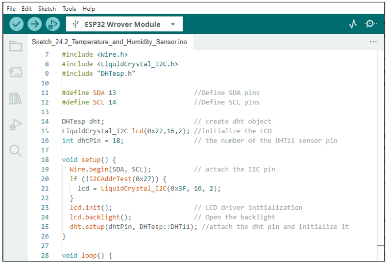

##############################################################################
Chapter Hygrothermograph DHT11
##############################################################################

In this chapter, we will learn about a commonly used sensor called a Hygrothermograph DHT11.

Project Hygrothermograph
**********************************************

Hygrothermograph is an important tool in our lives to give us data on the temperature and humidity in our environment. In this project, we will use the ESP32 to read temperature and humidity data of the DHT11 Module.

Component List
============================================

+----------------------+----------------------------------------------+
| ESP32-WROVER x1      | GPIO Extension Board x1                      |
|                      |                                              |
| |Chapter01_00|       | |Chapter01_01|                               |
+----------------------+----------------------------------------------+
| Breadboard x1                                                       |
|                                                                     |
| |Chapter01_02|                                                      |
+----------------------+------------------------+---------------------+
| Jumper M/M x4        | DHT11 x1               | Resistor 10kΩ x1    |
|                      |                        |                     |
| |Chapter01_05|       |  |Chapter24_00|        |   |Chapter02_01|    |
+----------------------+------------------------+---------------------+

.. |Chapter01_00| image:: ../_static/imgs/1_LED/Chapter01_00.png
.. |Chapter01_01| image:: ../_static/imgs/1_LED/Chapter01_01.png
.. |Chapter01_02| image:: ../_static/imgs/1_LED/Chapter01_02.png
.. |Chapter01_05| image:: ../_static/imgs/1_LED/Chapter01_05.png

.. |Chapter02_01| image:: ../_static/imgs/2_Button_&_LED/Chapter02_01.png

Component knowledge
=============================================

The temperature & humidity sensor DHT11 is a compound temperature & humidity sensor, and the output digital signal has been calibrated by its manufacturer.

DHT11 uses customized single-line communication protocol, so we can use the library to read data more conveniently.

After being powered up, it will initialize in 1s. Its operating voltage is within the range of 3.3V-5.5V.

The SDA pin is a data pin, which is used to communicate with other devices. 

The NC pin (Not Connected Pin) is a type of pin found on various integrated circuit packages. Those pins have no functional purpose to the outside circuit (but may have an unknown functionality during manufacture and test). Those pins should not be connected to any of the circuit connections.

Circuit
================================

.. list-table:: 
   :width: 80%
   :header-rows: 1 
   :align: center
   
   * -  Schematic diagram
   * -  |Chapter24_02|
   * -  Hardware connection. 
       
        If you need any support, please feel free to contact us via: support@freenove.com

        |Chapter24_03|

Sketch
===================================

How to install the library
----------------------------------

The code is used to read the temperature and humidity data of DHT11, and print them out.

We use the third party library **DHTesp** . If you haven't installed it yet, please do so now. The steps to add third-party libraries are as follows: open arduino -> Sketch -> Include library -> Manage libraries. Enter " DHTesp " in the search bar and select " **DHTesp** " for installation.

Refer to the following operations:

.. image:: ../_static/imgs/24_Hygrothermograph_DHT11/Chapter24_05.png
    :align: center

Sketch_Temperature_and_Humidity_Sensor
------------------------------------------------------

Compile and upload the code to the ESP32-WROVER, turn on the serial monitor, and set the baud rate to 115200. Print out data of temperature and humidity sensor via the serial port.

The following is the program code:

.. literalinclude:: ../../../freenove_Kit/C/Sketches/Sketch_24.1_Temperature_and_Humidity_Sensor/Sketch_24.1_Temperature_and_Humidity_Sensor.ino
    :linenos: 
    :language: c
    :dedent:

In this project code, we use a third party library, DHTesp, and we need to define the objects for it first; Otherwise we could not use its functionality.

.. literalinclude:: ../../../freenove_Kit/C/Sketches/Sketch_24.1_Temperature_and_Humidity_Sensor/Sketch_24.1_Temperature_and_Humidity_Sensor.ino
    :linenos: 
    :language: c
    :lines: 7-9
    :dedent:

Initialize the connection pin of DHT and select the type of temperature and humidity sensor as DHT11. If the temperature and humidity sensor is DHT12, we can also change it to DHT12.

.. literalinclude:: ../../../freenove_Kit/C/Sketches/Sketch_24.1_Temperature_and_Humidity_Sensor/Sketch_24.1_Temperature_and_Humidity_Sensor.ino
    :linenos: 
    :language: c
    :lines: 13-13
    :dedent:

Due to the use of the single-line protocol, data may be lost in the transmission process. So each time when getting the data of the temperature and humidity sensor, we need to call the getStatus function to determine whether the data is normal. If not, use goto to go back to line 12 and re-execute the program.

.. literalinclude:: ../../../freenove_Kit/C/Sketches/Sketch_24.1_Temperature_and_Humidity_Sensor/Sketch_24.1_Temperature_and_Humidity_Sensor.ino
    :linenos: 
    :language: c
    :lines: 18-21
    :dedent:

Get the temperature and humidity data and store it in a TempAndHumidity class called newValues.

.. literalinclude:: ../../../freenove_Kit/C/Sketches/Sketch_24.1_Temperature_and_Humidity_Sensor/Sketch_24.1_Temperature_and_Humidity_Sensor.ino
    :linenos: 
    :language: c
    :lines: 18-18
    :dedent:

Reference

.. py:function:: class DHTesp	

    Make sure that the library and header files are added before using the object every time.

    **setup(Pin, DHTesp::DHTxx):** Select the type of DHTxx and associate Pin with the DHTesp class.

    Parameter 1: the pin to be associated.

    Parameter 2: select the type of sensor, DHT11 or DHT12.

    **getTempAndHumidity():** Obtain temperature and humidity data. The received data must be stored in the 'TempAndHumidity' class.

    **getStatus():** To judge whether the obtained data format is normal, the return value of 0 means the data is normal, and the return value of non-0 means the data is abnormal or the data fails to be obtained.

Project Hygrothermograph
***********************************************************

In this project, we use L2C-LCD1602 to display data collected by DHT11.

Component List
============================================

+----------------------+----------------------------------------------+
| ESP32-WROVER x1      | GPIO Extension Board x1                      |
|                      |                                              |
| |Chapter01_00|       | |Chapter01_01|                               |
+----------------------+----------------------------------------------+
| Breadboard x1                                                       |
|                                                                     |
| |Chapter01_02|                                                      |
+----------------------------------+----------------------------------+
| LCD1602 Module x1                | Resistor 10kΩ x1                 |
|                                  |                                  |
| |Chapter20_00|                   |   |Chapter02_01|                 |
+----------------------------------+----------------------------------+
| Jumper F/M x4                    | DHT11 x1                         |
|                                  |                                  |
| Jumper M/M x4                    |                                  |
|                                  |                                  |
| |Chapter24_08|                   |   |Chapter24_00|                 |
+----------------------------------+----------------------------------+

.. |Chapter24_08| image:: ../_static/imgs/24_Hygrothermograph_DHT11/Chapter24_08.png
.. |Chapter20_00| image:: ../_static/imgs/20_LCD1602/Chapter20_00.png

Circuit
================================

.. list-table:: 
   :width: 80%
   :header-rows: 1 
   :align: center
   
   * -  Schematic diagram
   * -  |Chapter24_09|
   * -  Hardware connection. 
       
        If you need any support, please feel free to contact us via: support@freenove.com

        |Chapter24_10|

Sketch
===================================

This code uses the DHTesp and LiquidCrystal_I2C libraries, so make sure the relevant library files are added before writing the program.

Sketch_Temperature_and_Humidity_Sensor
------------------------------------------------------

Download the code to ESP32-WROVER. The first line of LCD1602 shows the temperature value, and the second line shows the humidity value. Try to "pinch" the thermistor (without touching the leads) with your index finger and thumb for a brief time to observe the change in the LCD display value.

The following is the program code:

.. literalinclude:: ../../../freenove_Kit/C/Sketches/Sketch_24.2_Temperature_and_Humidity_Sensor/Sketch_24.2_Temperature_and_Humidity_Sensor.ino
    :linenos: 
    :language: c
    :dedent:

First, add the library function header file.

.. literalinclude:: ../../../freenove_Kit/C/Sketches/Sketch_24.2_Temperature_and_Humidity_Sensor/Sketch_24.2_Temperature_and_Humidity_Sensor.ino
    :linenos: 
    :language: c
    :lines: 7-9
    :dedent:

Second, initialize the pins associated with the DHT11 sensor and I2C-LCD1602.

.. literalinclude:: ../../../freenove_Kit/C/Sketches/Sketch_24.2_Temperature_and_Humidity_Sensor/Sketch_24.2_Temperature_and_Humidity_Sensor.ino
    :linenos: 
    :language: c
    :lines: 14-26
    :dedent:

Finally, the data of temperature and humidity sensor are obtained and displayed on LCD1602. The first row shows the temperature and the second shows the humidity.

.. literalinclude:: ../../../freenove_Kit/C/Sketches/Sketch_24.2_Temperature_and_Humidity_Sensor/Sketch_24.2_Temperature_and_Humidity_Sensor.ino
    :linenos: 
    :language: c
    :lines: 30-39
    :dedent: