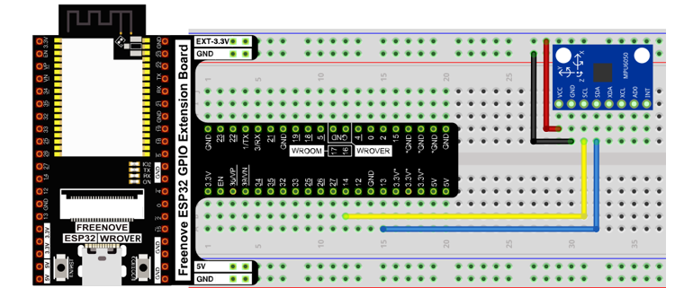

##############################################################################
Chapter Attitude Sensor MPU6050
##############################################################################

In this chapter, we will learn about a MPU6050 attitude sensor which integrates an accelerometer and gyroscope.

Project Read a MPU6050 Sensor Module
*****************************************************

In this project, we will read acceleration and gyroscope data of the MPU6050 sensor

Component List
============================================

.. table::
    :width: 80%
    :align: center
    :class: table-line
    
    +----------------------+----------------------------------------------+
    | ESP32-WROVER x1      | GPIO Extension Board x1                      |
    |                      |                                              |
    | |Chapter01_00|       | |Chapter01_01|                               |
    +----------------------+----------------------------------------------+
    | Breadboard x1                                                       |
    |                                                                     |
    | |Chapter01_02|                                                      |
    +----------------------------------+----------------------------------+
    | LED x1                           | MPU6050 x1                       |
    |                                  |                                  |
    | |Chapter01_05|                   |   |Chapter26_00|                 |
    +----------------------------------+----------------------------------+

.. |Chapter01_00| image:: ../_static/imgs/1_LED/Chapter01_00.png
.. |Chapter01_01| image:: ../_static/imgs/1_LED/Chapter01_01.png
.. |Chapter01_02| image:: ../_static/imgs/1_LED/Chapter01_02.png
.. |Chapter01_05| image:: ../_static/imgs/1_LED/Chapter01_05.png    
.. |Chapter26_00| image:: ../_static/imgs/26_Attitude_Sensor_MPU6050/Chapter26_00.png

Component knowledge
==================================

MPU6050
------------------------------------

MPU6050 sensor module is a complete 6-axis motion tracking device. It combines a 3-axis gyroscope, a 3-axis accelerometer and a DMP (Digital Motion Processor) all in a small package. The settings of the accelerometer and gyroscope of MPU6050 can be changed. A precision wide range digital temperature sensor is also integrated to compensate data readings for changes in temperature, and temperature values can also be read. The MPU6050 Module follows the I2C communication protocol and the default address is 0x68.

MPU6050 is widely used to assist with balancing vehicles, robots and aircraft, mobile phones and other products which require stability to control stability and attitude or which need to sense same.

.. image:: ../_static/imgs/26_Attitude_Sensor_MPU6050/Chapter26_01.png
    :align: center

The port description of the MPU6050 module is as follows:

.. table::
    :align: center
    :class: zebra
    
    +----------+------------+-------------------------------------------------------------+
    | Pin name | Pin number | Description                                                 |
    +==========+============+=============================================================+
    | VCC      | 1          | Positive pole of power supply with voltage 3.3V/5V          |
    +----------+------------+-------------------------------------------------------------+
    | GND      | 2          | Negative pole of power supply                               |
    +----------+------------+-------------------------------------------------------------+
    | SCL      | 3          | I2C communication clock pin                                 |
    +----------+------------+-------------------------------------------------------------+
    | SDA      | 4          | I2C communication clock pin                                 |
    +----------+------------+-------------------------------------------------------------+
    | XDA      | 5          | I2C host data pin which can be connected to other devices.  |
    +----------+------------+-------------------------------------------------------------+
    | XCL      | 6          | I2C host clock pin which can be connected to other devices. |
    +----------+------------+-------------------------------------------------------------+
    |          |            | I2C address bit control pin.                                |
    |          |            |                                                             |
    | AD0      | 7          | Low level: the device address is 0x68                       |
    |          |            |                                                             |
    |          |            | High level: the device address is 0x69                      |
    +----------+------------+-------------------------------------------------------------+
    | INT      | 8          | Output interrupt pin                                        |
    +----------+------------+-------------------------------------------------------------+

For more detail, please refer to datasheet.

Circuit
======================================

Note that the power supply voltage for MPU6050 module is 3.3V in the circuit.

.. list-table:: 
   :width: 80%
   :align: center
   :class: table-line
   
   * -  **Schematic diagram**
   * -  |Chapter26_02|
   * -  **Hardware connection** 
       
        :combo:`red font-bolder:If you need any support, please feel free to contact us via:` support@freenove.com

        |Chapter26_03|

.. |Chapter26_02| image:: ../_static/imgs/26_Attitude_Sensor_MPU6050/Chapter26_02.png

Sketch
======================================

How to install the library
---------------------------------------

In this project, we will read the acceleration data and gyroscope data of MPU6050, and print them out.

We use the third party library **MPU6050_tockn** . If you haven't installed it yet, please do so before learning. 

The steps to add third-party Libraries are as follows: open arduino -> Sketch -> Include library -> Manage libraries. 

Enter " **MPU6050_tockn** " in the search bar and select " **MPU6050_tockn** " for installation.

Sketch_Acceleration_Detection
---------------------------------------

Download the code to ESP32-WROVER, open the serial port monitor, set the baud rate to 115200 and you can use it to measure the distance between the ultrasonic module and the object. As shown in the following figure: 

The following is the program code:

.. literalinclude:: ../../../freenove_Kit/C/Sketches/Sketch_26.1_Acceleration_Detection/Sketch_26.1_Acceleration_Detection.ino
    :linenos: 
    :language: c
    :dedent:

Two library files " **MPU6050_tockn.h** " and " **Wire.h** " are used in the code and will be compiled with others. Class MPU6050 is used to operate the MPU6050. When using it, please instantiate an object first.

.. literalinclude:: ../../../freenove_Kit/C/Sketches/Sketch_26.1_Acceleration_Detection/Sketch_26.1_Acceleration_Detection.ino
    :linenos: 
    :language: c
    :lines: 13-13
    :dedent:

In the setup function, IIC and MPU6050 are initialized and the offset difference of MPU6050 is obtained.

.. literalinclude:: ../../../freenove_Kit/C/Sketches/Sketch_26.1_Acceleration_Detection/Sketch_26.1_Acceleration_Detection.ino
    :linenos: 
    :language: c
    :lines: 19-24
    :dedent:

The getMotion6 function is used to obtain the x, y, z axis acceleration raw data and the Gyroscope raw data.

.. literalinclude:: ../../../freenove_Kit/C/Sketches/Sketch_26.1_Acceleration_Detection/Sketch_26.1_Acceleration_Detection.ino
    :linenos: 
    :language: c
    :lines: 47-54
    :dedent:

Finally, the original data of the gyroscope is updated and acquired every second, and the original data, the processed acceleration and angular velocity data are printed out through the serial port.

.. literalinclude:: ../../../freenove_Kit/C/Sketches/Sketch_26.1_Acceleration_Detection/Sketch_26.1_Acceleration_Detection.ino
    :linenos: 
    :language: c
    :lines: 26-46
    :dedent:

Reference
------------------------

.. py:function:: Class MPU6050
    
    This is a class library used to operate MPU6050, which can directly read and set MPU6050. Here are some member functions:
    
    **MPU6050 mpu6050(Wire):** Associate MPU6050 with IIC. 
    
    **begin():** Initialize the MPU6050.
    
    **calcGyroOffsets(true):** If the parameter is true, get the gyro offset and automatically correct the offset. If the parameter is false, the offset value is not obtained and the offset is not corrected.
    
    **getRawAccX():** Gain the values of X axis acceleration raw data.
    
    **getRawAccY():** Gain the values of Y axis acceleration raw data.
    
    **getRawAccZ():** Gain the values of Z axis acceleration raw data.
    
    **getRawGyroX():** Gain the values of X axis Gyroscope raw data.
    
    **getRawGyroY():** Gain the values of Y axis Gyroscope raw data.
    
    **getRawGyroZ():** gain the values of Z axis Gyroscope raw data.
    
    **getTemp():** Gain the values of MPU6050'temperature data.
    
    **update():** Update the MPU6050. If the updated function is not used, the IIC will not be able to retrieve the new data.
