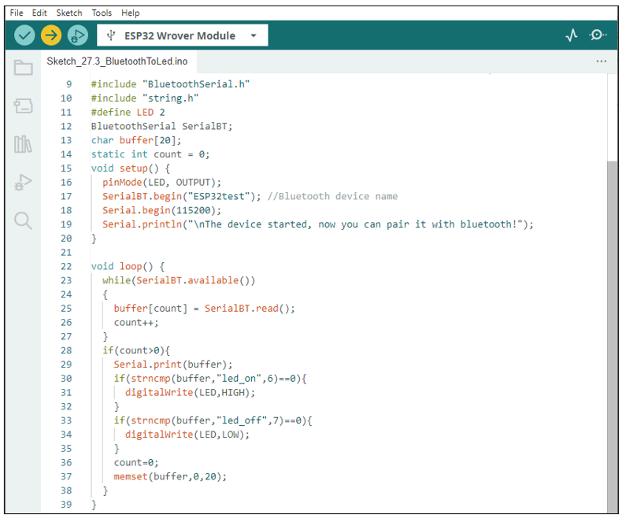
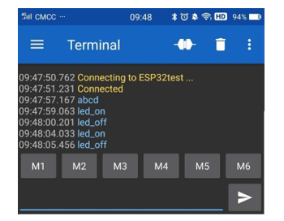
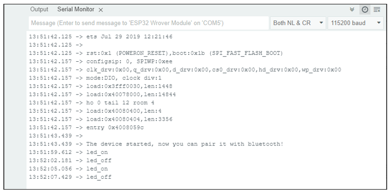
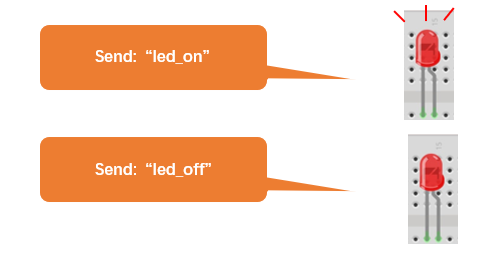

Project 27.3 Bluetooth Control LED
*********************************************

In this section, we will control the LED with Bluetooth.

Component List
======================================

.. table::
    :width: 80%
    :align: center
    :class: table-line
    
    +------------------------------------+-------------------------+
    | ESP32-WROVER x1                    | GPIO Extension Board x1 |
    |                                    |                         |
    | |Chapter01_00|                     | |Chapter01_01|          |
    +------------------------------------+-------------------------+
    | Micro USB Wire x1                                            |
    |                                                              |
    | |Chapter08_00|                                               |
    +--------------------------------------------------------------+
    | Breadboard x1                                                |
    |                                                              |
    | |Chapter01_02|                                               |
    +-----------------+------------------+-------------------------+
    | LED x1          | Resistor 220Ω x1 | Jumper M/M x2           |
    |                 |                  |                         |
    | |Chapter01_03|  | |Chapter01_04|   | |Chapter01_05|          |
    +-----------------+------------------+-------------------------+
  
.. |Chapter01_00| image:: ../_static/imgs/1_LED/Chapter01_00.png    
.. |Chapter01_01| image:: ../_static/imgs/1_LED/Chapter01_01.png    
.. |Chapter01_02| image:: ../_static/imgs/1_LED/Chapter01_02.png    
.. |Chapter01_03| image:: ../_static/imgs/1_LED/Chapter01_03.png    
.. |Chapter01_04| image:: ../_static/imgs/1_LED/Chapter01_04.png    
.. |Chapter01_05| image:: ../_static/imgs/1_LED/Chapter01_05.png    
.. |Chapter08_00| image:: ../_static/imgs/8_Serial_Communication/Chapter08_00.png

Circuit
==========================================

Connect Freenove ESP32 to the computer using a USB cable.

.. list-table:: 
   :width: 80%
   :align: center
   :class: table-line
   
   * -  **Schematic diagram**
   * -  |Chapter27_27|
   * -  **Hardware connection** 
       
   * -  If you need any support, please feel free to contact us via: support@freenove.com

        |Chapter27_28|

.. |Chapter27_27| image:: ../_static/imgs/27_Bluetooth/Chapter27_27.png
.. |Chapter27_28| image:: ../_static/imgs/27_Bluetooth/Chapter27_28.png

Sketch
======================================

Sketch_27.3_Bluetooth_Control_LED
--------------------------------------------

Compile and upload code to ESP32. The operation of the APP is the same as 27.1, you only need to change the sending content to "led_on" and "led_off" to operate LEDs on the ESP32-WROVER.

Data sent from mobile APP:

Display on the serial port of the computer:

The phenomenon of LED

.. attention::
    
    If the sending content isn't "led-on' or "led-off", then the state of LED will not change. If the LED is on, when receiving irrelevant content, it keeps on; Correspondingly, if the LED is off, when receiving irrelevant content, it keeps off.

The following is the program code:

.. literalinclude:: ../../../freenove_Kit/C/Sketches/Sketch_27.3_BluetoothToLed/Sketch_27.3_BluetoothToLed.ino
    :linenos: 
    :language: c
    :dedent:

Use character string to handle function header file.

.. literalinclude:: ../../../freenove_Kit/C/Sketches/Sketch_27.3_BluetoothToLed/Sketch_27.3_BluetoothToLed.ino
    :linenos: 
    :language: c
    :lines: 10-10
    :dedent:

Define a buffer to receive data from Bluetooth, and use "count" to record the bytes of data received.

.. literalinclude:: ../../../freenove_Kit/C/Sketches/Sketch_27.3_BluetoothToLed/Sketch_27.3_BluetoothToLed.ino
    :linenos: 
    :language: c
    :lines: 13-14
    :dedent:

Initialize the classic Bluetooth and name it as "ESP32test"

.. literalinclude:: ../../../freenove_Kit/C/Sketches/Sketch_27.3_BluetoothToLed/Sketch_27.3_BluetoothToLed.ino
    :linenos: 
    :language: c
    :lines: 17-17
    :dedent:

When receive data, read the Bluetooth data and store it into buffer array.

.. literalinclude:: ../../../freenove_Kit/C/Sketches/Sketch_27.3_BluetoothToLed/Sketch_27.3_BluetoothToLed.ino
    :linenos: 
    :language: c
    :lines: 23-27
    :dedent:

Compare the content in buffer array with "led_on" and "led_off" to see whether they are the same. If yes, execute the corresponding operation. 

.. literalinclude:: ../../../freenove_Kit/C/Sketches/Sketch_27.3_BluetoothToLed/Sketch_27.3_BluetoothToLed.ino
    :linenos: 
    :language: c
    :lines: 30-35
    :dedent:

After comparing the content of array, to ensure successful transmission next time, please empty the array and set the count to zero.

.. literalinclude:: ../../../freenove_Kit/C/Sketches/Sketch_27.3_BluetoothToLed/Sketch_27.3_BluetoothToLed.ino
    :linenos: 
    :language: c
    :lines: 36-37
    :dedent:

Reference
-------------------------------

strncmp() functions are often used for string comparisons, which are accurate and stable.

.. py:function:: int strncmp(const char *str1, const char *str2, size_t n)	
    
    str1: the first string to be compared 
    
    str2: the second string to be compared 
    
    n: the biggest string to be compared
    
    Return value: if stir1>str2, then return value>0.
    
        If return value is 0, then the contents of str1 and str2 are the same.
    
        If str1< str2, then return value<0.

Function memset is mainly used to clean and initialize the memory of array

.. py:function:: void *memset(void *s, int c, unsigned long n)	
    
    Function memset() is to set the content of a certain internal storage as specified value.
    
    \*s: the initial address of the content to clear out. 
    
    c:to be replaced as specified value 
    
    n: the number of byte to be replaced