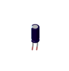
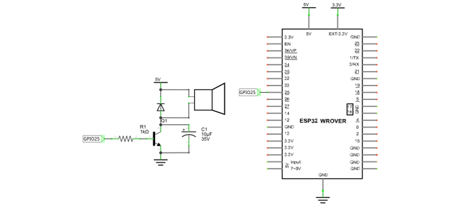
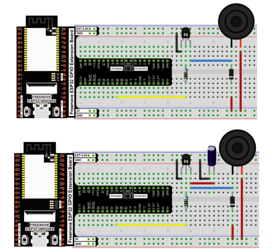

##############################################################################
Chapter 28 Bluetooth Media by DAC
##############################################################################

ESP32 integrates Classic Bluetooth and Bluetooth Low Energy(BLE). It can transmit not only simple data and orders, but also files including texts and audios. In this section, we will utilize the audio's receiving function of Bluetooth to receive music from mobile phones and play it. 

Project 28.1 Playing Bluetooth Music through DAC
*****************************************************************

Use the Bluetooth audio receiving function of ESP32 to transcode the audio data from mobile phones and play the music through DAC output pin. 

The accuracy of ESP32's DAC is only eight bits, so the music would be distorted to some extent using this tutorial. In order to highlight the difference between having and not having an iis decoder, we recommend learning Chapter 29.

Component List
======================================

.. table::
    :width: 80%
    :align: center
    :class: table-line
    
    +------------------------------------+-------------------------+
    | ESP32-WROVER x1                    | GPIO Extension Board x1 |
    |                                    |                         |
    | |Chapter01_00|                     | |Chapter01_01|          |
    +------------------------------------+-------------------------+
    | Micro USB Wire x1                  | Speaker                 |
    |                                    |                         |
    | |Chapter08_00|                     | |Chapter28_00|          |
    +------------------------------------+-------------------------+
    | NPN transistorx1 (S8050)           | Diode x1                |
    |                                    |                         |
    | |Chapter07_02|                     | |Chapter17_01|          |
    +------------------------------------+-------------------------+
    | Resistor 1kΩ x1                    | Capacitor 10uF x1       |
    |                                    |                         |
    | |Chapter07_03|                     | |Chapter28_01|          |
    |                                    |                         |
    |                                    | :red:`(Optional)`       |
    +------------------------------------+-------------------------+

.. |Chapter01_00| image:: ../_static/imgs/1_LED/Chapter01_00.png
.. |Chapter01_01| image:: ../_static/imgs/1_LED/Chapter01_01.png
.. |Chapter08_00| image:: ../_static/imgs/8_Serial_Communication/Chapter08_00.png
.. |Chapter07_02| image:: ../_static/imgs/7_Buzzer/Chapter07_02.png
.. |Chapter07_03| image:: ../_static/imgs/7_Buzzer/Chapter07_03.png
.. |Chapter28_00| image:: ../_static/imgs/28_Bluetooth_Media_by_DAC/Chapter28_00.png

.. |Chapter17_01| image:: ../_static/imgs/17_Relay_&_Motor/Chapter17_01.png

Component knowledge
================================================

signal conversion
---------------------------------------------

Bluetooth devices receive music data from mobile devices, which cannot play through earphones and speakers directly. To output DAC signal, Bluetooth devices need to decode these data with I2S decoding chip. The power of these audio signals is so small that it can only drives low-power music listening devices, such as earphone. Amplify the power of these DAC signals with power amplifier chip, so that it can drive relatively bigger-power music playing devices, such as speakers.

Circuit
===========================================

.. list-table:: 
   :width: 80%
   :align: center
   :class: table-line
   
   * -  **Schematic diagram**
   * -  |Chapter28_03|

        |Chapter28_04|

        :combo:`red font-bolder:Please note that some kits do not include the 10uF capacitor.`
        
        Even if you do not have the capacitor in your kit, you can still build the circuit 
        
        without it, which won't affect the function. If the sound is too low to hear, 
        
        please try holding the speaker closer to your ear.
  
   * -  **Hardware connection** 
       
   * -  If you need any support, please feel free to contact us via: support@freenove.com

        |Chapter28_05|

        :combo:`red font-bolder:Please note that some kits do not include the 10uF capacitor.`
        
        Even if you do not have the capacitor in your kit, you can still build the circuit 
        
        without it, which won't affect the function. If the sound is too low to hear, 
        
        please try holding the speaker closer to your ear.

Sketch
==============================================

If you are using ESP32 Core 2.x.x, please see :ref:`Sketch_28.1_Bluetooth_Music_by_DAC(2.x.x) <fnk0047/codes/c/28_bluetooth_media_by_dac:sketch_28.1_bluetooth_music_by_dac(2.x.x)>`

If you are using ESP32 Core 3.x.x, please see :ref:`Sketch_28.1_Bluetooth_Music_by_DAC(3.x.x) <fnk0047/codes/c/28_bluetooth_media_by_dac:sketch_28.1_bluetooth_music_by_dac(3.x.x)>`

Sketch_28.1_Bluetooth_Music_by_DAC(2.x.x)
----------------------------------------------

Compile and upload the code to the ESP32-WROVER and open the serial monitor. ESP32 takes a few seconds to initialize the program. When you see the prompt as shown in the figure below, it means that the Bluetooth function of ESP32 is ready and waiting for the connection of other Bluetooth devices.

.. image:: ../_static/imgs/28_Bluetooth_Media_by_DAC/Chapter28_07.png
    :align: center

Please use your mobile phone to search and connect a Bluetooth device named "ESP32". After the connection is successful, you can use ESP32 to play the audio files in your mobile phone.

The following is the program code:

.. literalinclude:: ../../../freenove_Kit/C/Sketches/Sketch_28.1_BluetoothByDAC(2.x.x)/Sketch_28.1_BluetoothByDAC(2.x.x).ino
    :linenos: 
    :language: c
    :dedent:

Add program files related to Bluetooth and API interface files.

.. literalinclude:: ../../../freenove_Kit/C/Sketches/Sketch_28.1_BluetoothByDAC(2.x.x)/Sketch_28.1_BluetoothByDAC(2.x.x).ino
    :linenos: 
    :language: c
    :lines: 10-22
    :dedent:

Set the Bluetooth in slave mode through macro definition and use it to receive data from other devices.

.. literalinclude:: ../../../freenove_Kit/C/Sketches/Sketch_28.1_BluetoothByDAC(2.x.x)/Sketch_28.1_BluetoothByDAC(2.x.x).ino
    :linenos: 
    :language: c
    :lines: 24-26
    :dedent:

Initialize the serial port and set the baud rate to 115200; initialize Bluetooth and name it as "ESP32".

.. literalinclude:: ../../../freenove_Kit/C/Sketches/Sketch_28.1_BluetoothByDAC(2.x.x)/Sketch_28.1_BluetoothByDAC(2.x.x).ino
    :linenos: 
    :language: c
    :lines: 45-47
    :dedent:

Define an I2S interface variable and initialize it.

.. literalinclude:: ../../../freenove_Kit/C/Sketches/Sketch_28.1_BluetoothByDAC(2.x.x)/Sketch_28.1_BluetoothByDAC(2.x.x).ino
    :linenos: 
    :language: c
    :lines: 54-66
    :dedent:

Initialize the Bluetooth hardware device, establish a Bluetooth thread task, and print out messages to prompt the user to take the next step.

.. literalinclude:: ../../../freenove_Kit/C/Sketches/Sketch_28.1_BluetoothByDAC(2.x.x)/Sketch_28.1_BluetoothByDAC(2.x.x).ino
    :linenos: 
    :language: c
    :lines: 68-72
    :dedent:

Bluetooth thread task: Set Bluetooth to slave mode; initialize Bluetooth command resolution function; set Bluetooth to be visible to other devices and in waiting for connection mode.

.. literalinclude:: ../../../freenove_Kit/C/Sketches/Sketch_28.1_BluetoothByDAC(2.x.x)/Sketch_28.1_BluetoothByDAC(2.x.x).ino
    :linenos: 
    :language: c
    :lines: 30-42
    :dedent:

Sketch_28.1_Bluetooth_Music_by_DAC(3.x.x)
----------------------------------------------

How to install the library
^^^^^^^^^^^^^^^^^^^^^^^^^^^^^^^^^^^^^^^^^

Click **Sketch** -> **Include Library** -> **Add .ZIP Library...**

.. image:: ../_static/imgs/28_Bluetooth_Media_by_DAC/Chapter28_09.png
    :align: center

Install ESP32-A2DP-1.8.8.zip and arduino-audio-tools-1.2.1.zip

.. image:: ../_static/imgs/28_Bluetooth_Media_by_DAC/Chapter28_10.png
    :align: center

Code
^^^^^^^^^^^^^^^^^^^^^^^^^^^^^^^^^^^^^^^^^

The following is the program code:

.. literalinclude:: ../../../freenove_Kit/C/Sketches/Sketch_28.1_BluetoothByDAC(3.x.x)/Sketch_28.1_BluetoothByDAC(3.x.x).ino
    :linenos: 
    :language: c
    :lines: 1-31
    :dedent:

Code Explanation
^^^^^^^^^^^^^^^^^^^^^^^^^^^^^^^^^^^^^^^^^

Introduce the necessary libraries.

.. literalinclude:: ../../../freenove_Kit/C/Sketches/Sketch_28.1_BluetoothByDAC(3.x.x)/Sketch_28.1_BluetoothByDAC(3.x.x).ino
    :linenos: 
    :language: c
    :lines: 19-20
    :dedent:

Initialize the Bluetooth A2DP Sink and connect it to the output stream

.. literalinclude:: ../../../freenove_Kit/C/Sketches/Sketch_28.1_BluetoothByDAC(3.x.x)/Sketch_28.1_BluetoothByDAC(3.x.x).ino
    :linenos: 
    :language: c
    :lines: 22-23
    :dedent:

"InternalDAC" is the device name that will appear in your phone's Bluetooth list.

.. literalinclude:: ../../../freenove_Kit/C/Sketches/Sketch_28.1_BluetoothByDAC(3.x.x)/Sketch_28.1_BluetoothByDAC(3.x.x).ino
    :linenos: 
    :language: c
    :lines: 26-26
    :dedent: