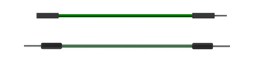

##############################################################################
Chapter 29 Bluetooth Media by Audio Module
##############################################################################

In the previous section, ESP32's own DAC was used to output the audio signal, and obviously there was some distortion in the sound quality. In this section, with the help of PCM5102A chip, you will enjoy higher-quality music.

Project 29.1 Playing Bluetooth Music through Audio Converter & Amplifier
**********************************************************************************

In this project, we will use Audio Converter & Amplifier to transcode audio data into stereo and output it. 

Component List
======================================

.. table::
    :width: 80%
    :align: center
    :class: table-line
    
    +------------------------------------+-------------------------+
    | ESP32-WROVER x1                    | GPIO Extension Board x1 |
    |                                    |                         |
    | |Chapter01_00|                     | |Chapter01_01|          |
    +------------------------------------+-------------------------+
    | Micro USB Wire x1                  | Speaker                 |
    |                                    |                         |
    | |Chapter08_00|                     | |Chapter28_00|          |
    +------------------------------------+-------------------------+
    | Audio Converter & Amplifier        | Jumper F/M x4           |
    |                                    |                         |
    |                                    | Jumper F/F x2           |
    |                                    |                         |
    | |Chapter29_00|                     | |Chapter24_08|          |
    +------------------------------------+-------------------------+
  
.. |Chapter01_00| image:: ../_static/imgs/1_LED/Chapter01_00.png
.. |Chapter01_01| image:: ../_static/imgs/1_LED/Chapter01_01.png
.. |Chapter08_00| image:: ../_static/imgs/8_Serial_Communication/Chapter08_00.png
.. |Chapter28_00| image:: ../_static/imgs/28_Bluetooth_Media_by_DAC/Chapter28_00.png

.. |Chapter29_00| image:: ../_static/imgs/29_Bluetooth_Media_by_Audio_Module/Chapter29_00.png

Component knowledge
========================================

The front and reverse view of Audio Converter & Amplifier module.

.. list-table:: 
   :width: 80%
   :header-rows: 1 
   :align: center
   :class: table-line
   
   * -  front view
     -  reverse view
     -  schematic diagram

   * -  |Chapter29_01|
     -  |Chapter29_02|
     -  |Chapter29_03| 

.. |Chapter29_01| image:: ../_static/imgs/29_Bluetooth_Media_by_Audio_Module/Chapter29_01.png

Interface description for Audio Converter & Amplifier module

.. table::
    :width: 80%
    :align: center
    :class: zebra
    
    +-----+------+-------------------------------------+
    | Pin | Name | Introductions                       |
    +=====+======+=====================================+
    | 1   | SCK  | System clock input                  |
    +-----+------+-------------------------------------+
    | 2   | BCK  | Audio data bit clock input          |
    +-----+------+-------------------------------------+
    | 3   | DIN  | Audio data input                    |
    +-----+------+-------------------------------------+
    | 4   | LCK  | Audio data word clock input         |
    +-----+------+-------------------------------------+
    | 5   | VCC  | Power input, 3.3V~5.0V              |
    +-----+------+-------------------------------------+
    | 6   | GND  | Power Ground                        |
    +-----+------+-------------------------------------+
    | 7   | L    | External audio left channel input   |
    +-----+------+-------------------------------------+
    | 8   | G    | Power Ground                        |
    +-----+------+-------------------------------------+
    | 9   | R    | External audio right channel input  |
    +-----+------+-------------------------------------+
    | 10  | G    | Power Ground                        |
    +-----+------+-------------------------------------+
    | 11  | R+   | Positive pole of right channel horn |
    +-----+------+-------------------------------------+
    | 12  | R-   | Negative pole of right channel horn |
    +-----+------+-------------------------------------+
    | 13  | L+   | Positive pole of left channel horn  |
    +-----+------+-------------------------------------+
    | 14  | L-   | Negative pole of left channel horn  |
    +-----+------+-------------------------------------+

.. list-table:: 
   :width: 80%
   :align: center
   :class: table-line
   
   * -  |Chapter29_04|
   * -  |Chapter29_05|

Speaker interface: Connect left channel speaker and right channel speaker. Group L: L+ & L-; Group R: R+& R-. The two interfaces of the speaker can be connected to the interfaces of group L or group R. But when one interface is connected to group L, the other cannot be connected to group R. Doing so may cause the module to malfunction.

Headphone interface: the interface to connect the headphones.

I2S input interface: connect to the device with I2S. Used to transcode audio data into DAC audio signals.

External audio input interface: connect to external audio equipment. Used to amplify externally input audio signals.

Power interface: connect to external power supply. External power supply selection range: 3.3V-5.0V.

Circuit
==========================

.. list-table:: 
   :width: 80%
   :align: center
   :class: table-line
   
   * -  **Schematic diagram**
   * -  |Chapter29_06|
   * -  **Hardware connection**  
   * -  :combo:`red font-bolder:If you need any support, please feel free to contact us via:` support@freenove.com

        |Chapter29_07|

Sketch
============================================

Sketch_29.1_Bluetooth_Music_by_PCM5102A
----------------------------------------------

Compile and upload the code to the ESP32-WROVER and open the serial monitor. ESP32 takes a few seconds to initialize the program.

When you see the prompt as shown in the figure below, it means that the Bluetooth function of ESP32 is ready and waiting for the connection of other Bluetooth devices.

Please use your mobile phone to search and connect a Bluetooth device named "ESP32". After the connection is successful, you can use ESP32 to play the audio files in your mobile phone.

The following is the program code:

.. literalinclude:: ../../../freenove_Kit/C/Sketches/Sketch_29.1_BluetoothByPCM5102A/Sketch_29.1_BluetoothByPCM5102A.ino
    :linenos: 
    :language: c
    :dedent:

Define an I2S configuration class and initialize it; define an I2S pin configuration class and associate I2S signals with these pins.

.. literalinclude:: ../../../freenove_Kit/C/Sketches/Sketch_29.1_BluetoothByPCM5102A/Sketch_29.1_BluetoothByPCM5102A.ino
    :linenos: 
    :language: c
    :lines: 40-59
    :dedent:

In this chapter, the procedure is very similar to the previous section. The difference only lies in the I2S configuration. The audio quality of the DAC output from the PCM5102 chip after decoding is significantly higher than that of the ESP32's own 8-bit precision DAC.