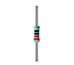

##############################################################################
Chapter 2 Button & LED
##############################################################################

Usually, there are three essential parts in a complete automatic control device: INPUT, OUTPUT, and CONTROL. In last section, the LED module was the output part and ESP32 was the control part. In practical applications, we not only make LEDs flash, but also make a device sense the surrounding environment, receive instructions and then take the appropriate action such as LEDs light up, make a buzzer turn ON and so on.

Next, we will build a simple control system to control a LED through a push button switch.

Project 2.1 Button & LED
**************************************

In the project, we will control the LED state through a Push Button Switch. When the button is pressed, our LED will turn ON, and when it is released, the LED will turn OFF. 

Component List
========================================

.. table::
    :width: 80%
    :align: center
    :class: table-line
    
    +------------------------------------+-------------------------+
    | ESP32-WROVER x1                    | GPIO Extension Board x1 |
    |                                    |                         |
    | |Chapter01_00|                     | |Chapter01_01|          |
    +------------------------------------+-------------------------+
    | Breadboard x1                                                |
    |                                                              |
    | |Chapter01_02|                                               |
    +-----------------+------------------+-------------------------+
    | LED x1          | Resistor 220Ω x1 | Push button x1          |
    |                 |                  |                         |
    | |Chapter01_03|  | |Chapter01_04|   | |Chapter02_02|          |
    +-----------------+------------+-----+-------------------------+
    | Resistor 10kΩ x2             | Jumper M/M x4                 |
    |                              |                               |
    |  |Chapter02_01|              |  |Chapter01_05|               |
    +------------------------------+-------------------------------+

.. |Chapter01_00| image:: ../_static/imgs/1_LED/Chapter01_00.png
.. |Chapter01_01| image:: ../_static/imgs/1_LED/Chapter01_01.png
.. |Chapter01_02| image:: ../_static/imgs/1_LED/Chapter01_02.png
.. |Chapter01_03| image:: ../_static/imgs/1_LED/Chapter01_03.png

.. |Chapter01_05| image:: ../_static/imgs/1_LED/Chapter01_05.png
.. |Chapter02_01| image:: ../_static/imgs/2_Button_&_LED/Chapter02_01.png
.. |Chapter02_02| image:: ../_static/imgs/2_Button_&_LED/Chapter02_02.png

Component knowledge
======================================

Push button
--------------------------------------

This type of push button switch has 4 pins (2 Pole Switch). Two pins on the left are connected, and both left and right sides are the same per the illustration:

When the button on the switch is pressed, the circuit is completed (your project is powered ON).

Circuit
=====================================

.. list-table:: 
   :width: 80%
   :align: center
   :class: table-line
   
   * -  **Schematic diagram**
   * -  |Chapter02_04|
   * -  **Hardware connection** 
       
        :combo:`red font-bolder:If you need any support, please feel free to contact us via:` support@freenove.com

   * -  |Chapter02_05|

Sketch
===================================

This project is designed for learning how to use push button switch to control a LED. We first need to read the state of switch, and then determine whether to turn the LED ON in accordance to the state of the switch.

Upload following sketch:

**Freenove_Ultimate_Starter_Kit_for_ESP32\\Sketches\\Sketch_02.1_ButtonAndLed.**

Sketch_02.1_ButtonAndLed
-----------------------------------

Download the code to ESP32-WROVER, then press the key, the LED turns ON, release the switch, the LED turns OFF.

:combo:`red font-bolder:If you have any concerns, please contact us via:` support@freenove.com

The following is the program code:

.. literalinclude:: ../../../freenove_Kit/C/Sketches/Sketch_02.1_ButtonAndLed/Sketch_02.1_ButtonAndLed.ino
    :linenos: 
    :language: c
    :dedent:

In the circuit connection, LED and button are connected with GPIO2 and GPIO13 respectively, so define ledPin and buttonPin as 2 and 13 respectively.

.. literalinclude:: ../../../freenove_Kit/C/Sketches/Sketch_02.1_ButtonAndLed/Sketch_02.1_ButtonAndLed.ino
    :linenos: 
    :language: c
    :lines: 7-8
    :dedent:

In the while cycle of main function, use digitalRead(buttonPin) to determine the state of button. When the button is pressed, the function returns low level, the result of "if" is true, and then turn on LED. Otherwise, turn off LED.

.. literalinclude:: ../../../freenove_Kit/C/Sketches/Sketch_02.1_ButtonAndLed/Sketch_02.1_ButtonAndLed.ino
    :linenos: 
    :language: c
    :lines: 17-23
    :dedent:

Reference
--------------------------------------

.. py:function:: int digitalRead (int pin);

    This function returns the value read at the given pin. It will be "HIGH" or "LOW"(1 or 0) depending on the logic level at the pin.

Project 2.2 MINI table lamp
******************************************

We will also use a push button switch, LED and ESP32 to make a MINI table lamp but this will function differently: Press the button, the LED will turn ON, and pressing the button again, the LED turns OFF. The ON switch action is no longer momentary (like a door bell) but remains ON without needing to continually press on the Button Switch.

First, let us learn something about the push button switch.

Debounce for Push Button 
===========================================

The moment when a push button switch is pressed, it will not change from one state to another state immediately. Due to tiny mechanical vibrations, there will be a short period of continuous buffeting before it completely reaches another state too fast for humans to detect but not for computer microcontrollers. The same is true when the push button switch is released. This unwanted phenomenon is known as "bounce".

Therefore, if we can directly detect the state of the push button switch, there are multiple pressing and releasing actions in one pressing cycle. This buffeting will mislead the high-speed operation of the microcontroller to cause many false decisions. Therefore, we need to eliminate the impact of buffeting. Our solution: to judge the state of the button multiple times. Only when the button state is stable (consistent) over a period of time, can it indicate that the button is actually in the ON state (being pressed). 

This project needs the same components and circuits as we used in the previous section.

Sketch
========================================

Sketch_02.2_Tablelamp
----------------------------------------

.. image:: ../_static/imgs/2_Button_&_LED/Chapter02_09.png
    :align: center

Download the code to the ESP32-WROVER, press the button, the LED turns ON, and press the button again, the LED turns OFF.

:combo:`red font-bolder:If you have any concerns, please contact us via:` support@freenove.com

The following is the program code:

.. literalinclude:: ../../../freenove_Kit/C/Sketches/Sketch_02.2_TableLamp/Sketch_02.2_TableLamp.ino
    :linenos: 
    :language: c
    :dedent:

When judging the push button state, if it is detected as "pressed down", wait for a certain time to detect again to eliminate the effect of bounce. When confirmed, flip the LED on and off. Then it starts to wait for the pressed button to be released, and waits for a certain time to eliminate the effect of bounce after it is released.

.. literalinclude:: ../../../freenove_Kit/C/Sketches/Sketch_02.2_TableLamp/Sketch_02.2_TableLamp.ino
    :linenos: 
    :language: c
    :lines: 18-26
    :dedent:

The subfunction reverseGPIO() means reading the state value of the specified pin, taking the value back and writing it to the pin again to achieve the function of flipping the output state of the pin.

.. literalinclude:: ../../../freenove_Kit/C/Sketches/Sketch_02.2_TableLamp/Sketch_02.2_TableLamp.ino
    :linenos: 
    :language: c
    :lines: 29-31
    :dedent: