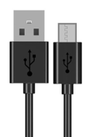

##############################################################################
Chapter Read and Write the Sdcard
##############################################################################

.. note:: 
    
    :combo:`red font-bolder:The SD card chapter only applies to the ESP32 WROVER development board with an SD card slot on the back. If your ESP32 WROVER does not have an SD card slot on the back, please skip this chapter.`

An SDcard slot is integrated on the back of the ESP32 WROVER. In this chapter we learn how to use ESP32 to read and write SDcard.

Project SDMMC Test
****************************************

.. list-table:: 
   :width: 80%
   :align: center
   :class: table-line
   
   * -  ESP32 WROVER x1
     -  USB cable x1
     -  SDcard reader x1 (random color)
     -  SDcard x1   
   
   * -  |Chapter01_00|
     -  |Chapter30_00|
     -  |Chapter30_01|

        :combo:`red font-bolder:(Not a USB flash drive.)`  
     -  |Chapter30_02|

.. |Chapter01_00| image:: ../_static/imgs/1_LED/Chapter01_00.png

.. |Chapter30_01| image:: ../_static/imgs/30_Read_and_Write_the_Sdcard/Chapter30_01.png
.. |Chapter30_02| image:: ../_static/imgs/30_Read_and_Write_the_Sdcard/Chapter30_02.png

Component knowledge
=======================================

SD card read and write method
-------------------------------------

ESP32 has two ways to use SD card, one is to use the SPI interface to access the SD card, and the other is to use the SDMMC interface to access the SD card. SPI mode uses 4 IOs to access SD card. The SDMMC has one-bit bus mode and four-bit bus mode. In one-bit bus mode, SDMMC use 3 IOs to access SD card. In four-bit bus mode, SDMMC uses 6 IOs to access the SD card.

The above three methods can all be used to access the SD card, the difference is that the access speed is different.

In the four-bit bus mode of SDMMC, the reading and writing speed of accessing the SD card is the fastest. In the one-bit bus mode of SDMMC, the access speed is about 80% of the four-bit bus mode. The access speed of SPI is the slowest, which is about 50% of the four-bit bus mode of SDMMC.

Usually, we recommend using the one-bit bus mode to access the SD card, because in this mode, we only need to use the least pin IO to access the SD card with good performance and speed.

Format SD card
========================================

Before starting the tutorial, we need to create a drive letter for the blank SD card and format it. This step requires a card reader and SD card. Please prepare them in advance. Below we will guide you to do it on different computer systems. You can choose the guide that matches your computer.

Windows
-----------------------------------------

Insert the SD card into the card reader, then insert the card reader into the computer.

In the Windows search box, enter "Disk Management" and select "Create and format hard disk partitions".

In the new pop-up window, find an unallocated volume close to 1G in size.

Click to select the volume, right-click and select "New Simple Volume".

.. image:: ../_static/imgs/30_Read_and_Write_the_Sdcard/Chapter30_05.png
    :align: center

Click Next.

.. image:: ../_static/imgs/30_Read_and_Write_the_Sdcard/Chapter30_05.png
    :align: center

You can choose the drive letter on the right, or you can choose the default. By default, just click Next.

File system is FAT(or FAT32). The Allocation unit size is 16K, and the Volume label can be set to any name. After setting, click Next.

Click Finish. Wait for the SD card initialization to complete.

At this point, you can see the SD card in This PC.

MAC
---------------------------------------

Insert the SD card into the card reader, then insert the card reader into the computer. Some computers will prompt the following information, please click to ignore it.

Find "Disk Utility" in the MAC system and click to open it.

Select "Generic MassStorageClass Media", note that its size is about 1G. Please do not choose wrong item. Click "Erase".

Select the configuration as shown in the figure below, and then click "Erase".

Wait for the formatting to complete. When finished, it will look like the picture below. At this point, you can see a new disk on the desktop named "SD".

Circuit
=======================================

Before connecting the USB cable, insert the SD card into the SD card slot on the back of the ESP32.

.. image:: ../_static/imgs/30_Read_and_Write_the_Sdcard/Chapter30_15.png
    :align: center

Connect Freenove ESP32 to the computer using the USB cable.

Sketch
======================================

Sketch_SDMMC_Test
---------------------------------------

Compile and upload the code to ESP32, open the serial monitor, and press the RST button on the board.

You can see the printout as shown below.

The following is the program code:

.. literalinclude:: ../../../freenove_Kit/C/Sketches/Sketch_30.1_SDMMC_Test/Sketch_30.1_SDMMC_Test.ino
    :linenos: 
    :language: c
    :dedent:

Add the SD card drive header file.

.. literalinclude:: ../../../freenove_Kit/C/Sketches/Sketch_30.1_SDMMC_Test/Sketch_30.1_SDMMC_Test.ino
    :linenos: 
    :language: c
    :lines: 7-8
    :dedent:

Defines the drive pins of the SD card. Please do not modify it. Because these pins are fixed.

.. literalinclude:: ../../../freenove_Kit/C/Sketches/Sketch_30.1_SDMMC_Test/Sketch_30.1_SDMMC_Test.ino
    :linenos: 
    :language: c
    :lines: 10-12
    :dedent:

Initialize the serial port function. Sets the drive pin for SDMMC one-bit bus mode.

.. literalinclude:: ../../../freenove_Kit/C/Sketches/Sketch_30.1_SDMMC_Test/Sketch_30.1_SDMMC_Test.ino
    :linenos: 
    :language: c
    :lines: 15-16
    :dedent:

Set the mount point of the SD card, set SDMMC to one-bit bus mode, and set the read and write speed to 20MHz.

.. literalinclude:: ../../../freenove_Kit/C/Sketches/Sketch_30.1_SDMMC_Test/Sketch_30.1_SDMMC_Test.ino
    :linenos: 
    :language: c
    :lines: 17-20
    :dedent:

Get the type of SD card and print it out through the serial port.

.. literalinclude:: ../../../freenove_Kit/C/Sketches/Sketch_30.1_SDMMC_Test/Sketch_30.1_SDMMC_Test.ino
    :linenos: 
    :language: c
    :lines: 21-36
    :dedent:

Call the listDir() function to read the folder and file names in the SD card, and print them out through the serial port. This function can be found in "sd_read_write.cpp".

.. literalinclude:: ../../../freenove_Kit/C/Sketches/Sketch_30.1_SDMMC_Test/Sketch_30.1_SDMMC_Test.ino
    :linenos: 
    :language: c
    :lines: 41-41
    :dedent:

Call createDir() to create a folder, and call removeDir() to delete a folder.

.. literalinclude:: ../../../freenove_Kit/C/Sketches/Sketch_30.1_SDMMC_Test/Sketch_30.1_SDMMC_Test.ino
    :linenos: 
    :language: c
    :lines: 43-46
    :dedent:

Call writeFile() to write any content to the txt file. If there is no such file, create this file first.

Call appendFile() to append any content to txt.

Call readFile() to read the content in txt and print it via the serial port.

.. literalinclude:: ../../../freenove_Kit/C/Sketches/Sketch_30.1_SDMMC_Test/Sketch_30.1_SDMMC_Test.ino
    :linenos: 
    :language: c
    :lines: 49-51
    :dedent:

Call deleteFile() to delete a specified file.

Call renameFile() to copy a file and rename it.

.. literalinclude:: ../../../freenove_Kit/C/Sketches/Sketch_30.1_SDMMC_Test/Sketch_30.1_SDMMC_Test.ino
    :linenos: 
    :language: c
    :lines: 53-54
    :dedent:

Call the testFileIO() function to test the time it takes to read 512 bytes and the time it takes to write 2048*512 bytes of data.

.. literalinclude:: ../../../freenove_Kit/C/Sketches/Sketch_30.1_SDMMC_Test/Sketch_30.1_SDMMC_Test.ino
    :linenos: 
    :language: c
    :lines: 57-57
    :dedent:

Print the total size and used size of the SD card via the serial port.

.. literalinclude:: ../../../freenove_Kit/C/Sketches/Sketch_30.1_SDMMC_Test/Sketch_30.1_SDMMC_Test.ino
    :linenos: 
    :language: c
    :lines: 59-60
    :dedent: