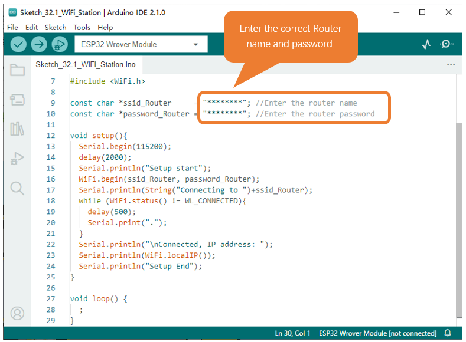
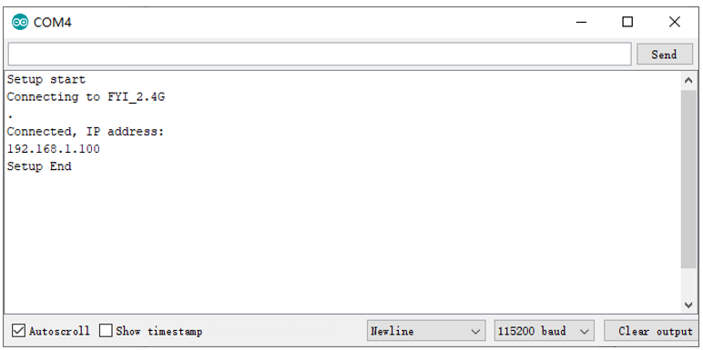
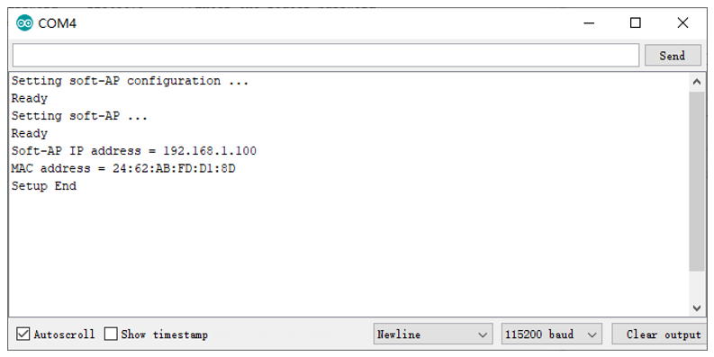
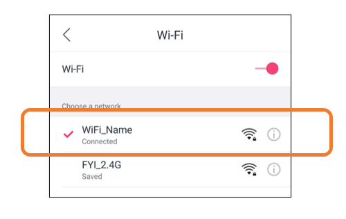
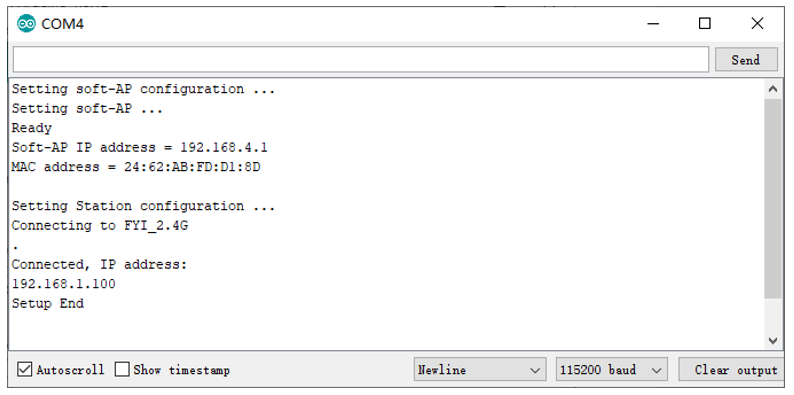
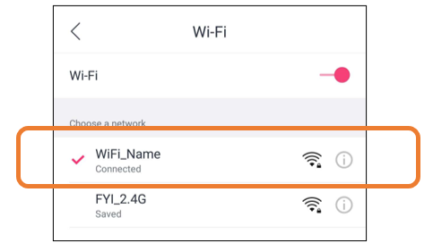

##############################################################################
Chapter WiFi Working Modes
##############################################################################

In this chapter, we'll focus on the WiFi infrastructure for ESP32-WROVER. 

ESP32-WROVER has 3 different WiFi operating modes: station mode, AP mode and AP+station mode. All WiFi programming projects must be configured with WiFi operating mode before using WiFi, otherwise WiFi cannot be used.

Project Station mode
*******************************************

Component List
===========================================

.. table::
    :width: 80%
    :align: center
    :class: table-line
    
    +------------------------------------+-------------------------+
    | ESP32-WROVER x1                    | Micro USB Wire x1       |
    |                                    |                         |
    | |Chapter01_00|                     | |Chapter08_00|          |
    +------------------------------------+-------------------------+
  
.. |Chapter01_00| image:: ../_static/imgs/1_LED/Chapter01_00.png
.. |Chapter08_00| image:: ../_static/imgs/8_Serial_Communication/Chapter08_00.png

Component knowledge
======================================

Station mode
----------------------------------------

When ESP32 selects Station mode, it acts as a WiFi client. It can connect to the router network and communicate with other devices on the router via WiFi connection. As shown below, the PC is connected to the router, and if ESP32 wants to communicate with the PC, it needs to be connected to the router.

.. image:: ../_static/imgs/32_WiFi_Working_Modes/Chapter32_00.png
    :align: center

Circuit
=================================

Connect Freenove ESP32 to the computer using the USB cable.

.. image:: ../_static/imgs/32_WiFi_Working_Modes/Chapter32_01.png
    :align: center

Sketch
=================================

Sketch_Station_mode
------------------------------------

Because the names and passwords of routers in various places are different, before the Sketch runs, users need to enter the correct router's name and password in the box as shown in the illustration above.

After making sure the router name and password are entered correctly, compile and upload codes to ESP32-WROVER, open serial monitor and set baud rate to 115200. And then it will display as follows:

When ESP32-WROVER successfully connects to "ssid_Router", serial monitor will print out the IP address assigned to ESP32-WROVER by the router.

The following is the program code:

.. literalinclude:: ../../../freenove_Kit/C/Sketches/Sketch_32.1_WiFi_Station/Sketch_32.1_WiFi_Station.ino
    :linenos: 
    :language: c
    :dedent:

Include the WiFi Library header file of ESP32.

.. literalinclude:: ../../../freenove_Kit/C/Sketches/Sketch_32.1_WiFi_Station/Sketch_32.1_WiFi_Station.ino
    :linenos: 
    :language: c
    :lines: 7-7
    :dedent:

Enter correct router name and password.

.. literalinclude:: ../../../freenove_Kit/C/Sketches/Sketch_32.1_WiFi_Station/Sketch_32.1_WiFi_Station.ino
    :linenos: 
    :language: c
    :lines: 9-10
    :dedent:

Set ESP32 in Station mode and connect it to your router.

.. literalinclude:: ../../../freenove_Kit/C/Sketches/Sketch_32.1_WiFi_Station/Sketch_32.1_WiFi_Station.ino
    :linenos: 
    :language: c
    :lines: 16-16
    :dedent:

Check whether ESP32 has connected to router successfully every 0.5s.

.. literalinclude:: ../../../freenove_Kit/C/Sketches/Sketch_32.1_WiFi_Station/Sketch_32.1_WiFi_Station.ino
    :linenos: 
    :language: c
    :lines: 12-15
    :dedent:

Serial monitor prints out the IP address assigned to ESP32-WROVER

.. literalinclude:: ../../../freenove_Kit/C/Sketches/Sketch_32.1_WiFi_Station/Sketch_32.1_WiFi_Station.ino
    :linenos: 
    :language: c
    :lines: 23-23
    :dedent:

Reference
-------------------------------

.. py:function:: Class Station

    Every time when using WiFi, you need to include header file "WiFi.h.".

    **begin(ssid, password,channel, bssid, connect):** ESP32 is used as Station to connect hotspot.

    **ssid:** WiFi hotspot name

    **password:** WiFi hotspot password

    **channel:** WiFi hotspot channel number; communicating through specified channel; optional parameter 

    **bssid:** mac address of WiFi hotspot, optional parameter

    **connect:** blloean optional parameter, defaulting to true. If set as false, then ESP32 won't connect WiFi.

    **config(local_ip, gateway, subnet, dns1, dns2):** set static local IP address.

        **local_ip:** station fixed IP address.

        **subnet:** subnet mask

        **dns1,dns2:** optional parameter. define IP address of domain name server

    **status:** obtain the connection status of WiFI

    **local IP():** obtian IP address in Station mode 

    **disconnect():** disconnect wifi

    **setAutoConnect(boolen):** set automatic connection Every time ESP32 is power on, it will connect WiFi aitomatically.

    **setAutoReconnect(boolen):** set automatic reconnection Every time ESP32 disconnects WiFi, it will reconnect to WiFi automatically.

Project AP mode
*********************************************

Component List & Circuit
============================================

Component List & Circuit are the same as in Section 30.1.

Component knowledge
============================================

AP mode
----------------------------------------------

When ESP32 selects AP mode, it creates a hotspot network that is separate from the Internet and waits for other WiFi devices to connect. As shown in the figure below, ESP32 is used as a hotspot. If a mobile phone or PC wants to communicate with ESP32, it must be connected to the hotspot of ESP32. Only after a connection is established with ESP32 can they communicate.

.. image:: ../_static/imgs/32_WiFi_Working_Modes/Chapter32_04.png
    :align: center

Circuit
=================================

Connect Freenove ESP32 to the computer using the USB cable.

.. image:: ../_static/imgs/32_WiFi_Working_Modes/Chapter32_01.png
    :align: center

Sketch
==================================

.. image:: ../_static/imgs/32_WiFi_Working_Modes/Chapter32_05.png
    :align: center

Before the Sketch runs, you can make any changes to the AP name and password for ESP32 in the box as shown in the illustration above. Of course, you can leave it alone by default.

Compile and upload codes to ESP32-WROVER, open the serial monitor and set the baud rate to 115200. And then it will display as follows.

When observing the print information of the serial monitor, turn on the WiFi scanning function of your phone, and you can see the ssid_AP on ESP32, which is called "WiFi_Name" in this Sketch. You can enter the password "12345678" to connect it or change its AP name and password by modifying Sketch.

Sketch_AP_mode
------------------------------------

The following is the program code:

.. literalinclude:: ../../../freenove_Kit/C/Sketches/Sketch_32.2_WiFi_AP/Sketch_32.2_WiFi_AP.ino
    :linenos: 
    :language: c
    :dedent:

Include WiFi Library header file of ESP32. 

.. literalinclude:: ../../../freenove_Kit/C/Sketches/Sketch_32.2_WiFi_AP/Sketch_32.2_WiFi_AP.ino
    :linenos: 
    :language: c
    :lines: 7-7
    :dedent:

Enter correct AP name and password.

.. literalinclude:: ../../../freenove_Kit/C/Sketches/Sketch_32.2_WiFi_AP/Sketch_32.2_WiFi_AP.ino
    :linenos: 
    :language: c
    :lines: 9-10
    :dedent:

Set ESP32 in AP mode.

.. literalinclude:: ../../../freenove_Kit/C/Sketches/Sketch_32.2_WiFi_AP/Sketch_32.2_WiFi_AP.ino
    :linenos: 
    :language: c
    :lines: 21-21
    :dedent:

Configure IP address, gateway and subnet mask for ESP32.

.. code-block:: c

    WiFi.softAPConfig(local_IP, gateway, subnet)

Turn on an AP in ESP32, whose name is set by ssid_AP and password is set by password_AP.

.. code-block:: c

    WiFi.softAP(ssid_AP, password_AP);

Check whether the AP is turned on successfully. If yes, print out IP and MAC address of AP established by ESP32. If no, print out the failure prompt. 

.. literalinclude:: ../../../freenove_Kit/C/Sketches/Sketch_32.2_WiFi_AP/Sketch_32.2_WiFi_AP.ino
    :linenos: 
    :language: c
    :lines: 25-32
    :dedent:

Reference
------------------------------

.. py:function:: Class AP	
    
    Every time when using WiFi, you need to include header file "WiFi.h.".
    
    **softAP(ssid, password, channel, ssid_hidden, max_connection):**
    
    **ssid: ** WiFi hotspot name
    
    **password: ** WiFi hotspot password
    
    **channel: ** Number of WiFi connection channels, range 1-13. The default is 1.
    
    **ssid_hidden: ** Whether to hide WiFi name from scanning by other devices. The default is not hide.
    
    **max_connection: ** Maximum number of WiFi connected devices. The range is 1-4. The default is 4.
    
    **softAPConfig(local_ip, gateway, subnet): ** set static local IP address. 
    
        **local_ip: ** station fixed IP address.
        
        **Gateway: ** gateway IP address
        
        **subnet: ** subnet mask
    
    **softAP(): ** obtian IP address in AP mode 
    
    **softAPdisconnect (): ** disconnect AP mode.

Project AP+Station mode
******************************************

Component List
==========================================

.. table::
    :width: 80%
    :align: center
    :class: table-line
    
    +------------------------------------+-------------------------+
    | ESP32-WROVER x1                    | Micro USB Wire x1       |
    |                                    |                         |
    | |Chapter01_00|                     | |Chapter08_00|          |
    +------------------------------------+-------------------------+
  
.. |Chapter01_00| image:: ../_static/imgs/1_LED/Chapter01_00.png
.. |Chapter08_00| image:: ../_static/imgs/8_Serial_Communication/Chapter08_00.png

Component knowledge
=============================================

AP+Station mode
----------------------------------------------

In addition to AP mode and station mode, ESP32 can also use AP mode and station mode at the same time. This mode contains the functions of the previous two modes. Turn on ESP32's station mode, connect it to the router network, and it can communicate with the Internet via the router. At the same time, turn on its AP mode to create a hotspot network. Other WiFi devices can choose to connect to the router network or the hotspot network to communicate with ESP32.

Circuit
============================================

Connect Freenove ESP32 to the computer using the USB cable.

.. image:: ../_static/imgs/32_WiFi_Working_Modes/Chapter32_08.png
    :align: center

Sketch
=============================================

Sketch_AP_Station_mode
--------------------------------------------

.. image:: ../_static/imgs/32_WiFi_Working_Modes/Chapter32_09.png
    :align: center

It is analogous to project 32.1 and project 32.2. Before running the Sketch, you need to modify ssid_Router, password_Router, ssid_AP and password_AP shown in the box of the illustration above.

After making sure that Sketch is modified correctly, compile and upload codes to ESP32-WROVER, open serial monitor and set baud rate to 115200. And then it will display as follows:

When observing the print information of the serial monitor, turn on the WiFi scanning function of your phone, and you can see the ssid_AP on ESP32.

The following is the program code:

.. literalinclude:: ../../../freenove_Kit/C/Sketches/Sketch_32.3_AP_Station/Sketch_32.3_AP_Station.ino
    :linenos: 
    :language: c
    :dedent: