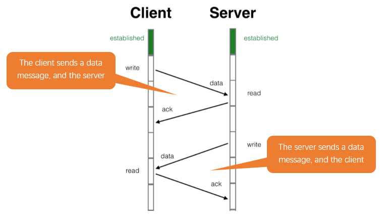
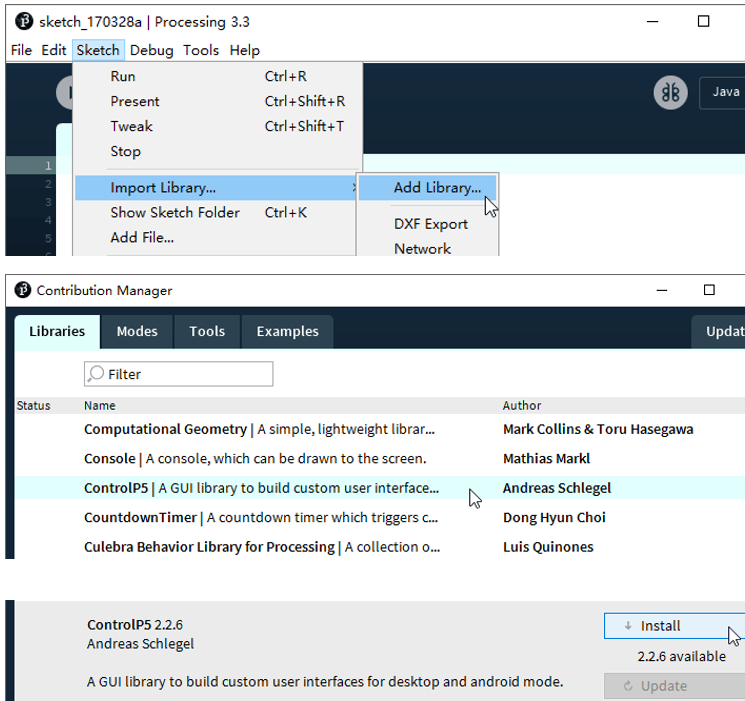
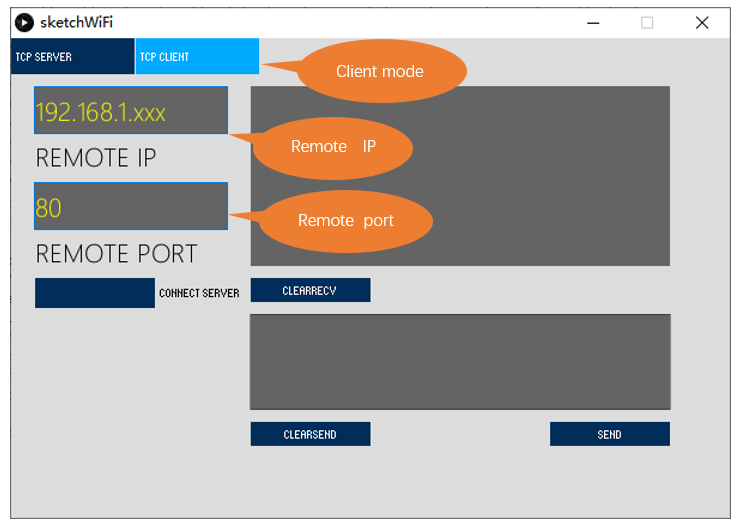
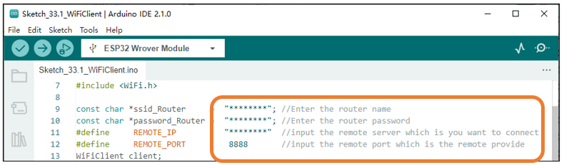
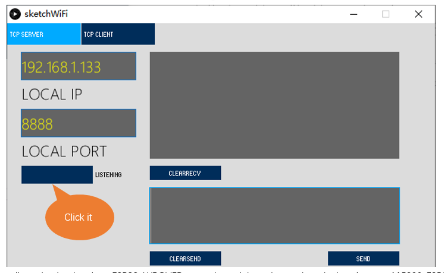
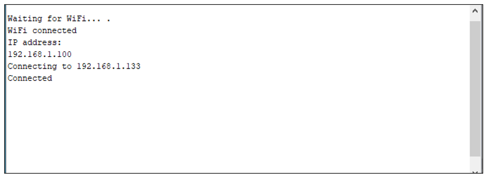
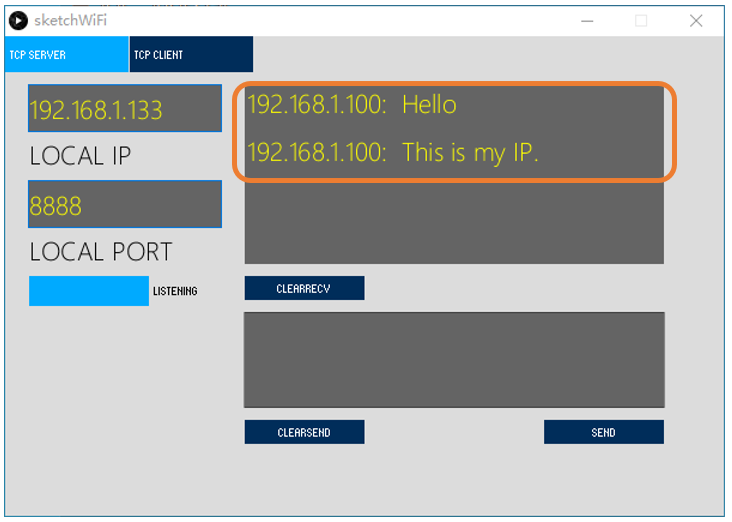
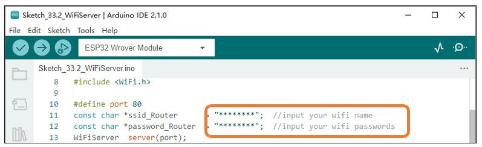
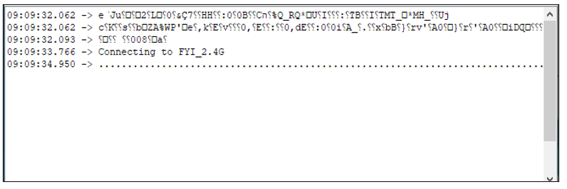
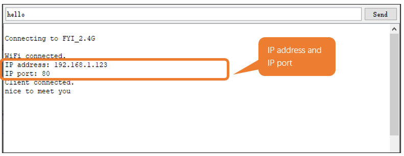

##############################################################################
Chapter TCP/IP
##############################################################################

In this chapter, we will introduce how ESP32 implements network communications based on TCP/IP protocol. There are two roles in TCP/IP communication, namely Server and Client, which will be implemented respectively with two projects in this chapter.

Project As Client
**********************************

In this section, ESP32 is used as Client to connect Server on the same LAN and communicate with it.

Component List
===========================================

+------------------------------------+-------------------------+
| ESP32-WROVER x1                    | Micro USB Wire x1       |
|                                    |                         |
| |Chapter01_00|                     | |Chapter08_00|          |
+------------------------------------+-------------------------+
  
.. |Chapter01_00| image:: ../_static/imgs/1_LED/Chapter01_00.png
.. |Chapter08_00| image:: ../_static/imgs/8_Serial_Communication/Chapter08_00.png

Component knowledge
=============================

TCP connection
-------------------------------

Before transmitting data, TCP needs to establish a logical connection between the sending end and the receiving end. It provides reliable and error-free data transmission between the two computers. In the TCP connection, the client and the server must be clarified. The client sends a connection request to the server, and each time such a request is proposed, a "three-times handshake" is required.

Three-times handshake: In the TCP protocol, during the preparation phase of sending data, the client and the server interact three times to ensure the reliability of the connection, which is called "three-times handshake".

The first handshake, the client sends a connection request to the server and waits for the server to confirm.

The second handshake, the server sends a response back to the client informing that it has received the connection request.

The third handshake, the client sends a confirmation message to the server again to confirm the connection. 

.. image:: ../_static/imgs/33_TCP_IP/Chapter33_00.png
    :align: center

TCP is a connection-oriented, low-level transmission control protocol. After TCP establishes a connection, the client and server can send and receive messages to each other, and the connection will always exist as long as the client or server does not initiate disconnection. Each time one party sends a message, the other party will reply with an ack signal.

Install Processing
---------------------------------

In this tutorial, we use Processing to build a simple TCP/IP communication platform.

If you've not installed Processing, you can download it by clicking https://processing.org/download/. You can choose an appropriate version to download according to your PC system.

.. image:: ../_static/imgs/33_TCP_IP/Chapter33_02.png
    :align: center

Unzip the downloaded file to your computer. Click "processing.exe" as the figure below to run this software.

.. image:: ../_static/imgs/33_TCP_IP/Chapter33_03.png
    :align: center

Use Server mode for communication
------------------------------------------

Install ControlP5.

Open the "Freenove_Ultimate_Starter_Kit_for_ESP32\Sketches\Sketches\Sketch_33.1_WiFiClient\sketchWiFi\sketchWiFi.pde", and click "Run".

.. image:: ../_static/imgs/33_TCP_IP/Chapter33_05.png
    :align: center

The new pop-up interface is as follows. If ESP32 is used as client, select TCP SERVER mode for sketchWiFi.

.. image:: ../_static/imgs/33_TCP_IP/Chapter33_06.png
    :align: center

When sketchWiFi selects TCP SERVER mode, ESP32 Sketch needs to be changed according to sketchWiFi's displaying of LOCAL IP or LOCAL PORT.

If ESP32 serves as server, select TCP CLIENT mode for sketchWiFi.

When sketchWiFi selects TCP CLIENT mode, the LOCAL IP and LOCAL PORT of sketchWiFi need to be changed according to the IP address and port number printed by the serial monitor.

**Mode selection:** select Server mode/Client mode.

**IP address:** In server mode, this option does not need to be filled in, and the computer will automatically obtain the IP address. In client mode, fill in the remote IP address to be connected.

**Port number:** In server mode, fill in a port number for client devices to make an access connection. In client mode, fill in port number given by the Server devices to make an access connection.

**Start button:** In server mode, push the button, then the computer will serve as server and open a port number for client to make access connection. During this period, the computer will keep monitoring. In client mode, before pushing the button, please make sure the server is on, remote IP address and remote port number is correct; push the button, and the computer will make access connection to the remote port number of the remote IP as a client. 

**clear receive:** clear out the content in the receiving text box

**clear send:** clear out the content in the sending text box

**Sending button:** push the sending button, the computer will send the content in the text box to others.

Circuit
=========================================

Connect Freenove ESP32 to the computer using USB cable.

.. image:: ../_static/imgs/33_TCP_IP/Chapter33_08.png
    :align: center

Sketch
======================================

Before running the Sketch, please open "sketchWiFi.pde." first, and click "Run".

.. image:: ../_static/imgs/33_TCP_IP/Chapter33_09.png
    :align: center

Next, open Sketch_33.1_WiFiClient.ino. Before running it, please change the following information based on "LOCAL IP" and "LOCAL PORT" in the figure above. 

REMOTE_IP needs to be filled in according to the interface of sketchWiFi.pde. Taking this tutorial as an example, its REMOTE_IP is "192.168.1.133". Generally, by default, the ports do not need to change its value.

Click LISTENING, turn on TCP SERVER's data listening function and wait for ESP32 to connect.

Compile and upload code to ESP32-WROVER, open the serial monitor and set the baud rate to 115200. ESP32 connects router, obtains IP address and sends access request to server IP address on the same LAN till the connection is successful. When connect successfully, ESP32 can send messages to server.

ESP32 connects with TCP SERVER, and TCP SERVER receives messages from ESP32, as shown in the figure below.

Sketch_As_Client
----------------------------------------

The following is the program code:

.. literalinclude:: ../../../freenove_Kit/C/Sketches/Sketch_33.1_WiFiClient/Sketch_33.1_WiFiClient.ino
    :linenos: 
    :language: c
    :dedent:

Add WiFi function header file.

.. literalinclude:: ../../../freenove_Kit/C/Sketches/Sketch_33.1_WiFiClient/Sketch_33.1_WiFiClient.ino
    :linenos: 
    :language: c
    :lines: 7-7
    :dedent:

Enter the actual router name, password, remote server IP address, and port number.

.. literalinclude:: ../../../freenove_Kit/C/Sketches/Sketch_33.1_WiFiClient/Sketch_33.1_WiFiClient.ino
    :linenos: 
    :language: c
    :lines: 9-12
    :dedent:

Apply for the method class of WiFiClient.

.. literalinclude:: ../../../freenove_Kit/C/Sketches/Sketch_33.1_WiFiClient/Sketch_33.1_WiFiClient.ino
    :linenos: 
    :language: c
    :lines: 13-13
    :dedent:

Connect specified WiFi until it is successful. If the name and password of WiFi are correct but it still fails to connect, please push the reset key.

.. literalinclude:: ../../../freenove_Kit/C/Sketches/Sketch_33.1_WiFiClient/Sketch_33.1_WiFiClient.ino
    :linenos: 
    :language: c
    :lines: 19-24
    :dedent:

Send connection request to remote server until connect successfully. When connect successfully, print out the connecting prompt on the serial monitor and send messages to remote server.

.. literalinclude:: ../../../freenove_Kit/C/Sketches/Sketch_33.1_WiFiClient/Sketch_33.1_WiFiClient.ino
    :linenos: 
    :language: c
    :lines: 34-39
    :dedent:

When ESP32 receive messages from servers, it will print them out via serial port; Users can also send messages to servers from serial port.

.. literalinclude:: ../../../freenove_Kit/C/Sketches/Sketch_33.1_WiFiClient/Sketch_33.1_WiFiClient.ino
    :linenos: 
    :language: c
    :lines: 44-54
    :dedent:

If the server is disconnected, turn off WiFi of ESP32.

.. literalinclude:: ../../../freenove_Kit/C/Sketches/Sketch_33.1_WiFiClient/Sketch_33.1_WiFiClient.ino
    :linenos: 
    :language: c
    :lines: 55-58
    :dedent:

Reference
-------------------------------

.. py:function:: Class Client	
    
    Every time when using Client, you need to include header file "WiFi.h."
    
    **connect(ip, port, timeout)/connect(*host, port, timeout):** establish a TCP connection.
    
        **ip, *host:** ip address of target server 
        
        **port:** port number of target server
        
        **timeout:** connection timeout
    
    **connected():** judge whether client is connecting. If return value is 1, then connect successfully; If return value is 0, then fail to connect.
    
    **stop():** stop tcp connection
    
    **print():** send data to server connecting to client
    
    **available():** return to the number of bytes readable in receive buffer, if no, return to 0 or -1.
    
    **read():** read one byte of data in receive buffer
    
    **readString():** read string in receive buffer 

Project As Server 
*******************************************

In this section, ESP32 is used as a server to wait for the connection and communication of client on the same LAN.

Component List
===============================

+------------------------------------+-------------------------+
| ESP32-WROVER x1                    | Micro USB Wire x1       |
|                                    |                         |
| |Chapter01_00|                     | |Chapter08_00|          |
+------------------------------------+-------------------------+
  
.. |Chapter01_00| image:: ../_static/imgs/1_LED/Chapter01_00.png
.. |Chapter08_00| image:: ../_static/imgs/8_Serial_Communication/Chapter08_00.png

Circuit
==========================================

Connect Freenove ESP32 to the computer using a USB cable.

.. image:: ../_static/imgs/33_TCP_IP/Chapter33_14.png
    :align: center

Sketch
============================================

Before running Sketch, please modify the contents of the box below first. 

Sketch_As_Server
---------------------------------------------

Compile and upload code to ESP32-WROVER board, open the serial monitor and set the baud rate to 115200. Turn on server mode for ESP32, waiting for the connection of other devices on the same LAN. Once a device connects to server successfully, they can send messages to each other.

If the ESP32 fails to connect to router, press the reset button as shown below and wait for ESP32 to run again.

Serial Monitor

Processing: 

Open the "Freenove_Ultimate_Starter_Kit_for_ESP32\Sketches\Sketches\Sketch_33.2_WiFiServer\

sketchWiFi\sketchWiFi.pde".

Based on the messages printed by the serial monitor, enter correct IP address and serial port in Processing to establish connection and make communication.

.. image:: ../_static/imgs/33_TCP_IP/Chapter33_18.png
    :align: center

The following is the program code:

.. literalinclude:: ../../../freenove_Kit/C/Sketches/Sketch_33.2_WiFiServer/Sketch_33.2_WiFiServer.ino
    :linenos: 
    :language: c
    :dedent:

Apply for method class of WiFiServer.

.. literalinclude:: ../../../freenove_Kit/C/Sketches/Sketch_33.2_WiFiServer/Sketch_33.2_WiFiServer.ino
    :linenos: 
    :language: c
    :lines: 13-13
    :dedent:

Connect specified WiFi until it is successful. If the name and password of WiFi are correct but it still fails to connect, please push the reset key.

.. literalinclude:: ../../../freenove_Kit/C/Sketches/Sketch_33.2_WiFiServer/Sketch_33.2_WiFiServer.ino
    :linenos: 
    :language: c
    :lines: 20-28
    :dedent:

Print out the IP address and port number of ESP32.

.. literalinclude:: ../../../freenove_Kit/C/Sketches/Sketch_33.2_WiFiServer/Sketch_33.2_WiFiServer.ino
    :linenos: 
    :language: c
    :lines: 29-31
    :dedent:

Turn on server mode of ESP32, turn on automatic reconnection.

.. literalinclude:: ../../../freenove_Kit/C/Sketches/Sketch_33.2_WiFiServer/Sketch_33.2_WiFiServer.ino
    :linenos: 
    :language: c
    :lines: 32-33
    :dedent:

When ESP32 receive messages from servers, it will print them out via serial port; Users can also send messages to servers from serial port.

.. literalinclude:: ../../../freenove_Kit/C/Sketches/Sketch_33.2_WiFiServer/Sketch_33.2_WiFiServer.ino
    :linenos: 
    :language: c
    :lines: 41-48
    :dedent:

Reference
-------------------------------------

.. py:function:: Class Server	
    
    Every time use Server functionality, we need to include header file"WiFi.h".
    
    **WiFiServer(uint16_t port=80, uint8_t max_clients=4):** create a TCP Server.
    
        **port:** ports of Server; range from 0 to 65535 with the default number as 80.
    
        **max_clients:** maximum number of clients with default number as 4.
    
    **begin(port):** start the TCP Server.
    
        **port:** ports of Server; range from 0 to 65535 with the default number as 0.
    
    **setNoDelay(bool nodelay):** whether to turn off the delay sending functionality.
    
        **nodelay:** true stands for forbidden Nagle algorithm.
    
    **close():** close tcp connection.
    
    **stop():** stop tcp connection.