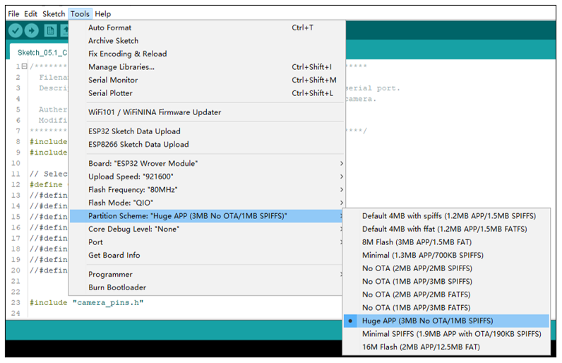

##############################################################################
Chapter 34 Camera Web Server
##############################################################################

In this section, we'll use ESP32's video function as an example to study.

Project 34.1 Camera Web Server
******************************************

Connect ESP32 using USB and check its IP address through serial monitor. Use web page to access IP address to obtain video and image data.

Component List
===========================================

.. table::
    :width: 80%
    :align: center
    :class: table-line
    
    +------------------------------------+-------------------------+
    | ESP32-WROVER x1                    | Micro USB Wire x1       |
    |                                    |                         |
    | |Chapter01_00|                     | |Chapter08_00|          |
    +------------------------------------+-------------------------+
  
.. |Chapter01_00| image:: ../_static/imgs/1_LED/Chapter01_00.png
.. |Chapter08_00| image:: ../_static/imgs/8_Serial_Communication/Chapter08_00.png

Circuit
=================================

Connect Freenove ESP32 to the computer using the USB cable.

.. image:: ../_static/imgs/32_WiFi_Working_Modes/Chapter32_01.png
    :align: center

Sketch
=====================================

Sketch_34.1_As_CameraWebServer
---------------------------------------

Before running the program, please modify your router's name and password in the box shown in the illustration above to make sure that your Sketch can compile and work successfully. 

If your Arduino IDE prompts you that your sketch is out of your project's storage space, compile the code again as configured below. 

Compile and upload codes to ESP32, open the serial monitor and set the baud rate to 115200, and the serial monitor will print out a network link address.

If your ESP32 has been in the process of connecting to router, but the information above has not been printed out, please re-check whether the router name and password have been entered correctly and press the reset key on ESP32-WROVER to wait for a successful connection prompt. 

Open a web browser, enter the IP address printed by the serial monitor in the address bar, and access it. 

Taking the Google browser as an example, here's what the browser prints out after successful access to ESP32's IP.

:combo:`red font-bolder:We recommend that the resolution not exceed VGA(640x480).`

Click on Start Stream. The effect is shown in the image below.

.. note::
    
    **If sketch compilation fails due to ESP32 support package, follow the steps of the image to open the CameraWebServer. This sketch is the same as described in the tutorial above.**

The following is the main program code. You need include other code files in the same folder when write your own code.

.. literalinclude:: ../../../freenove_Kit/C/Sketches/Sketch_34.1_CameraWebServer/Sketch_34.1_CameraWebServer.ino
    :linenos: 
    :language: c
    :dedent:

Add procedure files and API interface files related to ESP32 camera.

.. literalinclude:: ../../../freenove_Kit/C/Sketches/Sketch_34.1_CameraWebServer/Sketch_34.1_CameraWebServer.ino
    :linenos: 
    :language: c
    :lines: 8-30
    :dedent:

Enter the name and password of the router 

.. literalinclude:: ../../../freenove_Kit/C/Sketches/Sketch_34.1_CameraWebServer/Sketch_34.1_CameraWebServer.ino
    :linenos: 
    :language: c
    :lines: 32-33
    :dedent:

Initialize serial port, set baud rate to 115200; open the debug and output function of the serial.

.. literalinclude:: ../../../freenove_Kit/C/Sketches/Sketch_34.1_CameraWebServer/Sketch_34.1_CameraWebServer.ino
    :linenos: 
    :language: c
    :lines: 40-42
    :dedent:

Configure parameters including interface pins of the camera. Note: It is generally not recommended to change them.

.. literalinclude:: ../../../freenove_Kit/C/Sketches/Sketch_34.1_CameraWebServer/Sketch_34.1_CameraWebServer.ino
    :linenos: 
    :language: c
    :lines: 79-106
    :dedent:

ESP32 connects to the router and prints a successful connection prompt. If it has not been successfully connected, press the reset key on the ESP32-WROVER.

.. literalinclude:: ../../../freenove_Kit/C/Sketches/Sketch_34.1_CameraWebServer/Sketch_34.1_CameraWebServer.ino
    :linenos: 
    :language: c
    :lines: 59-66
    :dedent:

Open the video streams server function of the camera and print its IP address via serial port.

.. literalinclude:: ../../../freenove_Kit/C/Sketches/Sketch_34.1_CameraWebServer/Sketch_34.1_CameraWebServer.ino
    :linenos: 
    :language: c
    :lines: 68-72
    :dedent:

Configure the display image information of the camera.

The set_vflip() function sets whether the image is flipped 180°, with 0 for no flip and 1 for flip 180°.

The set_brightness() function sets the brightness of the image, with values ranging from -2 to 2.

The set_saturation() function sets the color saturation of the image, with values ranging from -2 to 2.

.. literalinclude:: ../../../freenove_Kit/C/Sketches/Sketch_34.1_CameraWebServer/Sketch_34.1_CameraWebServer.ino
    :linenos: 
    :language: c
    :lines: 53-57
    :dedent:

Modify the resolution and sharpness of the images captured by the camera. The sharpness ranges from 10 to 63, and the smaller the number, the sharper the picture. The larger the number, the blurrier the picture. Please refer to the table below.

.. code-block:: c

    config.frame_size = FRAMESIZE_VGA;
    config.jpeg_quality = 10;

Reference
--------------------------------

.. table::
    :width: 80%
    :align: center
    :class: zebra
    
    +-------------------+-----------+------------------+-----------+
    | Image resolution  | Sharpness | Image resolution | Sharpness |
    +===================+===========+==================+===========+
    | FRAMESIZE_96x96   | 96x96     | FRAMESIZE_HVGA   | 480x320   |
    +-------------------+-----------+------------------+-----------+
    | FRAMESIZE_QQVGA   | 160x120   | FRAMESIZE_VGA    | 640x480   |
    +-------------------+-----------+------------------+-----------+
    | FRAMESIZE_QCIF    | 176x144   | FRAMESIZE_SVGA   | 800x600   |
    +-------------------+-----------+------------------+-----------+
    | FRAMESIZE_HQVGA   | 240x176   | FRAMESIZE_XGA    | 1024x768  |
    +-------------------+-----------+------------------+-----------+
    | FRAMESIZE_240x240 | 240x240   | FRAMESIZE_HD     | 1280x720  |
    +-------------------+-----------+------------------+-----------+
    | FRAMESIZE_QVGA    | 320x240   | FRAMESIZE_SXGA   | 1280x1024 |
    +-------------------+-----------+------------------+-----------+
    | FRAMESIZE_CIF     | 400x296   | FRAMESIZE_UXGA   | 1600x1200 |
    +-------------------+-----------+------------------+-----------+

:combo:`red font-bolder:We recommend that the resolution not exceed VGA(640x480).`

Project 34.2 Video Web Server
*******************************************

Connect to ESP32 using USB and view its IP address through a serial monitor. Access IP addresses through web pages to obtain real-time video data.

Component List
============================================

.. table::
    :width: 80%
    :align: center
    :class: table-line
    
    +------------------------------------+-------------------------+
    | ESP32-WROVER x1                    | Micro USB Wire x1       |
    |                                    |                         |
    | |Chapter01_00|                     | |Chapter08_00|          |
    +------------------------------------+-------------------------+

Circuit
=================================

Connect Freenove ESP32 to the computer using the USB cable.

.. image:: ../_static/imgs/32_WiFi_Working_Modes/Chapter32_01.png
    :align: center

Sketch
=================================

Sketch_34.2_As_VideoWebServer
---------------------------------

Before running the program, please modify your router's name and password in the box shown in the illustration above to make sure that your Sketch can compile and work successfully. 

Compile and upload codes to ESP32, open the serial monitor and set the baud rate to 115200, and the serial monitor will print out a network link address.

If your ESP32 has been in the process of connecting to router, but the information above has not been printed out, please re-check whether the router name and password have been entered correctly and press the reset key on ESP32-WROVER to wait for a successful connection prompt. 

Open a web browser, enter the IP address printed by the serial monitor in the address bar, and access it. 

Taking the Google browser as an example, here's what the browser prints out after successful access to ESP32's IP.

The effect is shown in the image below.

The following is the main program code. You need include other code files in the same folder when write your own code.

.. literalinclude:: ../../../freenove_Kit/C/Sketches/Sketch_34.2_As_VideoWebServer/Sketch_34.2_As_VideoWebServer.ino
    :linenos: 
    :language: c
    :dedent:

Configure parameters including interface pins of the camera. Note: It is generally not recommended to change them.

.. literalinclude:: ../../../freenove_Kit/C/Sketches/Sketch_34.2_As_VideoWebServer/Sketch_34.2_As_VideoWebServer.ino
    :linenos: 
    :language: c
    :lines: 24-44
    :dedent:

ESP32 connects to the router and prints a successful connection prompt. If it has not been successfully connected, press the reset key on the ESP32-WROVER.

.. literalinclude:: ../../../freenove_Kit/C/Sketches/Sketch_34.2_As_VideoWebServer/Sketch_34.2_As_VideoWebServer.ino
    :linenos: 
    :language: c
    :lines: 69-76
    :dedent:

Open the video streams server function of the camera and print its IP address via serial port.

.. literalinclude:: ../../../freenove_Kit/C/Sketches/Sketch_34.2_As_VideoWebServer/Sketch_34.2_As_VideoWebServer.ino
    :linenos: 
    :language: c
    :lines: 78-82
    :dedent: