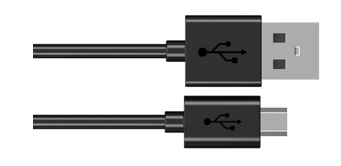
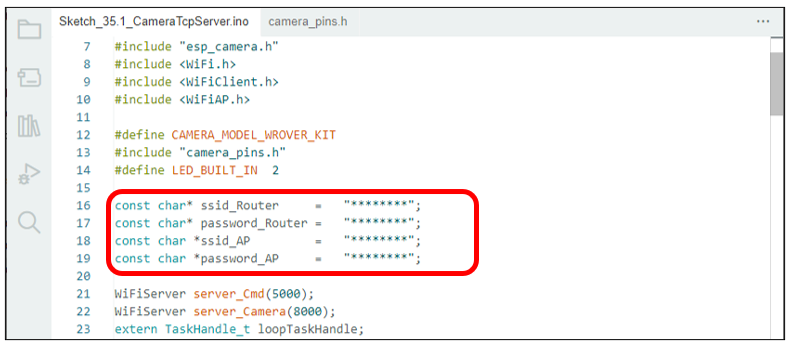

##############################################################################
Chapter Camera Tcp Server
##############################################################################

In the previous section, we used web page to display the video data captured by ESP32, and in this section, we will use a mobile phone to display it.

Project Camera Tcp Server
******************************************

Connect ESP32 using USB and check its IP address through serial monitor. Use a mobile phone to obtain video and image data.

Component List
===========================================

.. table::
    :width: 80%
    :align: center
    :class: table-line
    
    +------------------------------------+-------------------------+
    | ESP32-WROVER x1                    | Micro USB Wire x1       |
    |                                    |                         |
    | |Chapter01_00|                     | |Chapter08_00|          |
    +------------------------------------+-------------------------+
  
.. |Chapter01_00| image:: ../_static/imgs/1_LED/Chapter01_00.png

Install Freenove app
===============================

There are three ways to install app, you can choose any one. 

Method 1
---------------------------------

Use Google play to search "Freenove", download and install.

Method 2
--------------------------------

Visit https://play.google.com/store/apps/details?id=com.freenove.suhayl.Freenove, and click install.

.. image:: ../_static/imgs/35_Camera_Tcp_Server/Chapter35_01.png
    :align: center

Method 3
--------------------------------------

Visit https://github.com/Freenove/Freenove_app_for_Android, download the files in this library, and install freenove.apk to your Android phone manually. 

Menu
-----------------------------------------------

Open application "Freenove", as shown below:

.. image:: ../_static/imgs/35_Camera_Tcp_Server/Chapter35_03.png
    :align: center

Freenove 4WD Car for Raspberry Pi
----------------------------------------------------

In this chapter, we use Freenove 4WD Car for Raspberry Pi, so it is necessary to understand the interface of this mode.

Circuit
=================================

Connect Freenove ESP32 to the computer using the USB cable.

.. image:: ../_static/imgs/32_WiFi_Working_Modes/Chapter32_01.png
    :align: center

Sketch
===================================

Click Tools in the menu bar, select Partition Scheme:" :red:`Huge APP (3MB No OTA/1MB SPIFFS)` ", as shown in the figure below.

After making sure the Tools is configured correctly, don't run Sketch. Due to WiFi, we need to modify Sketch a little bit based on physical situation.

In the box in the figure above, ssid_Router and password_Router are the user's Router name and password, which need to be modified according to the actual name and password. ssid_AP and password_AP are name and password of a AP created by ESP32, and they are freely set by the user. When all settings are correct, compile and upload the code to ESP32, turn on the serial port monitor, and set the baud rate to 115200. The serial monitor will print out two IP addresses.

There are two methods for you to check camera data of ESP32 via mobile phone APP.

Method 1
----------------------------------------

Using your phone's WiFi function, select the WiFi name represented by ssid_AP in Sketch and enter the password "password_AP" to connect. 

Next, open Freenove app and select 4WD Car for Raspberry Pi mode.

Enter the IP address printed by serial port in the new interface, which generally is "192.168.4.1"

Click "Connect".

Method 2:
---------------------------------------

Using your phone's WiFi function, select the router named ssid_Router and enter the password "ssid_password" to connect. And then open Freenove app and select 4WD Car for Raspberry Pi mode. The operation is similar to Method 1.

Enter the IP address printed by serial port in the new interface, which generally is not "192.168.4.1" but another one. The IP address in this example is "192.168.1.100". After entering the IP address, click "Connect".

The following is the main program code. You need include other code files in the same folder when write your own code.

Sketch_Camera_Tcp_Server
------------------------------------------

.. literalinclude:: ../../../freenove_Kit/C/Sketches/Sketch_35.1_CameraTcpServer/Sketch_35.1_CameraTcpServer.ino
    :linenos: 
    :language: c
    :dedent:

Include header files that drive camera and WiFi. 

.. literalinclude:: ../../../freenove_Kit/C/Sketches/Sketch_35.1_CameraTcpServer/Sketch_35.1_CameraTcpServer.ino
    :linenos: 
    :language: c
    :lines: 7-14
    :dedent:

Set name and password for router that ESP32 needs to connect to. And set ESP32 to open two servers, whose port are 82 and 5000 respectively.

.. literalinclude:: ../../../freenove_Kit/C/Sketches/Sketch_35.1_CameraTcpServer/Sketch_35.1_CameraTcpServer.ino
    :linenos: 
    :language: c
    :lines: 16-19
    :dedent:

Enable ESP32's server function and set two monitor ports as 5000 and 8000. In general, the two port numbers do not require modifications.

.. literalinclude:: ../../../freenove_Kit/C/Sketches/Sketch_35.1_CameraTcpServer/Sketch_35.1_CameraTcpServer.ino
    :linenos: 
    :language: c
    :lines: 21-23
    :dedent:

Initialize serial port, set baud rate to 115200; open the debug and output function of the serial.

.. code-block:: C
    :linenos:

    Serial.begin(115200);
    Serial.setDebugOutput(true);
    Serial.println();

Define a variable for camera interface and initialize it. 

.. literalinclude:: ../../../freenove_Kit/C/Sketches/Sketch_35.1_CameraTcpServer/Sketch_35.1_CameraTcpServer.ino
    :linenos: 
    :language: c
    :lines: 128-163
    :dedent:

Loop function will constantly send camera data obtained to mobile phone APP.

.. literalinclude:: ../../../freenove_Kit/C/Sketches/Sketch_35.1_CameraTcpServer/Sketch_35.1_CameraTcpServer.ino
    :linenos: 
    :language: c
    :lines: 71-86
    :dedent:

The loopTask_Cmd() function sends the received instruction back to the phone app and prints it out through a serial port.

.. literalinclude:: ../../../freenove_Kit/C/Sketches/Sketch_35.1_CameraTcpServer/Sketch_35.1_CameraTcpServer.ino
    :linenos: 
    :language: c
    :lines: 94-119
    :dedent:

loopTask_ Blink()function will control the blinking of LED. When you see LED blinking, it indicates that ESP32 has been configured and starts working.

.. literalinclude:: ../../../freenove_Kit/C/Sketches/Sketch_35.1_CameraTcpServer/Sketch_35.1_CameraTcpServer.ino
    :linenos: 
    :language: c
    :lines: 120-126
    :dedent:

If you do not have a router near you, or if you are outdoors, you can annotate the following code, and then compile and upload it to ESP32. And you can display the video images on your phone by Method 1.

.. literalinclude:: ../../../freenove_Kit/C/Sketches/Sketch_35.1_CameraTcpServer/Sketch_35.1_CameraTcpServer.ino
    :linenos: 
    :language: c
    :lines: 38-52
    :dedent: