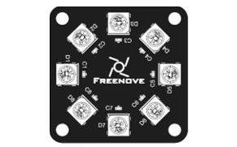
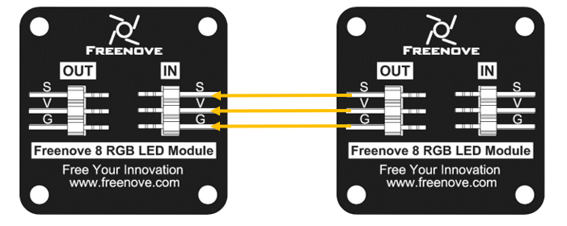

##############################################################################
Chapter LEDPixel
##############################################################################

This chapter will help you learn to use a more convenient RGB LED lamp, which requires only one GPIO control and can be connected in infinite series in theory. Each LED can be controlled independently.

Project LEDPixel
************************************

Learn the basic usage of LEDPixel and use it to flash red, green, blue and white.

Component List
======================================

.. table::
    :width: 80%
    :align: center
    :class: table-line
    
    +------------------------------------+-------------------------+
    | ESP32-WROVER x1                    | GPIO Extension Board x1 |
    |                                    |                         |
    | |Chapter01_00|                     | |Chapter01_01|          |
    +------------------------------------+-------------------------+
    | Breadboard x1                                                |
    |                                                              |
    | |Chapter01_02|                                               |
    +------------------------------------+-------------------------+
    | Freenove 8 RGB LED Module x1       | Jumper M/M x2           |
    |                                    |                         |
    | |Chapter06_00|                     | |Chapter01_05|          |
    +------------------------------------+-------------------------+
  
.. |Chapter01_00| image:: ../_static/imgs/1_LED/Chapter01_00.png
.. |Chapter01_01| image:: ../_static/imgs/1_LED/Chapter01_01.png
.. |Chapter01_02| image:: ../_static/imgs/1_LED/Chapter01_02.png
.. |Chapter01_05| image:: ../_static/imgs/1_LED/Chapter01_05.png

Related knowledge
=====================================

Freenove 8 RGB LED Module  
------------------------------------

The Freenove 8 RGB LED Module is as below. 

It consists of 8 WS2812, each of which requires only one pin to control and supports cascade. Each WS212 has integrated 3 LEDs, red, green and blue respectively, and each of them supports 256-level brightness adjustment, which means that each WS2812 can emit 2^24=16,777,216 different colors.

You can use only one data pin to control eight LEDs on the module. As shown below:

.. image:: ../_static/imgs/6_LEDPixel/Chapter06_01.png
    :align: center

And you can also control many modules at the same time. Just connect OUT pin of one module to IN pin of another module. In this way, you can use one data pin to control 8, 16, 32 … LEDs.

Pin description:

.. table::
    :class: zebra
    :align: center

    +---------------------------------------+---------------------------------------+
    |         (IN)                          |        (OUT)                          |
    +========+==============================+========+==============================+
    | symbol | Function                     | symbol | Function                     |
    +--------+------------------------------+--------+------------------------------+
    | S      | Input control signal         | S      | Output control signal        |
    +--------+------------------------------+--------+------------------------------+
    | V      | Power supply pin, +3.5V~5.5V | V      | Power supply pin, +3.5V~5.5V |
    +--------+------------------------------+--------+------------------------------+
    | G      | GND                          | G      | GND                          |
    +--------+------------------------------+--------+------------------------------+

Circuit
======================================

.. list-table:: 
   :width: 80%
   :align: center
   :class: table-line
   
   * -  **Schematic diagram**
   * -  |Chapter06_03|
   * -  **Hardware connection**

   * -  :combo:`red font-bolder:If you need any support, please feel free to contact us via:` support@freenove.com

        |Chapter06_04|

.. |Chapter06_03| image:: ../_static/imgs/6_LEDPixel/Chapter06_03.png    
.. |Chapter06_04| image:: ../_static/imgs/6_LEDPixel/Chapter06_04.png  

Sketch
=====================================

This code uses a library named "Freenove_WS2812_Lib_for_ESP32", if you have not installed it, please do so first.

Library is an important feature of the open source world, and we know that Arduino is an open source platform that everyone can contribute to. Libraries are generally licensed under the LGPL, which means you can use them for free to apply to your creations.

How to install the library
--------------------------------------

Open Arduino IDE, click Sketch **->** Include Library **->** Add .ZIP Library, In the pop-up window, find the file named "./Libraries/Freenove_WS2812_Lib_for_ESP32.Zip" which locates in this directory, and click OPEN.

In the pop-up window, Library Manager, search for the name of the Library, "Freenove WS2812 Lib for ESP32". Then click Install.

Sketch_LEDPixel
---------------------------------------

Download the code to ESP32-WROVER and RGB LED begins to light up in red, green, blue, white and black.

The following is the program code:

.. literalinclude:: ../../../freenove_Kit/C/Sketches/Sketch_06.1_LEDPixel/Sketch_06.1_LEDPixel.ino
    :linenos: 
    :language: c
    :dedent:

To use some libraries, first you need to include the library's header file.

.. literalinclude:: ../../../freenove_Kit/C/Sketches/Sketch_06.1_LEDPixel/Sketch_06.1_LEDPixel.ino
    :linenos: 
    :language: c
    :lines: 8-8
    :dedent:

Define the pins connected to the ring, the number of LEDs on the ring, and RMT channel values。

.. literalinclude:: ../../../freenove_Kit/C/Sketches/Sketch_06.1_LEDPixel/Sketch_06.1_LEDPixel.ino
    :linenos: 
    :language: c
    :lines: 10-12
    :dedent:

Use the above parameters to create a LEDPixel object strip.

.. literalinclude:: ../../../freenove_Kit/C/Sketches/Sketch_06.1_LEDPixel/Sketch_06.1_LEDPixel.ino
    :linenos: 
    :language: c
    :lines: 14-14
    :dedent:

Define the color values to be used, as red, green, blue, white, and black.

.. literalinclude:: ../../../freenove_Kit/C/Sketches/Sketch_06.1_LEDPixel/Sketch_06.1_LEDPixel.ino
    :linenos: 
    :language: c
    :lines: 17-17
    :dedent:

Initialize strip() in setup() and set the brightness.

.. literalinclude:: ../../../freenove_Kit/C/Sketches/Sketch_06.1_LEDPixel/Sketch_06.1_LEDPixel.ino
    :linenos: 
    :language: c
    :lines: 20-21
    :dedent:

In the loop(), there are two "for" loops, the internal for loop to light the LED one by one, and the external for loop to switch colors. strip.setLedColorData() is used to set the color, but it does not change immediately. Only when strip.show() is called will the color data be sent to the LED to change the color.

.. literalinclude:: ../../../freenove_Kit/C/Sketches/Sketch_06.1_LEDPixel/Sketch_06.1_LEDPixel.ino
    :linenos: 
    :language: c
    :lines: 24-31
    :dedent:

Reference
-----------------------------

.. py:function:: Freenove_ESP32_WS2812(u16 n = 8, u8 pin_gpio = 2, u8 chn = 0, LED_TYPE t = TYPE_GRB)

    Constructor to create a LEDPixel object.
    
    Before each use of the constructor, please add "#include "Freenove_WS2812_Lib_for_ESP32.h"
    
    **Parameters**
    
    **n** : The number of led.
    
    **pin_gpio** : A pin connected to an led.
    
    **Chn** : RMT channel, which uses channel 0 by default, has a total of eight channels, 0-7. This means that you can use eight LEDPixel modules for the display at the same time, and these modules do not interfere with each other 
    
    **t** : Types of LED.
    
        :combo:`red font-bolder:TYPE_RGB`: The sequence of LEDPixel module loading color is red, green and blue.
        
        :combo:`red font-bolder:TYPE_RBG`: The sequence of LEDPixel module loading color is red, blue and green.
        
        :combo:`red font-bolder:TYPE_GRB`: The sequence of LEDPixel module loading color is green, red and blue.
        
        :combo:`red font-bolder:TYPE_GBR`: The sequence of LEDPixel module loading color is green, blue and red.
        
        :combo:`red font-bolder:TYPE_BRG`: The sequence of LEDPixel module loading color is blue, red and green. 
        
        :combo:`red font-bolder:TYPE_BGR`: The sequence of LEDPixel module loading color is blue,g reen and red. 

.. py:function:: void begin(void);

    Initialize the LEDPixel object

.. py:function:: void setLedColorData (u8 index, u8 r, u8 g, u8 b);
.. py:function:: void setLedColorData (u8 index, u32 rgb);
.. py:function:: void setLedColor (u8 index, u8 r, u8 g, u8 b);
.. py:function:: void setLedColor (u8 index, u32 rgb);

    Set the color of led with order number n.

.. py:function:: void show(void);

    Send the color data to the led and display the set color immediately.

.. py:function:: void setBrightness(uint8_t);

    Set the brightness of the LED.

If you want to learn more about this library, you can visit the following website: https://github.com/Freenove/Freenove_WS2812_Lib_for_ESP32

Project Rainbow Light
********************************************

In the previous project, we have mastered the use of LEDPixel. This project will realize a slightly complicated rainbow light. The component list and the circuit are exactly the same as the project fashionable light.

Sketch
===============================

Continue to use the following color model to equalize the color distribution of the 8 LEDs and gradually change. 

Sketch_RainbowLight
----------------------------------

Download the code to ESP32-WROVER, and the Freenove 8 RGB LED Strip displays different colors and the color changes gradually.

The following is the program code:

.. literalinclude:: ../../../freenove_Kit/C/Sketches/Sketch_06.2_RainbowLight/Sketch_06.2_RainbowLight.ino
    :linenos: 
    :language: c
    :dedent:

In the loop(), two "for" loops are used, the internal "for" loop(for-j) is used to set the color of each LED, and the external "for" loop(for-i) is used to change the color, in which the self-increment value in i+=1 can be changed to change the color step distance. Changing the delay parameter changes the speed of the color change. Wheel(i * 256 / LEDS_COUNT + j) & 255) will take color from the color model at equal intervals starting from i.

.. literalinclude:: ../../../freenove_Kit/C/Sketches/Sketch_06.2_RainbowLight/Sketch_06.2_RainbowLight.ino
    :linenos: 
    :language: c
    :lines: 20-26
    :dedent: