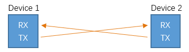

##############################################################################
Chapter Serial Communication
##############################################################################

Serial Communication is a means of communication between different devices/devices. This section describes ESP32's Serial Communication.

Project Serial Print
***************************************

This project uses ESP32's serial communicator to send data to the computer and print it on the serial monitor.

Component List
======================================

+------------------------------------+-------------------------+
| ESP32-WROVER x1                    | GPIO Extension Board x1 |
|                                    |                         |
| |Chapter01_00|                     | |Chapter01_01|          |
+------------------------------------+-------------------------+
| Micro USB Wire x1                                            |
|                                                              |
| |Chapter08_00|                                               |
+--------------------------------------------------------------+
  
.. |Chapter01_00| image:: ../_static/imgs/1_LED/Chapter01_00.png
.. |Chapter01_01| image:: ../_static/imgs/1_LED/Chapter01_01.png
.. |Chapter08_00| image:: ../_static/imgs/8_Serial_Communication/Chapter08_00.png

Related knowledge
==========================================

Serial communication
---------------------------------------------

Serial communication generally refers to the Universal Asynchronous Receiver/Transmitter (UART), which is commonly used in electronic circuit communication. It has two communication lines, one is responsible for sending data (TX line) and the other for receiving data (RX line). The serial communication connections of two devices is as follows:

Before serial communication starts, the baud rate of both sides must be the same. Communication between devices can work only if the same baud rate is used. The baud rates commonly used is 9600 and 115200.

Serial port on ESP32
===========================================

Freenove ESP32 has integrated USB to serial transfer, so it could communicate with computer connecting to USB cable.

Arduino Software also uploads code to Freenove ESP32 through the serial connection.

Your computer identifies serial devices connecting to it as COMx. We can use the Serial Monitor window of Arduino Software to communicate with Freenove ESP32, connect Freenove ESP32 to computer through the USB cable, choose the correct device, and then click the Serial Monitor icon to open the Serial Monitor window.

Interface of serial monitor window is as follows. If you can't open it, make sure Freenove ESP32 has been connected to the computer, and choose the right serial port in the menu bar "Tools".

Circuit
===========================================

Connect Freenove ESP32 to the computer with USB cable

Sketch
==========================================

Sketch_SerialPrinter
-----------------------------------------

Download the code to ESP32-WROVER, open the serial port monitor, set the baud rate to 115200, and press the reset button. As shown in the following figure:

.. image:: ../_static/imgs/8_Serial_Communication/Chapter08_07.png
    :align: center

As shown in the image above, "ESP32 initialization completed! " The previous is the printing message when the system is started, it uses the baud rate of 120,000, which is incorrect, so the garbled code is displayed. The user program is then printed at a baud rate of 115200.

How do I disable messages printed at system startup?

Use a jumper wire and connect one of its ends to GPIO5 of development board and the other to GND, so that we can disable the system to print out startup messages.

For more information, click :ref:`here <GPIO>`.

The following is the program code:

.. literalinclude:: ../../../freenove_Kit/C/Sketches/Sketch_08.1_SerialPrinter/Sketch_08.1_SerialPrinter.ino
    :linenos: 
    :language: c
    :dedent:

Reference

.. py:function:: void begin(unsigned long baud, uint32_t config=SERIAL_8N1, int8_t rxPin=-1, int8_t txPin=-1, bool invert=false, unsigned long timeout_ms = 20000UL);	

    Initializes the serial port. Parameter baud is baud rate, other parameters generally use the default value.

.. py:function:: size_t println( arg );	

    Print to the serial port and wrap. The parameter arg can be a number, a character, a string, an array of characters, etc.

.. py:function:: size_t printf(const char * format, ...)  __attribute__ ((format (printf, 2, 3)));	

    Print formatted content to the serial port in the same way as print in standard C.

.. py:function:: unsigned long millis();	

    Returns the number of milliseconds since the current system was booted.

Project Serial Read and Write
***********************************************

From last section, we use serial port on Freenove ESP32 to send data to a computer, now we will use that to receive data from computer.

Component and circuit are the same as in the previous project.

Sketch
===========================================

Sketch_SerialRW
-------------------------------------------

Download the code to ESP32-WROVER, open the serial monitor, and set the bottom to Newline, 115200. As shown in the following figure:

Type characters such as 'ABCDEFG' at the top, then press Enter to send the data to the ESP32, and the serial port monitor will print out the data received and forwarded back by the ESP32.

The following is the program code:

.. literalinclude:: ../../../freenove_Kit/C/Sketches/Sketch_08.2_SerialRW/Sketch_08.2_SerialRW.ino
    :linenos: 
    :language: c
    :dedent:

In loop(), determine whether the serial port has data, if so, read and save the data, and if the newline character is read, print out all the data that has been read.

Reference
----------------------------------------------

.. py:function:: String();	
    
    Constructs an instance of the String class.
    
    For more information, please visit
    
    https://www.arduino.cc/reference/en/language/variables/data-types/stringobject/

.. py:function:: int available(void);	
    
    Get the number of bytes (characters) available for reading from the serial port. This is data that's already arrived and stored in the serial receive buffer.

.. py:function:: Serial.read();
    
    Reads incoming serial data.
