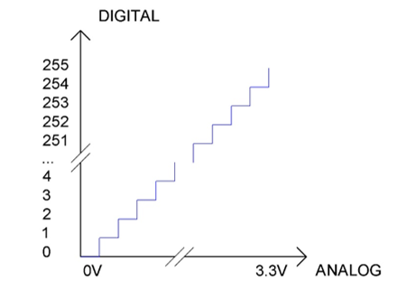
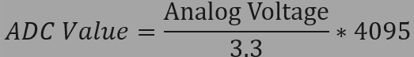
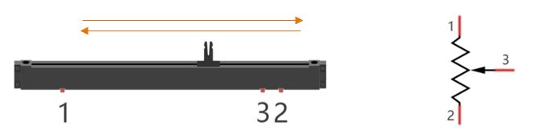
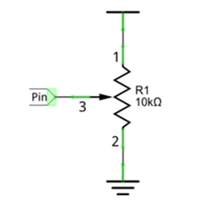
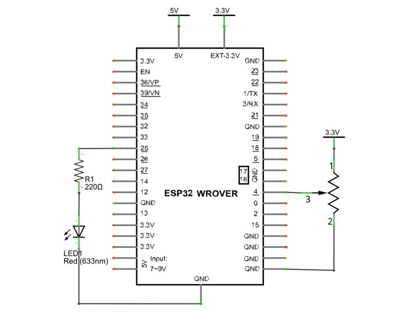

##############################################################################
Chapter 9 AD/DA Converter
##############################################################################

We have learned how to control the brightness of LED through PWM and understood that PWM is not the real analog before. In this chapter, we will learn how to read analog, convert it into digital and convert the digital into analog output. That is, ADC and DAC.

Project 9.1 Read the Voltage of Potentiometer 
******************************************************

In this project, we will use the ADC function of ESP32 to read the voltage value of potentiometer. And then output the voltage value through the DAC to control the brightness of LED.

Component List
==============================================

.. table::
    :width: 80%
    :align: center
    :class: table-line
    
    +------------------------------------+----------------------------------------------------+
    | ESP32-WROVER x1                    | GPIO Extension Board x1                            |
    |                                    |                                                    |
    | |Chapter01_00|                     | |Chapter01_01|                                     |
    +------------------------------------+----------------------------------------------------+
    | Breadboard x1                                                                           |
    |                                                                                         |
    | |Chapter01_02|                                                                          |
    +-----------------+------------------+------------------------+---------------------------+
    | LED x1          | Resistor 220Ω x1 | Jumper M/M x5          | Rotary potentiometer x1   |
    |                 |                  |                        |                           |
    | |Chapter01_03|  | |Chapter01_04|   | |Chapter01_05|         | |Chapter09_00|            |
    +-----------------+------------------+------------------------+---------------------------+

.. |Chapter01_00| image:: ../_static/imgs/1_LED/Chapter01_00.png
.. |Chapter01_01| image:: ../_static/imgs/1_LED/Chapter01_01.png
.. |Chapter01_02| image:: ../_static/imgs/1_LED/Chapter01_02.png
.. |Chapter01_03| image:: ../_static/imgs/1_LED/Chapter01_03.png 
.. |Chapter01_04| image:: ../_static/imgs/1_LED/Chapter01_04.png    
.. |Chapter01_05| image:: ../_static/imgs/1_LED/Chapter01_05.png
.. |Chapter09_00| image:: ../_static/imgs/9_AD_DA_Converter/Chapter09_00.png

Related knowledge
=====================================

ADC
--------------------------------

An ADC is an electronic integrated circuit used to convert analog signals such as voltages to digital or binary form consisting of 1s and 0s. The range of our ADC on ESP32 is 12 bits, that means the resolution is 2^12=4096, and it represents a range (at 3.3V) will be divided equally to 4096 parts. The rage of analog values corresponds to ADC values. So the more bits the ADC has, the denser the partition of analog will be and the greater the precision of the resulting conversion.

Subsection 1: the analog in rang of 0V---3.3/4095 V corresponds to digital 0;

Subsection 2: the analog in rang of 3.3/4095 V---2*3.3 /4095V corresponds to digital 1;

\.\.\.\.\.\.

The following analog will be divided accordingly.

The conversion formula is as follows:

DAC
---------------------------------

The reversing of this process requires a DAC, Digital-to-Analog Converter. The digital I/O port can output high level and low level (0 or 1), but cannot output an intermediate voltage value. This is where a DAC is useful.  ESP32 has two DAC output pins with 8-bit accuracy, GPIO25 and GPIO26, which can divide VDD (here is 3.3V) into 2*8=256 parts. For example, when the digital quantity is 1, the output voltage value is 3.3/256 *1 V, and when the digital quantity is 128, the output voltage value is 3.3/256 *128=1.65V, the higher the accuracy of DAC, the higher the accuracy of output voltage value will be.

The conversion formula is as follows:

.. image:: ../_static/imgs/9_AD_DA_Converter/Chapter09_03.png
    :align: center

ADC on ESP32
----------------------------------

ESP32 has two digital analog converters with successive approximations of 12-bit accuracy, and a total of 16 pins can be used to measure analog signals. GPIO pin sequence number and analog pin definition are shown in the following table.

.. table::
    :align: center
    :class: zebra
    
    +-----------------------+-------------+-------------+
    | Pin number in Arduino | GPIO number | ADC channel |
    +=======================+=============+=============+
    | A0                    | GPIO 36     | ADC1_CH0    |
    +-----------------------+-------------+-------------+
    | A3                    | GPIO 39     | ADC1_CH3    |
    +-----------------------+-------------+-------------+
    | A4                    | GPIO 32     | ADC1_CH4    |
    +-----------------------+-------------+-------------+
    | A5                    | GPIO 33     | ADC1_CH5    |
    +-----------------------+-------------+-------------+
    | A6                    | GPIO 34     | ADC1_CH6    |
    +-----------------------+-------------+-------------+
    | A7                    | GPIO 35     | ADC1_CH7    |
    +-----------------------+-------------+-------------+
    | A10                   | GPIO 4      | ADC2_CH0    |
    +-----------------------+-------------+-------------+
    | A11                   | GPIO 0      | ADC2_CH1    |
    +-----------------------+-------------+-------------+
    | A12                   | GPIO 2      | ADC2_CH2    |
    +-----------------------+-------------+-------------+
    | A13                   | GPIO 15     | ADC2_CH3    |
    +-----------------------+-------------+-------------+
    | A14                   | GPIO 13     | ADC2_CH4    |
    +-----------------------+-------------+-------------+
    | A15                   | GPIO 12     | ADC2_CH5    |
    +-----------------------+-------------+-------------+
    | A16                   | GPIO 14     | ADC2_CH6    |
    +-----------------------+-------------+-------------+
    | A17                   | GPIO 27     | ADC2_CH7    |
    +-----------------------+-------------+-------------+
    | A18                   | GPIO 25     | ADC2_CH8    |
    +-----------------------+-------------+-------------+
    | A19                   | GPIO 26     | ADC2_CH9    |
    +-----------------------+-------------+-------------+

The analog pin number is also defined in ESP32's code base. For example, you can replace GPIO36 with A0 in the code.

.. note::
    
    **ADC2 is disabled when ESP32's WiFi function is enabled.**

DAC on ESP32
--------------------------------------

ESP32 has two 8-bit digital analog converters to be connected to GPIO25 and GPIO26 pins, respectively, and it is immutable. As shown in the following table.

.. table::
    :align: center
    :class: zebra
    
    +---------------------+-------------+
    | Simulate pin number | GPIO number |
    +=====================+=============+
    | DAC1                | 25          |
    +---------------------+-------------+
    | DAC2                | 26          |
    +---------------------+-------------+

The DAC pin number is already defined in ESP32's code base; for example, you can replace GPIO25 with DAC1 in the code.

.. note::
    
    **In this ESP32, GPIO26 is used as the camera's IIC-SDA pin, which is connected to 3.3V through a resistor.Therefore, DAC2 cannot be used.**

Component knowledge
====================================

Potentiometer
---------------------------------

A potentiometer is a three-terminal resistor. Unlike the resistors that we have used thus far in our project which have a fixed resistance value, the resistance value of a potentiometer can be adjusted. A potentiometer is often made up by a resistive substance (a wire or carbon element) and movable contact brush. When the brush moves along the resistor element, there will be a change in the resistance of the potentiometer's output side (3) (or change in the voltage of the circuit that is a part). The illustration below represents a linear sliding potentiometer and its electronic symbol on the right.

What between potentiometer pin 1 and pin 2 is the resistor body, and pins 3 is connected to brush. When brush moves from pin 1 to pin 2, the resistance between pin 1 and pin 3 will increase up to body resistance linearly, and the resistance between pin 2 and pin 3 will decrease down to 0 linearly.

In the circuit. The both sides of resistance body are often connected to the positive and negative electrode of the power. When you slide the brush pin 3, you can get a certain voltage in the range of the power supply.

Rotary potentiometer 
---------------------------------------------

Rotary potentiometer and linear potentiometer have similar function; their only difference is: the resistance is adjusted by rotating the potentiometer.

.. image:: ../_static/imgs/9_AD_DA_Converter/Chapter09_06.png
    :align: center

Circuit
=====================================

.. list-table:: 
   :width: 80%
   :align: center
   :class: table-line
   
   * -  **Schematic diagram**
   * -  |Chapter09_07|
   * -  **Hardware connection**
   * -  :combo:`red font-bolder:If you need any support, please contact us via:` support@freenove.com
        
        |Chapter09_08|

.. |Chapter09_08| image:: ../_static/imgs/9_AD_DA_Converter/Chapter09_08.png    

Sketch
=======================================

Sketch_09.1_ADC_DAC
------------------------------------

Download the code to ESP32-WROVER, open the serial monitor, and set the baud rate to 115200. As shown in the following figure, 

The serial monitor prints ADC values, DAC values, and the output voltage of the potentiometer. In the code, we made the voltage output from the DAC pin equal to the voltage input from the ADC pin. Rotate the handle of the potentiometer and the print will change. When the voltage is greater than 1.6V (voltage needed to turn on red LED), LED starts emitting light. If you continue to increase the output voltage, the LED will become more and more brighter. When the voltage is less than 1.6v, the LED will not light up, because it does not reach the voltage to turn on LED, which indirectly proves the difference between DAC and PWM. (if you have an oscilloscope, you can check the waveform of the DAC output through it.)

The following is the code:

.. literalinclude:: ../../../freenove_Kit/C/Sketches/Sketch_09.1_ADC_DAC/Sketch_09.1_ADC_DAC.ino
    :linenos: 
    :language: c
    :dedent:

In loop(), the analogRead() function is used to obtain the ADC value, and then the map() function is used to convert the value into an 8-bit precision DAC value. The function dacWrite() is used to output the value. The input and output voltage are calculated according to the previous formula, and the information is finally printed out.

.. literalinclude:: ../../../freenove_Kit/C/Sketches/Sketch_09.1_ADC_DAC/Sketch_09.1_ADC_DAC.ino
    :linenos: 
    :language: c
    :lines: 14-18
    :dedent:

Reference
------------------------------------

.. py:function:: uint16_t analogRead(uint8_t pin);

    Reads the value from the specified analog pin. Return the analog reading on the pin. (0-4095 for 12 bits).

.. py:function:: void dacWrite(uint8_t pin, uint8_t value);

    This writes the given value to the supplied analog pin.

.. py:function:: long map(long value,long fromLow,long fromHigh,long toLow,long toHigh);

    Re-maps a number from one range to another. That is, a value of fromLow would get mapped to toLow, a value of fromHigh to toHigh, values in-between to values in-between, etc.