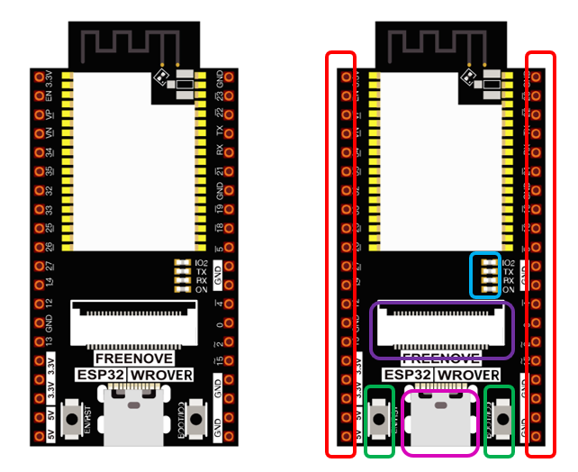
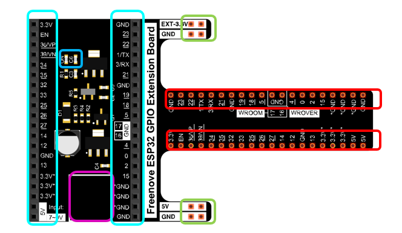
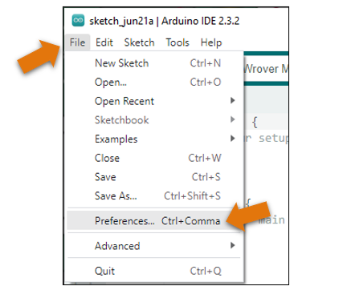
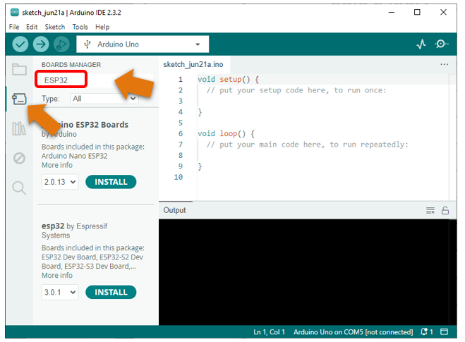

##############################################################################
Preface
##############################################################################

ESP32 is a micro control unit with integrated Wi-Fi launched by Espressif, which features strong properties and integrates rich peripherals. It can be designed and studied as an ordinary Single Chip Micyoco(SCM) chip, or connected to the Internet and used as an Internet of Things device.

ESP32 can be developed using the Arduino platform, which will definitely make it easier for people who have learned arduino to master. Moreover, the code of ESP32 is completely open-source, so beginners can quickly learn how to develop and design IOT smart household products including smart curtains, fans, lamps and clocks.

Generally, ESP32 projects consist of code and circuits. Don't worry even if you've never learned code and circuits, because we will gradually introduce the basic knowledge of C programming language and electronic circuits, from easy to difficult. Our products contain all the electronic components and modules needed to complete these projects. It's especially suitable for beginners.

We divide each project into four parts, namely Component List, Component Knowledge, Circuit and Code. Component List helps you to prepare material for the experiment more quickly. Component Knowledge allows you to quickly understand new electronic modules or components, while Circuit helps you understand the operating principle of the circuit. And Code allows you to easily master the use of SEP32 and accessory kit. After finishing all the projects in this tutorial, you can also use these components and modules to make products such as smart household, smart cars and robots to transform your creative ideas into prototypes and new and innovative products.

In addition, if you have any difficulties or questions with this tutorial or toolkit, feel free to ask for our quick and free technical support through support@freenove.com 

.. _ESP32_Wrover:

ESP32-WROVER
***********************************************************************

ESP32-WROVER has launched a total of two antenna packages, PCB on-board antenna and IPEX antenna respectively. The PCB on-board antenna is an integrated antenna in the chip module itself, so it is convenient to carry and design. The IPEX antenna is a metal antenna derived from the integrated antenna of the chip module itself, which is used to enhance the signal of the module.

.. list-table:: 
   :width: 80%
   :header-rows: 1 
   :align: center
   :class: table-line
   
   * -  PCB on-board antenna 
     -  IPEX antenna
   
   * -  |Preface00|
     -  |Preface01| 
  
.. |Preface00| image:: ../_static/imgs/Preface/Preface00.png    
.. |Preface01| image:: ../_static/imgs/Preface/Preface01.png    

In this tutorial, the ESP32-WROVER is designed based on the PCB on-board antenna-packaged ESP32-WROVER module. 

ESP32-WROVER

.. image:: ../_static/imgs/Preface/Preface02.png
    :align: center
    :width: 50%

**The version on the left is no longer mass-produced, and we mainly maintain the version on the right.**

Please note that there are many pirated versions of the ESP32 WROVER that look very similar to the version on the left. None of them will carry our logo and Freenove font.

We do not sell pirated ESP32 WROVER, nor do we provide after-sales service for pirated.

The hardware interfaces of ESP32-WROVER are distributed as follows:

Compare the left and right images. We've boxed off the resources on the ESP32-WROVER in different colors to facilitate your understanding of the ESP32-WROVER.

.. list-table:: 
   :width: 80%
   :header-rows: 1 
   :align: center
   :class: table-line
   
   * -  Box color 
     -  Corresponding resources introduction

   * -  |Preface04|
     -  GPIO pin

   * -  |Preface05|
     -  LED indicator

   * -  |Preface06|
     -  Camera interface

   * -  |Preface07|
     -  Reset button, Boot mode selection button 

   * -  |Preface08|
     -  USB portX

.. |Preface05| image:: ../_static/imgs/Preface/Preface05.png 

.. image:: ../_static/imgs/Preface/Preface09.png
    :align: center

For more information, please visit: https://www.espressif.com/sites/default/files/documentation/esp32-wrover_datasheet_en.pdf

Extension board of the ESP32-WROVER
**********************************************

And we also design an extension board, so that you can use the ESP32 more easily in accordance with the circuit diagram provided. The followings are their photos. 

The hardware interfaces of ESP32-WROVER are distributed as follows:

We've boxed off the resources on the ESP32-WROVER in different colors to facilitate your understanding of the ESP32-WROVER.

.. list-table:: 
   :width: 80%
   :header-rows: 1 
   :align: center
   :class: table-line
   
   * -  Box color 
     -  Corresponding resources introduction

   * -  |Preface11|
     -  GPIO pin

   * -  |Preface12|
     -  LED indicator

   * -  |Preface13|
     -  GPIO interface of development board

   * -  |Preface14|
     -  power supplied by the extension board 

   * -  |Preface15|
     -  External power supply

.. |Preface11| image:: ../_static/imgs/Preface/Preface11.png   

.. |Preface15| image:: ../_static/imgs/Preface/Preface15.png 

In ESP32, GPIO is an interface to control peripheral circuit. For beginners, it is necessary to learn the functions of each GPIO. The following is an introduction to the GPIO resources of the ESP32-WROVER development board.

In the following projects, we only use USB cable to power ESP32-WROVER by default.

In the whole tutorial, we don't use T extension to power ESP32-WROVER. So 5V and 3.3V (including EXT 3.3V) on the extension board are provided by ESP32-WROVER. 

We can also use DC jack of extension board to power ESP32-WROVER.In this way, 5v and EXT 3.3v on extension board are provided by external power resource.

CH340 (Importance)
***********************************

ESP32 uses CH340 to download codes. So before using it, we need to install CH340 driver in our computers.

Windows
====================================

Check whether CH340 has been installed

1.	Connect your computer and ESP32 with a USB cable.

2.	Turn to the main interface of your computer, select "This PC" and right-click to select "Manage".

3.	Click "Device Manager". If your computer has installed CH340, you can see"USB-SERIAL CH340 (COMx)". And you can click :ref:`here <programming>` to move to the next step.

Installing CH340
------------------------------------

1.	First, download CH340 driver, click http://www.wch-ic.com/search?q=CH340&t=downloads to download the appropriate one based on your operating system.

If you would not like to download the installation package, you can open **"Freenove_Ultimate_Starter_Kit_for_ESP32/CH340"**, we have prepared the installation package.

2.	Open the folder **"Freenove_Ultimate_Starter_Kit_for_ESP32/CH340/Windows/"**

.. image:: ../_static/imgs/Preface/Preface21.png
    :align: center

3.	Double click **"CH341SER.EXE"**.

4.	Click "INSTALL" and wait for the installation to complete.

5.	Install successfully. Close all interfaces.

6.	When ESP32 is connected to computer, select "This PC", right-click to select "Manage" and click "Device Manager" in the newly pop-up dialog box, and you can see the following interface.

.. image:: ../_static/imgs/Preface/Preface25.png
    :align: center

7.	So far, CH340 has been installed successfully. Close all dialog boxes. 

MAC
==============================

First, download CH340 driver, click http://www.wch-ic.com/search?q=CH340&t=downloads to download the appropriate one based on your operating system.

If you would not like to download the installation package, you can open **"Freenove_Ultimate_Starter_Kit_for_ESP32/CH340"**, we have prepared the installation package.

Second, open the folder **"Freenove_Ultimate_Starter_Kit_for_ESP32/CH340/MAC/"**

Third, click Continue.

Fourth, click Install.

Then, waiting Finsh.

Finally, restart your PC.

If you still haven't installed the CH340 by following the steps above, you can view readme.pdf to install it.

.. _programming:

Programming Software
****************************************************************

Arduino Software (IDE) is used to write and upload the code for Arduino Board.

First, install Arduino Software (IDE): visit https://www.arduino.cc/en/software/

.. image:: ../_static/imgs/ArduinoIDE/Preface03.png
    :align: center

Select and download corresponding installer based on your operating system. If you are a Windows user, please select the "Windows" to download and install the driver correctly.

.. image:: ../_static/imgs/ArduinoIDE/Preface04.png
    :align: center

After the downloading completes, run the installer. For Windows users, there may pop up an installation dialog box of driver during the installation process. When it is popped up, please allow the installation.

After installation is completed, an shortcut will be generated in the desktop.

.. image:: ../_static/imgs/ArduinoIDE/Preface05.png
    :align: center

Run it. The interface of the software is as follows:

.. image:: ../_static/imgs/ArduinoIDE/Preface06.png
    :align: center

Programs written with Arduino IDE are called sketches. These sketches are written in a text editor and are saved with the file extension.ino. The editor has features for cutting/pasting and for searching/replacing text. The console displays text output by the Arduino IDE, including complete error messages and other information. The bottom right-hand corner of the window displays the configured board and serial port. The toolbar buttons allow you to verify and upload programs, open the serial monitor, and access the serial plotter.

.. table::
    :align: center
    :class: table-line
    :width: 80%
    
    +-------------+---------------------------------------------------------------------+
    | |Preface007|| Verify                                                              |
    |             |                                                                     |
    |             | Checks your code for errors compiling it.                           |
    +-------------+---------------------------------------------------------------------+
    | |Preface008|| Upload                                                              |
    |             |                                                                     |
    |             | Compiles your code and uploads it to the configured board.          |
    +-------------+---------------------------------------------------------------------+
    | |Preface009|| Debug                                                               |
    |             |                                                                     |
    |             | Troubleshoot code errors and monitor program running status.        |
    +-------------+---------------------------------------------------------------------+
    | |Preface010|| Serial Plotter                                                      |
    |             |                                                                     |
    |             | Real-time plotting of serial port data charts.                      |
    +-------------+---------------------------------------------------------------------+
    | |Preface011|| Serial Monitor                                                      |
    |             |                                                                     |
    |             | Used for debugging and communication between devices and computers. |
    +-------------+---------------------------------------------------------------------+

.. |Preface007| image:: ../_static/imgs/ArduinoIDE/Preface07.png
.. |Preface008| image:: ../_static/imgs/ArduinoIDE/Preface08.png
.. |Preface009| image:: ../_static/imgs/ArduinoIDE/Preface09.png
.. |Preface010| image:: ../_static/imgs/ArduinoIDE/Preface10.png
.. |Preface011| image:: ../_static/imgs/ArduinoIDE/Preface11.png

Environment Configuration
***********************************

First, open the software platform arduino, and then click File in Menus and select Preferences.

Second, click on the symbol behind "Additional Boards Manager URLs" 

Third, fill in https://espressif.github.io/arduino-esp32/package_esp32_index.json in the new window, click OK, and click OK on the Preferences window again.

Fourth, click "BOARDS MANAGER" on the left and type "ESP32" in the search box.

Fifth, select Espressif Systems' ESP32 and select version 3.0.x. Click "INSTALL" to install esp32.

.. image:: ../_static/imgs/Preface/Preface42.png
    :align: center

.. note::

    it takes a while to install the ESP32, make sure your network is stable.

When finishing installation, click Tools in the Menus again and select Board: "Arduino Uno", and then you can see information of **ESP32 Wrover Module**. Click **"ESP32 Wrover Module"** so that the ESP32 programming development environment is configured.

.. _GPIO:

Notes for GPIO
*********************************

Strapping Pin
=================================

There are five Strapping pins for ESP32:MTDI、GPIO0、GPIO2、MTDO、GPIO5。

With the release of the chip's system reset (power-on reset, RTC watchdog reset, undervoltage reset), the strapping pins sample the level and store it in the latch as "0" or "1" ", and keep it until the chip is powered off or turned off.

Each Strapping pin is connecting to internal pull-up/pull-down.  Connecting to high-impedance external circuit or without an external connection, a strapping pin's default value of input level will be determined by internal weak pull-up/pull-down. To change the value of the Strapping, users can apply an external pull-down/pull-up resistor, or use the GPIO of the host MCU to control the level of the strapping pin when the ESP32's power on reset is released.

**When releasing the reset, the strapping pin has the same function as a normal pin.**

The followings are default configurations of these five strapping pins at power-on and their functions under the corresponding configuration.

If you have any questions about the information of GPIO, you can click here to go back to ESP32-WROVER to view specific information about GPIO.

If you have any difficulties or questions with this tutorial or toolkit, feel free to ask for our quick and free technical support through support@freenove.com at any time.

or check: https://www.espressif.com/sites/default/files/documentation/esp32-wrover_datasheet_en.pdf

Strapping Pin

Flash Pin

GPIO6-11 has been used to connect the integrated SPI flash on the module, and is used when GPIO 0 is power on and at high level. Flash is related to the operation of the whole chip, so the external pin GPIO6-11 cannot be used as an experimental pin for external circuits, otherwise it may cause errors in the operation of the program. 

In older versions, the flash pin looks like the image below.

In the new release, we no longer introduce GPIO6-11.

GPIO16-17 has been used to connect the integrated PSRAM on the module. 

Because of external pull-up, MTDI pin is not suggested to be used as a touch sensor. For details, please refer to Peripheral Interface and Sensor chapter in "ESP32 Data_Sheet".

For more relevant information, please check: https://www.espressif.com/sites/default/files/documentation/esp32-wrover_datasheet_en.pdf.

Cam Pin
========================================

When using the camera of our ESP32-WROVER, please check the pins of it. 

Pins with underlined numbers are used by the camera function, if you want to use other functions besides it, please avoid using them.

.. list-table:: 
   :width: 80%
   :widths: 1 1
   :header-rows: 1 
   :align: center
   :class: zebra text-center
   
   * -  CAM_Pin
     -  GPIO_pin

   * -  I2C_SDA	
     -  GPIO26

   * -  I2C_SCL
     -  GPIO27

   * -  CSI_VYSNC	
     -  GPIO25

   * -  CSI_HREF	
     -  GPIO23

   * -  CSI_Y9	
     -  GPIO35

   * -  XCLK	
     -  GPIO21

   * -  CSI_Y8	
     -  GPIO34

   * -  CSI_Y7	
     -  GPIO39

   * -  CSI_PCLK	
     -  GPIO22

   * -  CSI_Y6	
     -  GPIO36

   * -  CSI_Y2	
     -  GPIO4

   * -  CSI_Y5	
     -  GPIO19

   * -  CSI_Y3	
     -  GPIO5

   * -  CSI_Y4	
     -  GPIO18

If you have any questions about the information of GPIO, you can click :ref:`here <ESP32_Wrover>` to go back to ESP32-WROVER to view specific information about GPIO. 

or check: https://www.espressif.com/sites/default/files/documentation/esp32-wrover_datasheet_en.pdf.