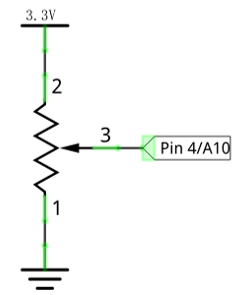
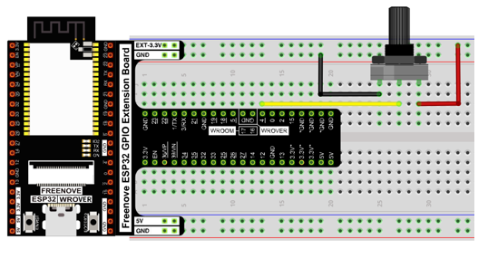
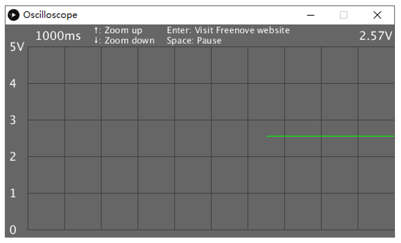
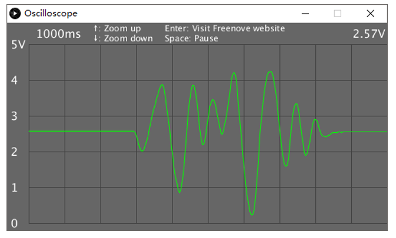
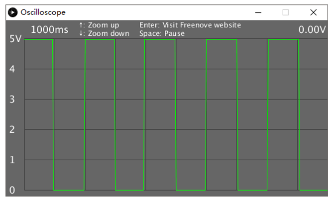

##############################################################################
Chapter Oscilloscope
##############################################################################

In this chapter, we will make a complex virtual instrument, oscilloscope. Oscilloscope is a widely used electronic measuring instrument. It can get the electrical signals not directly observed into visible image to facilitate the analysis and study of various electrical signals change process.

Project 1.1 Oscilloscope
**********************************

Now, let's use Processing and ESP32 board to create an oscilloscope.

Component List
====================================

+------------------------------------+------------------------+
| ESP32-WROVER x1                    | GPIO Extension Board x1|
|                                    |                        |
| |Chapter01_00|                     | |Chapter01_01|         |
+------------------------------------+------------------------+
| Breadboard x1                                               |
|                                                             |
| |Chapter01_02|                                              |
+------------------------------------+------------------------+
| Rotary potentiometer x1            | Jumper M/M x3          |
|                                    |                        |
| |Chapter09_00|                     | |Chapter01_05|         |
+------------------------------------+------------------------+

.. |Chapter01_00| image:: ../_static/imgs/1_LED/Chapter01_00.png
.. |Chapter01_01| image:: ../_static/imgs/1_LED/Chapter01_01.png
.. |Chapter01_02| image:: ../_static/imgs/1_LED/Chapter01_02.png
.. |Chapter13_00| image:: ../_static/imgs/1_LED/Chapter13_00.png 
.. |Chapter07_04| image:: ../_static/imgs/7_Buzzer/Chapter07_04.png   
.. |Chapter01_05| image:: ../_static/imgs/1_LED/Chapter01_05.png
.. |Chapter09_00| image:: ../_static/imgs/9_AD_DA_Converter/Chapter09_00.png

Circuit
===============================================

Use Pin4 (A10) port to detect the voltage of rotary potentiometer.

.. list-table:: 
   :width: 100%
   :align: center
   
   * -  Schematic diagram
     -  Hardware connection
   
   * -  |Chapter01_00|
     -  |Chapter01_01|

Sketch
==============================

Sketch Oscilloscope
------------------------------

Use Processing to open **Freenove Ultimate Starter Kit for ESP32\C\Processing\Processing\Oscilloscope\Oscilloscope.pde** and click Run. If the connection succeeds, the follow will be shown:

The green line is the waveform acquisited. Rotate the potentiometer, then you can see changes of the waveform:

Disconnect the A10 port from the potentiometer and connect it to the Pin 2 port. Pin 2 port output is 0.5Hz square wave. As is shown below:

The left side of the software interface is a voltage scale, which is used to indicate the voltage of the waveform.

The "1000ms" on top left corner is the time of a square, and you can press “↑” and “↓” key on keyboard to adjust it.

The "0.00V" on top right corner is the voltage value of current signal.

You can press the space bar on keyboard to pause the display waveform, which is easy to view and analysis.

We believe that with the help of this oscilloscope, you can obtain more intuitive understanding of the actual work of some electronic circuits. It will help you complete the project and eliminate the trouble. You can export this sketch to an application used as a tool.
