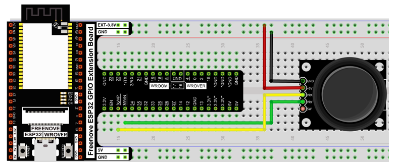
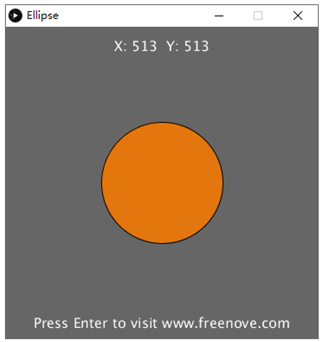
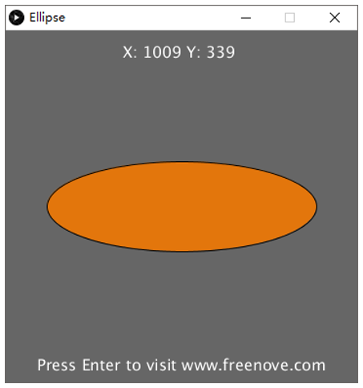
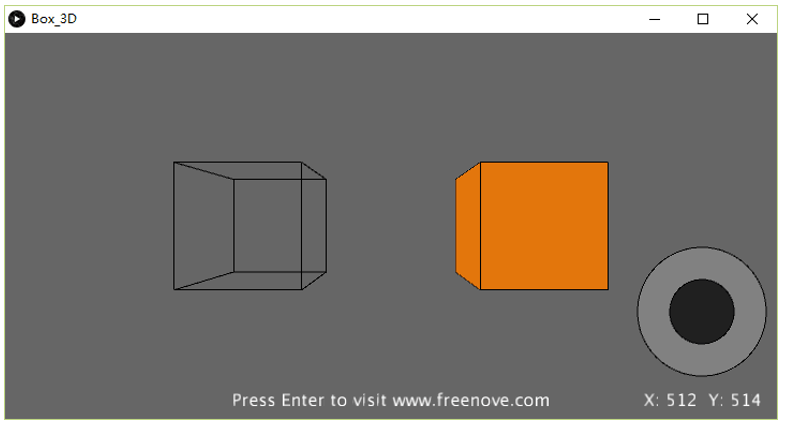
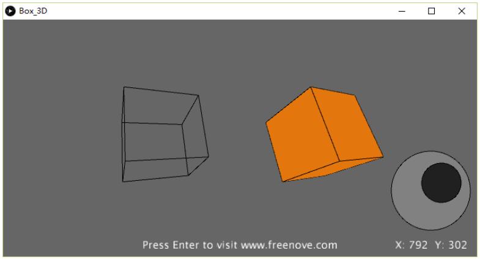

##############################################################################
Chapter Control 2D and 3D Figures
##############################################################################

In this chapter, we will use ESP32 board to make Processing program control figure changes. And we will control 2D and 3D figures, respectively.

Project 2.1 Ellipse
*************************************

First, control a 2D figure.

Component List
====================================

+------------------------------------+------------------------+
| ESP32-WROVER x1                    | GPIO Extension Board x1|
|                                    |                        |
| |Chapter01_00|                     | |Chapter01_01|         |
+------------------------------------+------------------------+
| Breadboard x1                                               |
|                                                             |
| |Chapter01_02|                                              |
+------------------------------------+------------------------+
| Joystick x1                        | Jumper M/M x3          |
|                                    |                        |
| |Chapter14_00|                     | |Chapter01_05|         |
+------------------------------------+------------------------+

.. |Chapter01_00| image:: ../_static/imgs/1_LED/Chapter01_00.png
.. |Chapter01_01| image:: ../_static/imgs/1_LED/Chapter01_01.png
.. |Chapter01_02| image:: ../_static/imgs/1_LED/Chapter01_02.png
.. |Chapter13_00| image:: ../_static/imgs/1_LED/Chapter13_00.png 
.. |Chapter07_04| image:: ../_static/imgs/7_Buzzer/Chapter07_04.png   
.. |Chapter01_05| image:: ../_static/imgs/1_LED/Chapter01_05.png
.. |Chapter14_00| image:: ../_static/imgs/14_Joystick/Chapter14_00.png

Circuit
=======================================

Use Pin36 and Pin39 (A0 and A3) ports to detect the voltage value of two rotary potentiometers inside joystick.

.. list-table:: 
   :width: 100%
   :align: center
   
   * -  Schematic diagram
   * -  |Chapter02_00|
   * -  Hardware connection. 
   * -  |Chapter02_01|

Sketch
==================================

Sketch Ellipse
-----------------------------

Use Processing to open **Freenove Ultimate Starter Kit for ESP32\C\Processing\Processing\Ellipse\Ellipse.pde** , then click Run. If the connection succeeds, the following will be shown:

Then you can change the ellipse shape by shifting the joystick:

Project 2.2 Box 3D
***********************************

Now control a 3D figure.

Component list
=================================

The same as last section.

Circuit
=================================

The same as last section.

Sketch
===================================

Sketch Box_3D
--------------------------------

Use Processing to open **Freenove Ultimate Starter Kit for ESP32\C\Processing\Processing\Box_3D\Box_3D.pde** , and click Run. If the connection succeeds, the following will be shown. The left is a 3D box presented by line and the right is a 3D box entity.

Then you can change the space angle of two 3D box by shifting the joystick:

