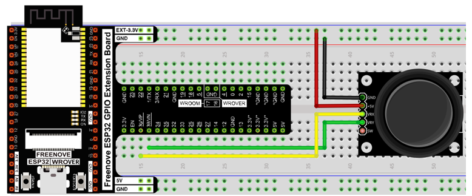

##############################################################################
Chapter Snake Game
##############################################################################

We have learned how control 2D and 3D figures. Now, we will use ESP32 board to play the classic snake game. There are both 2D and 3D version.

Project 3.1 Snake Game
************************************

First, let's play a 2D snake game.

Component List
====================================

+------------------------------------+------------------------+
| ESP32-WROVER x1                    | GPIO Extension Board x1|
|                                    |                        |
| |Chapter01_00|                     | |Chapter01_01|         |
+------------------------------------+------------------------+
| Breadboard x1                                               |
|                                                             |
| |Chapter01_02|                                              |
+------------------------------------+------------------------+
| Joystick x1                        | Jumper M/M x3          |
|                                    |                        |
| |Chapter14_00|                     | |Chapter01_05|         |
+------------------------------------+------------------------+

.. |Chapter01_00| image:: ../_static/imgs/1_LED/Chapter01_00.png
.. |Chapter01_01| image:: ../_static/imgs/1_LED/Chapter01_01.png
.. |Chapter01_02| image:: ../_static/imgs/1_LED/Chapter01_02.png
.. |Chapter13_00| image:: ../_static/imgs/1_LED/Chapter13_00.png 
.. |Chapter07_04| image:: ../_static/imgs/7_Buzzer/Chapter07_04.png   
.. |Chapter01_05| image:: ../_static/imgs/1_LED/Chapter01_05.png
.. |Chapter14_00| image:: ../_static/imgs/14_Joystick/Chapter14_00.png

Circuit
==============================

Use Pin36 and Pin39 (A0 and A3) ports to detect the voltage value of two rotary potentiometers inside joystick.

.. list-table:: 
   :width: 100%
   :align: center
   
   * -  Schematic diagram
   * -  |Chapter03_00|
   * -  Hardware connection. 
   * -  |Chapter03_01|

Sketch
===========================

Sketch Snake_Game
--------------------------

Use Processing to open **Freenove Ultimate Starter Kit for ESP32\C\Processing\Processing\Box_3D\Box_3D.pde** , and click Run.Snake_Game.pde and click Run. If the connection succeeds, the follow will be shown:

Press the space bar on keyboard to start the game:

Shift the joystick to control the snake action. The game rules are the same as the classic snake game:

When the game fails, press space bar to restart the game:

Additionally, you can restart the game by pressing the space bar at any time.

Project 3.2 Snake Game 3D
*******************************************

Now, let's experience the 3D version game.

Component list
================================

The same as last section.

Circuit
=================================

The same as last section.

Sketch
=================================

Sketch Snake_Game_3D
----------------------------------

Use Processing to open **Freenove Ultimate Starter Kit for ESP32\C\Processing\Processing\ Snake_Game_3D\Snake_Game_3D.pde Snake_Game_3D.pde** and click Run. If the connection succeeds, the follow will be shown:

Press the space bar on keyboard to start the game:

Shift the joystick to control the snake action. The game rules are the same as the classic snake game:

The rest operation is the same as the 2D version.