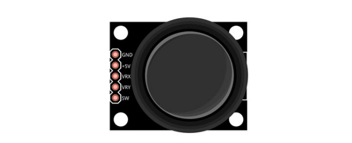
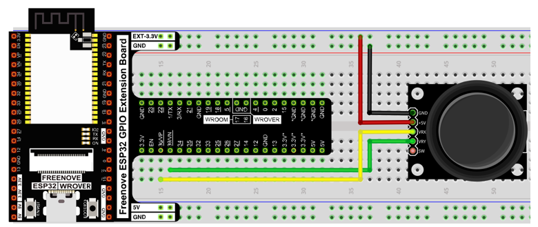
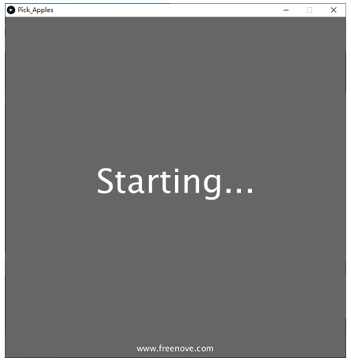
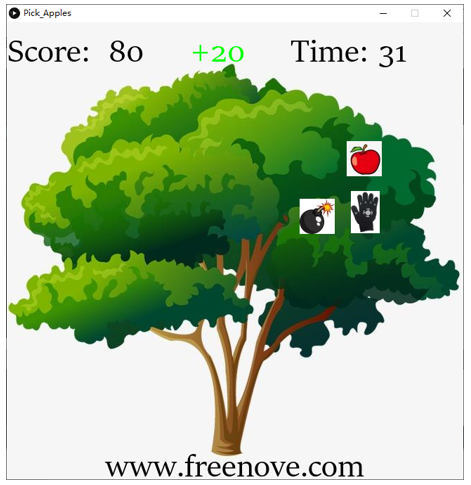
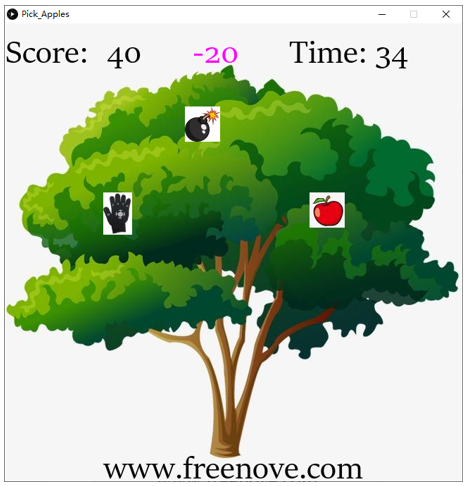
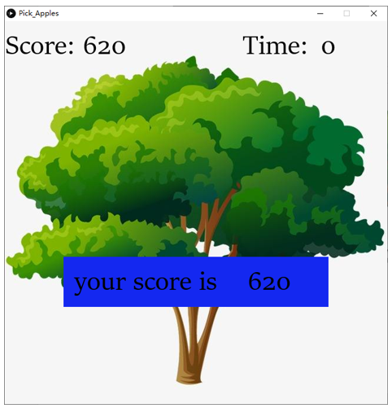

##############################################################################
Chapter Pick Apples
##############################################################################

In this chapter, we prepare pick apples game. You can use the joystick to pick apples. 

Project 4.1 Pick Apples
**************************************

Now, let's use Processing and ESP32 board to achieve the game.

Component List
====================================

.. table::
    :width: 80%
    :align: center
    :class: table-line
    
    +------------------------------------+------------------------+
    | ESP32-WROVER x1                    | GPIO Extension Board x1|
    |                                    |                        |
    | |Chapter01_00|                     | |Chapter01_01|         |
    +------------------------------------+------------------------+
    | Breadboard x1                                               |
    |                                                             |
    | |Chapter01_02|                                              |
    +------------------------------------+------------------------+
    | Joystick x1                        | Jumper M/M x3          |
    |                                    |                        |
    | |Chapter14_00|                     | |Chapter01_05|         |
    +------------------------------------+------------------------+

.. |Chapter01_00| image:: ../_static/imgs/1_LED/Chapter01_00.png
.. |Chapter01_01| image:: ../_static/imgs/1_LED/Chapter01_01.png
.. |Chapter01_02| image:: ../_static/imgs/1_LED/Chapter01_02.png
.. |Chapter07_04| image:: ../_static/imgs/7_Buzzer/Chapter07_04.png   
.. |Chapter01_05| image:: ../_static/imgs/1_LED/Chapter01_05.png

Circuit
==============================

Use Pin36 and Pin39 (A0 and A3) ports to detect the voltage value of two rotary potentiometers inside joystick.

.. list-table:: 
   :width: 80%
   :align: center
   :class: table-line
   
   * -  **Schematic diagram**
   * -  |Chapter04_00|
   * -  **Hardware connection** 
   * -  |Chapter04_01|

Sketch
================================

Sketch Pick Apples
----------------------------------

Use Processing to open Pick_Apples.pde and click Run. If the connection succeeds, the follow will be shown:

You can use the joystick to control the game. When the palm picked the apple, score +20. 

If the palm touches the bomb, the score is -20.

At the same time, you need to pick as many apples as possible before the countdown is over. 

When the game fails, press space bar to restart the game:

