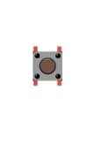

##############################################################################
Chapter Tetris
##############################################################################

In this chapter, we prepare a tetris game for you. You can play the game by pressing the buttons.

Project 6.1 Tetris
************************************

Now, let's use Processing and ESP32 board to achieve the tetris game.

Component list
===============================

+------------------------------------+-------------------------+
| ESP32-WROVER x1                    | GPIO Extension Board x1 |
|                                    |                         |
| |Chapter01_00|                     | |Chapter01_01|          |
+------------------------------------+-------------------------+
| Breadboard x1                                                |
|                                                              |
| |Chapter01_02|                                               |
+-----------------+------------------+-------------------------+
| Jumper M/M x4   | Resistor 10kΩ x4 | Push button x4          |
|                 |                  |                         |
| |Chapter01_05|  | |Chapter02_01|   | |Chapter02_02|          |
+-----------------+------------+-----+-------------------------+

.. |Chapter01_00| image:: ../_static/imgs/1_LED/Chapter01_00.png
.. |Chapter01_01| image:: ../_static/imgs/1_LED/Chapter01_01.png
.. |Chapter01_02| image:: ../_static/imgs/1_LED/Chapter01_02.png
.. |Chapter02_01| image:: ../_static/imgs/2_Button_&_LED/Chapter02_01.png
.. |Chapter01_05| image:: ../_static/imgs/1_LED/Chapter01_05.png 

Circuit
==================================

Use Pin4, Pin5, Pin18, Pin19 port on ESP32 board to control the movement of the block.

.. list-table:: 
   :width: 100%
   :align: center
   
   * -  Schematic diagram
   * -  |Chapter06_00|
   * -  Hardware connection. 
   * -  |Chapter06_01|

.. |Chapter06_00| image:: ../_static/imgs/6_Tetris/Chapter06_00.png

Sketch
============================

Sketch Tetris
---------------------------

Use Processing to open Tetris.pde and click Run. If the connection succeeds, the follow will be shown:

Now you can try using the buttons to control the falling block. Press the space bar to pause the game. 

When the game is over, you can press the space bar to play the game again. Press ESC to exit the game. 

