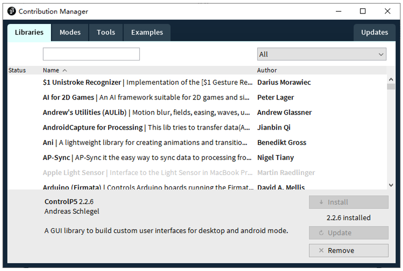

##############################################################################
Preface
##############################################################################

Processing is an easy-to-use, free and open source software for writing graphical programs to run on a computer.

This document will show you how to use Processing to write programs to communicate with the control board. By doing this, we can make virtual instruments, game consoles and other projects.

Processing Software
*************************************

Processing software / Processing Development Environment (PDE) makes it easy to write programs.

Processing software uses Java programming language by default. Do not worry if you don't know Java, because we provide complete code. You can learn Java later if you are interested in it.

First, install Processing software. Visit https://processing.org/, click "Download" to enter the download page.

Select the Mac, Windows, or Linux version, depending on what machine you have.

Installation on each machine is straightforward:

- On Windows, you'll have a .zip file. Double-click it, and drag the folder inside to a location on your hard disk. It could be Program Files or simply the desktop, but the important thing is for the processing folder to be pulled out of that .zip file. Then double-click processing.exe to start.

- The Mac OS X version is also a .zip file. Double-click it and drag the Processing icon to the Applications folder. If you're using someone else's machine and can't modify the Applications folder, just drag the application to the desktop. Then double-click the Processing icon to start.

- The Linux version is a .tar.gz file, which should be familiar to most Linux users. Download the file to your home directory, then open a terminal window, and type: 
 
  **tar xvfz processing-xxxx.tgz** 
  
  (Replace xxxx with the rest of the file's name, which is the version number.) This will create a folder named processing-2.0 or something similar. Then change to that directory:
 
  **cd processing-xxxx**
  
  and run it:
  
  **./processing**

With any luck, the main Processing window will now be visible. Everyone's setup is different, so if the program didn't start, or you're otherwise stuck, visit the troubleshooting page for possible solutions.

You're now running the Processing Development Environment (or PDE). There's not much to it; the large area is the Text Editor, and there's a row of buttons across the top; this is the toolbar. Below the editor is the Message Area, and below that is the Console. The Message Area is used for one line messages, and the Console is used for more technical details.

Install ControlP5
***************************

Open Processing.

Click Add Tool under Tools. 

Select Libraries in the pop-up window.

Input “ControlP5” in the searching box, and then select the option as below. Click “Install” and wait for the installation to finish.

First Use
******************************

In the editor, type the following:

.. code-block:: c 
    
    ellipse(50, 50, 80, 80);

This line of code means "draw an ellipse, with the center 50 pixels over from the left and 50 pixels down from the top, with a width and height of 80 pixels." Click the Run button (the triangle button in the Toolbar).

If you've typed everything correctly, you'll see a circle on your screen.

If you didn't type it correctly, the Message Area will turn red and complain about an error. If this happens, make sure that you've copied the example code exactly: the numbers should be contained within parentheses and have commas between each of them, and the line should end with a semicolon.

You can export this sketch to an application to run it directly without opening the Processing.

To export the sketch to the application, you must first save it.

So far, we have completed the first use. I believe you have felt the joy of it.

Communication protocol
***********************************

We need to write code for control board and Processing to complete the interaction project of them, respectively.

In order to simplify and facilitate the operation, we prepared a SerialDevice class for Processing to communicate with the control board. To use this class, we need to upload the following sketch to the control board:

:red:`Freenove Ultimate Starter Kit for ESP32\C\Processing\SerialDevice\SerialDevice.ino.`
 
This sketch only need to be uploaded once, so the latter projects of this tutorial does not need to upload again.

SerialDevice class and SerialDevice.ino defined the communication protocol between them. The futures include:

- Recognize the control board uploaded SerialDevice.ino and establish connection with it, automatically. No need to view and set the serial number of the control board connected to the computer, even if there are a number of control board, it can be connected automatically.

- If control board uploaded SerialDevice.ino is not connected to computer, the Processing code will not be executed until the connection is done. The Processing sketch does not need to be run again after the connection is done.

- Send data to control board and receive data from it.

Here, Processing sketch code will not be introduced in detail. Interested readers can learn it by yourself.

And as for syntax and standard functions of Processing, you can visit https://processing.org/ and click Reference to view.

Or in the Processing software menu bar, click Help-Reference to view offline documents.

