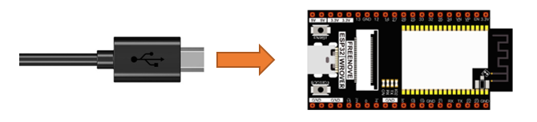
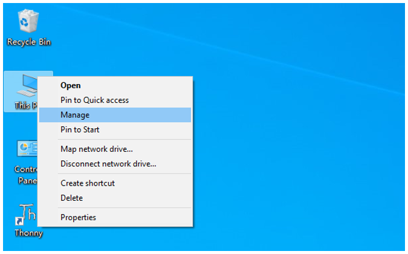

##############################################################################
0. Chapter Ready (Important)
##############################################################################

Before starting building the projects, you need to make some preparation first, which is so crucial that you must not skip.

.. _Thonny:

0.1 Installing Thonny (Important)
**********************************************

Thonny is a free, open-source software platform with compact size, simple interface, simple operation and rich functions, making it a Python IDE for beginners. In this tutorial, we use this IDE to develop ESP32 during the whole process.  

Thonny supports various operating system, including Windows、Mac OS、Linux.

Downloading Thonny
==============================================

Official website of Thonny: https://thonny.org

Open-source code repositories of Thonny: https://github.com/thonny/thonny

Follow the instruction of official website to install Thonny or click the links below to download and install. (Select the appropriate one based on your operating system.)

.. table::
    :width: 80%
    :align: center
    :class: zebra
    
    +------------------+----------------------------------------------------------------------------+
    | Operating System | Download links/methods                                                     |
    +==================+============================================================================+
    | Windows          | https://github.com/thonny/thonny/releases/download/v3.2.7/thonny-3.2.7.exe |
    +------------------+----------------------------------------------------------------------------+
    | Mac OS           | https://github.com/thonny/thonny/releases/download/v3.2.7/thonny-3.2.7.pkg |
    +------------------+----------------------------------------------------------------------------+
    |                  | **The latest version:**                                                    |
    |                  |                                                                            |
    |                  | **Binary bundle for PC (Thonny+Python):**                                  |
    |                  |                                                                            |
    |                  | bash <(wget -O - https://thonny.org/installer-for-linux)                   |
    |                  |                                                                            |
    |                  | |                                                                          |
    |                  |                                                                            |
    |                  | **With pip:**                                                              |
    |                  |                                                                            |
    |                  | pip3 install thonny                                                        |
    |                  |                                                                            |
    | Linux            | |                                                                          |
    |                  |                                                                            |
    |                  | **Distro packages (may not be the latest version):**                       |
    |                  |                                                                            |
    |                  | **Debian, Rasbian, Ubuntu, Mint and others:**                              |
    |                  |                                                                            |
    |                  | sudo apt install thonny                                                    |
    |                  |                                                                            |
    |                  | |                                                                          |
    |                  |                                                                            |
    |                  | **Fedora:**                                                                |
    |                  |                                                                            |
    |                  | sudo dnf install thonny                                                    |
    +------------------+----------------------------------------------------------------------------+

You can also open **"Freenove_Ultimate_Starter_Kit_for_ESP32/Python/Python_Software"**, we have prepared it in advance.

Installing on Windows
====================================

The icon of Thonny after downloading is as below. Double click "thonny-3.2.7.exe". 

If you're not familiar with computer software installation, you can simply keep clicking "Next" until the installation completes.

If you want to change Thonny's installation path, you can click "Browse" to modify it. After selecting installation path, click "OK".

If you do not want to change it, just click "Next".

Check "Create desktop icon" and then it will generate a shortcut on your desktop to facilitate you to open Thonny later.

Click "install" to install the software.

During the installation process, you only need to wait for the installation to complete, and you msut not click "Cancel", otherwise Thonny will fail to be installed.

Once you see the interface as below, Thonny has been installed successfully.

If you've check "Create desktop icon" during the installation process, you can see the below icon on your desktop.

0.2 Basic Configuration of Thonny
**********************************************

Click the desktop icon of Thonny and you can see the interface of it as follows:

Select "View" -> "Files" and "Shell".

.. image:: ../_static/imgs/0_LED/Chapter00_19.png
    :align: center

0.3 Installing CH340 (Important)
***********************************************

ESP32 uses CH340 to download codes. So before using it, we need to install CH340 driver in our computers.

Windows
==================================

Check whether CH340 has been installed
-------------------------------------------------

1.	Connect your computer and ESP32 with a USB cable.

2.	Turn to the main interface of your computer, select "This PC" and right-click to select "Manage".

3.	Click "Device Manager". If your computer has installed CH340, you can see"USB-SERIAL CH340 (COMx)". And you can click :ref:`here <Micropython>` to move to the next step.

Installing CH340
------------------------

1.	First, download CH340 driver, click http://www.wch-ic.com/search?q=CH340&t=downloads to download the appropriate one based on your operating system.

You can also open **"Freenove_Ultimate_Starter_Kit_for_ESP32/CH340"**, we have prepared the installation package.

2.	Open the folder **"Freenove_Ultimate_Starter_Kit_for_ESP32/CH340/Windows/ch341ser"**

3.	Double click "CH341SER.EXE".

4.	Click "INSTALL" and wait for the installation to complete.

5.	Install successfully. Close all interfaces.

6.	When ESP32 is connected to computer, select "This PC", right-click to select "Manage" and click "Device Manager" in the newly pop-up dialog box, and you can see the following interface.

7.	So far, CH340 has been installed successfully. Close all dialog boxes. 

MAC
=============================

First, download CH340 driver, click http://www.wch-ic.com/search?q=CH340&t=downloads to download the appropriate one based on your operating system.

If you would not like to download the installation package, you can open "Freenove_Ultimate_Starter_Kit_for_ESP32/CH340", we have prepared the installation package.

Second, open the folder "Freenove_Ultimate_Starter_Kit_for_ESP32/CH340/MAC/"

Third, click Continue.

Fourth, click Install.

Then, waiting Finsh.

Finally, restart your PC.

If you still haven't installed the CH340 by following the steps above, you can view readme.pdf to install it.

.. image:: ../_static/imgs/0_LED/Chapter00_37.png
    :align: center

.. _Micropython:

0.4 Burning Micropython Firmware (Important)
************************************************

To run Python programs on ESP32, we need to burn a firmware to ESP32 first.

.. _Downloading:

Downloading Micropython Firmware
============================================

Official website of microPython: http://micropython.org/

Webpage listing firmware of microPython for ESP32: https://micropython.org/download/esp32spiram/

Firmware used in this tutorial is **esp32spiram-20220117-v1.18.bin**

This file is also provided in our data folder **"Freenove_Ultimate_Starter_Kit_for_ESP32/Python/Python_Firmware"**.

.. _Burning:

Burning a Micropython Firmware
=====================================

Connect your computer and ESP32 with a USB cable.

Make sure that the driver has been installed successfully and that it can recognize COM port correctly. Open device manager and expand "Ports".

.. image:: ../_static/imgs/0_LED/Chapter00_40.png
    :align: center

.. note::
    
    The port of different people may be different, which is a normal situation.

1.	Open Thonny, click "run" and select "Select interpreter..."

2.	Select "Micropython (ESP32)",select "USB-SERIAL CH340 (COM4)",and then click the long button under "Firmware".

3.	The following dialog box pops up. Select "USB-SERIAL CH340 (COM3)" for "Port" and then click "Browse...". Select the previous prepared microPython firmware " **esp32spiram-20220117-v1.18.bin** ". Check "Erase flash before installing" and click "install" to wait for the prompt of finishing installation.

4.	Wait for the installation to be done.

5.	Close all dialog boxes, turn to main interface and click "STOP". As shown in the illustration below

6.	So far, all the preparations have been made.

0.5 Testing codes (Important)
*************************************

Testing Shell Command
======================================

Enter "print('hello world')" in "Shell" and press Enter.

.. _online:

Running Online
==================================

ESP32 needs to be connected to a computer when it is run online. Users can use Thonny to writer and debug programs.

1.	Open Thonny and click "Open…".

2.	On the newly pop-up window, click "This computer".

In the new dialog box, select " **HelloWorld.py** " in " **Freenove_Ultimate_Starter_Kit_for_ESP32/Python/Python_Codes/00.0_HelloWorld** " folder. 

Click "Run current script" to execute the program and "Hello World" will be printed in "Shell". 

.. note::
    
    When running online, if you press the reset key of ESP32, user's code will not be executed again. If you wish to run the code automatically after resetting the code, please refer to the following :ref:`Running Offline <offline>`.

.. _offline:

Running Offline(Importance)
======================================

After ESP32 is reset, it runs the file boot.py in root directory first and then runs file main.py, and finally, it enters "Shell". Therefore, to make ESP32 execute user's programs after resetting, we need to add a guiding program in boot.py to execute user's code.

1.	Move the program folder " **Freenove_Ultimate_Starter_Kit_for_ESP32/Python/Python_Codes** " to disk(D) in advance with the path of " **D:/Micropython_Codes** ". Open "Thonny"。

2.	Expand "00.1_Boot" in the "Micropython_Codes" in the directory of disk(D), and double-click boot.py, which is provided by us to enable programs in "MicroPython device" to run offline. 

If you want your written programs to run offline, you need to upload boot.py we provided and all your codes to "MicroPython device" and press ESP32's reset key. Here we use programs 00.0 and 00.1 as examples. Select "boot.py", right-click to select "Upload to /".

Similarly, upload "HelloWorld.py" to "MicroPython device".

3.	Press the reset key and in the box of the illustration below, you can see the code is executed.

0.6 Thonny Common Operation
********************************************

Uploading Code to ESP32
=============================================

Each time when ESP32 restarts, if there is a "boot.py" in the root directory, it will execute this code first. 

Select "Blink.py" in "01.1_Blink", right-click your mouse and select "Upload to /" to upload code to ESP32's root directory.

Downloading Code to Computer
=========================================

Select "boot.py" in "MicroPython device", right-click to select "Download to ..." to download the code to your computer.

Deleting Files from ESP32's Root Directory 
===============================================

Select "boot.py" in "MicroPython device", right-click it and select "Delete" to delete "boot.py" from ESP32's root directory.

Deleting Files from your Computer Directory
=================================================

Select "boot.py" in "00.1_Boot", right-click it and select "Move to Recycle Bin" to delete it from "00.1_Boot".

Creating and Saving the code 
==========================================

Click "File" -> "New" to create and write codes.

Enter codes in the newly opened file. Here we use codes of "01.1_Blink.py" as an example.

Click "Save" on the menu bar. You can save the codes either to your computer or to ESP32-WROVER.

Select "MicroPython device", enter "main.py" in the newly pop-up window and click "OK".

You can see that codes have been uploaded to ESP32-WROVER.

Disconnect and reconnect USB cable, and you can see that LED is ON for one second and then OFF for one second, which repeats in an endless loop.

0.7 Note
*******************************************

Though there are many pins available on ESP32, some of them have been connected to peripheral equipment, so we should avoid using such pins to prevent pin conflicts. For example, when downloading programs, make sure that the pin state of Strapping Pin, when resetting, is consistent with the default level; do NOT use Flash Pin; Do NOT use Cam Pin when using Camera function.

Strapping Pin
===========================================

The state of Strapping Pin can affect the functions of ESP32 after it is reset, as shown in the table below.

If you have any difficulties or questions with this tutorial or toolkit, feel free to ask for our quick and free technical support through support@freenove.com at any time.

or check: https://www.espressif.com/sites/default/files/documentation/esp32-wrover_datasheet_en.pdf

Flash Pin
==============================================

GPIO6-11 has been used to connect the integrated SPI flash on the module, and is used when GPIO 0 is power on and at high level. Flash is related to the operation of the whole chip, so the external pin GPIO6-11 cannot be used as an experimental pin for external circuits, otherwise it may cause errors in the operation of the program.

GPIO16-17 has been used to connect the integrated PSRAM on the module. 

Because of external pull-up, MTDI pin is not suggested to be used as a touch sensor. For details, please refer to Peripheral Interface and Sensor chapter in ":ref:`ESP32_Data_Sheet <ESP32_Wrover>`".

For more relevant information, please click: https://www.espressif.com/sites/default/files/documentation/esp32-wrover_datasheet_en.pdf.

Cam Pin
=============================================

When using the cam camera of our ESP32-WROVER, please check the pins of it. Pins with underlined numbers are used by the cam camera function, if you want to use other functions besides it, please avoid using them.

.. list-table:: 
   :width: 80%
   :align: center
   :header-rows: 1
   :class: zebra
   
   * -  CAM_Pin
     -  GPIO_pin

   * -  I2C_SDA
     -  GPIO26 

   * -  I2C_SCL
     -  GPIO27

   * -  CSI_VYSNC
     -  GPIO25

   * -  CSI_HREF
     -  GPIO23

   * -  CSI_Y9
     -  GPIO35

   * -  XCLK
     -  GPIO21

   * -  CSI_Y8 
     -  GPIO34

   * -  CSI_Y7
     -  GPIO39

   * -  CSI_PCLK
     -  GPIO22

   * -  CSI_Y6
     -  GPIO36

   * -  CSI_Y2
     -  GPIO4

   * -  CSI_Y5
     -  GPIO19

   * -  CSI_Y3
     -  GPIO5

   * -  CSI_Y4
     -  GPIO18

If you have any questions about the information of GPIO, you can click :ref:`here <ESP32_Wrover>` to go back to ESP32-WROVER to view specific information about GPIO.

Or check: https://www.espressif.com/sites/default/files/documentation/esp32-wrover_datasheet_en.pdf.