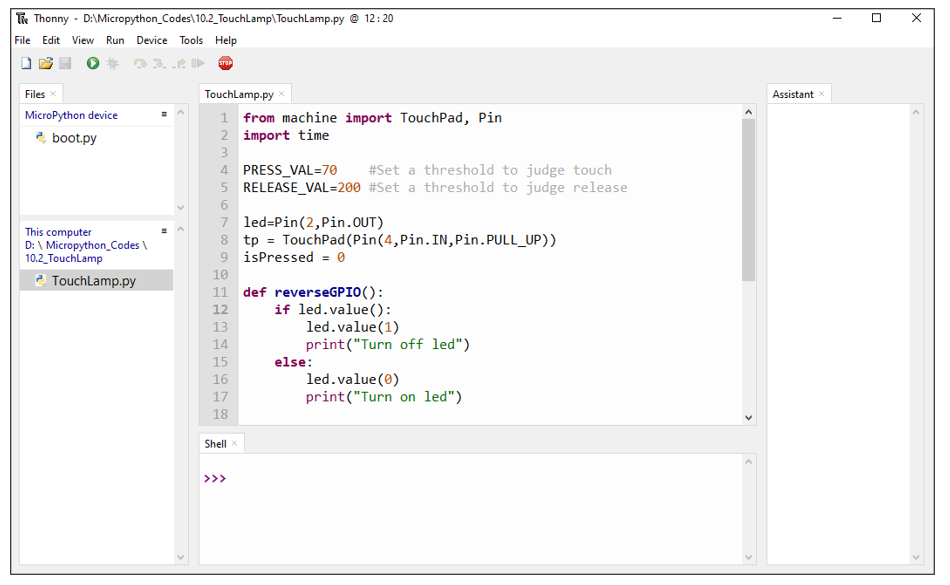

##############################################################################
Chapter 10 Touch Sensor
##############################################################################

ESP32 offers up to 10 capacitive touch GPIO, and as you can see from the previous section, mechanical switches are prone to jitter that must be eliminated when used, which is not the case with ESP32's built-in touch sensor. In addition, on the service life, the touch switch also has advantages that mechanical switch is completely incomparable.

Project 10.1 Read Touch Sensor
*********************************************

This project reads the value of the touch sensor and prints it out.

Component List
======================================

.. table::
    :width: 80%
    :align: center
    :class: table-line
    
    +------------------------------------+-------------------------+
    | ESP32-WROVER x1                    | GPIO Extension Board x1 |
    |                                    |                         |
    | |Chapter01_00|                     | |Chapter01_01|          |
    +------------------------------------+-------------------------+
    | Breadboard x1                                                |
    |                                                              |
    | |Chapter01_02|                                               |
    +--------------------------------------------------------------+
    | Jumper M/M x2                                                |
    |                                                              |
    | |Chapter01_05|                                               |
    +--------------------------------------------------------------+
  
.. |Chapter01_00| image:: ../_static/imgs/1_LED/Chapter01_00.png
.. |Chapter01_01| image:: ../_static/imgs/1_LED/Chapter01_01.png
.. |Chapter01_02| image:: ../_static/imgs/1_LED/Chapter01_02.png
.. |Chapter01_05| image:: ../_static/imgs/1_LED/Chapter01_05.png

Related knowledge
========================================

Touch sensor
------------------------------------------

ESP32's touch sensor supports up to 7 GPIO channels as capacitive touch pins. Each pin can be used separately as an independent touch switch or be combined to produce multiple touch points. The following table is a list of available touch pins on ESP32.

.. table::
    :align: center
    :class: zebra text-center

    +-------------------+-------------------+
    | Functions of pins | ESP32 GPIO number |
    +===================+===================+
    | GPIO4             | GPIO4             |
    +-------------------+-------------------+
    | MTDO              | GPIO15            |
    +-------------------+-------------------+
    | MTCK              | GPIO13            |
    +-------------------+-------------------+
    | MTDI              | GPIO12            |
    +-------------------+-------------------+
    | MTMS              | GPIO14            |
    +-------------------+-------------------+
    | 32K_XN            | GPIO33            |
    +-------------------+-------------------+
    | 32K_XP            | GPIO32            |
    +-------------------+-------------------+

The pin numbers are shown in the figure above. When you need to use the TouchPad, you only need to call the TouchPad function to initialize the corresponding pins. 

The electronic signals generated with the touch are analog, which are converted by the internal ADC. You may have found that all touch pins have featured with ADC.

The way to connect the hardware is as follows:

Circuit
=============================================

.. list-table:: 
   :width: 80%
   :align: center
   :class: table-line
   
   * -  **Schematic diagram**
   * -  |Chapter10_01|
   * -  **Hardware connection**
       
        :combo:`red font-bolder:If you need any support, please contact us via:` support@freenove.com
   * -  |Chapter10_02|

.. |Chapter10_01| image:: ../_static/imgs/10_Touch_Sensor/Chapter10_01.png    
.. |Chapter10_02| image:: ../_static/imgs/10_Touch_Sensor/Chapter10_02.png    

Code
============================

Move the program folder **"Freenove_Ultimate_Starter_Kit_for_ESP32/Python/Python_Codes"** to disk(D) in advance with the path of **"D:/Micropython_Codes"**.

Open "Thonny", click "This computer" **->** "D:" **->** "Micropython_Codes" **->** "10.1_Read_Touch_Sensor" and double click "Read_Touch_Sensor.py".

10.1_Read_Touch_Sensor
-------------------------------

Click "Run current script", touch the jumper wire with your finger and observe the messages printed in "Shell".

Messages printed at "Shell": 

Reference
---------------------------------

.. py:function:: Class TouchPad

    Before each use of **TouchPad** module, please add the statement " **from machine import TouchPad** "to the top of the python file.
    
    **TouchPad(pin):** Initialize the TouchPad object and associate it with ESP32 pins.
    
    **pin:** Pin(4)、Pin(15)、Pin(13)、Pin(12)、Pin(14)、Pin(32)、Pin(33)
    
    **TouchPad.read():** Read the capacitance of touchpad. If your fingers touch TouchPad pins, the capacitance decreases; Otherwise, it will not change.

Project 10.2 Touch Lamp
*****************************************

In this project, we will use ESP32's touch sensor to create a touch switch lamp.

Component List
==========================================

.. table::
    :width: 80%
    :align: center
    :class: table-line
    
    +------------------------------------+------------------------+
    | ESP32-WROVER x1                    | GPIO Extension Board x1|
    |                                    |                        |
    | |Chapter01_00|                     | |Chapter01_01|         |
    +------------------------------------+------------------------+
    | Breadboard x1                                               |
    |                                                             |
    | |Chapter01_02|                                              |
    +-----------------+------------------+------------------------+
    | LED x1          | Resistor 220Ω x1 | Jumper M/M x3          |
    |                 |                  |                        |
    | |Chapter01_03|  | |Chapter01_04|   | |Chapter01_05|         |
    +-----------------+------------------+------------------------+

.. |Chapter01_03| image:: ../_static/imgs/1_LED/Chapter01_03.png 
.. |Chapter01_04| image:: ../_static/imgs/1_LED/Chapter01_04.png    

Circuit
=========================================

.. list-table:: 
   :width: 80%
   :align: center
   :class: table-line
   
   * -  **Schematic diagram**
   * -  |Chapter10_06|
   * -  **Hardware connection** 
   * -  :combo:`red font-bolder:If you need any support, please contact us via:` support@freenove.com
        
        |Chapter10_07|

.. |Chapter10_06| image:: ../_static/imgs/10_Touch_Sensor/Chapter10_06.png    

Code
=========================================

Move the program folder "**Freenove_Ultimate_Starter_Kit_for_ESP32/Python/Python_Codes**" to disk(D) in advance with the path of "**D:/Micropython_Codes**".

Open "Thonny, click "This computer" **->** "D:" **->** "Micropython_Codes" **->** "10.2_TouchLamp"and double click "TouchLamp.py". 

10.2_TouchLamp
------------------------------------------

Click "Run current script" and then touch the jumper wire with your finger. The state of LED will change with each touch and the detection state of the touch sensor will be printed in the "Shell"

LED displays as follows:

.. image:: ../_static/imgs/10_Touch_Sensor/Chapter10_16.png
    :align: center

The following is the program code:

.. literalinclude:: ../../../freenove_Kit/Python/Python_Codes/10.2_TouchLamp/TouchLamp.py
    :linenos:
    :language: python
    :lines: 1-30
    :dedent:

Import Pin and TouchPad modules.

.. literalinclude:: ../../../freenove_Kit/Python/Python_Codes/10.2_TouchLamp/TouchLamp.py
    :linenos:
    :language: python
    :lines: 1-2
    :dedent:

The closer the return value of the function read() is to 0, the more obviously the touch action is detected. As this is not a fixed value, a threshold value needs to be defined. When the value of the sensor is less than the threshold, it is considered a valid touch action. Similarly, define a threshold value for the released state, and the value between the sensor value and the threshold is regarded as an invalid interference value.

.. literalinclude:: ../../../freenove_Kit/Python/Python_Codes/10.2_TouchLamp/TouchLamp.py
    :linenos:
    :language: python
    :lines: 4-5
    :dedent:

First, decide whether the touch is detected. If yes, print some messages, reverse the state of LED and set the flag bit isProcessed to 1 to avoid repeatedly executing the program after a touch is detected.

.. literalinclude:: ../../../freenove_Kit/Python/Python_Codes/10.2_TouchLamp/TouchLamp.py
    :linenos:
    :language: python
    :lines: 20-25
    :dedent:

And then decide whether the touch key is released. If yes, print some messages, and set isProcessed to 0 to avoid repeatedly executing the program after a touch is released and to prepare for the next touch detector.

.. literalinclude:: ../../../freenove_Kit/Python/Python_Codes/10.2_TouchLamp/TouchLamp.py
    :linenos:
    :language: python
    :lines: 26-30
    :dedent:

Customize a function that reverses the output level of the LED each time it is called.

.. literalinclude:: ../../../freenove_Kit/Python/Python_Codes/10.2_TouchLamp/TouchLamp.py
    :linenos:
    :language: python
    :lines: 11-17
    :dedent: