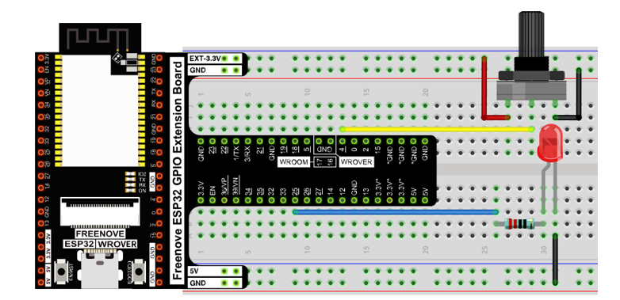

##############################################################################
Chapter Potentiometer & LED
##############################################################################

We have learned how to use ADC and DAC before. When using DAC output analog to drive LED, we found that, when the output voltage is less than led turn-on voltage, the LED does not light; when the output analog voltage is greater than the LED voltage, the LED lights. This leads to a certain degree of waste of resources. Therefore, in the control of LED brightness, we should choose a more reasonable way of PWM control. In this chapter, we learn to control the brightness of LED through a potentiometer.

Project Soft Light
*********************************************

In this project, we will make a soft light. We will use an ADC Module to read ADC values of a potentiometer and map it to duty cycle of the PWM used to control the brightness of a LED. Then you can change the brightness of a LED by adjusting the potentiometer.

Component List
==============================================

.. table::
    :width: 80%
    :align: center
    :class: table-line
    
    +------------------------------------+----------------------------------------------------+
    | ESP32-WROVER x1                    | GPIO Extension Board x1                            |
    |                                    |                                                    |
    | |Chapter01_00|                     | |Chapter01_01|                                     |
    +------------------------------------+----------------------------------------------------+
    | Breadboard x1                                                                           |
    |                                                                                         |
    | |Chapter01_02|                                                                          |
    +-----------------+------------------+------------------------+---------------------------+
    | LED x1          | Resistor 220Ω x1 | Jumper M/M x5          | Rotary potentiometer x1   |
    |                 |                  |                        |                           |
    | |Chapter01_03|  | |Chapter01_04|   | |Chapter01_05|         | |Chapter09_00|            |
    +-----------------+------------------+------------------------+---------------------------+

.. |Chapter01_00| image:: ../_static/imgs/1_LED/Chapter01_00.png
.. |Chapter01_01| image:: ../_static/imgs/1_LED/Chapter01_01.png
.. |Chapter01_02| image:: ../_static/imgs/1_LED/Chapter01_02.png
.. |Chapter01_03| image:: ../_static/imgs/1_LED/Chapter01_03.png 
.. |Chapter01_04| image:: ../_static/imgs/1_LED/Chapter01_04.png    
.. |Chapter01_05| image:: ../_static/imgs/1_LED/Chapter01_05.png
.. |Chapter09_00| image:: ../_static/imgs/9_AD_DA_Converter/Chapter09_00.png

Circuit
=========================================

.. list-table:: 
   :width: 100%
   :header-rows: 1 
   :align: center
   
   * -  **Schematic diagram**
   * -  |Chapter11_00|
   * -  **Hardware connection** 
   * -  :combo:`red font-bolder:If you need any support, please contact us via:` support@freenove.com
        
        |Chapter11_01|

.. |Chapter11_00| image:: ../_static/imgs/11_Potentiometer_&_LED/Chapter11_00.png    

Code
======================================

Move the program folder **"Freenove_Ultimate_Starter_Kit_for_ESP32/Python/Python_Codes"** to disk(D) in advance with the path of **"D:/Micropython_Codes"**.

Open "Thonny", click  "This computer" **->** "D:" **->** "Micropython_Codes" **->** "11.1_Soft_LED" and double click "Soft_LED.py". 

Soft_LED
-----------------------------------------

Click "Run current script". Rotate the handle of potentiometer and the brightness of LED will change correspondingly.

The following is the code:

.. literalinclude:: ../../../freenove_Kit/Python/Python_Codes/11.1_Soft_LED/Soft_LED.py
    :linenos:
    :language: python
    :dedent:

In the code, read the ADC value of potentiometer and map it to the duty cycle of PWM to control LED brightness. 
