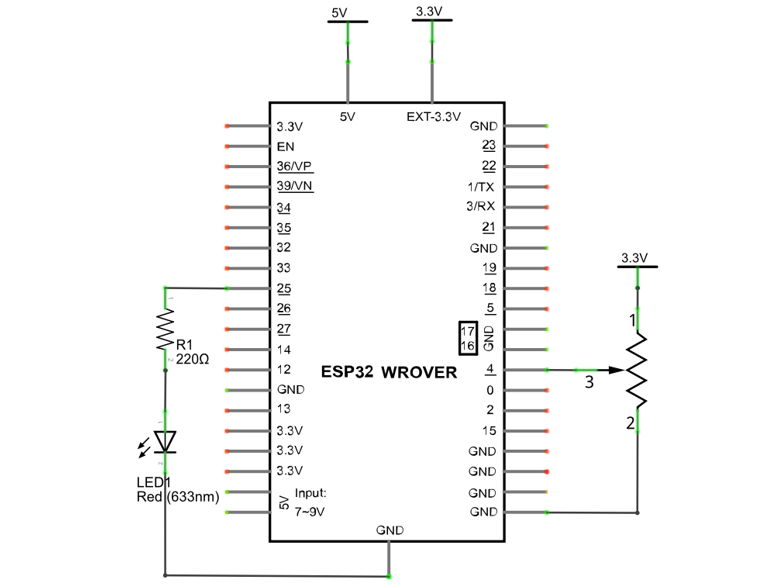
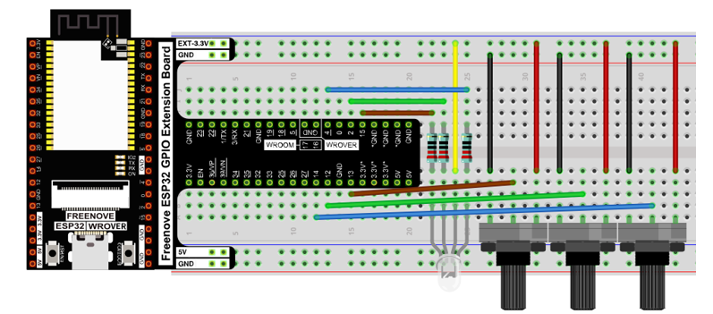
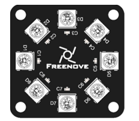

##############################################################################
Chapter Potentiometer & LED
##############################################################################

We have learned how to use ADC and DAC before. When using DAC output analog to drive LED, we found that, when the output voltage is less than led turn-on voltage, the LED does not light; when the output analog voltage is greater than the LED voltage, the LED lights. This leads to a certain degree of waste of resources. Therefore, in the control of LED brightness, we should choose a more reasonable way of PWM control. In this chapter, we learn to control the brightness of LED through a potentiometer.

Project Soft Light
*********************************************

In this project, we will make a soft light. We will use an ADC Module to read ADC values of a potentiometer and map it to duty cycle of the PWM used to control the brightness of a LED. Then you can change the brightness of a LED by adjusting the potentiometer.

Component List
==============================================

+------------------------------------+----------------------------------------------------+
| ESP32-WROVER x1                    | GPIO Extension Board x1                            |
|                                    |                                                    |
| |Chapter01_00|                     | |Chapter01_01|                                     |
+------------------------------------+----------------------------------------------------+
| Breadboard x1                                                                           |
|                                                                                         |
| |Chapter01_02|                                                                          |
+-----------------+------------------+------------------------+---------------------------+
| LED x1          | Resistor 220Ω x1 | Jumper M/M x5          | Rotary potentiometer x1   |
|                 |                  |                        |                           |
| |Chapter01_03|  | |Chapter01_04|   | |Chapter01_05|         | |Chapter09_00|            |
+-----------------+------------------+------------------------+---------------------------+

.. |Chapter01_00| image:: ../_static/imgs/1_LED/Chapter01_00.png
.. |Chapter01_01| image:: ../_static/imgs/1_LED/Chapter01_01.png
.. |Chapter01_02| image:: ../_static/imgs/1_LED/Chapter01_02.png
.. |Chapter01_03| image:: ../_static/imgs/1_LED/Chapter01_03.png 
.. |Chapter01_04| image:: ../_static/imgs/1_LED/Chapter01_04.png    
.. |Chapter01_05| image:: ../_static/imgs/1_LED/Chapter01_05.png
.. |Chapter09_00| image:: ../_static/imgs/9_AD_DA_Converter/Chapter09_00.png

Circuit
=========================================

.. list-table:: 
   :width: 100%
   :header-rows: 1 
   :align: center
   
   * -  Schematic diagram
   * -  |Chapter11_00|
   * -  Hardware connection. 
       
        :red:`If you need any support, please contact us via:` support@freenove.com
   * -  |Chapter11_01|

.. |Chapter11_01| image:: ../_static/imgs/11_Potentiometer_&_LED/Chapter11_01.png    

Code
======================================

Move the program folder "Freenove_Ultimate_Starter_Kit_for_ESP32/Python/Python_Codes" to disk(D) in advance with the path of "D:/Micropython_Codes".

Open "Thonny", click  "This computer"  ->  "D:"  ->  "Micropython_Codes"  ->  "11.1_Soft_LED" and double click "Soft_LED.py". 

Soft_LED
-----------------------------------------

.. image:: ../_static/imgs/11_Potentiometer_&_LED/Chapter11_11.png
    :align: center

Click "Run current script". Rotate the handle of potentiometer and the brightness of LED will change correspondingly.

The following is the code:

.. literalinclude:: ../../../freenove_Kit/Python/Python_Codes/11.1_Soft_LED/Soft_LED.py
    :language: python
    :dedent:

In the code, read the ADC value of potentiometer and map it to the duty cycle of PWM to control LED brightness. 

Project Soft Colorful Light 
*****************************************

In this project, 3 potentiometers are used to control the RGB LED and in principle it is the same as the Soft Light project. Namely, read the voltage value of the potentiometer and then convert it to PWM used to control LED brightness. Difference is that the original project only controlled one LED, but this project required (3) RGB LEDs.

+------------------------------------+----------------------------------------------------+
| ESP32-WROVER x1                    | GPIO Extension Board x1                            |
|                                    |                                                    |
| |Chapter01_00|                     | |Chapter01_01|                                     |
+------------------------------------+----------------------------------------------------+
| Breadboard x1                                                                           |
|                                                                                         |
| |Chapter01_02|                                                                          |
+-----------------+------------------+------------------------+---------------------------+
| RGBLED x1       | Resistor 220Ω x3 | Jumper M/M x13         | Rotary potentiometer x3   |
|                 |                  |                        |                           |
| |Chapter11_03|  | |Chapter01_04|   | |Chapter01_05|         | |Chapter09_00|            |
+-----------------+------------------+------------------------+---------------------------+

.. |Chapter11_03| image:: ../_static/imgs/11_Potentiometer_&_LED/Chapter11_03.png

Circuit
=============================================

.. list-table:: 
   :width: 100%
   :header-rows: 1 
   :align: center
   
   * -  Schematic diagram
   * -  |Chapter11_04|
   * -  Hardware connection. 
       
        :red:`If you need any support, please contact us via:` support@freenove.com
   * -  |Chapter11_05|

.. |Chapter11_04| image:: ../_static/imgs/11_Potentiometer_&_LED/Chapter11_04.png    

Code
============================================

Open "Thonny", click "This computer"  ->  "D:"  ->  "Micropython_Codes"  ->  "11.2_Soft_Colorful_Light" and double click "Soft_Colorful_Light.py". 

Soft_Colorful_Light
------------------------------------------

Click "Run current script" and control the change of RGBLED color by rotating the handles of three rotary potentiometers.

The following is the program code:

.. literalinclude:: ../../../freenove_Kit/Python/Python_Codes/11.2_Soft_Colorful_Light/Soft_Colorful_Light.py
    :language: python
    :dedent:

In the code, read the ADC value of 3 potentiometers and map it into PWM duty cycle to control the control 3 LEDs with different color of RGBLED, respectively.

Project Soft Rainbow Light
********************************************

In this project, we use potentiometer to control Freenove 8 RGB LED Module.

Component List
=====================================

+------------------------------------+----------------------------------------------------+
| ESP32-WROVER x1                    | GPIO Extension Board x1                            |
|                                    |                                                    |
| |Chapter01_00|                     | |Chapter01_01|                                     |
+------------------------------------+----------------------------------------------------+
| Breadboard x1                                                                           |
|                                                                                         |
| |Chapter01_02|                                                                          |
+------------------------------------+----------------------------------------------------+
| Freenove 8 RGB LED Module x1       | Jumper F/M x3 Jumper M/M x3                        |
|                                    |                                                    |
| |Chapter11_08|                     |  |Chapter11_07|                                    |
+------------------------------------+----------------------------------------------------+

.. |Chapter11_07| image:: ../_static/imgs/11_Potentiometer_&_LED/Chapter11_07.png

Code
=====================================

Open "Thonny", click "This computer"  ->  "D:"  ->  "Micropython_Codes"  ->  "11.3_Soft_Rainbow_Light" and double click "Soft_Rainbow_Light.py". 

11.3_Soft_Rainbow_Light
--------------------------------------

Click "Run current script". Rotate the handle of potentiometer and the color of the lights will change.

:red:`If you have any concerns, please contact us via:` support@freenove.com

The following is the program code:

.. literalinclude:: ../../../freenove_Kit/Python/Python_Codes/11.3_Soft_Rainbow_Light/Soft_Rainbow_Light.py
    :language: python
    :dedent:

The logic of the code is basically the same as the previous project :ref:`Rainbow Light <Rainbow_Light>`. The difference is that in this code, the starting point of the color is controlled by the potentiometer.