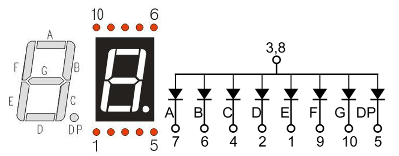
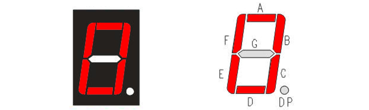
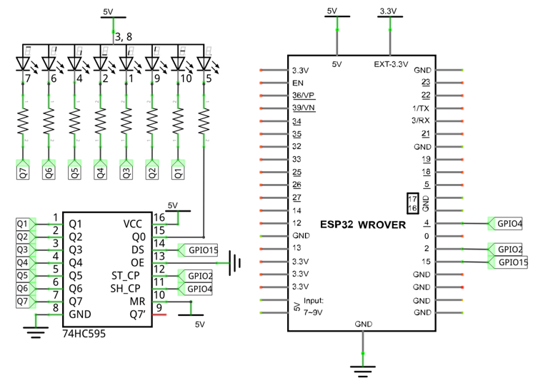
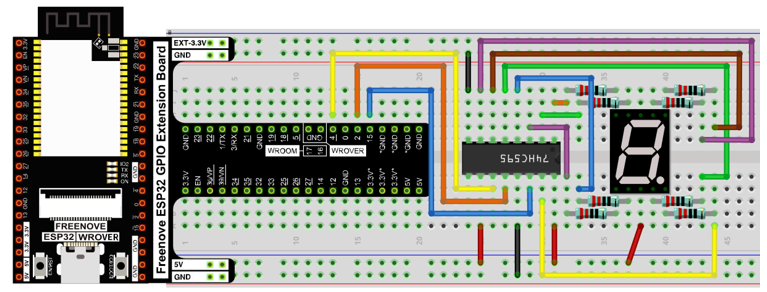
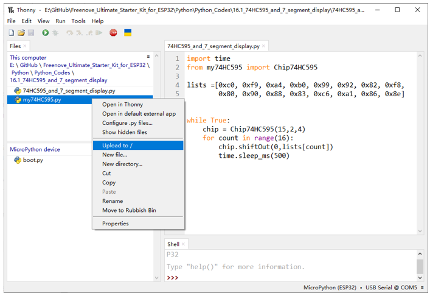
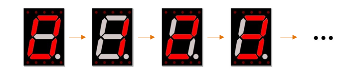

##############################################################################
Chapter 74HC595 & 7-Segment Display
##############################################################################

In this chapter, we will introduce the 7-Segment Display.

Project 7-Segment Display.
********************************************

We will use 74HC595 to control 7-segment display and make it display hexadecimal character "0-F".

Component List
==============================================

.. table:: 
    :align: center
    :width: 80%
    :class: table-line

    +------------------------------------+----------------------------------------------------+
    | ESP32-WROVER x1                    | GPIO Extension Board x1                            |
    |                                    |                                                    |
    | |Chapter01_00|                     | |Chapter01_01|                                     |
    +------------------------------------+----------------------------------------------------+
    | Breadboard x1                                                                           |
    |                                                                                         |
    | |Chapter01_02|                                                                          |
    +-----------------+------------------+------------------------+---------------------------+
    | 74HC595         | Resistor 220Ω x8 | Jumper M/M x15         | 7-segment display x1      |
    |                 |                  |                        |                           |
    | |Chapter15_00|  | |Chapter01_04|   | |Chapter01_05|         | |Chapter16_00|            |
    +-----------------+------------------+------------------------+---------------------------+

.. |Chapter01_00| image:: ../_static/imgs/1_LED/Chapter01_00.png
.. |Chapter01_01| image:: ../_static/imgs/1_LED/Chapter01_01.png
.. |Chapter01_02| image:: ../_static/imgs/1_LED/Chapter01_02.png
.. |Chapter15_00| image:: ../_static/imgs/15_74HC595_&_LED_Bar_Graph/Chapter15_00.png 
.. |Chapter01_04| image:: ../_static/imgs/1_LED/Chapter01_04.png    
.. |Chapter01_05| image:: ../_static/imgs/1_LED/Chapter01_05.png
.. |Chapter16_00| image:: ../_static/imgs/16_74HC595_&_7-Segment_Display/Chapter16_00.png

Component knowledge
=================================

7-segment display
-------------------------------

A 7-segment display is a digital electronic display device. There is a figure "8" and a decimal point represented, which consists of 8 LEDs. The LEDs have a common anode and individual cathodes. Its internal structure and pin designation diagram is shown below:

As we can see in the above circuit diagram, we can control the state of each LED separately. Also, by combining LEDs with different states of ON and OFF, we can display different characters (Numbers and Letters). For example, to display a "0": we need to turn ON LED segments A, B, C, D, E and F, and turn OFF LED segments G and DP.

In this project, we will use a 7-Segment Display with a common anode. Therefore, when there is an input low level to a LED segment the LED will turn ON. Defining segment "A" as the lowest level and segment "DP" as the highest level, from high to low would look like this: "DP", "G", "F", "E", "D", "C", "B", "A". Character "0" corresponds to the code: 1100 0000b=0xc0.

For detailed code values, please refer to the following table (common anode). 

.. table::
    :align: center
    :class: zebra
    
    +------+-----+-----+-----+-----+-----+-----+-----+-----+------+-----------+
    | CHAR | DP  |  G  |  F  |  E  |  D  |  C  |  B  |  A  | Hex  |   ASCII   |
    +======+=====+=====+=====+=====+=====+=====+=====+=====+======+===========+
    | 0    | 1   | 1   | 0   | 0   | 0   | 0   | 0   | 0   | 0xc0 | 1100 0000 |
    +------+-----+-----+-----+-----+-----+-----+-----+-----+------+-----------+
    | 1    | 1   | 1   | 1   | 1   | 1   | 0   | 0   | 1   | 0xf9 | 1111 1001 |
    +------+-----+-----+-----+-----+-----+-----+-----+-----+------+-----------+
    | 2    | 1   | 0   | 1   | 0   | 0   | 1   | 0   | 0   | 0xa4 | 1010 0100 |
    +------+-----+-----+-----+-----+-----+-----+-----+-----+------+-----------+
    | 3    | 1   | 0   | 1   | 1   | 0   | 0   | 0   | 0   | 0xb0 | 1011 0000 |
    +------+-----+-----+-----+-----+-----+-----+-----+-----+------+-----------+
    | 4    | 1   | 0   | 0   | 1   | 1   | 0   | 0   | 1   | 0x99 | 1001 1001 |
    +------+-----+-----+-----+-----+-----+-----+-----+-----+------+-----------+
    | 5    | 1   | 0   | 0   | 1   | 0   | 0   | 1   | 0   | 0x92 | 1001 0010 |
    +------+-----+-----+-----+-----+-----+-----+-----+-----+------+-----------+
    | 6    | 1   | 0   | 0   | 0   | 0   | 0   | 1   | 0   | 0x82 | 1000 0010 |
    +------+-----+-----+-----+-----+-----+-----+-----+-----+------+-----------+
    | 7    | 1   | 1   | 1   | 1   | 1   | 0   | 0   | 0   | 0xf8 | 1111 1000 |
    +------+-----+-----+-----+-----+-----+-----+-----+-----+------+-----------+
    | 8    | 1   | 0   | 0   | 0   | 0   | 0   | 0   | 0   | 0x80 | 1000 0000 |
    +------+-----+-----+-----+-----+-----+-----+-----+-----+------+-----------+
    | 9    | 1   | 0   | 0   | 1   | 0   | 0   | 0   | 0   | 0x90 | 1001 0000 |
    +------+-----+-----+-----+-----+-----+-----+-----+-----+------+-----------+
    | A    | 1   | 0   | 0   | 0   | 1   | 0   | 0   | 0   | 0x88 | 1000 1000 |
    +------+-----+-----+-----+-----+-----+-----+-----+-----+------+-----------+
    | B    | 1   | 0   | 0   | 0   | 0   | 0   | 1   | 1   | 0x83 | 1000 0011 |
    +------+-----+-----+-----+-----+-----+-----+-----+-----+------+-----------+
    | C    | 1   | 1   | 0   | 0   | 0   | 1   | 1   | 0   | 0xc6 | 1100 0110 |
    +------+-----+-----+-----+-----+-----+-----+-----+-----+------+-----------+
    | D    | 1   | 0   | 1   | 0   | 0   | 0   | 0   | 1   | 0xa1 | 1010 0001 |
    +------+-----+-----+-----+-----+-----+-----+-----+-----+------+-----------+
    | E    | 1   | 0   | 0   | 0   | 0   | 1   | 1   | 0   | 0x86 | 1000 0110 |
    +------+-----+-----+-----+-----+-----+-----+-----+-----+------+-----------+
    | F    | 1   | 0   | 0   | 0   | 1   | 1   | 1   | 0   | 0x8e | 1000 1110 |
    +------+-----+-----+-----+-----+-----+-----+-----+-----+------+-----------+

Circuit
=========================================

.. list-table:: 
   :width: 80%
   :align: center
   :class: table-line
   
   * -  **Schematic diagram**
   * -  |Chapter16_03|
   * -  **Hardware connection** 
   * -  :combo:`red font-bolder:If you need any support, please contact us via:` support@freenove.com
        
        |Chapter16_04|

Code
===========================================

In this section, the 74HC595 is used in the same way as in the previous section, but with different values transferred. We can learn how to master the digital display by sending the code value of "0" - "F".

Move the program folder "Freenove_Ultimate_Starter_Kit_for_ESP32/Python/Python_Codes" to disk(D) in advance with the path of "D:/Micropython_Codes".

Open "Thonny", click "This computer" **->** "D:" **->** "Micropython_Codes" **->** "16.1_74HC595_and_7_segment_display". 

Select "my74HC595.py", right click your mouse to select "Upload to /", wait for "my74HC595.py" to be uploaded to ESP32-WROVER and then double click"74HC595_and_7_segment_display.py". 

74HC595_and_7_segment_display
----------------------------------------------

Click "Run current script", and you'll see a 1-bit, 7-segment display displaying 0-f in a loop.

The following is the program code:

.. literalinclude:: ../../../freenove_Kit/Python/Python_Codes/16.1_74HC595_and_7_segment_display/74HC595_and_7_segment_display.py
    :linenos:
    :language: python
    :dedent:

Import time and my74HC595 modules.

.. literalinclude:: ../../../freenove_Kit/Python/Python_Codes/16.1_74HC595_and_7_segment_display/74HC595_and_7_segment_display.py
    :linenos:
    :language: python
    :lines: 1-2
    :dedent:

Put the encoding "0" - "F" into the list.

.. literalinclude:: ../../../freenove_Kit/Python/Python_Codes/16.1_74HC595_and_7_segment_display/74HC595_and_7_segment_display.py
    :linenos:
    :language: python
    :lines: 4-5
    :dedent:

Define an object, whose pins applys default configuration, to drive 74HC595. 

.. literalinclude:: ../../../freenove_Kit/Python/Python_Codes/16.1_74HC595_and_7_segment_display/74HC595_and_7_segment_display.py
    :linenos:
    :language: python
    :lines: 9-9
    :dedent:

Send data of digital tube to 74HC595 chip.

.. literalinclude:: ../../../freenove_Kit/Python/Python_Codes/16.1_74HC595_and_7_segment_display/74HC595_and_7_segment_display.py
    :linenos:
    :language: python
    :lines: 11-11
    :dedent:

.. include:: 16_2_74HC595_&_7-Segment_Display.rst