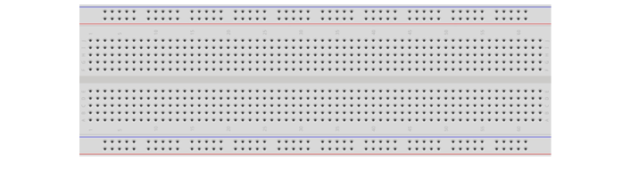
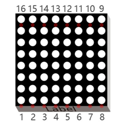
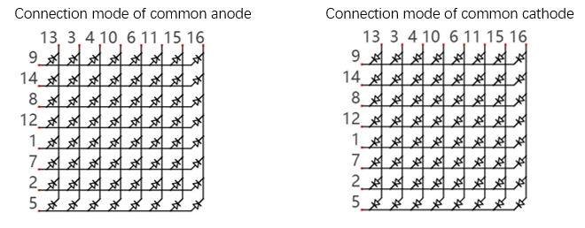
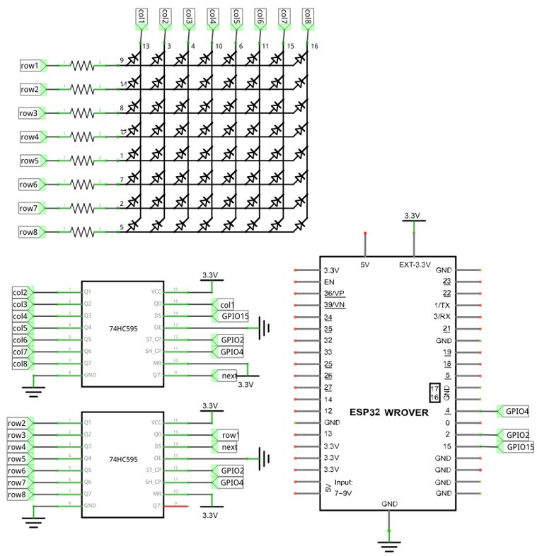
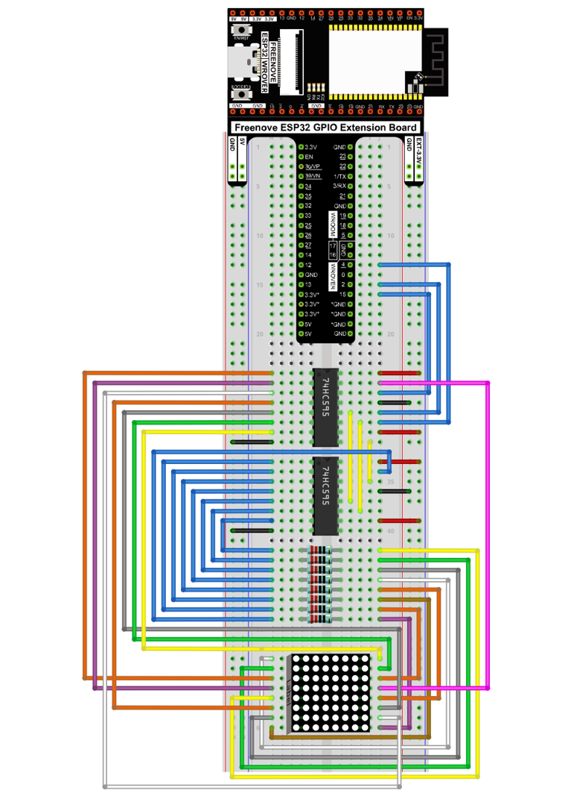
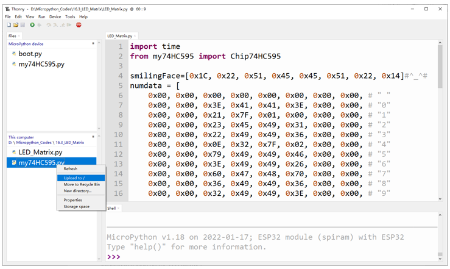

##############################################################################
Chapter 74HC595 & LED Matrix
##############################################################################

Thus far we have learned how to use the 74HC595 IC chip to control the LED bar graph and the 7-segment display. We will now use 74HC595 IC chips to control a LED matrix.

Project LED Matrix
*************************************

In this project, we will use two 74HC595 IC chips to control a monochrome (one color) (8X8) LED matrix to make it display both simple graphics and characters.

Component List
==========================

.. table::
    :width: 80%
    :align: center
    :class: table-line
    
    +------------------------------------+----------------------------------------------------+
    | ESP32-WROVER x1                    | GPIO Extension Board x1                            |
    |                                    |                                                    |
    | |Chapter01_00|                     | |Chapter01_01|                                     |
    +------------------------------------+----------------------------------------------------+
    | Breadboard x1                                                                           |
    |                                                                                         |
    | |Chapter01_02|                                                                          |
    +-----------------+------------------+------------------------+---------------------------+
    | 74HC595 x2      | Resistor 220Ω x8 | Jumper M/M x15         | 8*8 LEDMatrix x1          |
    |                 |                  |                        |                           |
    | |Chapter15_00|  | |Chapter01_04|   | |Chapter01_05|         | |Chapter16_00|            |
    +-----------------+------------------+------------------------+---------------------------+

.. |Chapter01_00| image:: ../_static/imgs/1_LED/Chapter01_00.png
.. |Chapter01_01| image:: ../_static/imgs/1_LED/Chapter01_01.png

.. |Chapter15_00| image:: ../_static/imgs/15_74HC595_&_LED_Bar_Graph/Chapter15_00.png 
.. |Chapter01_04| image:: ../_static/imgs/1_LED/Chapter01_04.png    
.. |Chapter01_05| image:: ../_static/imgs/1_LED/Chapter01_05.png
.. |Chapter16_00| image:: ../_static/imgs/16_74HC595_&_7-Segment_Display/Chapter16_00.png

Component knowledge
=================================

LED Matrix
---------------------------------

A LED matrix is a rectangular display module that consists of a uniform grid of LEDs. The following is an 8X8 monochrome (one color) LED matrix containing 64 LEDs (8 rows by 8 columns).

In order to facilitate the operation and reduce the number of ports required to drive this component, the positive poles of the LEDs in each row and negative poles of the LEDs in each column are respectively connected together inside the LED matrix module, which is called a common anode. There is another arrangement type. Negative poles of the LEDs in each row and the positive poles of the LEDs in each column are respectively connected together, which is called a common cathode.

Here is how a common anode LED matrix works. First, choose 16 ports on ESP32 board to connect to the 16 ports of LED matrix. Configure one port in columns for low level, which makes that column the selected port. Then configure the eight port in the row to display content in the selected column. Add a delay value and then select the next column that outputs the corresponding content. This kind of operation by column is called scan. If you want to display the following image of a smiling face, you can display it in 8 columns, and each column is represented by one byte.

.. image:: ../_static/imgs/16_74HC595_&_LED_Matrix/Chapter16_02.png
    :align: center

.. table::
    :align: center
    :class: zebra text-center
    
    +--------+-----------+-------------+
    | Column |  Binary   | Hexadecimal |
    +========+===========+=============+
    | 1      | 0001 1100 | 0x1c        |
    +--------+-----------+-------------+
    | 2      | 0010 0010 | 0x22        |
    +--------+-----------+-------------+
    | 3      | 0101 0001 | 0x51        |
    +--------+-----------+-------------+
    | 4      | 0100 0101 | 0x45        |
    +--------+-----------+-------------+
    | 5      | 0100 0101 | 0x45        |
    +--------+-----------+-------------+
    | 6      | 0101 0001 | 0x51        |
    +--------+-----------+-------------+
    | 7      | 0010 0010 | 0x22        |
    +--------+-----------+-------------+
    | 8      | 0001 1100 | 0x1c        |
    +--------+-----------+-------------+

To begin, display the first column, then turn off the first column and display the second column. (and so on) .... turn off the seventh column and display the 8th column, and then start the process over from the first column again like the control of LED bar graph project. The whole process will be repeated rapidly in a loop. Due to the principle of optical afterglow effect and the vision persistence effect in human sight, we will see a picture of a smiling face directly rather than individual columns of LEDs turned ON one column at a time (although in fact this is the reality we cannot perceive). 

Then, to save the number of GPIO, we use a 74HC595. When the first column is turned ON, set the lights that need to be displayed in the first column to "1", otherwise to "0", as shown in the above example, where the value of the first column is 0x1c. This value is sent to 74HC595 to control the display of the first column of the LED matrix. Following the above idea, turn OFF the display of the first column, then turn ON the second column, and then send the value of the second column to 74HC595 ...... Until each column is displayed, the LED matrix is displayed again from the first column.

Circuit
========================================

In circuit of this project, the power pin of the 74HC595 IC chip is connected to 3.3V. It can also be connected to 5V to make LED matrix brighter.

.. list-table:: 
   :width: 80%
   :align: center
   :class: table-line
   
   * -  **Schematic diagram**
   * -  |Chapter16_03|
   * -  **Hardware connection** 
   * -  :combo:`red font-bolder:If you need any support, please contact us via:` support@freenove.com
        
        |Chapter16_04|

Code
=========================================

The following code will make LEDMatrix display a smiling face, and then display scrolling character "0-F".

Open "Thonny", click "This computer" **->** "D:" **->** "Micropython_Codes" **->** "Micropython_Codes".  Select "HC595.py", right click your mouse to select "Upload to /", wait for "HC595.py" to be uploaded to ESP32-WROVER and double click "LED_Matrix.py". 

LED_Matrix
--------------------------------------------

Click "Run current script", and the LED Matrix display a smiling face, and then display characters "0 to F" scrolling in a loop on the LED Matrix.

The following is the program code:

.. literalinclude:: ../../../freenove_Kit/Python/Python_Codes/16.3_LED_Matrix/LED_Matrix.py
    :linenos:
    :language: python
    :dedent:

Import time and my 74HC595 modules.

.. literalinclude:: ../../../freenove_Kit/Python/Python_Codes/16.3_LED_Matrix/LED_Matrix.py
    :linenos:
    :language: python
    :lines: 1-2
    :dedent:

Use a nesting of two for loops to display a smiling face.

.. literalinclude:: ../../../freenove_Kit/Python/Python_Codes/16.3_LED_Matrix/LED_Matrix.py
    :linenos:
    :language: python
    :lines: 40-48
    :dedent:

Use a nesting of two for loops to display "0"-"F".

.. literalinclude:: ../../../freenove_Kit/Python/Python_Codes/16.3_LED_Matrix/LED_Matrix.py
    :linenos:
    :language: python
    :lines: 49-58
    :dedent:

The amount of pins of ESP32 is limited, so we need to find ways to save pins. If we use ESP32, s GPIO to control the LEDMatrix instead of 74HC595, we need 16 pins to drive LED matrix. In this example, we use two 74HC595 chips to drive the LED matrix, requiring only three pins, so that we could save the rest of 13 pins.

Reference
-------------------------------

.. py:function:: Class HC595	
    
    Before each use of HC595, please make sure HC595.py has been uploaded to "/" of ESP32, and then add the statement " **import HC595** " to the top of the python file.
    
    **Chip74HC595():** The object to control LEDMatrix.
    
    **chip=Chip74HC595()** or **chip=Chip74HC595(15,2,4,5)**
    
    **set_bit_data(data):** Write data to 74HC595.
    
    **clear():** Clear the latch data of 74HC595.