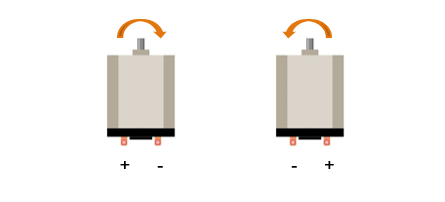

##############################################################################
Chapter Relay & Motor
##############################################################################

In this chapter, we will learn a kind of special switch module, relay module.

Project Relay & Motor
*********************************************

In this project, we will use a push button switch indirectly to control the motor via a relay.

Component List
==========================

.. table::
    :width: 80%
    :align: center
    :class: table-line
    
    +------------------------------------+----------------------------------------------------+
    | ESP32-WROVER x1                    | GPIO Extension Board x1                            |
    |                                    |                                                    |
    | |Chapter01_00|                     | |Chapter01_01|                                     |
    +------------------------------------+----------------------------------------------------+
    | Breadboard x1                                                                           |
    |                                                                                         |
    | |Chapter01_02|                                                                          |
    +-----------------+------------------+------------------------+---------------------------+
    | Resistor 10kΩ x2| Resistor 220Ω x1 | NPN transistor x1      | Resistor 1kΩ x1           |
    |                 |                  |                        |                           |
    | |Chapter02_01|  | |Chapter01_04|   | |Chapter07_00|         | |Chapter07_03|            |
    +-----------------+------------------+------------------------+---------------------------+
    | Relay x1        | Diode x1         | Push button x1         | LED x1                    |
    |                 |                  |                        |                           |
    | |Chapter17_00|  | |Chapter17_01|   | |Chapter02_02|         | |Chapter01_03|            |
    +-----------------+------------------+------------------------+---------------------------+
    | Motor x1                           | Jumper M/M                                         |
    |                                    |                                                    |
    | |Chapter17_02|                     | |Chapter01_05|                                     |
    +------------------------------------+----------------------------------------------------+
    | 9V battery (prepared by yourself) & battery line                                        |
    |                                                                                         |
    | |Chapter17_03|                                                                          |
    +-----------------------------------------------------------------------------------------+

.. |Chapter01_00| image:: ../_static/imgs/1_LED/Chapter01_00.png
.. |Chapter01_01| image:: ../_static/imgs/1_LED/Chapter01_01.png
.. |Chapter01_02| image:: ../_static/imgs/1_LED/Chapter01_02.png
.. |Chapter02_01| image:: ../_static/imgs/2_Button_&_LED/Chapter02_01.png
.. |Chapter01_04| image:: ../_static/imgs/1_LED/Chapter01_04.png
.. |Chapter07_00| image:: ../_static/imgs/7_Buzzer/Chapter07_00.png    
.. |Chapter07_03| image:: ../_static/imgs/7_Buzzer/Chapter07_03.png
.. |Chapter17_00| image:: ../_static/imgs/17_Relay_&_Motor/Chapter17_00.png
.. |Chapter17_01| image:: ../_static/imgs/17_Relay_&_Motor/Chapter17_01.png
.. |Chapter02_02| image:: ../_static/imgs/2_Button_&_LED/Chapter02_02.png
.. |Chapter01_03| image:: ../_static/imgs/1_LED/Chapter01_03.png 

.. |Chapter01_05| image:: ../_static/imgs/1_LED/Chapter01_05.png
.. |Chapter17_03| image:: ../_static/imgs/17_Relay_&_Motor/Chapter17_03.png

Component knowledge
====================================

Relay
------------------------------------

A relay is a safe switch which can use low power circuit to control high power circuit. It consists of electromagnet and contacts. The electromagnet is controlled by low power circuit and contacts are used in high power circuit. When the electromagnet is energized, it will attract contacts.

The following is a schematic diagram of a common relay and the feature and circuit symbol of a 5V relay used in this project:

.. list-table:: 
   :width: 80%
   :align: center
   :class: table-line
   
   * -  Diagram 
     -  Feature
     -  Symbol

   * -  |Chapter17_04|
     -  |Chapter17_05| 
     -  |Chapter17_06|

.. |Chapter17_04| image:: ../_static/imgs/17_Relay_&_Motor/Chapter17_04.png
.. |Chapter17_05| image:: ../_static/imgs/17_Relay_&_Motor/Chapter17_05.png
.. |Chapter17_06| image:: ../_static/imgs/17_Relay_&_Motor/Chapter17_06.png

Pin 5 and pin 6 are connected to each other inside. When the coil pins 3 and 4 get connected to 5V power supply, pin 1 will be disconnected to pin 5&6 and pin 2 will be connected to pin 5&6. So pin 1 is called close end, pin 2 is called open end.

Inductor
----------------------------------------

The symbol of Inductance is "L" and the unit of inductance is the "Henry" (H). Here is an example of how this can be encountered: 1H=1000mH, 1mH=1000μH.

An inductor is an energy storage device that converts electrical energy into magnetic energy. Generally, it consists of winding coil, with a certain amount of inductance. Inductors hinder the change of current passing through it.  When the current passing through it increases, it will attempt to hinder the increasing trend of current; and when the current passing through it decreases, it will attempt to hinder the decreasing trend of current. So the current passing through inductor is not transient.

.. image:: ../_static/imgs/17_Relay_&_Motor/Chapter17_07.png
    :align: center

The reference circuit for relay is as follows. The coil of relays can be equivalent to that of inductors, when the transistor disconnects power supply of the relay, the current in the coil of the relay can't stop immediately, causing an impact on power supply. So a parallel diode will get connected to both ends of relay coil pin in reversing direction, then the current will pass through diode, avoiding the impact on power supply. 

.. image:: ../_static/imgs/17_Relay_&_Motor/Chapter17_08.png
    :align: center

Motor
----------------------------------------

A motor is a device that converts electrical energy into mechanical energy. Motor consists of two parts: stator and rotor. When motor works, the stationary part is stator, and the rotating part is rotor. Stator is usually the outer case of motor, and it has terminals to connect to the power. Rotor is usually the shaft of motor, and can drive other mechanical devices to run. Diagram below is a small DC motor with two pins.

.. image:: ../_static/imgs/17_Relay_&_Motor/Chapter17_09.png
    :align: center

When a motor gets connected to the power supply, it will rotate in one direction. Reverse the polarity of power supply, then the motor rotates in opposite direction.

.. list-table:: 
   :width: 80%
   :align: center
   :class: table-line
   
   * -  **Schematic diagram**
   * -  |Chapter17_11|
   * -  **Hardware connection** 
   * -  If you need any support, please feel free to contact us via: support@freenove.com

        |Chapter17_12|

.. note::
    
    The motor circuit uses A large current, about 0.2-0.3A without load.We recommend that you use a 9V battery to power the extension board.

Code 
==================================

Use buttons to control the relays and motors.

Move the program folder "Freenove_Ultimate_Starter_Kit_for_ESP32/Python/Python_Codes" to disk(D) in advance with the path of "D:/Micropython_Codes".

Open "Thonny", click "This computer" -> "D:" -> "Micropython_Codes" -> "17.1_Relay_And_Motor" and double click "Relay_And_Motor.py". 

Relay_And_Motor
-----------------------------------

Click "Run current script". When the DC Motor is connected to a power supply, it will rotate in one direction. If you reverse the polarity of the power supply, the DC Motor will rotate in opposite direction. 

The following is the program code:

.. literalinclude:: ../../../freenove_Kit/Python/Python_Codes/17.1_Relay_And_Motor/Relay_And_Motor.py
    :language: python
    :dedent:

This section of code is basically the same as that of project Tablelamp. If you don't understand the program, you can click :ref:`here <Tablelamp>` to go back to the Tablelamp and study again.

Project Control Motor with Potentiometer
*************************************************************

Control the direction and speed of the motor with a potentiometer.

.. table::
    :width: 80%
    :align: center
    :class: table-line
    
    +------------------------------------+----------------------------------------------------+
    | ESP32-WROVER x1                    | GPIO Extension Board x1                            |
    |                                    |                                                    |
    | |Chapter01_00|                     | |Chapter01_01|                                     |
    +------------------------------------+----------------------------------------------------+
    | Breadboard x1                                                                           |
    |                                                                                         |
    | |Chapter01_02|                                                                          |
    +------------------------------------+----------------------------------------------------+
    | Motor x1                           | 9V battery (prepared by yourself) & battery line   |
    |                                    |                                                    |
    | |Chapter17_02|                     | |Chapter17_03|                                     |
    +-------------------------+----------+----------------------+-----------------------------+
    | Jumper M/M              | L293D                           | Rotary potentiometer x1     |
    |                         |                                 |                             |
    | |Chapter01_05|          | |Chapter17A_00|                 |  |Chapter09_00|             |
    +-------------------------+---------------------------------+-----------------------------+

.. |Chapter09_00| image:: ../_static/imgs/9_AD_DA_Converter/Chapter09_00.png

Component knowledge
=============================================

L293D
---------------------------------------

L293D is an IC chip (Integrated Circuit Chip) with a 4-channel motor drive. You can drive a unidirectional DC motor with 4 ports or a bi-directional DC motor with 2 ports or a stepper motor (stepper motors are covered later in this Tutorial).

.. image:: ../_static/imgs/17_Motor_&_Driver/Chapter17_01.png
    :align: center

Port description of L293D module is as follows:

.. table::
    :width: 80%
    :align: center
    :class: zebra
    
    +----------+--------------+---------------------------------------------------------------------------------------------------------------+
    | Pin name |  Pin number  |                                                  Description                                                  |
    +==========+==============+===============================================================================================================+
    | In x     | 2, 7, 10, 15 | Channel x digital signal input pin                                                                            |
    +----------+--------------+---------------------------------------------------------------------------------------------------------------+
    | Out x    | 3, 6, 11, 14 | Channel x output pin, input high or low level according to In x pin, get connected to +Vmotor or 0V           |
    +----------+--------------+---------------------------------------------------------------------------------------------------------------+
    | Enable1  | 1            | Channel 1 and channel 2 enable pin, high level enable                                                         |
    +----------+--------------+---------------------------------------------------------------------------------------------------------------+
    | Enable2  | 9            | Channel 3 and channel 4 enable pin, high level enable                                                         |
    +----------+--------------+---------------------------------------------------------------------------------------------------------------+
    | 0V       | 4, 5, 12, 13 | Power cathode (GND)                                                                                           |
    +----------+--------------+---------------------------------------------------------------------------------------------------------------+
    | +V       | 16           | Positive electrode (VCC) of power supply, supply voltage 3.0~36V                                              |
    +----------+--------------+---------------------------------------------------------------------------------------------------------------+
    |          |              | Positive electrode of load power supply, provide power supply for the Out                                     |
    | +Vmotor  | 8            |                                                                                                               |
    |          |              | pin x, the supply voltage is +V~36V                                                                           |
    +----------+--------------+---------------------------------------------------------------------------------------------------------------+

For more detail, please refer to the datasheet for this IC Chip.

When using L293D to drive DC motor, there are usually two connection options.

The following connection option uses one channel of the L239D, which can control motor speed through the PWM, However the motor then can only rotate in one direction.

.. image:: ../_static/imgs/17_Motor_&_Driver/Chapter17_02.png
    :align: center

The following connection uses two channels of the L239D: one channel outputs the PWM wave, and the other channel connects to GND, therefore you can control the speed of the motor. When these two channel signals are exchanged, not only controls the speed of motor, but also can control the steering of the motor.

.. image:: ../_static/imgs/17_Motor_&_Driver/Chapter17_03.png
    :align: center

In practical use the motor is usually connected to channel 1 and 2 by outputting different levels to in1 and in2 to control the rotational direction of the motor, and output to the PWM wave to Enable1 port to control the motor's rotational speed. If the motor is connected to channel 3 and 4 by outputting different levels to in3 and in4 to control the motor's rotation direction, and output to the PWM wave to Enable2 pin to control the motor's rotational speed.

Circuit
============================================

Use caution when connecting this circuit, because the DC motor is a high-power component, do not use the power provided by the ESP32 to power the motor directly, which may cause permanent damage to your ESP32! The logic circuit can be powered by the ESP32 power or an external power supply, which should share a common ground with ESP32.

.. list-table:: 
   :width: 80%
   :class: table-line
   :align: center
   
   * -  **Schematic diagram**
   * -  |Chapter17_17|
   * -  **Hardware connection** 
   * -  :combo:`red font-bolder:If you need any support, please feel free to contact us via:` support@freenove.com

        |Chapter17_18|

.. note::
    
    The motor circuit uses A large current, about 0.2-0.3A without load.We recommend that you use a 9V battery to power the extension board.

Code
=======================================

Move the program folder **"Freenove_Ultimate_Starter_Kit_for_ESP32/Python/Python_Codes"** to disk(D) in advance with the path of **"D:/Micropython_Codes"**.

Open "Thonny", click "This computer" **->** "D:" **->** "Micropython_Codes" **->** "17.2_Motor_And_Driver" and double click "Motor_And_Driver.py". 

Motor_And_Driver
----------------------------------------

Click "Run current script", rotate the potentiometer in one direction and the motor speeds up slowly in one direction. Rotate the potentiometer in the other direction and the motor will slow down to stop. And then rotate it in the original direction to accelerate the motor.

The following is the Code:

.. literalinclude:: ../../../freenove_Kit/Python/Python_Codes/17.2_Motor_And_Driver/Motor_And_Driver.py
    :linenos:
    :language: python
    :dedent:

The ADC of ESP32 has a 12-bit accuracy, corresponding to a range from 0 to 4095. In this program, set the number 2048 as the midpoint. If the value of ADC is less than 2048, make the motor rotate in one direction. If the value of ADC is greater than 2048, make the motor rotate in the other direction. Subtract 2048 from the ADC value and take the absolute value, and then divide this result by 2 to be the speed of the motor.

.. literalinclude:: ../../../freenove_Kit/Python/Python_Codes/17.2_Motor_And_Driver/Motor_And_Driver.py
    :linenos:
    :language: python
    :lines: 26-34
    :dedent:

Initialize pins of L293D chip.

.. literalinclude:: ../../../freenove_Kit/Python/Python_Codes/17.2_Motor_And_Driver/Motor_And_Driver.py
    :linenos:
    :language: python
    :lines: 5-9
    :dedent:

Initialize ADC pins, set the range of voltage to 0-3.3V and the acquisition width of data to 0-4095.

.. literalinclude:: ../../../freenove_Kit/Python/Python_Codes/17.2_Motor_And_Driver/Motor_And_Driver.py
    :linenos:
    :language: python
    :lines: 11-13
    :dedent:

Function driveMotor is used to control the rotation direction and speed of the motor. The dir represents direction while **spd** refers to speed.

.. literalinclude:: ../../../freenove_Kit/Python/Python_Codes/17.2_Motor_And_Driver/Motor_And_Driver.py
    :linenos:
    :language: python
    :lines: 15-22
    :dedent: