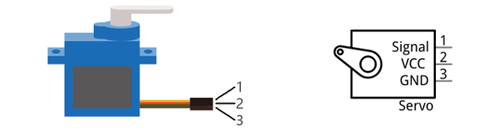
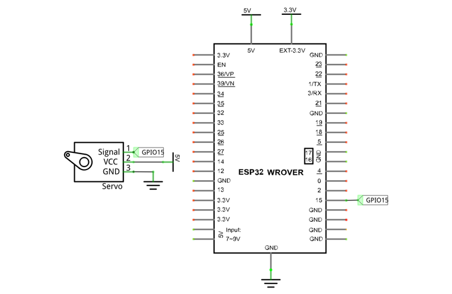
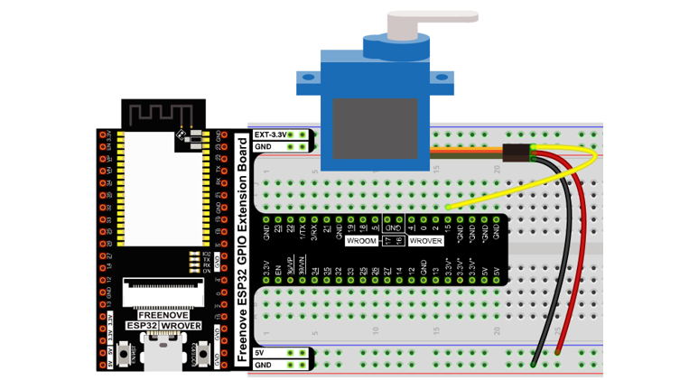
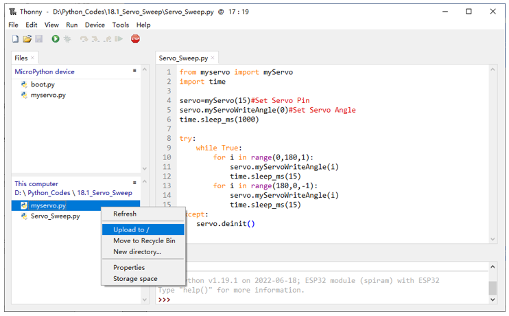
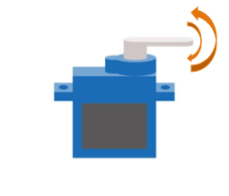
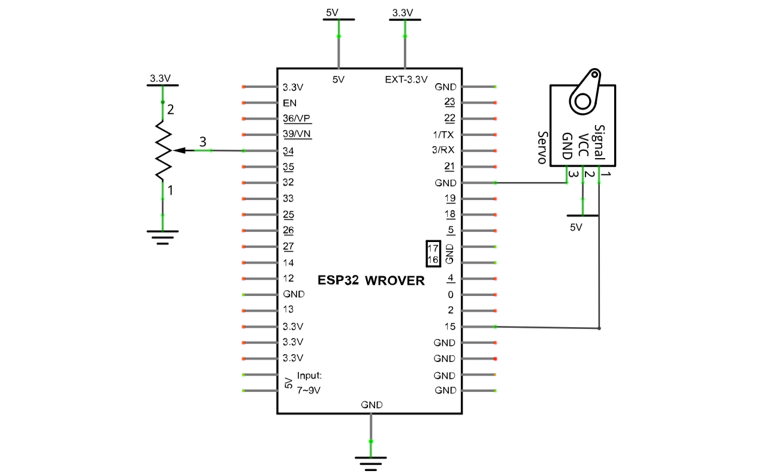
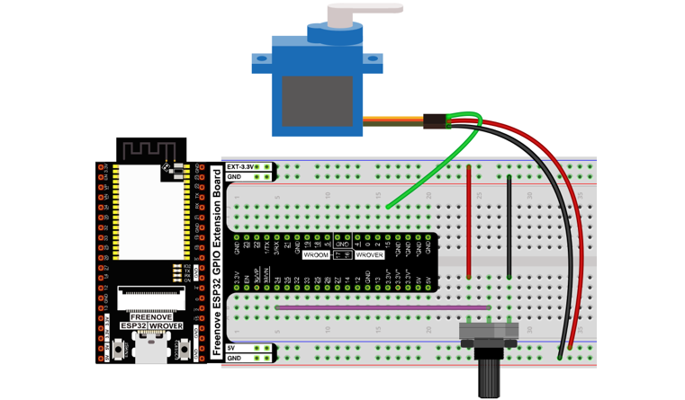
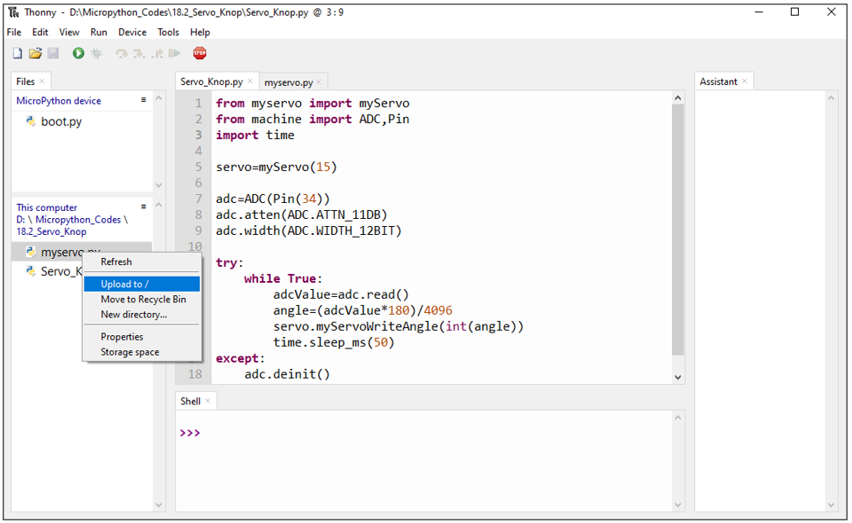
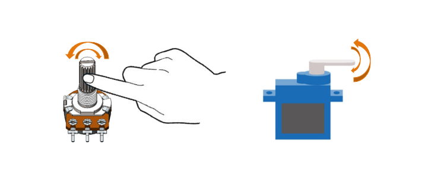

##############################################################################
Chapter Servo
##############################################################################

Previously, we learned how to control the speed and rotational direction of a motor. In this chapter, we will learn about servos which are a rotary actuator type motor that can be controlled to rotate to specific angles.

Project Servo Sweep
*******************************************

First, we need to learn how to make a servo rotate.

Component List
============================================

.. table::
    :width: 80%
    :align: center
    :class: table-line
    
    +------------------------------------+----------------------------------------------------+
    | ESP32-WROVER x1                    | GPIO Extension Board x1                            |
    |                                    |                                                    |
    | |Chapter01_00|                     | |Chapter01_01|                                     |
    +------------------------------------+----------------------------------------------------+
    | Breadboard x1                                                                           |
    |                                                                                         |
    | |Chapter01_02|                                                                          |
    +------------------------------------+----------------------------------------------------+
    | Servo x1                           | Jumper M/M x3                                      |
    |                                    |                                                    |
    | |Chapter18_00|                     |  |Chapter01_05|                                    |
    +------------------------------------+----------------------------------------------------+

.. |Chapter01_00| image:: ../_static/imgs/1_LED/Chapter01_00.png
.. |Chapter01_01| image:: ../_static/imgs/1_LED/Chapter01_01.png
.. |Chapter01_02| image:: ../_static/imgs/1_LED/Chapter01_02.png
.. |Chapter18_00| image:: ../_static/imgs/18_Servo/Chapter18_00.png
.. |Chapter01_05| image:: ../_static/imgs/1_LED/Chapter01_05.png

Component knowledge
============================================

Servo
---------------------------------------------

Servo is a compact package which consists of a DC motor, a set of reduction gears to provide torque, a sensor and control circuit board. Most servos only have a 180-degree range of motion via their "horn". Servos can output higher torque than a simple DC motor alone and they are widely used to control motion in model cars, model airplanes, robots, etc. Servos have three wire leads which usually terminate to a male or female 3-pin plug. Two leads are for electric power: positive (2-VCC, Red wire), negative (3-GND, Brown wire), and the signal line (1-Signal, Orange wire), as represented in the Servo provided in your Kit.

We will use a 50Hz PWM signal with a duty cycle in a certain range to drive the Servo. The lasting time of 0.5ms-2.5ms of PWM single cycle high level corresponds to the servo angle 0 degrees - 180 degree linearly. Part of the corresponding values are as follows:

.. table::
    :align: center
    :class: zebra
    
    +-----------------+-------------+
    | High level time | Servo angle |
    +=================+=============+
    | 0.5ms           | 0 degree    |
    +-----------------+-------------+
    | 1ms             | 45 degree   |
    +-----------------+-------------+
    | 1.5ms           | 0 degree    |
    +-----------------+-------------+
    | 2ms             | 45 degree   |
    +-----------------+-------------+
    | 2.5ms           | 180 degree  |
    +-----------------+-------------+

When you change the servo signal value, the servo will rotate to the designated angle.

Circuit
========================================

Use caution when supplying power to the servo, it should be 5V. Make sure you do not make any errors when connecting the servo to the power supply.

.. list-table:: 
   :width: 80%
   :align: center
   :class: table-line

   * -  **Schematic diagram**
   * -  |Chapter18_02|
   * -  **Hardware connection** 
   * -  :combo:`red font-bolder:If you need any support, please feel free to contact us via:` support@freenove.com

        |Chapter18_03|

Code
========================================

Move the program folder **"Freenove_Ultimate_Starter_Kit_for_ESP32/Python/Python_Codes"** to disk(D) in advance with the path of **"D:/Micropython_Codes"**.

Open "Thonny", click "This computer" **->** "D:" **->** "Micropython_Codes" **->** "18.1_Servo_Sweep". Select "myservo.py", right click your mouse to select "Upload to /", wait for "myservo.py" to be uploaded to ESP32-WROVER and then double click "Servo_Sweep.py". 

Servo_Sweep
---------------------------------------

Click "Run current script", the Servo will rotate from 0 degrees to 180 degrees and then reverse the direction to make it rotate from 180 degrees to 0 degrees and repeat these actions in an endless loop.

The following is the program code:

.. literalinclude:: ../../../freenove_Kit/Python/Python_Codes/18.1_Servo_Sweep/Servo_Sweep.py
    :linenos:
    :language: python
    :dedent:

Import myservo module.

.. literalinclude:: ../../../freenove_Kit/Python/Python_Codes/18.1_Servo_Sweep/Servo_Sweep.py
    :linenos:
    :language: python
    :lines: 1-1
    :dedent:

Initialize pins of the servo and set the starting point of the servo to 0 degree.

.. literalinclude:: ../../../freenove_Kit/Python/Python_Codes/18.1_Servo_Sweep/Servo_Sweep.py
    :linenos:
    :language: python
    :lines: 4-6
    :dedent:

Control the servo to rotate to a specified angle within the range of 0-180 degrees.  

.. literalinclude:: ../../../freenove_Kit/Python/Python_Codes/18.1_Servo_Sweep/Servo_Sweep.py
    :linenos:
    :language: python
    :lines: 11-11
    :dedent:

Use two for loops. The first one controls the servo to rotate from 0 degree to 180 degrees while the other controls it to rotate back from 180 degrees to 0 degree.

.. literalinclude:: ../../../freenove_Kit/Python/Python_Codes/18.1_Servo_Sweep/Servo_Sweep.py
    :linenos:
    :language: python
    :lines: 10-15
    :dedent:

Reference
---------------------------

.. py:function:: class myServo 	
    
    Before each use of **myServo** , please make sure myservo.py has been uploaded to "/" of ESP32, and then add the statement " **from myservo import myServo** " to the top of the python file.
    
    **myServo ():** The object that controls the servo, with the default pin Pin(15), default frequency 50Hz and default duty cycle 512.
    
    **myServoWriteDuty(duty):** The function that writes duty cycle to control the servo.
    
        **duty:** Range from 26 to 128, with 26 corresponding to the servo, s 0 degree and 128 corresponding to 180 degrees.
    
    **myServoWriteAngle(pos):** Function that writes angle value to control the servo.
    
        **pos:** Ranging from 0-180, corresponding the 0-180 degrees of the servo.
    
    **myServoWriteTime(us):** Writes time to control the servo.
    
        **us:** Range from 500-2500, with 500 corresponding to the servo, s 0 degree and 2500 corresponding to 180 degrees.

Project Servo Knop
*********************************

Use a potentiometer to control the servo motor to rotate at any angle.

.. table::
    :width: 80%
    :align: center
    :class: table-line
    
    +------------------------------------+----------------------------------------------------+
    | ESP32-WROVER x1                    | GPIO Extension Board x1                            |
    |                                    |                                                    |
    | |Chapter01_00|                     | |Chapter01_01|                                     |
    +------------------------------------+----------------------------------------------------+
    | Breadboard x1                                                                           |
    |                                                                                         |
    | |Chapter01_02|                                                                          |
    +------------------------------------+-------------------------+--------------------------+
    | Servo x1                           | Jumper M/M x6           | Rotary potentiometer x1  |
    |                                    |                         |                          |
    | |Chapter18_00|                     |  |Chapter01_05|         |  |Chapter09_00|          |
    +------------------------------------+-------------------------+--------------------------+

.. |Chapter09_00| image:: ../_static/imgs/9_AD_DA_Converter/Chapter09_00.png

Circuit
=======================================

Use caution when supplying power to the servo, it should be 5V. Make sure you do not make any errors when connecting the servo to the power supply.

.. list-table:: 
   :width: 80%
   :align: center
   :class: table-line
   
   * -  **Schematic diagram**
   * -  |Chapter18_07|
   * -  **Hardware connection** 
   * -  :combo:`red font-bolder:If you need any support, please feel free to contact us via:` support@freenove.com

        |Chapter18_08|

Code
=====================================

Move the program folder **"Freenove_Ultimate_Starter_Kit_for_ESP32/Python/Python_Codes"** to disk(D) in advance with the path of **"D:/Micropython_Codes"**.

Open "Thonny", click "This computer" **->** "D:" **->** "Micropython_Codes" **->** "18.2_Servo_Knop". Select "myservo.py", right click your mouse to select "Upload to /", wait for "myservo.py" to be uploaded to ESP32-WROVER and then double click "Servo_Knop.py". 
 
18.2_Servo_Knop
-------------------------------------

Click "Run current script", twist the potentiometer back and forth, and the servo motor rotates accordingly.

The following is the program code:

.. literalinclude:: ../../../freenove_Kit/Python/Python_Codes/18.2_Servo_Knop/Servo_Knop.py
    :linenos:
    :language: python
    :dedent:

In this project, we will use Pin(34) of ESP32 to read the ADC value of the rotary potentiometer and then convert it to the angle value required by the servo and control the servo to rotate to the corresponding angle.