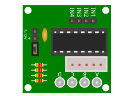
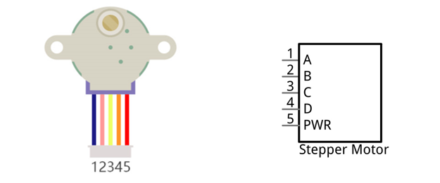
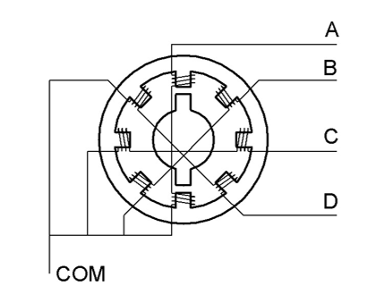
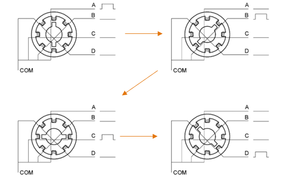
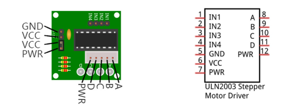
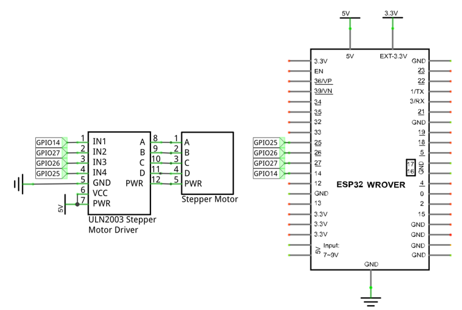
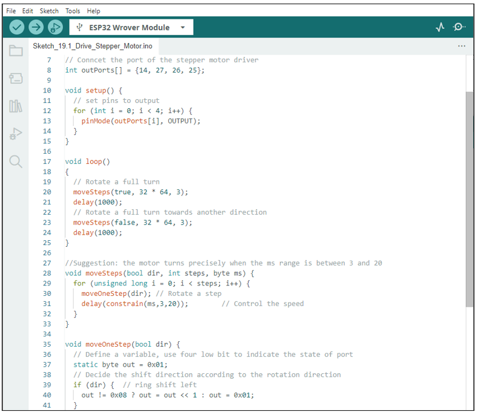
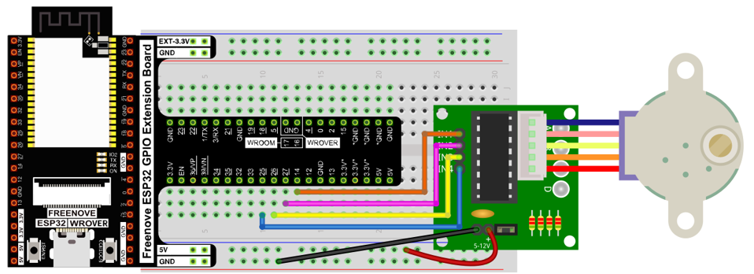
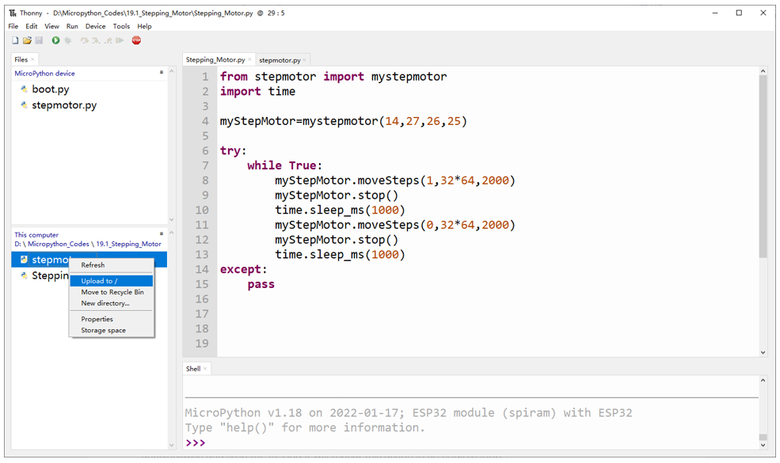

##############################################################################
Chapter Stepper Motor
##############################################################################

In this project, we will learn how to drive a stepper motor, and understand its working principle.

Project Stepper Motor
*******************************************

Component List
============================================

+------------------------------------+---------------------------------------------------------------+
| ESP32-WROVER x1                    | GPIO Extension Board x1                                       |
|                                    |                                                               |
| |Chapter01_00|                     | |Chapter01_01|                                                |
+------------------------------------+---------------------------------------------------------------+
| Breadboard x1                                                                                      |
|                                                                                                    |
| |Chapter01_02|                                                                                     |
+------------------------------------+------------------------+--------------------------------------+
| Stepper Motor x1                   | Jumper F/M x6          | ULN2003 Stepper Motor Driver x1      |
|                                    |                        |                                      |
| |Chapter19_00|                     |  |Chapter01_05|        |   |Chapter19_01|                     |
+------------------------------------+------------------------+--------------------------------------+

.. |Chapter01_00| image:: ../_static/imgs/1_LED/Chapter01_00.png
.. |Chapter01_01| image:: ../_static/imgs/1_LED/Chapter01_01.png
.. |Chapter01_02| image:: ../_static/imgs/1_LED/Chapter01_02.png
.. |Chapter01_05| image:: ../_static/imgs/1_LED/Chapter01_05.png
.. |Chapter19_00| image:: ../_static/imgs/19_Stepper_Motor/Chapter19_00.png

Component knowledge
========================================

Stepper Motor
--------------------------------------

Stepper motors are an open-loop control device, which converts an electronic pulse signal into angular displacement or linear displacement. In a non-overload condition, the speed of the motor and the location of the stops depends only on the pulse signal frequency and number of pulses and is not affected by changes in load as with a DC motor. A small four-phase deceleration stepper motor is shown here:

The electronic schematic diagram of a four-phase stepper motor is shown below:

The outside case or housing of the stepper motor is the stator and inside the stator is the rotor. There are a specific number of individual coils, usually an integer multiple of the number of phases the motor has, when the stator is powered ON, an electromagnetic field will be formed to attract a corresponding convex diagonal groove or indentation in the rotor's surface. The rotor is usually made of iron or a permanent magnet. Therefore, the stepper motor can be driven by powering the coils on the stator in an ordered sequence (producing a series of "steps" or stepped movements).

A common driving process is as follows:

In the course above, the stepper motor rotates a certain angle once, which is called a step. By controlling the number of rotation steps, you can control the stepper motor rotation angle. By controlling the time between two steps, you can control the stepper motor rotation speed. When rotating clockwise, the order of coil powered on is: A -> B -> C -> D -> A -> ...... . And the rotor will rotate in accordance with the order, step by step down, called four steps four pats. If the coils is powered on in the reverse order, D -> C -> B -> A -> D -> … , the rotor will rotate in anti-clockwise direction.

There are other methods to control stepper motors, such as: connect A phase, then connect A B phase, the stator will be located in the center of A B, which is called a half-step. This method can improve the stability of the stepper motor and reduces noise. The sequence of powering the coils looks like this: A ->  AB -> B  -> BC -> C  -> CD -> D -> DA -> A -> ...... , the rotor will rotate in accordance to this sequence at a half-step at a time, called four-steps, eight-part. Conversely, if the coils are powered ON in the reverse order the stepper motor will rotate in the opposite direction.

The stator in the stepper motor we have supplied has 32 magnetic poles. Therefore, to complete one full revolution requires 32 full steps. The rotor (or output shaft) of the stepper motor is connected to a speed reduction set of gears and the reduction ratio is 1:64. Therefore, the final output shaft (exiting the stepper motor's housing) requires 32 X 64 = 2048 steps to make one full revolution.

ULN2003 Stepper motor driver
--------------------------------------------

A ULN2003 stepper motor driver is used to convert weak signals into more powerful control signals in order to drive the stepper motor. In the illustration below, the input signal IN1-IN4 corresponds to the output signal A-D, and 4 LEDs are integrated into the board to indicate the state of these signals. The PWR interface can be used as a power supply for the stepper motor. By default, PWR and VCC are connected.

Circuit
=============================================

When building the circuit, note that rated voltage of the stepper motor is 5V, and we need to use the breadboard power supply independently. Additionally, the breadboard power supply needs to share Ground with ESP32.

.. list-table:: 
   :width: 80%
   :header-rows: 1 
   :align: center
   
   * -  Schematic diagram
   * -  |Chapter19_06|
   * -  Hardware connection. 
       
        If you need any support, please feel free to contact us via: support@freenove.com

        |Chapter19_07|

Code
======================================

This code uses the four-step, four-part mode to drive the Stepper Motor in the clockwise and anticlockwise directions.

Move the program folder "Freenove_Ultimate_Starter_Kit_for_ESP32/Python/Python_Codes" to disk(D) in advance with the path of "D:/Micropython_Codes".

Open "Thonny", click "This computer"  ->  "D:"  ->  "Micropython_Codes"  ->  "19.1_Stepping_Motor". Select "stepmotor.py", right click your mouse to select "Upload to /", wait for "myservo.py" to be uploaded to ESP32-WROVER and then double click "Stepping_Motor.py". 

Stepping_Motor
---------------------------------------

Click "Run current script", the stepper motor will rotate 360° clockwise and stop for 1s, and then rotate 360° anticlockwise and stop for 1s. And it will repeat this action in an endless loop.

The following is the program code:

.. literalinclude:: ../../../freenove_Kit/Python/Python_Codes/19.1_Stepping_Motor/Stepping_Motor.py
    :language: python
    :dedent:

Import time and stepmotor modules.

.. literalinclude:: ../../../freenove_Kit/Python/Python_Codes/19.1_Stepping_Motor/Stepping_Motor.py
    :language: python
    :lines: 1-2
    :dedent:

In this project, we define four pins to drive the stepper motor.

.. literalinclude:: ../../../freenove_Kit/Python/Python_Codes/19.1_Stepping_Motor/Stepping_Motor.py
    :language: python
    :lines: 4-4
    :dedent:

Call the function moveSteps to control the stepper motor to rotate for 360°and then call function stop() to stop it.

.. literalinclude:: ../../../freenove_Kit/Python/Python_Codes/19.1_Stepping_Motor/Stepping_Motor.py
    :language: python
    :lines: 8-9
    :dedent:

Repeatedly control the stepmotor to rotate 360° clockwise and then rotate 360° anti-clockwise.

.. literalinclude:: ../../../freenove_Kit/Python/Python_Codes/19.1_Stepping_Motor/Stepping_Motor.py
    :language: python
    :lines: 7-13
    :dedent:

Reference
--------------------------------

.. py:function:: class myServo 	
    
    Before each use of the object **mystepmotor** , please make sure that stepmotor.py has been uploaded to "/" of ESP32, and then add the statement "from stepmotor import mystepmotor" to the top of the python file.
    
    **mystepmotor():** The object to control the stepper motor. The default control pins are Pin(14), Pin(27), Pin(26) and Pin(25).
    
    **moveSteps(direction,steps,us):** Control the stepper motor to rotate a specified number of steps. 
    
        **direction:** The rotation direction of stepper motor. 
    
        **Steps:** Rotation steps of the stepper motor.
    
        **us:** Time required by the stepper motor to rotate for one step.
    
    **moveAround(direction,turns,us):** Control the stepper motor to rotate a specific number of turns. 
    
        **Turns:** Number of turns that the stepper motor rotates. 
    
    **moveAngle(direction,angles,us):** Control the stepper motor to rotate a specific angle.
    
        **Angles:** Rotation angles that the stepper motor rotates. 
    
    **stop():** Stop the stepper motor. 
