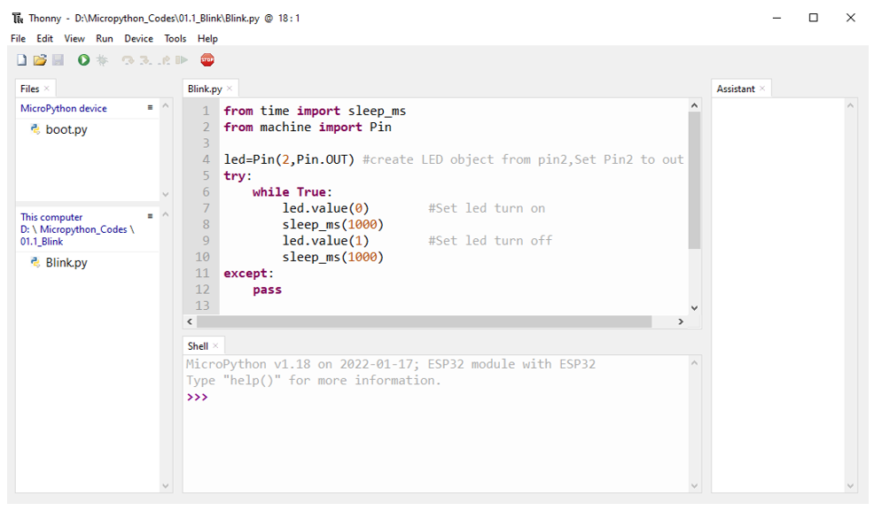
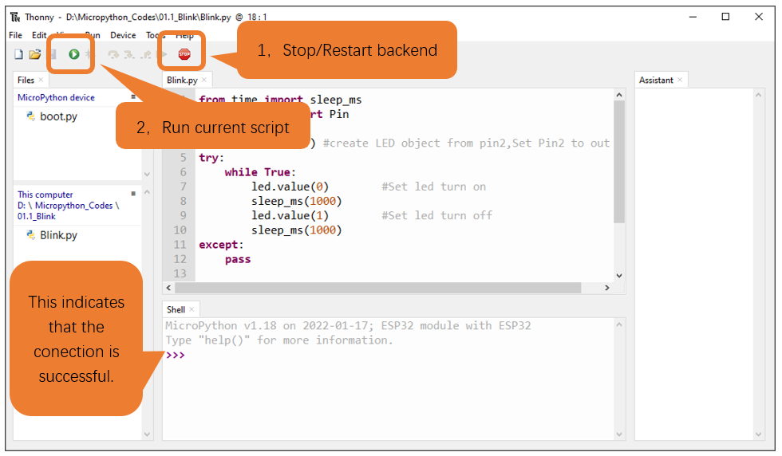
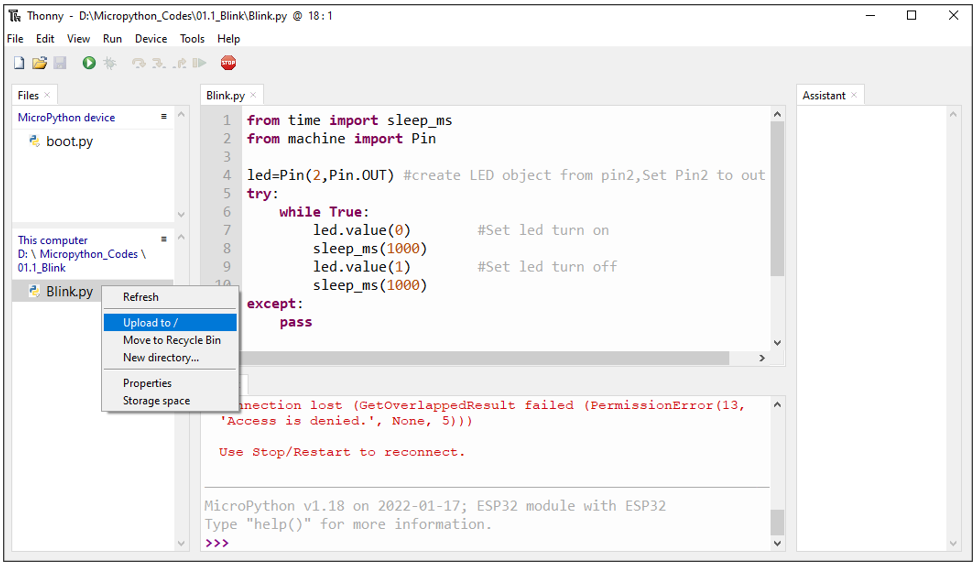
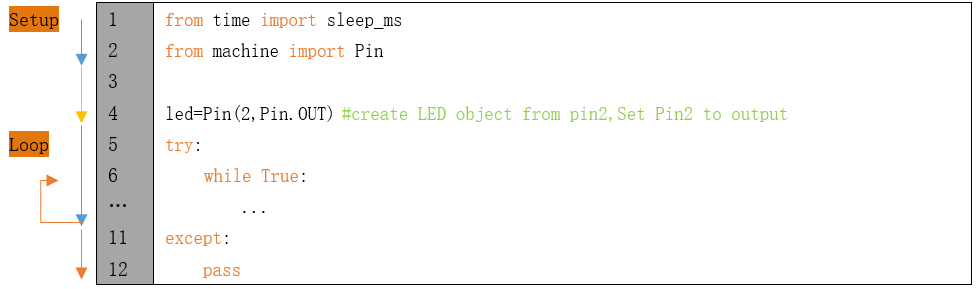

##############################################################################
Chapter LED (Important)
##############################################################################

This chapter is the Start Point in the journey to build and explore ESP32 electronic projects. We will start with simple "Blink" project.

Project Blink
*******************************

In this project, we will use ESP32 to control blinking a common LED.

If you have not yet installed Thonny, click :ref:`here <Thonny>`.

If you have not yet downloaded Micropython Firmware, click :ref:`here <Downloading>`.

If you have not yet loaded Micropython Firmware, click :ref:`here <Burning>`.

Component List
===============================

.. table::
    :width: 80%
    :align: center
    :class: table-line
    
    +------------------------------------+-------------------------+
    | ESP32-WROVER x1                    | USB cable               |
    |                                    |                         |
    | |Chapter01_00|                     | |Chapter08_00|          |
    +------------------------------------+-------------------------+
  
.. |Chapter01_00| image:: ../_static/imgs/1_LED/Chapter01_00.png
.. |Chapter08_00| image:: ../_static/imgs/8_Serial_Communication/Chapter08_00.png

Power
-----------------------------

ESP32-WROVER needs 5v power supply. In this tutorial, we need connect ESP32-WROVER to computer via USB cable to power it and program it. We can also use other 5v power source to power it.

In the following projects, we only use USB cable to power ESP32-WROVER by default.

In the whole tutorial, we don't use T extension to power ESP32-WROVER. So 5V and 3.3V (includeing EXT 3.3V) on the extension board are provided by ESP32-WROVER. 

We can also use DC jack of extension board to power ESP32-WROVER.In this way, 5v and EXT 3.3v on extension board are provided by external power resource.

Code
===========================

Codes used in this tutorial are saved in **"Freenove_Ultimate_Starter_Kit_for_ESP32/Python/Python_Codes"**. You can move the codes to any location. For example, we save the codes in Disk(D) with the path of **"D:/Micropython_Codes"**.

Blink
---------------------------

Open "Thonny", click "This computer" **->** "D:" **->** "Micropython_Codes".

Expand folder "01.1_Blink" and double click "Blink.py" to open it. As shown in the illustration below.

Make sure ESP32 has been connected with the computer with ESP32 correctly. Click "Stop/Restart backend" or press the reset button, and then wait to see what interface will show up.

Click "Run current script" shown in the box above, the code starts to be executed and the LED in the circuit starts to blink. 

:combo:`red font-bolder:Due to different versions, some board leds will show the opposite effect.`

.. note::

    This is the code :ref:`running online <online>`. If you disconnect USB cable and repower ESP32 or press its reset key, LED stops blinking and the following messages will be displayed in Thonny.

Uploading code to ESP32
------------------------------

As shown in the following illustration, right-click the file Blink.py and select "Upload to /" to upload code to ESP32.

Upload boot.py in the same way.

Press the reset key of ESP32 and you can see LED is ON for one second and then OFF for one second, which repeats in an endless loop. 

:combo:`red font-bolder:Due to different versions, some board leds will show the opposite effect.`

.. note::
    
    Codes here is run offline. If you want to stop running offline and enter Shell, just click "Stop" in Thonny.

:combo:`red font-bolder:If you have any concerns, please contact us via:` support@freenove.com

The following is the program code:

.. code-block:: python
    :linenos:

    from time import sleep_ms
    from machine import Pin

    led=Pin(2,Pin.OUT) #create LED object from pin2,Set Pin2 to output
    try:
        while True:
            led.value(1) #Set led turn on
            sleep_ms(1000)
            led.value(0) #Set led turn off
            sleep_ms(1000)
    except:
        pass

Each time a new file is opened, the program will be executed from top to bottom. When encountering a loop construction, it will execute the loop statement according to the loop condition.

Print() function is used to print data to Terminal. It can be executed in Terminal directly or be written in a Python file and executed by running the file.

.. code-block:: python
    :linenos:

    print("Hello world!")

Each time when using the functions of ESP32, you need to import modules corresponding to those functions: Import sleep_ms module of time module and Pin module of machine module.

.. code-block:: python
    :linenos:

    from time import sleep_ms
    from machine import Pin

Configure GPIO2 of ESP32-WROVER to output mode and assign it to an object named "led". 

.. code-block:: python
    :linenos:

    led=Pin(2,Pin.OUT) #create LED object from pin2,Set Pin2 to output

It means that from now on, LED represents GPIO2 that is in output mode.

Set the value of LED to 1 and GPIO2 will output high level.

.. code-block:: python
    :linenos:

    led.value(1) #Set led turn on

Set the value of LED to 0 and GPIO2 will output low level.

.. code-block:: python
    :linenos:

    led.value(0) #Set led turn on

Execute codes in a while loop.

.. code-block:: python
    :linenos:

    while True:
        ......

Put statements that may cause an error in "try" block and the executing statements when an error occurs in "except" block. In general, when the program executes statements, it will execute those in "try" block. However, when an error occurs to ESP32 due to some interference or other reasons, it will execute statements in "except" block.

"Pass" is an empty statement. When it is executed, nothing happens. It is useful as a placeholder to make the structure of a program look better. 

.. code-block:: python
    :linenos:

    try:
        ...
    except:
        pass

The single-line comment of Micropython starts with a "#" and continues to the end of the line. Comments help us to understand code. When programs are running, Thonny will ignore comments.

.. code-block:: python
    :linenos:

    #Set led turn on

MicroPython uses indentations to distinguish different blocks of code instead of braces. The number of indentations is changeable, but it must be consistent throughout one block. If the indentation of the same code block is inconsistent, it will cause errors when the program runs.

.. code-block:: python
    :linenos:

    while True:
        led.value(1) #Set led turn on
        sleep_ms(1000)
        led.value(0) #Set led turn off
        sleep_ms(1000)

How to import python files
-----------------------------------

Whether to import the built-in python module or to import that written by users, the command "import" is needed.

If you import the module directly you should indicate the module to which the function or attribute belongs when using the function or attribute (constant, variable) in the module. The format should be: <module name>.<function or attribute>, otherwise an error will occur. 

If you only want to import a certain function or attribute in the module, use the from...import statement. The format is as follows

When using "from...import" statement to import function, to avoid conflicts and for easy understanding, you can use "as" statement to rename the imported function, as follows

Reference
---------------------------

.. py:function:: Class machine

    Before each use of the machine module, please add the statement "import machine" to the top of python file.

    **machine.freq(freq_val):** When freq_val is not specified, it is to return to the current CPU frequency; Otherwise, it is to set the current CPU frequency.

    **freq_val:** 80000000(80MHz)、160000000(160MHz)、240000000(240MHz)

    **machine.reset():** A reset function. When it is called, the program will be reset.

    **machine.unique_id():** Obtains MAC address of the device. 

    **machine.idle():** Turns off any temporarily unused functions on the chip and its clock, which is useful to reduce power consumption at any time during short or long periods.

    **machine.disable_irq():** Disables interrupt requests and return the previous IRQ state. The disable_irq () function and enable_irq () function need to be used together; Otherwise the machine will crash and restart.

    **machine.enable_irq(state):** To re-enable interrupt requests. The parameter state should be the value that was returned from the most recent call to the disable_irq() function

    **machine.time_pulse_us(pin, pulse_level, timeout_us=1000000):** 

        Tests the duration of the external pulse level on the given pin and returns the duration of the external pulse level in microseconds. When pulse level = 1, it tests the high level duration; When pulse level = 0, it tests the low level duration.

        If the setting level is not consistent with the current pulse level, it will wait until they are consistent, and then start timing. If the set level is consistent with the current pulse level, it will start timing immediately.

        When the pin level is opposite to the set level, it will wait for timeout and return "-2". When the pin level and the set level is the same, it will also wait timeout but return "-1". timeout_us is the duration of timeout. 

.. py:function:: Class Pin(id[, mode, pull, value])
    
    Before each use of the **Pin** module, please add the statement "**from machine import Pin**" to the top of python file.
    
    **id:** Arbitrary pin number
    
    **mode:** Mode of pins
    
        **Pin.IN:** Input Mode
    
        **Pin.OUT:** Output Mode
    
        **Pin.OPEN_DRAIN:** Open-drain Mode
    
    Pull: Whether to enable the internal pull up and down mode
    
        **None:** No pull up or pull down resistors
    
        **Pin.PULL_UP:** Pull-up Mode, outputting high level by default
    
        **Pin.PULL_DOWN:** Pull-down Mode, outputting low level by default
    
    **Value:** State of the pin level, 0/1
    
    **Pin.init(mode, pull):** Initialize pins 
    
    **Pin.value([value]):** Obtain or set state of the pin level, return 0 or 1 according to the logic level of pins. Without parameter, it reads input level. With parameter given, it is to set output level. 
    
        **value:** It can be either True/False or 1/0.
    
    **Pin.irq(trigger, handler):** Configures an interrupt handler to be called when the pin level meets a condition.     
    
    **trigger:**  
    
            **Pin.IRQ_FALLING:** interrupt on falling edge
    
            **Pin.IRQ_RISING:** interrupt on rising edge
    
            **3:** interrupt on both edges
    
        **Handler:** callback function

.. py:function:: Class time
    
    Before each use of the **time** module, please add the statement " **import time** " to the top of python file
    
    **time.sleep(sec):** Sleeps for the given number of seconds
    
        **sec:** This argument should be either an int or a float.
    
    **time.sleep_ms(ms):** Sleeps for the given number of milliseconds, ms should be an int.
    
    **time.sleep_us(us):** Sleeps for the given number of microseconds, us should be an int.
    
    **time.time():** Obtains the timestamp of CPU, with second as its unit.
    
    **time.ticks_ms():** Returns the incrementing millisecond counter value, which recounts after some values.
    
    **time.ticks_us():** Returns microsecond
    
    **time.ticks_cpu():** Similar to ticks_ms() and ticks_us(), but it is more accurate(return clock of CPU).
    
    **time.ticks_add(ticks, delta):** Gets the timestamp after the offset.
    
        **ticks:** ticks_ms()、ticks_us()、ticks_cpu()
    
        **delta:** Delta can be an arbitrary integer number or numeric expression
    
    **time.ticks_diff(old_t, new_t):** Calculates the interval between two timestamps, such as ticks_ms(), ticks_us() or ticks_cpu().
    
        **old_t:** Starting time
    
        **new_t:** Ending time

Project Blink
********************************

In this project, we will use ESP32 to control blinking a common LED.

Component List
======================================

.. table::
    :width: 80%
    :align: center
    :class: table-line
    
    +------------------------------------+-------------------------+
    | ESP32-WROVER x1                    | GPIO Extension Board x1 |
    |                                    |                         |
    | |Chapter01_00|                     | |Chapter01_01|          |
    +------------------------------------+-------------------------+
    | Breadboard x1                                                |
    |                                                              |
    | |Chapter01_02|                                               |
    +-----------------+------------------+-------------------------+
    | LED x1          | Resistor 220Ω x1 | Jumper M/M x2           |
    |                 |                  |                         |
    | |Chapter01_03|  | |Chapter01_04|   | |Chapter01_05|          |
    +-----------------+------------------+-------------------------+
  
.. |Chapter01_00| image:: ../_static/imgs/1_LED/Chapter01_00.png    
.. |Chapter01_01| image:: ../_static/imgs/1_LED/Chapter01_01.png    
.. |Chapter01_02| image:: ../_static/imgs/1_LED/Chapter01_02.png    
.. |Chapter01_03| image:: ../_static/imgs/1_LED/Chapter01_03.png    
.. |Chapter01_04| image:: ../_static/imgs/1_LED/Chapter01_04.png    
.. |Chapter01_05| image:: ../_static/imgs/1_LED/Chapter01_05.png    

Component knowledge
==========================

LED
-------------------------

An LED is a type of diode. All diodes only work if current is flowing in the correct direction and have two Poles.  An LED will only work (light up) if the longer pin (+) of LED is connected to the positive output from a power source and the shorter pin is connected to the negative (-).  Negative output is also referred to as Ground (GND). This type of component is known as "Polar" (think One-Way Street).

All common 2 lead diodes are the same in this respect. Diodes work only if the voltage of its positive electrode is higher than its negative electrode and there is a narrow range of operating voltage for most all common diodes of 1.9 and 3.4V. If you use much more than 3.3V the LED will be damaged and burn out.

.. note::
    
    LEDs cannot be directly connected to a power supply, which usually ends in a damaged component. A resistor with a specified resistance value must be connected in series to the LED you plan to use.

Resistor
-------------------------

Resistors use Ohms (Ω) as the unit of measurement of their resistance (R). 1MΩ=1000kΩ, 1kΩ=1000Ω. 

A resistor is a passive electrical component that limits or regulates the flow of current in an electronic circuit. 

On the left, we see a physical representation of a resistor, and the right is the symbol used to represent the presence of a resistor in a circuit diagram or schematic.

The bands of color on a resistor is a shorthand code used to identify its resistance value. For more details of resistor color codes, please refer to the appendix of this tutorial.

With a fixed voltage, there will be less current output with greater resistance added to the circuit. The relationship between Current, Voltage and Resistance can be expressed by this formula: I=V/R known as Ohm's Law where I = Current, V = Voltage and R = Resistance. Knowing the values of any two of these allows you to solve the value of the third.

In the following diagram, the current through R1 is: I=U/R=5V/10kΩ=0.0005A=0.5mA. 

.. warning::
    
    Never connect the two poles of a power supply with anything of low resistance value (i.e. a metal object or bare wire) this is a Short and results in high current that may damage the power supply and electronic components.

.. note::
    
    Unlike LEDs and Diodes, Resistors have no poles and re non-polar (it does not matter which direction you insert them into a circuit, it will work the same)

Breadboard
-------------------------------------

Here we have a small breadboard as an example of how the rows of holes (sockets) are electrically attached. 

The left picture shows the way to connect pins. The right picture shows the practical internal structure.

Power
----------------------------------

ESP32-WROVER needs 5v power supply. In this tutorial, we need connect ESP32-WROVER to computer via USB cable to power it and program it. We can also use other 5v power source to power it.

Later, we only use USB cable to power ESP32-WROVER in default.

In the whole tutorial, we don't use T extension to power ESP32-WROVER. So 5V and 3.3V (include EXT 3.3V) on the extension board are from ESP32-WROVER. 

We can also use DC jack of extension board to power ESP32-WROVER. Then 5v and EXT 3.3v on extension board are from external power resource.

Circuit
==============================

First, disconnect all power from the ESP32-WROVER. Then build the circuit according to the circuit and hardware diagrams. After the circuit is built and verified correct, connect the PC to ESP32-WROVER. 

.. caution:: 
    
    Avoid any possible short circuits (especially connecting 5V or GND, 3.3V and GND)! WARNING: A short circuit can cause high current in your circuit, create excessive component heat and cause permanent damage to your hardware!

.. list-table:: 
   :width: 100%
   :align: center
   :class: table-line
   
   * -  **Schematic diagram**
   * -  |Chapter01_37|
   * -  **Hardware connection**   
   * -  :combo:`red font-bolder:If you need any support, please contact us via:` support@freenove.com
     
        |Chapter01_38| 
        
        :red:`Don't rotate ESP32-WROVER 180° for connection.`
  

Code
=====================================

Codes used in this tutorial are saved in "**Freenove_Ultimate_Starter_Kit_for_ESP32/Python/Python_Codes**". You can move the codes to any location. For example, we save the codes in Disk(D) with the path of "**D:/Micropython_Codes**".

Blink
-------------------------------------

Open "Thonny"'click "This computer" **->** "D:" **->** "Micropython_Codes".

Expand folder "01.1_Blink" and double click "Blink.py" to open it. As shown in the illustration below.

Make sure ESP32 has been connected with the computer with ESP32 correctly. Click "Stop/Restart backend" or press the reset button, and then wait to see what interface will show up.

Click "Run current script" shown in the box above, the code starts to be executed and the LED in the circuit starts to blink. 

.. note::

    This is the code :ref:`running online <online>`. If you disconnect USB cable and repower ESP32 or press its reset key, LED stops blinking and the following messages will be displayed in Thonny.

Uploading code to ESP32
--------------------------------

As shown in the following illustration, right-click the file Blink.py and select "Upload to /" to upload code to ESP32.

Upload boot.py in the same way.

Press the reset key of ESP32 and you can see LED is ON for one second and then OFF for one second, which repeats in an endless loop. 

.. image:: ../_static/imgs/1_LED/Chapter01_46.png
    :align: center

.. note::

    Codes here is run offline. If you want to stop running offline and enter Shell, just click "Stop" in Thonny.

:combo:`red font-bolder:If you have any concerns, please contact us via:` support@freenove.com