##############################################################################
Chapter 20 LCD1602
##############################################################################

In this chapter, we will learn about the LCD1602 Display Screen

Project 20.1 LCD1602
****************************************

In this section we learn how to use LCD1602 to display something.

Component List
===========================================

.. table::
    :width: 80%
    :align: center
    :class: table-line
    
    +------------------------------------+----------------------------------------------------+
    | ESP32-WROVER x1                    | GPIO Extension Board x1                            |
    |                                    |                                                    |
    | |Chapter01_00|                     | |Chapter01_01|                                     |
    +------------------------------------+----------------------------------------------------+
    | Breadboard x1                                                                           |
    |                                                                                         |
    | |Chapter01_02|                                                                          |
    +------------------------------------+----------------------------------------------------+
    | LCD1602 Module x1                  | Jumper F/M x4                                      |
    |                                    |                                                    |
    | |Chapter20_00|                     |  |Chapter20_01|                                    |
    +------------------------------------+----------------------------------------------------+

.. |Chapter01_00| image:: ../_static/imgs/1_LED/Chapter01_00.png
.. |Chapter01_01| image:: ../_static/imgs/1_LED/Chapter01_01.png
.. |Chapter01_02| image:: ../_static/imgs/1_LED/Chapter01_02.png
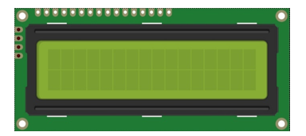
.. |Chapter20_01| image:: ../_static/imgs/20_LCD1602/Chapter20_01.png

Component knowledge
==============================================

I2C communication
-----------------------------------------------

I2C (Inter-Integrated Circuit) is a two-wire serial communication mode, which can be used for the connection of micro controllers and their peripheral equipment. Devices using I2C communication must be connected to the serial data (SDA) line, and serial clock (SCL) line (called I2C bus). Each device has a unique address and can be used as a transmitter or receiver to communicate with devices connected to the bus.

LCD1602 communication'
-------------------------------------------------

The LCD1602 display screen can display 2 lines of characters in 16 columns. It is capable of displaying numbers, letters, symbols, ASCII code and so on. As shown below is a monochrome LCD1602 display screen along with its circuit pin diagram

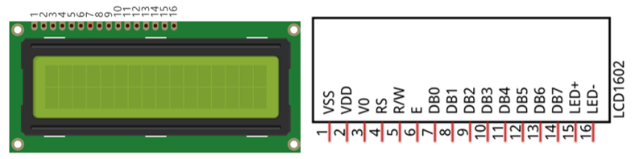

I2C LCD1602 display screen integrates a I2C interface, which connects the serial-input & parallel-output module to the LCD1602 display screen. This allows us to only use 4 lines to the operate the LCD1602.

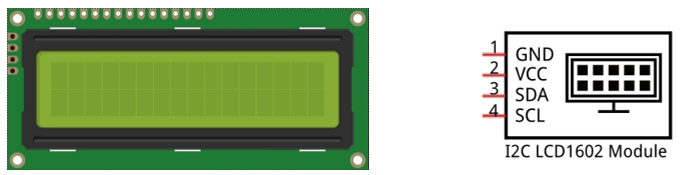

The serial-to-parallel IC chip used in this module is PCF8574T (PCF8574AT), and its default I2C address is 0x27(0x3F).

Below is the PCF8574 pin schematic diagram and the block pin diagram:

.. list-table:: 
   :width: 80%
   :class: table-line
   :align: center
   
   * -  PCF8574 chip pin diagram
     -  PCF8574 module pin diagram

   * -  |Chapter20_04|
     -  |Chapter20_05| 

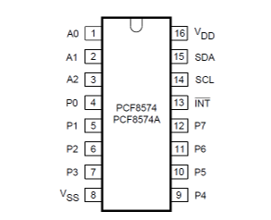
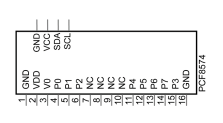

PCF8574 module pin and LCD1602 pin are corresponding to each other and connected with each other:

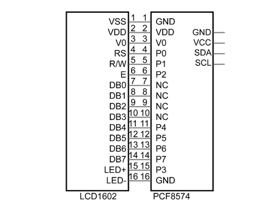

So we only need 4 pins to control the 16 pins of the LCD1602 display screen through the I2C interface.

Circuit
============================================

.. list-table:: 
   :width: 80%
   :align: center
   :class: table-line
   
   * -  **Schematic diagram**
   * -  |Chapter20_07|
   * -  **Hardware connection** 
   * -  :combo:`red font-bolder:If you need any support, please feel free to contact us via:` support@freenove.com

        |Chapter20_08|

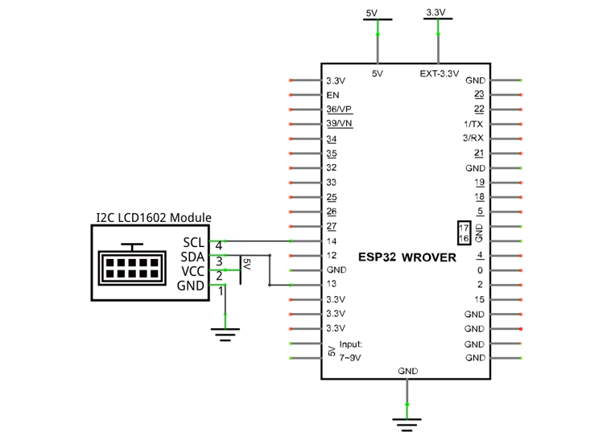
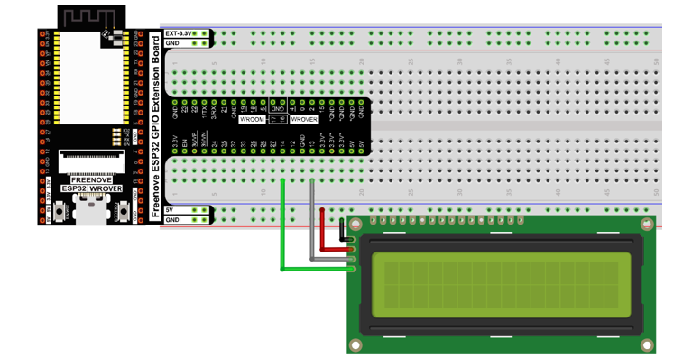

Code
==========================================

Move the program folder **"Freenove_Ultimate_Starter_Kit_for_ESP32/Python/Python_Codes"** to disk(D) in advance with the path of **"D:/Micropython_Codes"**.

Open "Thonny", click "This computer"  ->  "D:"  ->  "Micropython_Codes"  ->  "20.1_I2C_LCD1602". Select "I2C_LCD.py"and "LCD_API.py", right click your mouse to select "Upload to /", wait for "I2C_LCD.py" and"LCD_API.py" to be uploaded to ESP32-WROVER and then double click "I2C_LCD1602.py". 

20.1_I2C_LCD1602
------------------------------------------

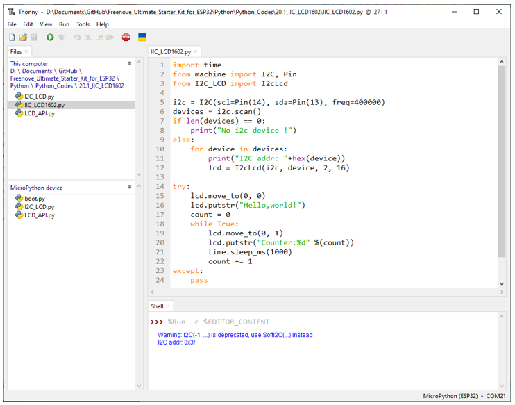

Click "Run current script" and LCD1602 displays some characters. 

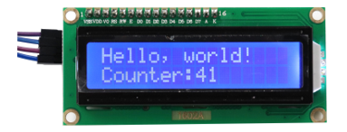

So far, at this writing, we have two types of LCD1602 on sale. One needs to adjust the backlight, and the other does not.

The LCD1602 that does not need to adjust the backlight is shown in the figure below.

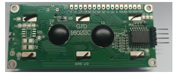

The following is the program code:

.. literalinclude:: ../../../freenove_Kit/Python/Python_Codes/20.1_IIC_LCD1602/IIC_LCD1602.py
    :linenos:
    :language: python
    :lines: 1-24
    :dedent:

Import time, I2C and I2C_LCD modules.

.. literalinclude:: ../../../freenove_Kit/Python/Python_Codes/20.1_IIC_LCD1602/IIC_LCD1602.py
    :linenos:
    :language: python
    :lines: 1-3
    :dedent:

Initialize I2C pins and associate them with I2CLCD module, and then set the number of rows and columns for LCD1602. 

Instantiate the I2C LCD1602 screen. It should be noted here that if your LCD driver chip uses PCF8574T, set the I2C address to 0x27, and if uses PCF8574AT, set the I2C address to 0x3F.

.. literalinclude:: ../../../freenove_Kit/Python/Python_Codes/20.1_IIC_LCD1602/IIC_LCD1602.py
    :linenos:
    :language: python
    :lines: 5-12
    :dedent:

Move the cursor of LCD1602 to the first row, first column, and print out "Hello, world!"

.. literalinclude:: ../../../freenove_Kit/Python/Python_Codes/20.1_IIC_LCD1602/IIC_LCD1602.py
    :linenos:
    :language: python
    :lines: 15-16
    :dedent:

The second line of LCD1602 continuously prints the number of seconds after the ESP32 program runs.

.. literalinclude:: ../../../freenove_Kit/Python/Python_Codes/20.1_IIC_LCD1602/IIC_LCD1602.py
    :linenos:
    :language: python
    :lines: 18-22
    :dedent:

Reference
------------------------------

.. py:function:: Class I2cLcd
    
    Before each use of the object **I2cLcd** , please make sure that **I2C_LCD.py** and **LCD_API.py** have been uploaded to "/" of ESP32, and then add the statement **"from I2C_LCD import I2cLcd"** to the top of the python file. 
    
    **clear():** Clear the LCD1602 screen display.
    
    **show_cursor():** Show the cursor of LCD1602. 
    
    **hide_cursor():** Hide the cursor of LCD1602. 
    
    **blink_cursor_on():** Turn on cursor blinking.
    
    **blink_cursor_off():** Turn off cursor blinking. 
    
    **display_on():** Turn on the display function of LCD1602. 
    
    **display_off():** Turn on the display function of LCD1602. 
    
    **backlight_on():** Turn on the backlight of LCD1602.
    
    **backlight_off():** Turn on the backlight of LCD1602. 
    
    **move_to(cursor_x, cursor_y):** Move the cursor to a specified position. 
    
        **cursor_x:** Column cursor_x 
        
        **cursor_y :** Row cursor_y 
    
    **putchar(char) :** Print the character in the bracket on LCD1602
    
    **putstr(string) :** Print the string in the bracket on LCD1602. 
