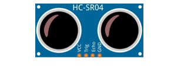
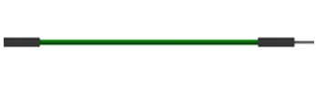
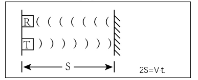
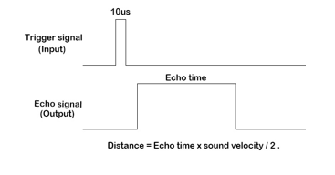
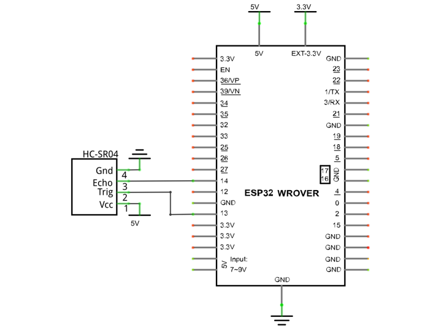
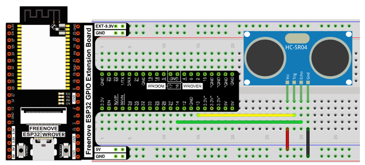
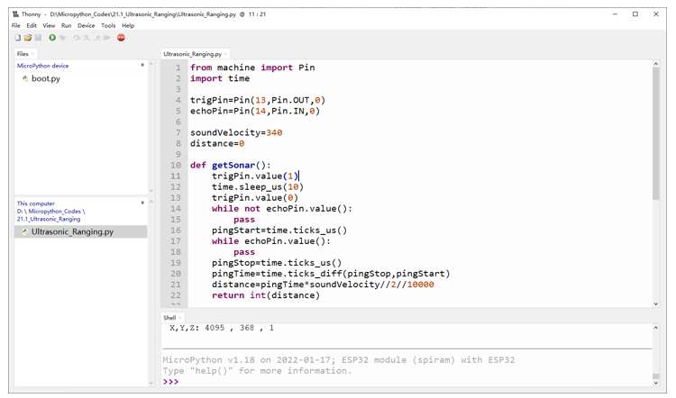
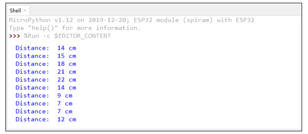
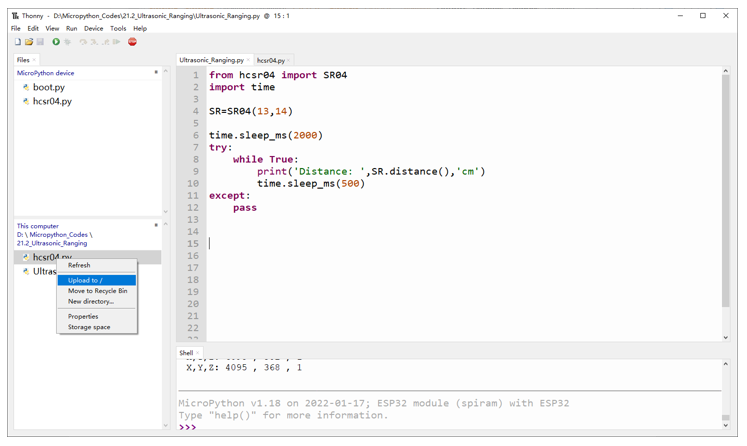
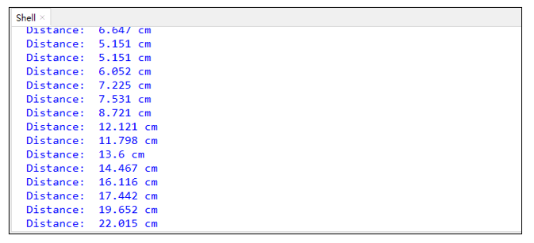

##############################################################################
Chapter Ultrasonic Ranging
##############################################################################

In this chapter, we learn a module which use ultrasonic to measure distance, HC SR04.

Project Ultrasonic Ranging
*******************************************

In this project, we use ultrasonic ranging module to measure distance, and print out the data in the terminal.

Component List
===========================================

+------------------------------------+----------------------------------------------------+
| ESP32-WROVER x1                    | GPIO Extension Board x1                            |
|                                    |                                                    |
| |Chapter01_00|                     | |Chapter01_01|                                     |
+------------------------------------+----------------------------------------------------+
| Breadboard x1                                                                           |
|                                                                                         |
| |Chapter01_02|                                                                          |
+------------------------------------+----------------------------------------------------+
| HC SR04 x1                         | Jumper F/M x4                                      |
|                                    |                                                    |
| |Chapter21_00|                     |  |Chapter20_01|                                    |
+------------------------------------+----------------------------------------------------+

.. |Chapter01_00| image:: ../_static/imgs/1_LED/Chapter01_00.png
.. |Chapter01_01| image:: ../_static/imgs/1_LED/Chapter01_01.png
.. |Chapter01_02| image:: ../_static/imgs/1_LED/Chapter01_02.png

Component Knowledge
===========================================

The ultrasonic ranging module uses the principle that ultrasonic waves will be sent back when encounter obstacles. We can measure the distance by counting the time interval between sending and receiving of the ultrasonic waves, and the time difference is the total time of the ultrasonic wave's journey from being transmitted to being received. Because the speed of sound in air is a constant, about v=340m/s, we can calculate the distance between the ultrasonic ranging module and the obstacle: s=vt/2.

The HC-SR04 ultrasonic ranging module integrates both an ultrasonic transmitter and a receiver. The transmitter is used to convert electrical signals (electrical energy) into high frequency (beyond human hearing) sound waves (mechanical energy) and the function of the receiver is opposite of this. The picture and the diagram of the HC SR04 ultrasonic ranging module are shown below:

.. list-table:: 
   :width: 80%
   :header-rows: 1 
   :align: center
   
   * -  |Chapter21_00|
     -  |Chapter21_02|

Pin description:

.. list-table:: 
   :width: 80%
   :header-rows: 1 
   :align: center
   
   * -  Pin
     -  Description
   
   * -  VCC
     -  power supply pin

   * -  Trig
     -  trigger pin

   * -  Echo
     -  Echo pin

   * -  GND
     -  GND

**Technical specs:**

Working voltage: 5V

Working current: 12mA

Minimum measured distance: 2cm

Maximum measured distance: 200cm

Instructions for use: output a high-level pulse in Trig pin lasting for least 10us, the module begins to transmit ultrasonic waves. At the same time, the Echo pin is pulled up. When the module receives the returned ultrasonic waves from encountering an obstacle, the Echo pin will be pulled down. The duration of high level in the Echo pin is the total time of the ultrasonic wave from transmitting to receiving, s=vt/2. 

Circuit
=======================================

Note that the voltage of ultrasonic module is 5V in the circuit.

.. list-table:: 
   :width: 80%
   :header-rows: 1 
   :align: center
   
   * -  Schematic diagram
   * -  |Chapter21_04|
   * -  Hardware connection. 
       
        If you need any support, please feel free to contact us via: support@freenove.com

        |Chapter21_05|

Code
========================================

Move the program folder "Freenove_Ultimate_Starter_Kit_for_ESP32/Python/Python_Codes" to disk(D) in advance with the path of "D:/Micropython_Codes".

Open "Thonny", click "This computer"  ->  "D:"  ->  "Micropython_Codes"  ->  "21.1_Ultrasonic_Ranging" and double click "Ultrasonic_Ranging.py". 

Ultrasonic_Ranging
-----------------------------------------

Click "Run current script", you can use it to measure the distance between the ultrasonic module and the object. As shown in the following figure: 

The following is the program code:

.. literalinclude:: ../../../freenove_Kit/Python/Python_Codes/21.1_Ultrasonic_Ranging/Ultrasonic_Ranging.py
    :language: python
    :dedent:

Define the control pins of the ultrasonic ranging module.

.. literalinclude:: ../../../freenove_Kit/Python/Python_Codes/21.1_Ultrasonic_Ranging/Ultrasonic_Ranging.py
    :language: python
    :lines: 4-5
    :dedent:

Set the speed of sound.

.. literalinclude:: ../../../freenove_Kit/Python/Python_Codes/21.1_Ultrasonic_Ranging/Ultrasonic_Ranging.py
    :language: python
    :lines: 7-8
    :dedent:

Subfunction getSonar() is used to start the Ultrasonic Module to begin measurements, and return the measured distance in centimeters. In this function, first let trigPin send 10us high level to start the Ultrasonic Module. Then use pulseIn() to read the Ultrasonic Module and return the duration time of high level. Finally, the measured distance according to the time is calculated.

.. literalinclude:: ../../../freenove_Kit/Python/Python_Codes/21.1_Ultrasonic_Ranging/Ultrasonic_Ranging.py
    :language: python
    :lines: 10-22
    :dedent:

Delay for 2 seconds and wait for the ultrasonic module to stabilize. Print data obtained from ultrasonic module every 500 milliseconds

.. literalinclude:: ../../../freenove_Kit/Python/Python_Codes/21.1_Ultrasonic_Ranging/Ultrasonic_Ranging.py
    :language: python
    :lines: 24-27
    :dedent:

Project Ultrasonic Ranging
***************************************

Component List and Circuit
========================================

Component List and Circuit are the same as the previous section.

Code
=========================================

Open "Thonny", click "This computer"  ->  "D:"  ->  "Micropython_Codes"  ->  "21.2_Ultrasonic_Ranging". Select "hcsr04.py", right click your mouse to select "Upload to /", wait for "hcsr04.py" to be uploaded to ESP32-WROVER and then double click "Ultrasonic_Ranging.py". 

Ultrasonic_Ranging
-----------------------------------------

Click "Run current script". Use the ultrasonic module to measure distance. As shown in the following figure: 

The following is the program code:

.. literalinclude:: ../../../freenove_Kit/Python/Python_Codes/21.2_Ultrasonic_Ranging/Ultrasonic_Ranging.py
    :language: python
    :dedent:

Import hcsr04 module.

.. literalinclude:: ../../../freenove_Kit/Python/Python_Codes/21.2_Ultrasonic_Ranging/Ultrasonic_Ranging.py
    :language: python
    :lines: 1-1
    :dedent:

Define an ultrasonic object and associate with the pins.

.. literalinclude:: ../../../freenove_Kit/Python/Python_Codes/21.2_Ultrasonic_Ranging/Ultrasonic_Ranging.py
    :language: python
    :lines: 4-4
    :dedent:

Obtain the distance data returned from the ultrasonic ranging module. 

.. code-block:: python

    SR.distance()

Obtain the ultrasonic data every 500 milliseconds and print them out in "Shell".

.. literalinclude:: ../../../freenove_Kit/Python/Python_Codes/21.2_Ultrasonic_Ranging/Ultrasonic_Ranging.py
    :language: python
    :lines: 8-10
    :dedent:

Reference
-------------------------

.. py:function:: Class hcsr04 	
    
    Before each use of object **SR04** , please add the statement "from hcsr04 import SR04" to the top of python file. 
    
    **SR04():** Object of ultrasonic module. By default, trig pin is Pin(13) and echo pinis Pin(14).
    
    **distanceCM():** Obtain the distance from the ultrasonic to the measured object with the data type being int type, and the unit being cm.
    
    **distanceMM():** Obtain the distance from the ultrasonic to the measured object with the data type being int type, and the unit being mm.
    
    **distance():** Obtain the distance from the ultrasonic to the measured object with the data type being float type, and the unit being cm.
