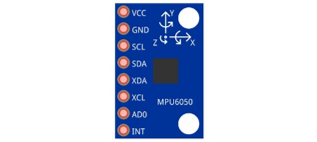
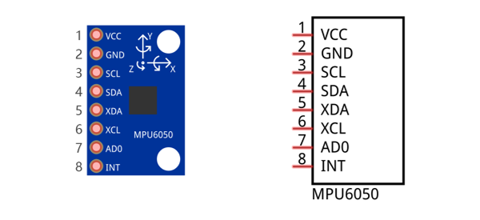
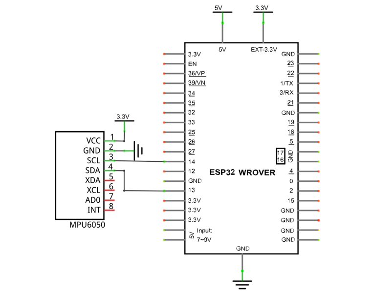
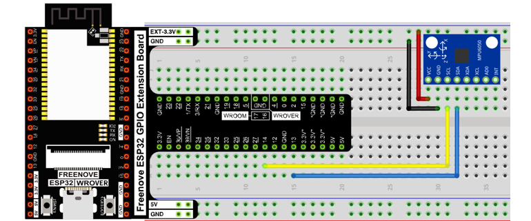
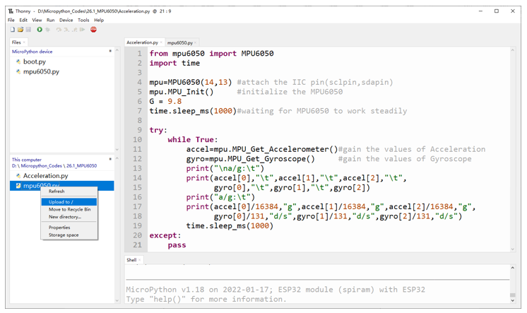
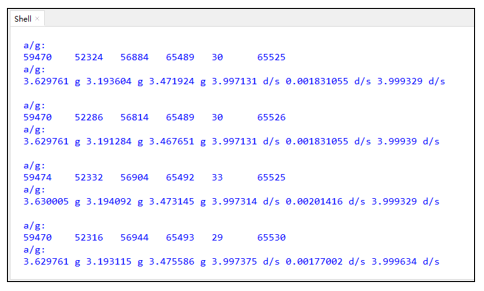

##############################################################################
Chapter 26 Attitude Sensor MPU6050
##############################################################################

In this chapter, we will learn about a MPU6050 attitude sensor which integrates an accelerometer and gyroscope.

Project 26.1 Read a MPU6050 Sensor Module
*****************************************************

In this project, we will read acceleration and gyroscope data of the MPU6050 sensor

Component List
============================================

.. table::
    :width: 80%
    :align: center
    :class: table-line
    
    +----------------------+----------------------------------------------+
    | ESP32-WROVER x1      | GPIO Extension Board x1                      |
    |                      |                                              |
    | |Chapter01_00|       | |Chapter01_01|                               |
    +----------------------+----------------------------------------------+
    | Breadboard x1                                                       |
    |                                                                     |
    | |Chapter01_02|                                                      |
    +----------------------------------+----------------------------------+
    | LED x1                           | MPU6050 x1                       |
    |                                  |                                  |
    | |Chapter01_05|                   |   |Chapter26_00|                 |
    +----------------------------------+----------------------------------+

.. |Chapter01_00| image:: ../_static/imgs/1_LED/Chapter01_00.png
.. |Chapter01_01| image:: ../_static/imgs/1_LED/Chapter01_01.png
.. |Chapter01_02| image:: ../_static/imgs/1_LED/Chapter01_02.png
.. |Chapter01_05| image:: ../_static/imgs/1_LED/Chapter01_05.png    

Component knowledge
==================================

MPU6050
------------------------------------

MPU6050 sensor module is a complete 6-axis motion tracking device. It combines a 3-axis gyroscope, a 3-axis accelerometer and a DMP (Digital Motion Processor) all in a small package. The settings of the accelerometer and gyroscope of MPU6050 can be changed. A precision wide range digital temperature sensor is also integrated to compensate data readings for changes in temperature, and temperature values can also be read. The MPU6050 Module follows the I2C communication protocol and the default address is 0x68.

MPU6050 is widely used to assist with balancing vehicles, robots and aircraft, mobile phones and other products which require stability to control stability and attitude or which need to sense same.

The port description of the MPU6050 module is as follows:

.. table::
    :align: center
    :class: zebra
    
    +----------+------------+-------------------------------------------------------------+
    | Pin name | Pin number | Description                                                 |
    +==========+============+=============================================================+
    | VCC      | 1          | Positive pole of power supply with voltage 3.3V/5V          |
    +----------+------------+-------------------------------------------------------------+
    | GND      | 2          | Negative pole of power supply                               |
    +----------+------------+-------------------------------------------------------------+
    | SCL      | 3          | I2C communication clock pin                                 |
    +----------+------------+-------------------------------------------------------------+
    | SDA      | 4          | I2C communication clock pin                                 |
    +----------+------------+-------------------------------------------------------------+
    | XDA      | 5          | I2C host data pin which can be connected to other devices.  |
    +----------+------------+-------------------------------------------------------------+
    | XCL      | 6          | I2C host clock pin which can be connected to other devices. |
    +----------+------------+-------------------------------------------------------------+
    |          |            | I2C address bit control pin.                                |
    |          |            |                                                             |
    | AD0      | 7          | Low level: the device address is 0x68                       |
    |          |            |                                                             |
    |          |            | High level: the device address is 0x69                      |
    +----------+------------+-------------------------------------------------------------+
    | INT      | 8          | Output interrupt pin                                        |
    +----------+------------+-------------------------------------------------------------+

For more detail, please refer to datasheet.

Circuit
======================================

Note that the power supply voltage for MPU6050 module is 3.3V in the circuit.

.. list-table:: 
   :width: 80%
   :class: table-line
   :align: center
   
   * -  **Schematic diagram**
   * -  |Chapter26_02|
   * -  **Hardware connection** 
   * -  :combo:`red font-bolder:If you need any support, please feel free to contact us via:` support@freenove.com

        |Chapter26_03|

Code
=============================

Move the program folder **"Freenove_Ultimate_Starter_Kit_for_ESP32/Python/Python_Codes"** to disk(D) in advance with the path of "D:/Micropython_Codes".

Open "Thonny", click "This computer" **->** "D:" **->** "Micropython_Codes" **->** "26.1_MPU6050". Select "mpu6050.py", right click your mouse to select "Upload to /", wait for "mpu6050.py" to be uploaded to ESP32-WROVER and then double click "MPU6050.py". 

26.1_MPU6050
---------------------------

Click "Run current script". When ESP32 obtains acceleration data and gyroscope data of MPU605, it will print them in "Shell".

.. note::
    
    The data transmission of MPU6050 is very sensitive. Therefore, when using it, please make sure the jumper wire is in good contact, otherwise the data may fail to be obtained.

The following is the program code:

.. literalinclude:: ../../../freenove_Kit/Python/Python_Codes/26.1_MPU6050/Acceleration.py
    :linenos:
    :language: python
    :dedent:

Import MPU6050 and time modules. 

.. literalinclude:: ../../../freenove_Kit/Python/Python_Codes/26.1_MPU6050/Acceleration.py
    :linenos:
    :language: python
    :lines: 1-2
    :dedent:

Set I2C pins and associate them with MPU6050 module, and then initialize MPU6050 and wait for the initialization to complete.

.. literalinclude:: ../../../freenove_Kit/Python/Python_Codes/26.1_MPU6050/Acceleration.py
    :linenos:
    :language: python
    :lines: 4-7
    :dedent:

Obtain the acceleration data of MPU6050 and store it in accel. Obtain the gyroscope data and store it in gyro. 

.. literalinclude:: ../../../freenove_Kit/Python/Python_Codes/26.1_MPU6050/Acceleration.py
    :linenos:
    :language: python
    :lines: 11-12
    :dedent:

Update and collect the original data of the gyroscope every second and print the original data and processed acceleration and angular velocity data in "Shell".

.. literalinclude:: ../../../freenove_Kit/Python/Python_Codes/26.1_MPU6050/Acceleration.py
    :linenos:
    :language: python
    :lines: 11-19
    :dedent:

Reference
-------------------------------

.. py:function:: Class mpu6050	

    Before each use of **mpu6050** , please add the statement " **from mpu6050 import MPU6050** " to the top of the python file.

    **MPU6050(sclpin,sdapin):** Create an object MPU6050 and associate I2C pin with it.

    **MPU_Init():** Intialize MPU6050 module.

    **MPU_Get_Accelerometer():** Obtain original data of MPU6050's acceleration 

    **MPU_Get_Gyroscope():** Obtain original data of MPU6050's Gyroscope
