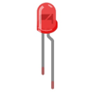
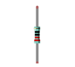
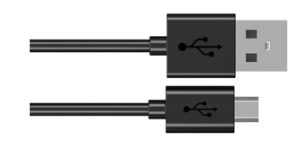
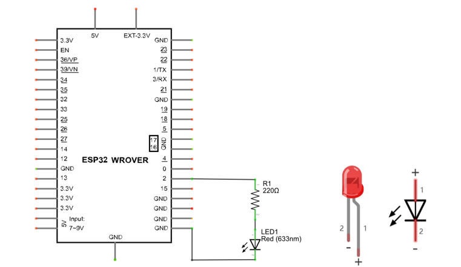
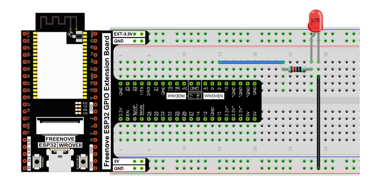
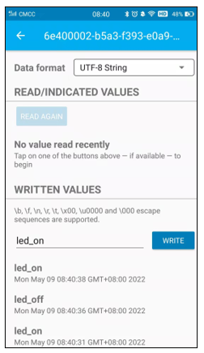
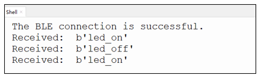
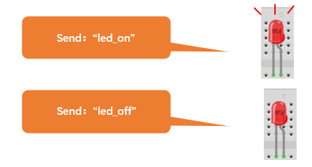

Project 27.2 Bluetooth Control LED
*********************************************

In this section, we will control the LED with Bluetooth.

Component List
======================================

.. table::
    :width: 80%
    :align: center
    :class: table-line
    
    +------------------------------------+-------------------------+
    | ESP32-WROVER x1                    | GPIO Extension Board x1 |
    |                                    |                         |
    | |Chapter01_00|                     | |Chapter01_01|          |
    +------------------------------------+-------------------------+
    | Micro USB Wire x1                                            |
    |                                                              |
    | |Chapter08_00|                                               |
    +--------------------------------------------------------------+
    | Breadboard x1                                                |
    |                                                              |
    | |Chapter01_02|                                               |
    +-----------------+------------------+-------------------------+
    | LED x1          | Resistor 220Ω x1 | Jumper M/M x2           |
    |                 |                  |                         |
    | |Chapter01_03|  | |Chapter01_04|   | |Chapter01_05|          |
    +-----------------+------------------+-------------------------+
  
.. |Chapter01_00| image:: ../_static/imgs/1_LED/Chapter01_00.png    
.. |Chapter01_01| image:: ../_static/imgs/1_LED/Chapter01_01.png    
.. |Chapter01_02| image:: ../_static/imgs/1_LED/Chapter01_02.png    

.. |Chapter01_05| image:: ../_static/imgs/1_LED/Chapter01_05.png    

Circuit
==========================================

Connect Freenove ESP32 to the computer using a USB cable.

.. list-table:: 
   :width: 80%
   :class: table-line
   :align: center
   
   * -  **Schematic diagram**
   * -  |Chapter27_27|
   * -  **Hardware connection** 
   * -  :combo:`red font-bolder:If you need any support, please feel free to contact us via:` support@freenove.com

        |Chapter27_28|

Code
====================================

Move the program folder **"Freenove_Ultimate_Starter_Kit_for_ESP32/Python/Python_Codes"** to disk(D) in advance with the path of **"D:/Micropython_Codes"**.

Open "Thonny", click "This computer" **->** "D:" **->** "Micropython_Codes" **->** "27.2_BLE_LED". Select "ble_advertising.py", right click your mouse to select "Upload to /", wait for "ble_advertising.py" to be uploaded to ESP32-WROVER and then double click "BLE_LED.py".

27.2_BLE_LED
-----------------------------------

.. image:: ../_static/imgs/27_Bluetooth/Chapter27_44.png
    :align: center

Compile and upload code to ESP32. The operation of the APP is the same as 27.1, you only need to change the sending content to "led_on" and "led_off" to operate LEDs on the ESP32-WROVER.

Data sent from mobile APP:

You can check the message sent by Bluetooth in "Shell".

The phenomenon of LED

Attention: If the sending content isn't "led_on' or "led_off", then the state of LED will not change. If the LED is on, when receiving irrelevant content, it keeps on; Correspondingly, if the LED is off, when receiving irrelevant content, it keeps off.

The following is the program code:

.. literalinclude:: ../../../freenove_Kit/Python/Python_Codes/27.2_BLE_LED/BLE_LED.py
    :linenos:
    :language: python
    :dedent:

Compare received message with "led_on" and "led_off" and take action accordingly.

.. literalinclude:: ../../../freenove_Kit/Python/Python_Codes/27.2_BLE_LED/BLE_LED.py
    :linenos:
    :language: python
    :lines: 88-91
    :dedent: