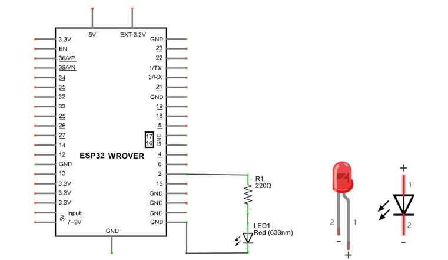
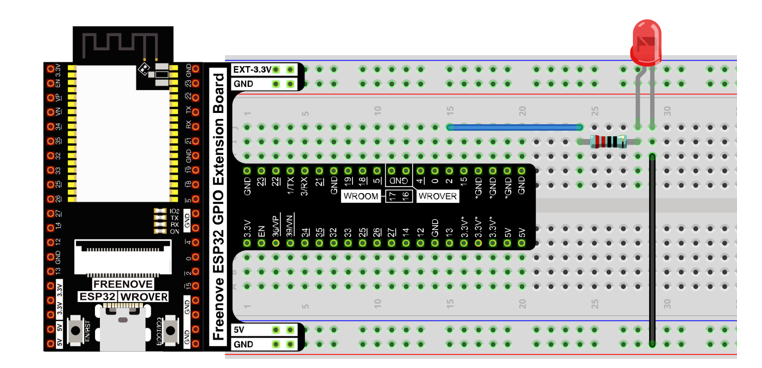
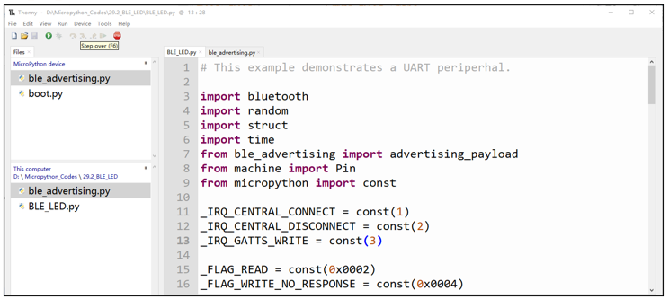
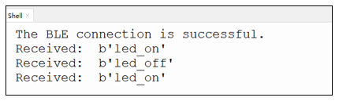

##############################################################################
Chapter Bluetooth
##############################################################################

This chapter mainly introduces how to make simple data transmission through Bluetooth of ESP32-WROVER and mobile phones.

Project 27.1 is classic Bluetooth and Project 27.2 is low power Bluetooth.If you are an iPhone user, please start with Project 27.2.

Project Bluetooth Low Energy Data Passthrough
****************************************************

Component List
==================================

+------------------------------------+-------------------------+
| ESP32-WROVER x1                    | Micro USB Wire x1       |
|                                    |                         |
| |Chapter01_00|                     | |Chapter08_00|          |
+------------------------------------+-------------------------+
  
.. |Chapter01_00| image:: ../_static/imgs/1_LED/Chapter01_00.png
.. |Chapter08_00| image:: ../_static/imgs/8_Serial_Communication/Chapter08_00.png

In this tutorial we need to use a Bluetooth APP called Serial Bluetooth Terminal to assist in the experiment. If you've not installed it yet, please do so by clicking: https://www.appsapk.com/serial-bluetooth-terminal/ The following is its logo.

Lightblue
======================================

If you can't install Serial Bluetooth on your phone, try LightBlue.If you do not have this software installed on your phone, you can refer to this link: https://apps.apple.com/us/app/lightblue/id557428110#?platform=iphone

Code
======================================

Move the program folder "Freenove_Ultimate_Starter_Kit_for_ESP32/Python/Python_Codes" to disk(D) in advance with the path of "D:/Micropython_Codes".

Open "Thonny", click "This computer"  ->  "D:"  ->  "Micropython_Codes"  ->  "27.1_BLE". Select "ble_advertising.py", right click your mouse to select "Upload to /", wait for "ble_advertising.py" to be uploaded to ESP32-WROVER and then double click "BLE.py". 

BLE
--------------------------------------

Click run for BLE.py.

Turn ON Bluetooth on your phone, and open the Lightblue APP. 

In the Scan page, swipe down to refresh the name of Bluetooth that the phone searches for. Click ESP32.

After Bluetooth is connect successfully, Shell will printer the information.

Click "Receive". Select the appropriate Data format in the box to the right of Data Format. For example, HEX for hexadecimal, utf-string for character, Binary for Binary, etc. Then click SUBSCRIBE.

You can type "Hello" in Shell and press "Enter" to send.

And then you can see the mobile Bluetooth has received the message.

.. image:: ../_static/imgs/27_Bluetooth/Chapter27_40.png
    :align: center

Similarly, you can select "Send" on your phone. Set Data format, and then enter anything in the sending box and click Write to send.

You can check the message from Bluetooth in "Shell".

And now data can be transferred between your mobile phone and computer via ESP32-WROVER.

The following is the program code:

.. literalinclude:: ../../../freenove_Kit/Python/Python_Codes/27.1_BLE/BLE.py
    :language: python
    :dedent:

Define the specified UUID number for BLE vendor.

.. literalinclude:: ../../../freenove_Kit/Python/Python_Codes/27.1_BLE/BLE.py
    :language: python
    :lines: 20-28
    :dedent:

Write an _irq function to manage BLE interrupt events.

.. literalinclude:: ../../../freenove_Kit/Python/Python_Codes/27.1_BLE/BLE.py
    :language: python
    :lines: 46-63
    :dedent:

Initialize the BLE function and name it.

.. literalinclude:: ../../../freenove_Kit/Python/Python_Codes/27.1_BLE/BLE.py
    :language: python
    :lines: 36-36
    :dedent:

When the mobile phone send data to ESP32 via BLE Bluetooth, it will print them out with serial port; When the serial port of ESP32 receive data, it will send them to mobile via BLE Bluetooth.

.. literalinclude:: ../../../freenove_Kit/Python/Python_Codes/27.1_BLE/BLE.py
    :language: python
    :lines: 80-96
    :dedent:

Project Bluetooth Control LED
*********************************************

In this section, we will control the LED with Bluetooth.

Component List
======================================

+------------------------------------+-------------------------+
| ESP32-WROVER x1                    | GPIO Extension Board x1 |
|                                    |                         |
| |Chapter01_00|                     | |Chapter01_01|          |
+------------------------------------+-------------------------+
| Micro USB Wire x1                                            |
|                                                              |
| |Chapter08_00|                                               |
+--------------------------------------------------------------+
| Breadboard x1                                                |
|                                                              |
| |Chapter01_02|                                               |
+-----------------+------------------+-------------------------+
| LED x1          | Resistor 220Ω x1 | Jumper M/M x2           |
|                 |                  |                         |
| |Chapter01_03|  | |Chapter01_04|   | |Chapter01_05|          |
+-----------------+------------------+-------------------------+
  
.. |Chapter01_00| image:: ../_static/imgs/1_LED/Chapter01_00.png    
.. |Chapter01_01| image:: ../_static/imgs/1_LED/Chapter01_01.png    
.. |Chapter01_02| image:: ../_static/imgs/1_LED/Chapter01_02.png    
.. |Chapter01_03| image:: ../_static/imgs/1_LED/Chapter01_03.png    
.. |Chapter01_04| image:: ../_static/imgs/1_LED/Chapter01_04.png    
.. |Chapter01_05| image:: ../_static/imgs/1_LED/Chapter01_05.png    
.. |Chapter08_00| image:: ../_static/imgs/8_Serial_Communication/Chapter08_00.png

Circuit
==========================================

Connect Freenove ESP32 to the computer using a USB cable.

.. list-table:: 
   :width: 80%
   :header-rows: 1 
   :align: center
   
   * -  Schematic diagram
   * -  |Chapter27_27|
   * -  Hardware connection. 
       
        If you need any support, please feel free to contact us via: support@freenove.com

        |Chapter27_28|

Code
====================================

Move the program folder "Freenove_Ultimate_Starter_Kit_for_ESP32/Python/Python_Codes" to disk(D) in advance with the path of "D:/Micropython_Codes".

Open "Thonny", click "This computer"  ->  "D:"  ->  "Micropython_Codes"  ->  "27.2_ BLE_LED". Select "ble_advertising.py", right click your mouse to select "Upload to /", wait for "ble_advertising.py" to be uploaded to ESP32-WROVER and then double click "BLE_LED.py".

BLE_LED
-----------------------------------

Compile and upload code to ESP32. The operation of the APP is the same as 27.1, you only need to change the sending content to "led_on" and "led_off" to operate LEDs on the ESP32-WROVER.

Data sent from mobile APP:

.. image:: ../_static/imgs/27_Bluetooth/Chapter27_45.png
    :align: center

You can check the message sent by Bluetooth in "Shell".

The phenomenon of LED

.. image:: ../_static/imgs/27_Bluetooth/Chapter27_47.png
    :align: center

Attention: If the sending content isn't "led_on' or "led_off", then the state of LED will not change. If the LED is on, when receiving irrelevant content, it keeps on; Correspondingly, if the LED is off, when receiving irrelevant content, it keeps off.

The following is the program code:

.. literalinclude:: ../../../freenove_Kit/Python/Python_Codes/27.2_BLE_LED/BLE_LED.py
    :language: python
    :dedent:

Compare received message with "led_on" and "led_off" and take action accordingly.

.. literalinclude:: ../../../freenove_Kit/Python/Python_Codes/27.2_BLE_LED/BLE_LED.py
    :language: python
    :lines: 88-91
    :dedent:
