##############################################################################
Chapter WiFi Working Modes
##############################################################################

In this chapter, we'll focus on the WiFi infrastructure for ESP32-WROVER. 

ESP32-WROVER has 3 different WiFi operating modes: station mode, AP mode and AP+station mode. All WiFi programming projects must be configured with WiFi operating mode before using WiFi, otherwise WiFi cannot be used.

Project Station mode
*******************************************

Component List
===========================================

+------------------------------------+-------------------------+
| ESP32-WROVER x1                    | Micro USB Wire x1       |
|                                    |                         |
| |Chapter01_00|                     | |Chapter08_00|          |
+------------------------------------+-------------------------+
  
.. |Chapter01_00| image:: ../_static/imgs/1_LED/Chapter01_00.png
.. |Chapter08_00| image:: ../_static/imgs/8_Serial_Communication/Chapter08_00.png

Component knowledge
======================================

Station mode
----------------------------------------

When ESP32 selects Station mode, it acts as a WiFi client. It can connect to the router network and communicate with other devices on the router via WiFi connection. As shown below, the PC is connected to the router, and if ESP32 wants to communicate with the PC, it needs to be connected to the router.

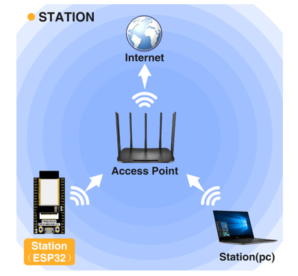

Circuit
=================================

Connect Freenove ESP32 to the computer using the USB cable.

.. image:: ../_static/imgs/32_WiFi_Working_Modes/Chapter32_01.png
    :align: center

Code
================================

Move the program folder "Freenove_Ultimate_Starter_Kit_for_ESP32/Python/Python_Codes" to disk(D) in advance with the path of "D:/Micropython_Codes".

Open "Thonny", click "This computer"  ->  "D:"  ->  "Micropython_Codes"  ->  "28.1_Station_mode" and double click "Station_mode.py". 

28.1_Station_mode
-----------------------------------

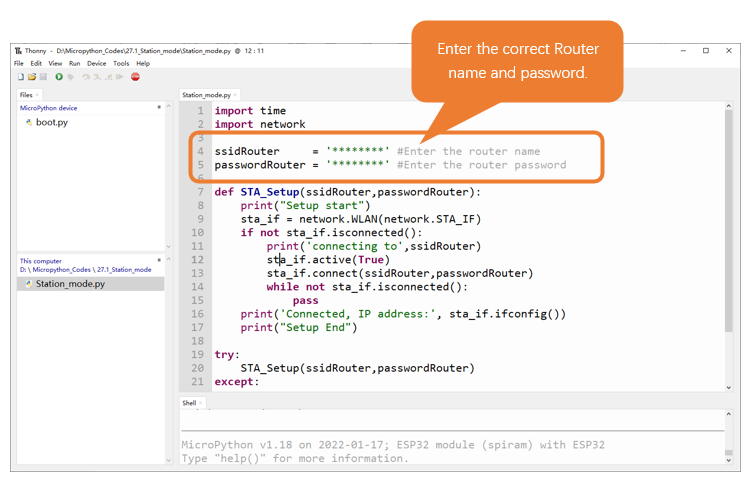

Because the names and passwords of routers in various places are different, before the Code runs, users need to enter the correct router’s name and password in the box as shown in the illustration above.

After making sure the router name and password are entered correctly, compile and upload codes to ESP32-WROVER, wait for ESP32 to connect to your router and print the IP address assigned by the router to ESP32 in "Shell". 

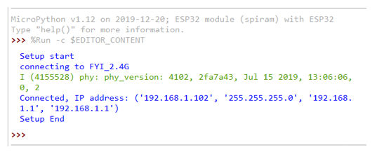

The following is the program code:

.. literalinclude:: ../../../freenove_Kit/Python/Python_Codes/28.1_Station_mode/Station_mode.py
    :language: python
    :dedent:

Import network module.

.. literalinclude:: ../../../freenove_Kit/Python/Python_Codes/28.1_Station_mode/Station_mode.py
    :language: python
    :lines: 2-2
    :dedent:

Enter correct router name and password.

.. literalinclude:: ../../../freenove_Kit/Python/Python_Codes/28.1_Station_mode/Station_mode.py
    :language: python
    :lines: 4-5
    :dedent:

Set ESP32 in Station mode.

.. literalinclude:: ../../../freenove_Kit/Python/Python_Codes/28.1_Station_mode/Station_mode.py
    :language: python
    :lines: 9-9
    :dedent:

Activate ESP32's Station mode, initiate a connection request to the router and enter the password to connect.

.. literalinclude:: ../../../freenove_Kit/Python/Python_Codes/28.1_Station_mode/Station_mode.py
    :language: python
    :lines: 14-15
    :dedent:

Print the IP address assigned to ESP32-WROVER in "Shell".

.. literalinclude:: ../../../freenove_Kit/Python/Python_Codes/28.1_Station_mode/Station_mode.py
    :language: python
    :lines: 16-16
    :dedent:

Reference
------------------------------

.. py:function:: Class network	
    
    Before each use of **network** , please add the statement " **import network** " to the top of the python file.
    
    **WLAN(interface_id):** Set to WiFi mode.
    
        **network.STA_IF:** Client, connecting to other WiFi access points. 
    
        **network.AP_IF:** Access points, allowing other WiFi clients to connect. 
    
    **active(is_active):** With parameters, it is to check whether to activate the network interface; Without parameters, it is to query the current state of the network interface.
    
    **scan(ssid, bssid, channel, RSSI, authmode, hidden):** Scan for wireless networks available nearby (only scan on STA interface), return a tuple list of information about the WiFi access point.
    
    **bssid:** The hardware address of the access point, returned in binary form as a byte object. You can use ubinascii.hexlify() to convert it to ASCII format. 
    
    **authmode:** Access type
    
        **AUTH_OPEN** = 0

        **AUTH_WEP** = 1

        **AUTH_WPA_PSK** = 2

        **AUTH_WPA2_PSK** = 3

        **AUTH_WPA_WPA2_PSK** = 4

        **AUTH_MAX** = 6
    
    **Hidden:** Whether to scan for hidden access points
    
        **False:** Only scanning for visible access points 
    
        **True:** Scanning for all access points including the hidden ones.
    
    **isconnected():** Check whether ESP32 is connected to AP in Station mode. In STA mode, it returns True if it is connected to a WiFi access point and has a valid IP address; Otherwise it returns False.
    
    **connect(ssid, password):** Connecting to wireless network.
    
        **ssid:** WiFiname
    
        **password:** WiFipassword
    
    **disconnect():** Disconnect from the currently connected wireless network.

Project AP mode
*********************************************

Component List & Circuit
============================================

Component List & Circuit are the same as in Section 30.1.

Component knowledge
============================================

AP mode
----------------------------------------------

When ESP32 selects AP mode, it creates a hotspot network that is separate from the Internet and waits for other WiFi devices to connect. As shown in the figure below, ESP32 is used as a hotspot. If a mobile phone or PC wants to communicate with ESP32, it must be connected to the hotspot of ESP32. Only after a connection is established with ESP32 can they communicate.

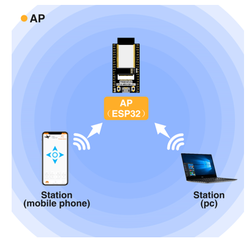

Circuit
=================================

Connect Freenove ESP32 to the computer using the USB cable.

.. image:: ../_static/imgs/32_WiFi_Working_Modes/Chapter32_01.png
    :align: center

Code
===================================

Move the program folder "Freenove_Ultimate_Starter_Kit_for_ESP32/Python/Python_Codes" to disk(D) in advance with the path of "D:/Micropython_Codes".

Open "Thonny", click "This computer"  ->  "D:"  ->  "Micropython_Codes"  ->  "28.2_AP_mode". and double click "AP_mode.py". 

AP_mode
----------------------------------

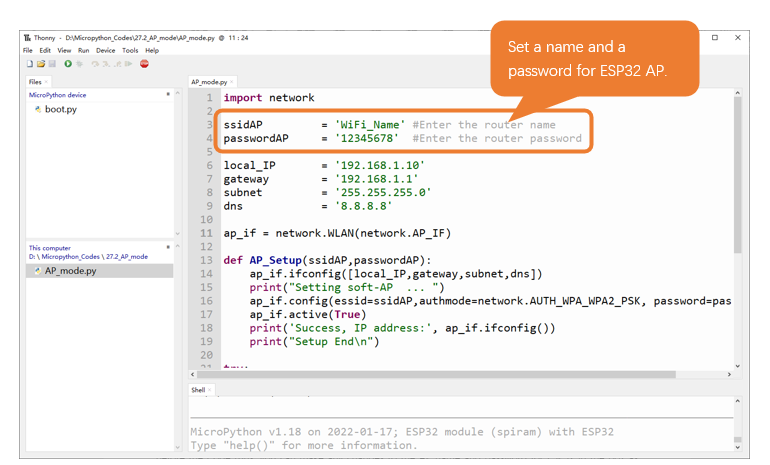

Before the Code runs, you can make any changes to the AP name and password for ESP32 in the box as shown in the illustration above. Of course, you can leave it alone by default.

Click "Run current script", open the AP function of ESP32 and print the access point information. 

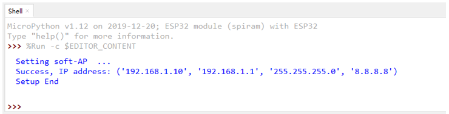

Turn on the WiFi scanning function of your phone, and you can see the ssid_AP on ESP32, which is called "WiFi_Name" in this Code. You can enter the password "12345678" to connect it or change its AP name and password by modifying Code.

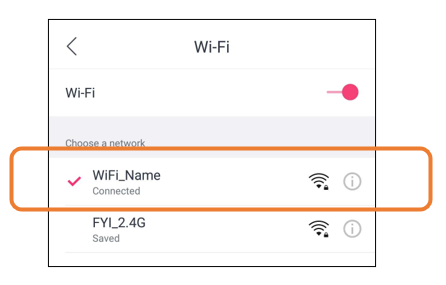

The following is the program code:

.. literalinclude:: ../../../freenove_Kit/Python/Python_Codes/28.2_AP_mode/AP_mode.py
    :language: python
    :dedent:

Import network module.

.. literalinclude:: ../../../freenove_Kit/Python/Python_Codes/28.2_AP_mode/AP_mode.py
    :language: python
    :lines: 1-1
    :dedent:

Enter correct AP name and password.

.. literalinclude:: ../../../freenove_Kit/Python/Python_Codes/28.2_AP_mode/AP_mode.py
    :language: python
    :lines: 3-4
    :dedent:

Set ESP32 in AP mode.

.. literalinclude:: ../../../freenove_Kit/Python/Python_Codes/28.2_AP_mode/AP_mode.py
    :language: python
    :lines: 11-11
    :dedent:

Configure IP address, gateway and subnet mask for ESP32.

.. literalinclude:: ../../../freenove_Kit/Python/Python_Codes/28.2_AP_mode/AP_mode.py
    :language: python
    :lines: 14-14
    :dedent:

Turn on an AP in ESP32, whose name is set by ssid_AP and password is set by password_AP.

.. literalinclude:: ../../../freenove_Kit/Python/Python_Codes/28.2_AP_mode/AP_mode.py
    :language: python
    :lines: 16-17
    :dedent:

If the program is running abnormally, the AP disconnection function will be called. 

.. literalinclude:: ../../../freenove_Kit/Python/Python_Codes/28.2_AP_mode/AP_mode.py
    :language: python
    :lines: 25-25
    :dedent:

Reference
----------------------------------

.. py:function:: Class network	
    
    Before each use of **network** , please add the statement " **import network** " to the top of the python file.
    
    **WLAN(interface_id):** Set to WiFi mode.
    
        **network.STA_IF:** Client, connecting to other WiFi access points
    
    **network.AP_IF:** Access points, allowing other WiFi clients to connect 
    
    **active(is_active):** With parameters, it is to check whether to activate the network interface; Without parameters, it is to query the current state of the network interface
    
    **isconnected():** In AP mode, it returns True if it is connected to the station; otherwise it returns False.
    
    **connect(ssid, password):** Connecting to wireless network
    
        **ssid:** WiFiname
    
        **password:** WiFipassword
    
    **config(essid, channel):** To obtain the MAC address of the access point or to set the WiFi channel and the name of the WiFi access point.
    
        **ssid:** WiFi account name
    
        **channel:** WiFichannel
    
    **ifconfig([(ip, subnet, gateway, dns)]):** Without parameters, it returns a 4-tuple (ip, subnet_mask, gateway, DNS_server); With parameters, it configures static IP.
    
        **ip:** IPaddress
    
        **subnet_mask:** subnet mask
    
        **gateway:** gateway
    
        **DNS_server:** DNSserver
    
    **disconnect():** Disconnect from the currently connected wireless network
    
    **status():** Return the current status of the wireless connection

Project AP+Station mode
******************************************

Component List
==========================================

+------------------------------------+-------------------------+
| ESP32-WROVER x1                    | Micro USB Wire x1       |
|                                    |                         |
| |Chapter01_00|                     | |Chapter08_00|          |
+------------------------------------+-------------------------+
  
.. |Chapter01_00| image:: ../_static/imgs/1_LED/Chapter01_00.png
.. |Chapter08_00| image:: ../_static/imgs/8_Serial_Communication/Chapter08_00.png

Component knowledge
=============================================

AP+Station mode
----------------------------------------------

In addition to AP mode and station mode, ESP32 can also use AP mode and station mode at the same time. This mode contains the functions of the previous two modes. Turn on ESP32's station mode, connect it to the router network, and it can communicate with the Internet via the router. At the same time, turn on its AP mode to create a hotspot network. Other WiFi devices can choose to connect to the router network or the hotspot network to communicate with ESP32.

Circuit
============================================

Connect Freenove ESP32 to the computer using the USB cable.

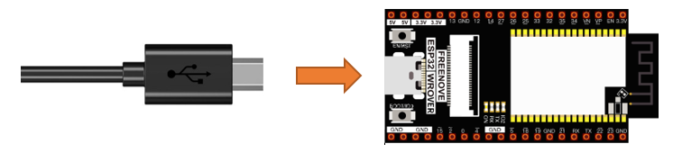

Code
============================

Move the program folder "Freenove_Ultimate_Starter_Kit_for_ESP32/Python/Python_Codes" to disk(D) in advance with the path of "D:/Micropython_Codes".

Open "Thonny", click "This computer"  ->  "D:"  ->  "Micropython_Codes"  ->  "28.3_AP+STA_mode"and double click "AP+STA_mode.py". 

AP+STA_mode
--------------------------

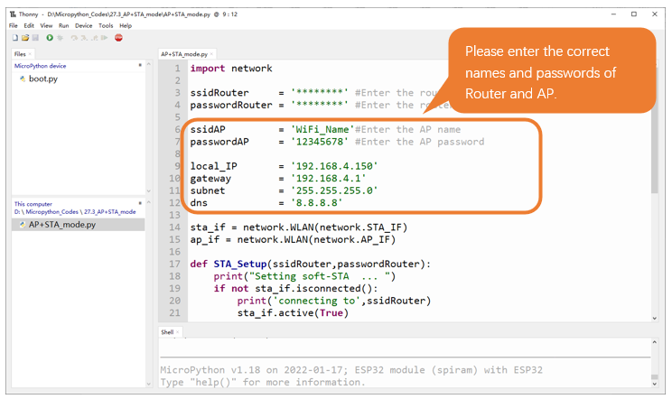

It is analogous to project 28.1 and project 28.2. Before running the Code, you need to modify ssidRouter, passwordRouter, ssidAP and passwordAP shown in the box of the illustration above.

After making sure that the code is modified correctly, click "Run current script" and the "Shell" will display as follows:

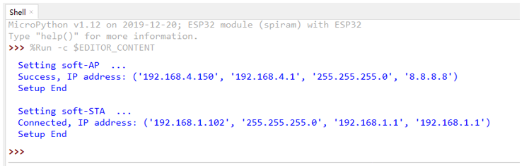

Turn on the WiFi scanning function of your phone, and you can see the ssidAP on ESP32.

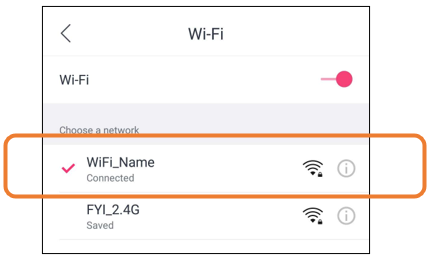

The following is the program code:

.. literalinclude:: ../../../freenove_Kit/Python/Python_Codes/28.3_AP+STA_mode/AP+STA_mode.py
    :language: python
    :dedent:
